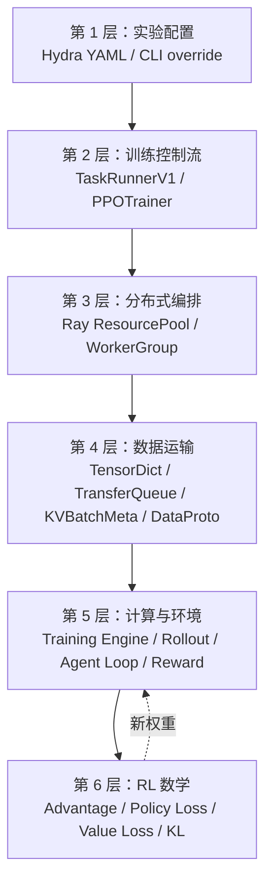

# 00. 学习地图：把 verl 拆成可以理解的层

## 0.1 为什么 verl 第一眼很难读

verl 同时包含五种不同性质的代码：

1. **RL 数学**：reward、return、advantage、PPO clipping、KL；
2. **LLM 计算**：tokenization、forward、generation、log-prob、backward；
3. **分布式并行**：data parallel、tensor parallel、pipeline parallel、FSDP；
4. **系统调度**：Ray actor、placement group、资源池、异步任务；
5. **产品/环境逻辑**：multi-turn、工具调用、reward function、dataset schema。

如果一开始按目录逐文件阅读，很容易把这些层混在一起。例如：

- `ActorRolloutRefWorker` 不是 RL 里的 actor 定义，而是一个可以承载多个角色的远程 worker；
- rollout 不是一次普通的 model forward，而是采样、服务路由、Agent Loop 和环境交互的组合；
- `DataProto` 不是算法本身，它是数据容器；
- TransferQueue 不计算 loss，它负责让大数据不必通过 controller 反复搬运；
- `response_mask` 不只是 padding mask，它还区分哪些 response token 是模型生成的。

所以更有效的学习方法不是“先把每个 class 背下来”，而是围绕一条 trajectory，逐层追问。

## 0.2 六层架构地图



每层只回答一种问题：

| 层 | 主要问题 | 典型对象 |
|---|---|---|
| 配置 | 这次实验想运行什么？ | `ppo_trainer.yaml`、dataclass config |
| 控制流 | 一次 step 的先后顺序是什么？ | `PPOTrainer.fit()`、`_step_once()` |
| 编排 | 哪些进程、GPU 执行任务？ | `ResourcePoolManager`、`RayWorkerGroup` |
| 数据运输 | tensor 存在哪里、怎样被引用？ | `TransferQueue`、`KVBatchMeta` |
| 计算与环境 | 如何生成、打分、forward/backward？ | engine、rollout、agent loop |
| RL 数学 | 如何从 reward 得到优化目标？ | GAE/GRPO、PPO loss、KL |

## 0.3 一条 trajectory 的十个问题

把任何训练故障或源码阅读任务映射到下面十个问题：

1. **来源**：这条数据来自哪个 split、哪一行？
2. **prompt**：chat template 在哪里应用，得到哪些 token？
3. **扩增**：`rollout.n` 如何让一条 prompt 变成多个 session？
4. **生成**：哪个 rollout replica 接到请求？用什么 sampling 参数？
5. **交互**：Agent Loop 是否插入工具结果或环境 observation？
6. **掩码**：哪些 token 是 action，哪些只是上下文或 padding？
7. **奖励**：reward 从规则、模型还是外部环境而来？放在哪个 token？
8. **优势**：怎样把 sequence reward 分配到 token，并形成 advantage？
9. **优化**：old/new/reference log-prob 怎样进入 policy loss？
10. **闭环**：更新后的权重何时同步给 rollout，下一批数据是否已经过时？

这十个问题组成了本手册的主线。

## 0.4 高层控制流：先忽略所有实现细节

先把一次 RL step 看成下面的伪代码：

```python
prompts = next(dataloader)
trajectories = rollout(prompts, samples_per_prompt=n)
rewards = reward(trajectories)

old_log_probs = (
    actor.log_prob(trajectories)
    if not bypass_recomputing_logprobs
    else trajectories.rollout_log_probs
)
ref_log_probs = reference.log_prob(trajectories)  # 仅在配置需要时
values = critic.value(trajectories)               # GAE 等方法需要

advantages, returns = estimate_advantage(
    trajectories, rewards, values
)

critic.update(trajectories, returns)               # 没有 critic 时跳过
if global_step >= critic_warmup:                   # warmup 阶段可以只更新 critic
    actor.update(trajectories, old_log_probs, ref_log_probs, advantages)

sync_actor_weights_to_rollout()
```

这段代码表达的是 **逻辑依赖**，不是 V1 的真实 Python API。真实实现还要解决：

- 6 条 trajectory 长度不同，如何存储？
- actor 和 rollout 是否共享 GPU？
- 一个 worker group 有多少 rank？
- log-prob 的大 tensor 是否需要回到 driver？
- rollout 正在生成时能否同时训练？
- tool call 被解析失败时 trajectory 怎样终止？
- checkpoint 恢复时 dataloader 和 global step 如何对齐？

verl 的大部分框架代码，正是在解决这些数学伪代码没有表达的系统问题。

## 0.5 三组容易混淆的概念

### 角色、进程、引擎不是一回事

```text
RL 角色：actor / reference / critic / reward / rollout
远程执行：Ray worker / worker group / rank
计算实现：FSDP engine / Megatron engine / vLLM rollout
```

一个 Ray worker 可以组合 actor、rollout、reference 多个角色；同一个 actor 角色也会由许多 data-parallel rank 共同实现。

### 逻辑 batch、物理 batch、micro batch 不是一回事

- 逻辑 batch：算法认为属于一次更新的全部 trajectory；
- mini-batch：一次 optimizer update 处理的子集；
- micro-batch：为了控制显存，一次 forward/backward 真正送进设备的更小子集；
- rollout batch：一次送给生成系统的 prompt/session 集合；
- dynamic batch：按照 token 数而不是样本数重新打包。

### 模型 token、环境 token、padding 不是一回事

```text
模型生成 token  → action，通常 response_mask=1
工具返回 token  → observation，通常 response_mask=0
padding token    → 仅用于对齐，attention/loss mask=0
```

它们都可能出现在最终张量里，但对 attention、log-prob 和 loss 的意义不同。

## 0.6 建议的源码阅读方法

不要从某个大 class 第一行读到最后一行。采用“纵向切片”：

1. 从 [`main_ppo.py`](https://github.com/verl-project/verl/blob/d33ddd7140f44d392e0e10b48a8902651a1340f4/verl/trainer/main_ppo.py) 找到 `TaskRunnerV1`；
2. 从 V1 trainer 的 `fit()` 进入一次 `_step_once()`；
3. 只追一项，例如 `old_log_probs`：
   `trainer → worker group method → worker → engine → output field`；
4. 再追数据的反方向：
   `dataset → agent loop → TransferQueue → worker`；
5. 最后才对照 `core_algos.py` 的公式。

每追一个字段，记录四件事：

| 问题 | 例子 |
|---|---|
| 谁创建它？ | rollout / actor / reward loop |
| 它的 shape 是什么？ | `[B, L_response]` |
| 它的 mask 是什么？ | `response_mask` |
| 谁消费它？ | advantage estimator / policy loss |

## 0.7 学习阶段与验收标准

### 阶段一：能画出来

不用看代码，可以画出 `prompt → rollout → reward → advantage → update → sync`。

### 阶段二：能定位

看到配置项或日志名，能定位到 trainer、worker、engine 或 agent loop 中对应位置。

### 阶段三：能解释 shape

能解释 batch 扩增、ragged trajectory、padding、mask、token-level loss。

### 阶段四：能安全扩展

新增 reward/tool/agent loop 时，知道输入输出契约，不破坏训练数据流。

### 阶段五：能诊断系统问题

看到 OOM、hang、stale sample、reward 为零、loss 不动时，能先判断是数据、算法、并行还是权重同步问题。

下一章先补足进入这些阶段所需的最小前置知识。
