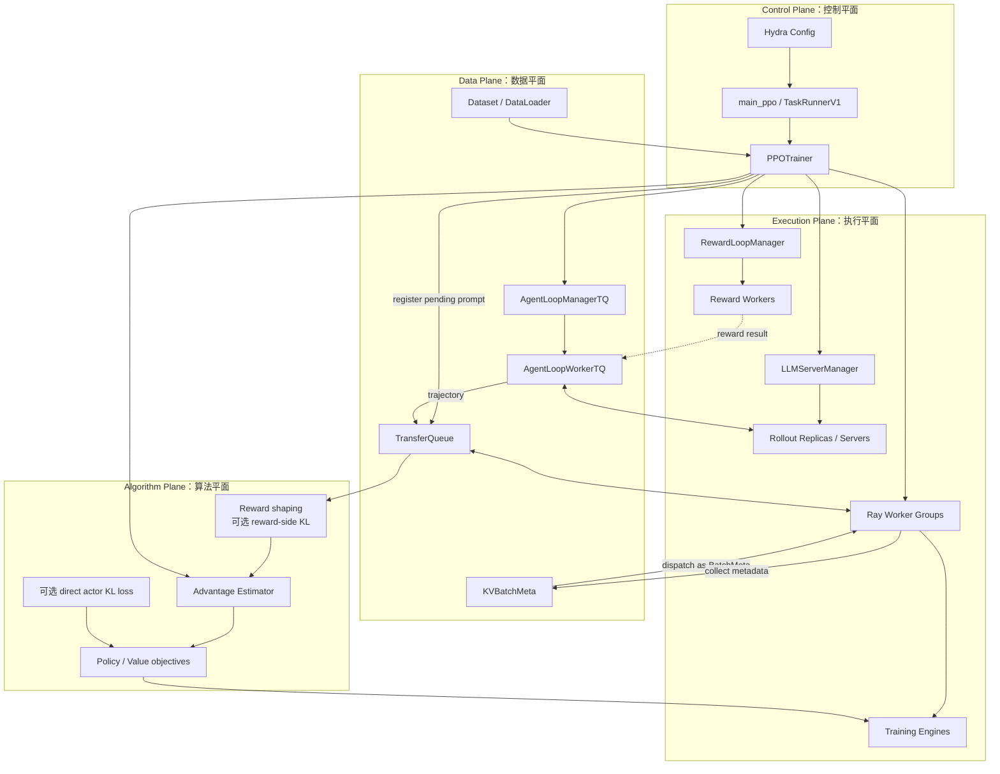
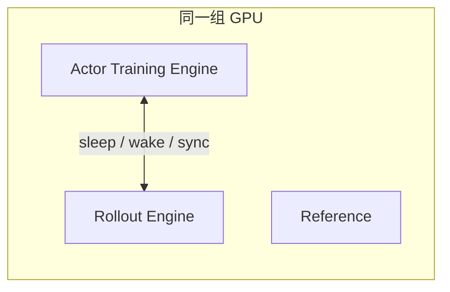
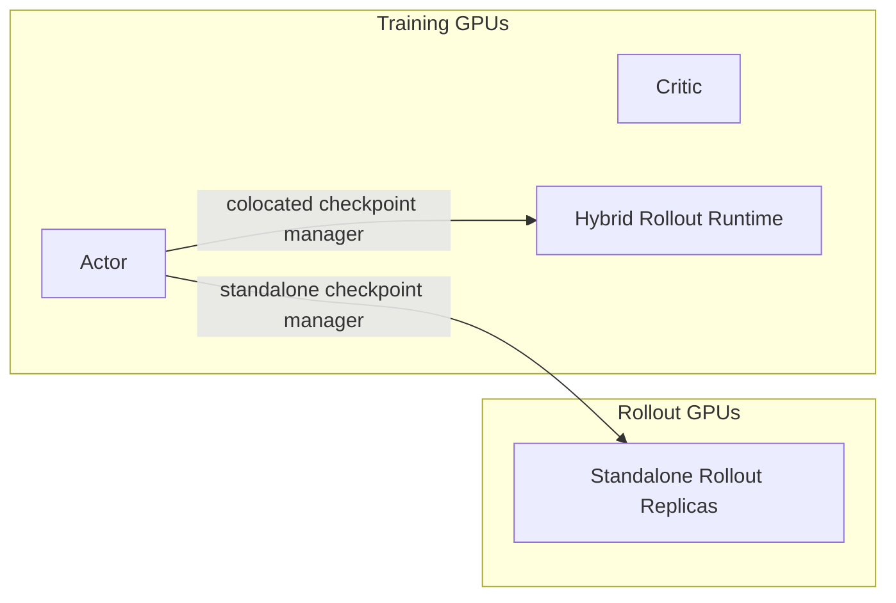
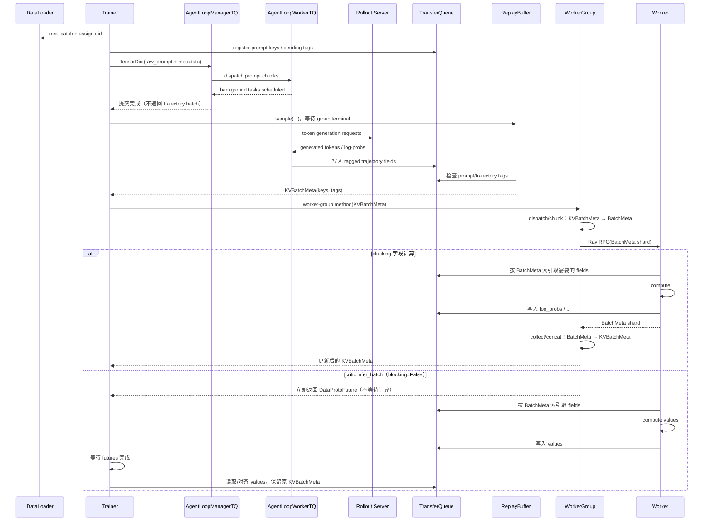
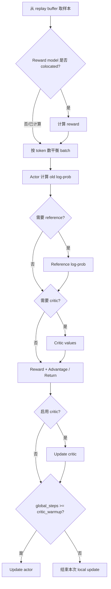

# 02. 整体架构：verl 到底负责什么

## 2.1 一句话定义

verl 是一个面向 LLM 强化学习后训练的 **混合控制器（hybrid-controller）框架**：高层由 single controller 以 MPMD 方式编排 actor、rollout、critic、reward 等不同程序；训练 Model Engine 内部再由各 rank/process group 以 SPMD 方式共同计算。rollout 则默认运行在 server mode，底层 executor 可以分布式执行，但不应把整个 rollout 角色概括成 SPMD worker。

角色共置和后端替换是这套控制结构带来的重要能力：actor、rollout、reference 可以共置于相同 worker/GPU；训练可用 FSDP/Megatron 等，rollout 可用 vLLM/SGLang/TensorRT-LLM 等。但它们不是 “hybrid-controller” 一词本身的完整定义。

所以 verl 的核心价值不是重新实现 Transformer，而是把一个 RL 闭环可靠地运行在分布式集群上。

## 2.2 四个平面



### 控制平面

负责：

- 解析配置；
- 创建资源和 worker；
- 决定一次 step 的调用顺序；
- validation、logging、checkpoint；
- 同步/异步模式的生命周期协调。

### 执行平面

负责真正的 GPU/CPU 计算：

- rollout 生成；
- actor/reference log-prob；
- critic value；
- reward model 或规则 reward；
- forward、backward、optimizer step。

### 数据平面

负责 trajectory 及其派生字段的存储、定位、padding、切分和传输。

### 算法平面

负责从 reward/value/log-prob 计算 advantage 和 loss。它不应该关心 Ray actor 被放在哪张 GPU 上。

## 2.3 RL 角色

下面把 trainer 的分布式模型 [`Role`](https://github.com/verl-project/verl/blob/d33ddd7140f44d392e0e10b48a8902651a1340f4/verl/trainer/ppo/utils.py) 与 reward function 这个非模型组件放在同一张功能表中。它们的高层含义如下：

| 角色 | 是否训练 | 输入 | 输出/职责 |
|---|---:|---|---|
| actor | 是 | trajectory、advantage | new log-prob、policy gradient、更新参数 |
| rollout | 否 | prompt、sampling config | sampled response / trajectory |
| reference | 通常冻结 | trajectory | reference log-prob，用于 KL |
| critic | 是 | trajectory | token-level value；拟合 return |
| reward model | 通常冻结 | prompt + response | model-based score |
| reward function | 否 | response、ground truth、metadata | rule/custom reward |

`reward function` 不是 `Role` enum 成员；它由 Reward Loop/Manager 调用。代码里还有组合 Role，例如 `Role.ActorRollout` 或 `Role.ActorRolloutRef`。它们表达 **部署组合**，不是增加了新的 RL 数学角色。

## 2.4 逻辑角色与物理部署

同一个实验有多种物理布局。

### Colocated



优点：节省 GPU；缺点：必须在训练、生成、权重同步、KV cache 生命周期之间协调显存。

### Separate



当前 `separate_async` 实现会同时创建 training GPU 上的 hybrid rollout runtime 和独立 rollout replicas。独立 replicas 持续生成；hybrid runtime 在首次取样后切到 trainer 模式，主要在 validation 时切回 rollout。动态 generation 切换接口目前仍返回 `False`，所以不能把图简化成“训练组里完全没有 rollout runtime”。

优点：训练和生成可重叠；缺点：需要额外 GPU、两条 actor 权重同步路径，并控制样本 staleness。

## 2.5 当前默认 V1 启动层次

当前入口的高层调用链：

```text
python3 -m verl.trainer.main_ppo
└── main(config)
    ├── validate_config(config)
    └── run_ppo(config, TaskRunnerV1)
        ├── ray.init(...)
        └── TaskRunnerV1.remote().run(config)
            ├── trainer_cls = get_trainer_cls(trainer_mode)
            ├── enable / resolve config + tq.init(...)
            ├── trainer.init()
            ├── AgentLoopManagerTQ.create(...)
            └── trainer.fit(agent_loop_manager)
```

对应入口见 [`verl/trainer/main_ppo.py`](https://github.com/verl-project/verl/blob/d33ddd7140f44d392e0e10b48a8902651a1340f4/verl/trainer/main_ppo.py)。

`TaskRunnerV1` 是一个 Ray remote actor。driver 先初始化 Ray，再让 task runner 在 Ray 运行环境中完成资源、worker 与 trainer 初始化。

## 2.6 Trainer 不是 Worker

这是读源码时最关键的边界之一。

### Trainer

Trainer 位于 controller 一侧，它的代码像：

```python
# 等价伪代码
self._add_batch_to_generate()  # fetch prompt，先注册 TQ pending tag，再 fire-and-forget
batch_meta, sample_metrics = self.replay_buffer.sample(...)

if reward_model_is_colocated:
    batch_meta = self._compute_reward_colocate(batch_meta, metrics)
batch_meta = self._balance_batch(batch_meta, metrics)
batch_meta = self._compute_old_log_prob(batch_meta, metrics)
if self.use_reference_policy:
    batch_meta = self._compute_ref_log_prob(batch_meta, metrics)
if self.use_critic:
    batch_meta = self._compute_values(batch_meta, metrics)
batch_meta = self._compute_advantage(batch_meta, metrics)
if self.use_critic:
    batch_meta = self._update_critic(batch_meta, metrics)
if self.global_steps >= self.config.trainer.critic_warmup:
    batch_meta = self._update_actor(batch_meta, metrics)
```

reward 也可能已由并行 Reward Loop 在 Agent Loop 后处理阶段写入；上面的 `_compute_reward_colocate` 只表示 reward model 与 rollout 共置时的延迟计算分支。Trainer 决定“提交生成、等样本、补齐 reward/log-prob/value、再更新”，但通常不亲自持有完整 GPU 模型。

### Worker

verl 中 “worker” 这个词有两层。在默认 V1 的 **模型训练 worker group** 中，Ray 远程进程边界是外层 `WorkerDict` actor；它内部再组合 `ActorRolloutRefWorker`、`TrainingWorker` 等普通本地对象。后者仍负责模型计算，但不能把每个 inner worker 都想成独立 Ray process。这个限定不适用于全部子系统：[`AgentLoopWorkerTQ` 本身就是 Ray actor](https://github.com/verl-project/verl/blob/d33ddd7140f44d392e0e10b48a8902651a1340f4/verl/trainer/ppo/v1/agent_loop_tq.py#L52-L59)，Reward Loop workers 和 rollout replicas 也由各自 manager 独立创建。

这一组 worker 对象共同负责：

- 初始化 distributed process group；
- 持有模型/optimizer/rollout engine；
- 执行 trainer 发来的方法；
- 从 TransferQueue 取得 tensor，写回结果字段。

### Engine

Engine 位于 worker 内部，封装具体训练后端：

```text
trainer → worker group → worker method → engine API → PyTorch/backend kernels
```

因此：

- trainer 是 orchestration；
- 外层 Ray worker/`WorkerDict` 是 remote process boundary，inner worker 是该进程内的角色实现；
- engine 是 computation backend boundary。

## 2.7 V1 的数据平面

当前默认 V1 通过 TransferQueue 避免 controller 成为大 tensor 中转站。

简化过程：



`KVBatchMeta` 更像“这一批数据的句柄和标签”，不是完整 trajectory tensor。

对于“产生非空 batch `TensorDict` 且需要 collect”的 blocking 字段计算型 worker 方法，桥接逻辑会：

1. 根据 metadata 从 TransferQueue 取字段；
2. 在 worker 内构造计算所需的 TensorDict；
3. 调用真实方法；
4. 把输出字段写回 TransferQueue；
5. 把较小的 metadata 返回 controller。

actor/critic update 这类只返回标量 metrics 的调用可以直接回到 controller，并不会为了统一形式而把 metrics 写成 TQ 列。critic 的 `infer_batch` 又是一个单独的 non-blocking 分支：controller [等待 `DataProtoFuture` 所代表的写入完成，再处理 TQ 中的 `values`](https://github.com/verl-project/verl/blob/d33ddd7140f44d392e0e10b48a8902651a1340f4/verl/trainer/ppo/v1/trainer_base.py#L1566-L1586)，而不执行图中 blocking collect/concat。上面的几条路径解释了为什么只看 trainer 里的变量，可能看不到传统意义上的大 batch 内容。

## 2.8 DataProto 在 V1 中仍然存在，但角色变了

[`DataProto`](https://github.com/verl-project/verl/blob/d33ddd7140f44d392e0e10b48a8902651a1340f4/verl/protocol.py) 是 verl 的重要数据抽象：

```text
DataProto
├── batch: TensorDict              # tensor fields
├── non_tensor_batch: numpy arrays # strings / objects / metadata
└── meta_info: dict                # runtime information
```

它支持 `select`、`pop`、`union`、`chunk`、`concat`、`reorder`、`repeat` 等 batch 操作。

但需要区分：

- **V0**：controller 主 batch 与 Agent Loop 边界以 `DataProto` 为主；[进入统一 training-engine RPC 前会再转换成 padding-free `TensorDict`](https://github.com/verl-project/verl/blob/d33ddd7140f44d392e0e10b48a8902651a1340f4/verl/trainer/ppo/ray_trainer.py#L1227-L1261)；
- **V1**：TransferQueue/KVBatchMeta 是主干；在需要现有 reward/advantage 算法时，会把 ragged 数据局部 pad 并复用 DataProto/算法函数。

因此文档中看到 DataProto 时，要问：这是持久的主数据路径，还是某个局部计算接口的适配层？

## 2.9 Rollout 不等于 `model.generate()`

在 verl 中，rollout 子系统至少包括：

```text
request routing
+ sampling configuration
+ inference backend
+ multi-turn Agent Loop
+ tool/environment interaction
+ token/mask construction
+ output storage
+ weight-version coordination
```

单轮无工具任务只是这个系统的退化情形：Agent Loop 生成一次，然后终止。

## 2.10 一次 V1 step 的逻辑依赖图

当前 V1 trainer 的 `_step_once()` 大体遵循：



这个顺序有几层含义：

- old log-prob 必须在 actor 被本 step 更新前得到；
- advantage 依赖 reward，GAE 还依赖 values；
- actor update 依赖 advantage 和 old log-prob；
- critic update 与 actor update 的具体先后由 trainer 固定；
- rollout 权重同步通常在 step 边界协调。

## 2.11 V0 与 V1：怎样阅读旧资料

| 维度 | V0 / legacy | 当前默认 V1 |
|---|---|---|
| 典型 trainer | `RayPPOTrainer` | `PPOTrainer` V1 系列 |
| 数据主干 | `DataProto` | TransferQueue + `KVBatchMeta` |
| 生成入口 | `AgentLoopManager` + LLM server，输出 padded `DataProto` | `AgentLoopManagerTQ` + LLM server，结果驻留 TQ |
| 模式 | 传统同步为主 | sync / colocate async / separate async |
| 入口选择 | `trainer.use_v1=false` | `trainer.use_v1=true` |

旧资料对 PPO 数学、角色划分、DataProto API 仍可能有帮助，但不能直接当作当前默认控制流。

## 2.12 框架不替你做什么

verl 提供机制，但不会自动保证：

- reward 合理且不可 hack；
- dataset prompt schema 正确；
- GRPO group 内有足够 reward 方差；
- sampling policy 与训练假设完全一致；
- tool sandbox 安全；
- async staleness 在可接受范围；
- 你选的并行策略最优；
- 日志中的 loss 下降等于模型能力提升。

所以系统性理解框架的最终目的，不是为了记住更多 class，而是能辨别问题属于“机制错误”还是“实验设计错误”。

## 2.13 本章源码入口

- [`verl/trainer/main_ppo.py`](https://github.com/verl-project/verl/blob/d33ddd7140f44d392e0e10b48a8902651a1340f4/verl/trainer/main_ppo.py)：入口与 V0/V1 选择；
- [`verl/trainer/ppo/v1/trainer_base.py`](https://github.com/verl-project/verl/blob/d33ddd7140f44d392e0e10b48a8902651a1340f4/verl/trainer/ppo/v1/trainer_base.py)：V1 初始化和 step；
- [`verl/trainer/ppo/utils.py`](https://github.com/verl-project/verl/blob/d33ddd7140f44d392e0e10b48a8902651a1340f4/verl/trainer/ppo/utils.py)：Role 与角色判断；
- [`verl/protocol.py`](https://github.com/verl-project/verl/blob/d33ddd7140f44d392e0e10b48a8902651a1340f4/verl/protocol.py)：DataProto；
- [`verl/utils/transferqueue_utils.py`](https://github.com/verl-project/verl/blob/d33ddd7140f44d392e0e10b48a8902651a1340f4/verl/utils/transferqueue_utils.py)：TransferQueue bridge；
- [`verl/single_controller/ray/base.py`](https://github.com/verl-project/verl/blob/d33ddd7140f44d392e0e10b48a8902651a1340f4/verl/single_controller/ray/base.py)：Ray resource/worker 基础设施；
- [`verl/workers/engine_workers.py`](https://github.com/verl-project/verl/blob/d33ddd7140f44d392e0e10b48a8902651a1340f4/verl/workers/engine_workers.py)：worker 与 engine 组合；
- [`verl/experimental/agent_loop/agent_loop.py`](https://github.com/verl-project/verl/blob/d33ddd7140f44d392e0e10b48a8902651a1340f4/verl/experimental/agent_loop/agent_loop.py)：Agent Loop 基类和管理器。
- [`verl/trainer/ppo/v1/agent_loop_tq.py`](https://github.com/verl-project/verl/blob/d33ddd7140f44d392e0e10b48a8902651a1340f4/verl/trainer/ppo/v1/agent_loop_tq.py)：V1 Agent Loop 与 TransferQueue 的连接层。
