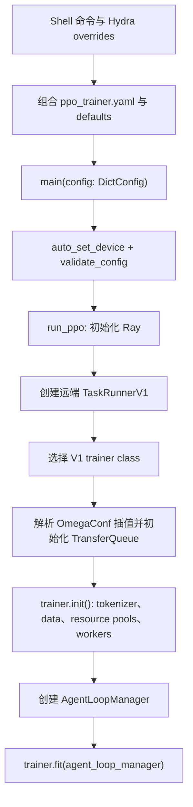

# 03. 配置系统与 PPO 入口：一条命令如何变成一场训练

这一章回答一个看似简单、实际上贯穿 verl 全部运行过程的问题：

> 当我们执行 `python3 -m verl.trainer.main_ppo ...` 时，命令行上的几十个参数究竟去了哪里？

verl 的 PPO 主路径使用 **Hydra** 组合配置，使用 **OmegaConf** 保存和解析配置；随后，它只在真正需要某个组件时，才把对应的配置子树转换成 Python `dataclass` 对象。理解这条链路后，长达数十行的训练命令就不再是一堆“魔法字符串”，而会变成一棵可以追踪、检查和推导的配置树。

本章以当前默认入口 [verl/trainer/main_ppo.py](https://github.com/verl-project/verl/blob/d33ddd7140f44d392e0e10b48a8902651a1340f4/verl/trainer/main_ppo.py) 和主配置 [verl/trainer/config/ppo_trainer.yaml](https://github.com/verl-project/verl/blob/d33ddd7140f44d392e0e10b48a8902651a1340f4/verl/trainer/config/ppo_trainer.yaml) 为准。

## 3.1 先认识四个概念

### 3.1.1 YAML 只是配置的原材料

例如：

```yaml
trainer:
  nnodes: 1
  n_gpus_per_node: 8
```

它表达的是一棵树：根节点下有 `trainer`，`trainer` 下又有两个叶子。命令行中的：

```bash
trainer.n_gpus_per_node=4
```

就是沿着点分路径找到这个叶子，再把值覆盖成 `4`。

### 3.1.2 OmegaConf 的 `DictConfig`

Hydra 组合完多个 YAML 后，`main()` 收到的不是普通 `dict`，也不是一个巨大的 `TrainerConfig` 类，而是 OmegaConf 的 `DictConfig`：

```python
config.trainer.n_gpus_per_node
config["trainer"]["n_gpus_per_node"]
```

这两种访问方式都可以。`DictConfig` 还支持插值、缺失值、合并和延迟解析，这些能力是普通字典没有的。

### 3.1.3 Hydra 的配置组合

verl 没有把所有字段写进一个巨型 YAML。主配置通过 `defaults` 从不同目录选择并合并组件配置，例如 actor、rollout、reference policy、critic 和 reward。

这样做的意义是：切换训练后端时，不需要逐个覆盖几百个 FSDP 或 Megatron 字段，只需要切换一个“配置组选择”。

### 3.1.4 `dataclass` 是部分组件的运行时配置对象

很多组件 YAML 都带有 `_target_`：

```yaml
_target_: verl.workers.config.FSDPActorConfig
```

它告诉 verl：“当这个子树需要被实例化时，请创建这个 Python 类。”对应的 schema 位于 [verl/workers/config/actor.py](https://github.com/verl-project/verl/blob/d33ddd7140f44d392e0e10b48a8902651a1340f4/verl/workers/config/actor.py)。

但是要特别注意：

> `_target_` 不会让 Hydra 在组合 YAML 时自动实例化整棵树。PPO 主入口拿到的仍然是 `DictConfig`；只有代码显式调用 `omega_conf_to_dataclass(...)` 时，相应子树才会变成对象。

当前 PPO 主路径也没有通过 Hydra `ConfigStore` 注册一棵覆盖所有字段的结构化配置。因此，`data` 和 `trainer` 等节点会一直以 `DictConfig` 的形式被消费，而 actor、critic、rollout、model 等节点会在不同阶段按需转换。

## 3.2 从入口找到配置搜索目录

入口装饰器位于 [verl/trainer/main_ppo.py](https://github.com/verl-project/verl/blob/d33ddd7140f44d392e0e10b48a8902651a1340f4/verl/trainer/main_ppo.py)：

```python
@hydra.main(config_path="config", config_name="ppo_trainer", version_base=None)
def main(config):
    ...
```

可以把它读成：

- `config_path="config"`：从 `main_ppo.py` 同级的 `config/` 目录搜索配置；
- `config_name="ppo_trainer"`：根配置是 `ppo_trainer.yaml`；
- `main(config)`：Hydra 组合完成后，把一个 `DictConfig` 传入函数。

所以默认根配置的实际位置是：

```text
verl/trainer/config/ppo_trainer.yaml
```

它的配置组位于同一搜索根下：

```text
verl/trainer/config/
├── algorithm/
├── actor/
├── critic/
├── data/
├── distillation/
├── engine/
├── model/
├── model_engine/
├── optim/
├── profiler/
├── ref/
├── reward/
├── rollout/
├── transfer_queue/
└── ppo_trainer.yaml
```

这里只画出 PPO 主配置直接组合或经组件继续组合的主要目录；同一搜索根下还有其他专项配置。

也可以用 `--config-path` 和 `--config-name` 换用 recipe 自己的根配置。不过对于第一次阅读源码，先坚持使用默认 `ppo_trainer.yaml`，否则很容易把“框架默认行为”和“某个 recipe 的扩展行为”混在一起。

## 3.3 `defaults`：最终配置树是怎样拼出来的

主配置最关键的部分不是下面那些具体数值，而是开头的 `defaults`：

```yaml
defaults:
  - model_engine: dp
  - actor@actor_rollout_ref.actor: ${model_engine}_actor
  - data@data: legacy_data
  - ref@actor_rollout_ref.ref: ${model_engine}_ref
  - rollout@actor_rollout_ref.rollout: rollout
  - model@actor_rollout_ref.model: hf_model
  - critic@critic: ${model_engine}_critic
  - model@critic.model: hf_model
  - legacy_reward_impl
  - reward@reward: reward
  - algorithm@algorithm.rollout_correction: rollout_correction
  - distillation@distillation: distillation
  - transfer_queue@transfer_queue: transfer_queue
  - _self_
```

先拆解这一行：

```yaml
- actor@actor_rollout_ref.actor: ${model_engine}_actor
```

其形式是：

```text
配置组目录 @ 放入最终树中的位置 : 选择的配置名
```

默认 `model_engine=dp`，所以 `${model_engine}_actor` 变成 `dp_actor`。Hydra 会读取：

```text
verl/trainer/config/actor/dp_actor.yaml
```

然后把内容放到：

```text
config.actor_rollout_ref.actor
```

同理：

| defaults 项 | 读取的默认文件 | 放入最终树的位置 |
|---|---|---|
| `data@data: legacy_data` | `data/legacy_data.yaml` | `config.data` |
| `ref@actor_rollout_ref.ref: dp_ref` | `ref/dp_ref.yaml` | `config.actor_rollout_ref.ref` |
| `rollout@actor_rollout_ref.rollout: rollout` | `rollout/rollout.yaml` | `config.actor_rollout_ref.rollout` |
| `model@actor_rollout_ref.model: hf_model` | `model/hf_model.yaml` | `config.actor_rollout_ref.model` |
| `critic@critic: dp_critic` | `critic/dp_critic.yaml` | `config.critic` |
| `model@critic.model: hf_model` | `model/hf_model.yaml` | `config.critic.model` |
| `reward@reward: reward` | `reward/reward.yaml` | `config.reward` |

这里的 `@actor_rollout_ref.actor` 是 **package override**：它覆盖该配置文件默认会被放入的位置。文件内部也可以声明 package，例如 [model_engine/dp.yaml](https://github.com/verl-project/verl/blob/d33ddd7140f44d392e0e10b48a8902651a1340f4/verl/trainer/config/model_engine/dp.yaml) 开头是：

```yaml
# @package _global_
model_engine: dp
```

`_global_` 表示把 `model_engine` 放在根节点，而不是得到 `config.model_engine.model_engine` 之类的重复层级。

### 3.3.1 配置还会递归组合

[verl/trainer/config/actor/dp_actor.yaml](https://github.com/verl-project/verl/blob/d33ddd7140f44d392e0e10b48a8902651a1340f4/verl/trainer/config/actor/dp_actor.yaml) 自己也有 `defaults`：

```yaml
defaults:
  - ../optim@optim: fsdp
  - ../engine@fsdp_config: fsdp
  - actor
  - _self_
```

它组合了：

- FSDP optimizer 配置；
- FSDP engine 配置；
- 通用 actor 配置 [verl/trainer/config/actor/actor.yaml](https://github.com/verl-project/verl/blob/d33ddd7140f44d392e0e10b48a8902651a1340f4/verl/trainer/config/actor/actor.yaml)；
- `dp_actor.yaml` 自己的覆盖值。

因此，最终的 `config.actor_rollout_ref.actor` 同时包含通用 PPO 超参数、优化器、FSDP engine、checkpoint 和 profiler 等子树。

### 3.3.2 `_self_` 决定当前文件的合并位置

`_self_` 代表“当前 YAML 自己的内容”。verl 通常把它放在最后，含义是：

1. 先加载 defaults 中引用的基础配置；
2. 再用当前文件中的字段覆盖它们。

主配置中的 `_self_` 也在最后，所以 [ppo_trainer.yaml](https://github.com/verl-project/verl/blob/d33ddd7140f44d392e0e10b48a8902651a1340f4/verl/trainer/config/ppo_trainer.yaml) 自己声明的值会覆盖前面组合进来的同名值。最后，命令行 override 再覆盖组合结果。

可以把优先级粗略记成：

```text
基础组件配置 < 当前 YAML 的 _self_ < 命令行 override
```

### 3.3.3 `model_engine` 是配置组，不只是一个字符串

当前主配置支持的 `model_engine` 选项包括：

```text
dp / megatron / veomni / torchtitan / mindspeed
```

例如：

```bash
model_engine=megatron
```

会同时让动态 defaults 选择：

```text
actor/megatron_actor.yaml
ref/megatron_ref.yaml
critic/megatron_critic.yaml
```

这和下面的写法完全不同：

```bash
actor_rollout_ref.actor.strategy=megatron
```

后者只改一个叶子，不会把 FSDP 的 optimizer、engine 和 dataclass schema 换成 Megatron 版本，最终会得到互相矛盾的配置。

当前默认 `model_engine=dp` 选择的是 `dp_actor.yaml`，而该文件目前把 actor strategy 设为 `fsdp`。因此，命令里的 `dp` 是配置组名称，不代表 rollout 使用某个名为 “dp” 的推理引擎。

## 3.4 先看懂最终配置树

组合后最值得先掌握的主干如下：

```text
config
├── actor_rollout_ref
│   ├── model          # 公共 HF 模型、tokenizer、LoRA 等
│   ├── actor          # 可训练策略和训练 engine
│   ├── rollout        # 生成服务、采样和 agent loop
│   ├── ref            # 冻结参考策略的 log-prob 计算
│   ├── hybrid_engine
│   └── nccl_timeout
├── critic             # value model；GAE 默认需要
│   └── model
├── reward
│   ├── custom_reward_function
│   ├── reward_manager
│   ├── reward_model   # 可选，且拥有自己的 rollout 配置
│   └── sandbox_fusion
├── data               # 数据文件、字段、长度、batch、工具/多模态设置
├── algorithm          # GAE/GRPO、gamma/lambda、KL、rollout correction
├── trainer            # 资源、epoch、日志、验证、保存和 V1 模式
├── distillation
├── transfer_queue
├── global_profiler
├── skip
└── ray_kwargs
```

### 3.4.1 `actor_rollout_ref.model`

来源是 [verl/trainer/config/model/hf_model.yaml](https://github.com/verl-project/verl/blob/d33ddd7140f44d392e0e10b48a8902651a1340f4/verl/trainer/config/model/hf_model.yaml)，schema 是 [verl/workers/config/model.py](https://github.com/verl-project/verl/blob/d33ddd7140f44d392e0e10b48a8902651a1340f4/verl/workers/config/model.py) 中的 `HFModelConfig`。

重点字段包括：

- `path`、`tokenizer_path`、`hf_config_path`；
- `trust_remote_code`、`override_config`；
- gradient checkpointing、activation offload、remove padding；
- LoRA、fused kernel、MTP 等模型功能。

actor、rollout 和 ref 在概念上使用同一个策略模型来源；critic 则有独立的 `critic.model`，只是 defaults 默认也从 `hf_model.yaml` 初始化。

### 3.4.2 `actor_rollout_ref.actor`

来源由 `model_engine` 决定，通用字段定义在 [actor/actor.yaml](https://github.com/verl-project/verl/blob/d33ddd7140f44d392e0e10b48a8902651a1340f4/verl/trainer/config/actor/actor.yaml)，schema 定义在 [verl/workers/config/actor.py](https://github.com/verl-project/verl/blob/d33ddd7140f44d392e0e10b48a8902651a1340f4/verl/workers/config/actor.py)。

它控制“怎样训练策略”：

- `strategy` 和后端 engine 子树；
- `optim`、学习率和 checkpoint；
- PPO mini/micro batch；
- dynamic batch 与每 GPU 最大 token 数；
- clip ratio、entropy、KL loss；
- PPO epoch、shuffle、loss aggregation。

### 3.4.3 `actor_rollout_ref.rollout`

来源是 [verl/trainer/config/rollout/rollout.yaml](https://github.com/verl-project/verl/blob/d33ddd7140f44d392e0e10b48a8902651a1340f4/verl/trainer/config/rollout/rollout.yaml)，schema 是 [verl/workers/config/rollout.py](https://github.com/verl-project/verl/blob/d33ddd7140f44d392e0e10b48a8902651a1340f4/verl/workers/config/rollout.py) 中的 `RolloutConfig`。

它控制“怎样用当前策略生成轨迹”：

- `name`：`vllm`、`sglang`、`trtllm` 等推理后端；
- `temperature`、`top_k`、`top_p`、`n`；
- prompt/response 长度；
- TP/DP/EP/PP 并行大小；
- KV cache 内存比例、最大 batched tokens、最大并发序列；
- rollout 后重新计算 log-prob 的 batch 配置；
- `multi_turn`、`agent`、trace；
- trainer 向 rollout 同步权重所需的 `checkpoint_engine`。

这里有一组必须分清的概念：

```text
model_engine=megatron                 # 训练模型使用什么后端
actor_rollout_ref.rollout.name=vllm  # 生成轨迹使用什么推理后端
```

两者彼此独立。Megatron 训练配 vLLM rollout 是完全正常的组合。

### 3.4.4 `actor_rollout_ref.ref`

ref 是冻结的参考策略，只负责算参考 log-prob。它不是另一个需要更新的 actor。

[verl/trainer/ppo/utils.py](https://github.com/verl-project/verl/blob/d33ddd7140f44d392e0e10b48a8902651a1340f4/verl/trainer/ppo/utils.py) 中的 `need_reference_policy()` 决定是否启用它：

```python
return (
    config.algorithm.get("use_kl_in_reward", False)
    or config.actor_rollout_ref.actor.use_kl_loss
)
```

ref 配置有一个容易困惑的实现细节：DP ref 的 `_target_` 也是 `FSDPActorConfig`。worker 在转换前，会把 ref 的：

```text
log_prob_micro_batch_size
log_prob_micro_batch_size_per_gpu
log_prob_use_dynamic_bsz
log_prob_max_token_len_per_gpu
```

重命名成 ActorConfig 所理解的 PPO 字段，然后复用同一套前向 engine 配置。对应代码在 [verl/workers/engine_workers.py](https://github.com/verl-project/verl/blob/d33ddd7140f44d392e0e10b48a8902651a1340f4/verl/workers/engine_workers.py) 的 `init_model()` 中。

### 3.4.5 `critic`

critic 预测 value，schema 位于 [verl/workers/config/critic.py](https://github.com/verl-project/verl/blob/d33ddd7140f44d392e0e10b48a8902651a1340f4/verl/workers/config/critic.py)。它拥有自己的：

- model；
- optimizer；
- value clip；
- PPO mini/micro batch；
- training engine 和 checkpoint。

`need_critic()` 的规则是：

1. 如果 `critic.enable` 被显式设置，服从该值；
2. 否则 `algorithm.adv_estimator=gae` 时启用；
3. 其他 estimator 默认禁用，并给出提示。

所以 GRPO 通常不需要 critic，而默认 GAE 配置需要。

### 3.4.6 `reward`

来源是 [verl/trainer/config/reward/reward.yaml](https://github.com/verl-project/verl/blob/d33ddd7140f44d392e0e10b48a8902651a1340f4/verl/trainer/config/reward/reward.yaml)，相关 schema 在 [verl/workers/config/reward.py](https://github.com/verl-project/verl/blob/d33ddd7140f44d392e0e10b48a8902651a1340f4/verl/workers/config/reward.py)。它包含三类路径：

- 注册或动态导入的 reward manager；
- `custom_reward_function` 指定的 Python 评分函数；
- 可选的 model-based reward model，以及该模型自己的 rollout 服务。

主配置还组合了 [legacy_reward_impl.yaml](https://github.com/verl-project/verl/blob/d33ddd7140f44d392e0e10b48a8902651a1340f4/verl/trainer/config/legacy_reward_impl.yaml)，因此生成后的配置中会看到旧的顶层 `reward_model`、`custom_reward_function` 和 `sandbox_fusion` 占位节点。新代码应优先使用 `reward.*` 子树；不要因为生成配置里仍存在兼容节点，就继续采用旧路径。

### 3.4.7 `data`

数据配置来自 [verl/trainer/config/data/legacy_data.yaml](https://github.com/verl-project/verl/blob/d33ddd7140f44d392e0e10b48a8902651a1340f4/verl/trainer/config/data/legacy_data.yaml)，当前没有对应的整体 dataclass；数据集代码直接读取 `DictConfig`。

重点字段包括：

- train/validation parquet 路径；
- `prompt_key`、`reward_fn_key`；
- 最大 prompt/response 长度；
- train/gen batch；
- 过长样本过滤与截断方式；
- 自定义 dataset class；
- 图像、视频、音频字段；
- tool config、function tool 和 continuous-token 设置。

### 3.4.8 `trainer`

`trainer` 直接写在 [ppo_trainer.yaml](https://github.com/verl-project/verl/blob/d33ddd7140f44d392e0e10b48a8902651a1340f4/verl/trainer/config/ppo_trainer.yaml) 中，也保持为 `DictConfig`。它控制：

- `nnodes × n_gpus_per_node`；
- epoch 或明确的 total steps；
- 日志后端、项目名、实验名；
- 保存、验证、resume；
- `trainer.use_v1`；
- V1 的 `sync`、`colocate_async`、`separate_async` 模式和 sampler。

当前默认 `trainer.use_v1=true`，旧 `main_ppo_v0.py` 路径已被标记为 deprecated。

## 3.5 OmegaConf 插值：配置节点之间怎样“连线”

verl 大量使用插值，避免同一个逻辑值在多个地方重复填写。

### 3.5.1 直接引用

```yaml
strategy: ${actor_rollout_ref.actor.strategy}
```

ref 的 strategy 直接跟随 actor。

### 3.5.2 `oc.select`：读取路径，缺失时使用默认值

rollout 中有：

```yaml
prompt_length: ${oc.select:data.max_prompt_length,512}
response_length: ${oc.select:data.max_response_length,512}
```

意思是：

1. 如果 `data.max_prompt_length` 存在，使用它；
2. 否则使用 `512`。

因此命令行只需要覆盖：

```bash
data.max_prompt_length=2048
```

`rollout.prompt_length` 会自动跟随。类似连线还包括：

```text
rollout.n
  ├──> actor.rollout_n
  ├──> ref.rollout_n
  └──> critic.rollout_n

actor.use_dynamic_bsz
  ├──> rollout.log_prob_use_dynamic_bsz
  ├──> ref.log_prob_use_dynamic_bsz
  └──> critic.use_dynamic_bsz

actor.ppo_mini_batch_size
  └──> critic.ppo_mini_batch_size
```

### 3.5.3 相对引用

critic 中有：

```yaml
forward_max_token_len_per_gpu: ${.ppo_max_token_len_per_gpu}
```

开头的 `.` 表示“从当前节点开始找”，即读取同一 critic 子树中的 `ppo_max_token_len_per_gpu`。

### 3.5.4 插值是延迟解析的

刚组合出来的配置中，某个值仍可能显示为：

```text
${oc.select:data.max_prompt_length,512}
```

读取这个叶子时 OmegaConf 会解析它。V1 的远端 `TaskRunnerV1.run()` 还会：

```python
pprint(OmegaConf.to_container(config, resolve=True))
OmegaConf.resolve(config)
```

第一行打印解析后的普通容器，第二行把配置树中的插值统一解析掉。

`???` 表示 mandatory-missing sentinel，不是普通字符串占位符。当前 `rollout.name` 默认就是 `???`，所以真实创建 rollout 时必须在 recipe 或命令行中指定。直接读取这个字段、把包含它的 structured config 转成对象，或调用 `OmegaConf.to_container(..., throw_on_missing=True)`，会报 missing-value 错误。单纯的 `resolve=True` 只负责解析插值，并不会自动检查树中每一个未被使用的 `???`；但若某个插值引用了 missing 值，解析该插值仍可能失败。

## 3.6 `_target_`：从配置子树到 Python 对象

转换函数位于 [verl/utils/config.py](https://github.com/verl-project/verl/blob/d33ddd7140f44d392e0e10b48a8902651a1340f4/verl/utils/config.py)。下面是保留两条主路径的简化摘录；原函数还处理空配置、已经实例化的对象、普通 `dict` 和类型检查：

```python
def omega_conf_to_dataclass(config, dataclass_type=None):
    if not config:
        return dataclass_type if dataclass_type is None else dataclass_type()
    if not isinstance(config, (DictConfig, ListConfig, dict, list)):
        return config

    if dataclass_type is None:
        assert "_target_" in config
        from hydra.utils import instantiate
        return instantiate(config, _convert_="partial")

    if not is_dataclass(dataclass_type):
        raise ValueError(...)
    config = OmegaConf.create(config)
    cfg_from_dataclass = OmegaConf.structured(dataclass_type)
    cfg_merged = OmegaConf.merge(cfg_from_dataclass, config)
    return OmegaConf.to_object(cfg_merged)
```

它有两条路径：

1. 没传 `dataclass_type`：读取 YAML 中的 `_target_`，由 Hydra 递归实例化；
2. 显式传入 `dataclass_type`：先用 dataclass 默认值建立 structured config，再让传入配置覆盖它，最后转成对象。

所有这些 schema 的公共基类是 [verl/base_config.py](https://github.com/verl-project/verl/blob/d33ddd7140f44d392e0e10b48a8902651a1340f4/verl/base_config.py) 中的 `BaseConfig`。它让 dataclass 同时拥有类似字典的 `get()`、`[]` 和遍历接口，并默认冻结已经初始化的字段；只有各类声明在 `_mutable_fields` 中的运行时字段可以重新赋值。

### 3.6.1 转换不是在同一个时刻完成的

当前 V1 路径大致在这些位置转换：

| 子树 | 转换时机 | 代表性源码 |
|---|---|---|
| actor | actor worker 初始化模型时 | [verl/workers/engine_workers.py](https://github.com/verl-project/verl/blob/d33ddd7140f44d392e0e10b48a8902651a1340f4/verl/workers/engine_workers.py) |
| ref | ref 字段重命名后、初始化模型时 | [verl/workers/engine_workers.py](https://github.com/verl-project/verl/blob/d33ddd7140f44d392e0e10b48a8902651a1340f4/verl/workers/engine_workers.py) |
| rollout | 构造 rollout engine 时 | [verl/workers/engine_workers.py](https://github.com/verl-project/verl/blob/d33ddd7140f44d392e0e10b48a8902651a1340f4/verl/workers/engine_workers.py) |
| critic | trainer 组装 critic `TrainingWorkerConfig` 时 | [verl/trainer/ppo/v1/trainer_base.py](https://github.com/verl-project/verl/blob/d33ddd7140f44d392e0e10b48a8902651a1340f4/verl/trainer/ppo/v1/trainer_base.py) |
| model | trainer 初始化 tokenizer，以及各 worker 初始化模型时 | [verl/trainer/ppo/v1/trainer_base.py](https://github.com/verl-project/verl/blob/d33ddd7140f44d392e0e10b48a8902651a1340f4/verl/trainer/ppo/v1/trainer_base.py) |

这也意味着 `_target_` 更像“可实例化说明”，而不是“这个节点现在已经是该类型”的证明。algorithm 和 reward 的部分代码仍直接使用 `DictConfig` 风格访问，即使 YAML 中存在 `_target_`。

### 3.6.2 某些对象转换有副作用

`HFModelConfig.__post_init__()` 会处理模型路径、构造 tokenizer/processor，并读取 Hugging Face `AutoConfig`。因此：

```python
omega_conf_to_dataclass(config.actor_rollout_ref.model)
```

不是一个纯粹的“打印配置类型”操作；它可能访问本地或远程模型资源。单纯学习配置时，优先转换 actor 这类不需要加载权重的子树。

### 3.6.3 dataclass schema 源码地图

| 配置职责 | 主要 schema |
|---|---|
| 公共基类 | [verl/base_config.py](https://github.com/verl-project/verl/blob/d33ddd7140f44d392e0e10b48a8902651a1340f4/verl/base_config.py) |
| actor 与复用 actor schema 的 ref | [verl/workers/config/actor.py](https://github.com/verl-project/verl/blob/d33ddd7140f44d392e0e10b48a8902651a1340f4/verl/workers/config/actor.py) |
| rollout、sampling、multi-turn、agent | [verl/workers/config/rollout.py](https://github.com/verl-project/verl/blob/d33ddd7140f44d392e0e10b48a8902651a1340f4/verl/workers/config/rollout.py) |
| critic | [verl/workers/config/critic.py](https://github.com/verl-project/verl/blob/d33ddd7140f44d392e0e10b48a8902651a1340f4/verl/workers/config/critic.py) |
| reward manager / reward model | [verl/workers/config/reward.py](https://github.com/verl-project/verl/blob/d33ddd7140f44d392e0e10b48a8902651a1340f4/verl/workers/config/reward.py) |
| Hugging Face model | [verl/workers/config/model.py](https://github.com/verl-project/verl/blob/d33ddd7140f44d392e0e10b48a8902651a1340f4/verl/workers/config/model.py) |
| FSDP/Megatron/VeOmni/TorchTitan engine | [verl/workers/config/engine.py](https://github.com/verl-project/verl/blob/d33ddd7140f44d392e0e10b48a8902651a1340f4/verl/workers/config/engine.py) |
| optimizer | [verl/workers/config/optimizer.py](https://github.com/verl-project/verl/blob/d33ddd7140f44d392e0e10b48a8902651a1340f4/verl/workers/config/optimizer.py) |
| checkpoint 扩展 | [verl/workers/config/checkpoint.py](https://github.com/verl-project/verl/blob/d33ddd7140f44d392e0e10b48a8902651a1340f4/verl/workers/config/checkpoint.py) |
| algorithm、KL、rollout correction | [verl/trainer/config/algorithm.py](https://github.com/verl-project/verl/blob/d33ddd7140f44d392e0e10b48a8902651a1340f4/verl/trainer/config/algorithm.py) |
| 通用 checkpoint/model/module 小配置 | [verl/trainer/config/config.py](https://github.com/verl-project/verl/blob/d33ddd7140f44d392e0e10b48a8902651a1340f4/verl/trainer/config/config.py) |

看到 YAML 中的 `_target_` 后，可以把完全限定类名映射到这张表，再阅读对应字段和 `__post_init__()`。

## 3.7 一个最小的“组合并转成对象”例子

下面的程序不会启动 Ray，也不会加载模型权重。它只组合完整 PPO 配置，并把 actor 子树转换成 dataclass：

```python
from pathlib import Path

from hydra import compose, initialize_config_dir

from verl.utils.config import omega_conf_to_dataclass


config_dir = Path("verl/trainer/config").resolve()

with initialize_config_dir(version_base=None, config_dir=str(config_dir)):
    config = compose(
        config_name="ppo_trainer",
        overrides=[
            "actor_rollout_ref.rollout.name=vllm",
            "actor_rollout_ref.actor.ppo_micro_batch_size_per_gpu=1",
        ],
    )

actor_config = omega_conf_to_dataclass(config.actor_rollout_ref.actor)

print(type(config).__name__)
print(type(actor_config).__name__)
print(type(actor_config.optim).__name__)
print(type(actor_config.engine).__name__)
print(actor_config.strategy, actor_config.rollout_n)
```

默认 `model_engine=dp` 时，预期类型关系是：

```text
DictConfig
FSDPActorConfig
FSDPOptimizerConfig
FSDPEngineConfig
fsdp 1
```

这里设置 `ppo_micro_batch_size_per_gpu=1`，是因为默认 actor 没有启用 dynamic batch，同时它要求全局旧字段和新的 per-GPU 字段至少填写一个、且不能同时填写。

仓库中的 [tests/workers/config/test_actor_config_on_cpu.py](https://github.com/verl-project/verl/blob/d33ddd7140f44d392e0e10b48a8902651a1340f4/tests/workers/config/test_actor_config_on_cpu.py) 使用了同样的 `initialize_config_dir → compose → omega_conf_to_dataclass` 模式。

## 3.8 不启动训练，只检查 Hydra 最终组合结果

[scripts/print_cfg.py](https://github.com/verl-project/verl/blob/d33ddd7140f44d392e0e10b48a8902651a1340f4/scripts/print_cfg.py) 是一个专门用于组合并打印 PPO 配置的轻量入口：

```bash
python3 scripts/print_cfg.py --cfg job \
  model_engine=megatron \
  actor_rollout_ref.rollout.name=vllm
```

`--cfg job` 是 Hydra 的特殊选项：打印组合后的 job config，然后退出，不执行训练函数体。

常用检查方式：

```bash
# 看默认组合
python3 scripts/print_cfg.py --cfg job

# 看切换训练后端后的整棵树
python3 scripts/print_cfg.py --cfg job model_engine=megatron

# 检查某个关键叶子是否被命令行覆盖
python3 scripts/print_cfg.py --cfg job \
  actor_rollout_ref.rollout.name=sglang \
  data.max_response_length=2048
```

如果加 `--resolve`，Hydra 会尝试解析插值。它有助于观察继承后的实际值，但不是一次完整的 mandatory-value 校验：没有被插值引用的 `???` 仍可能保留在打印结果中。

## 3.9 生成配置：它是地图，不是源代码

你会在配置目录看到：

```text
_generated_ppo_trainer.yaml
_generated_ppo_megatron_trainer.yaml
_generated_ppo_veomni_trainer.yaml
_generated_ppo_torchtitan_trainer.yaml
```

它们由 [scripts/generate_trainer_config.sh](https://github.com/verl-project/verl/blob/d33ddd7140f44d392e0e10b48a8902651a1340f4/scripts/generate_trainer_config.sh) 生成。脚本内部执行类似：

```bash
python3 scripts/print_cfg.py --cfg job model_engine=megatron
```

然后把 defaults 已展开的结果写进单个 YAML。所谓 “generated/flattened” 是指配置组已经展开，并不代表：

- 所有 `${...}` 都已 resolve；
- 所有 `_target_` 都已实例化；
- 训练时会直接读取这个 generated 文件。

文件头明确说明它通常只用于参考。正确的阅读方式是：

1. 用 generated 文件快速查看最终树长什么样；
2. 回到 `ppo_trainer.yaml` 和组件 YAML 找真正的来源；
3. 不要直接修改 generated 文件；
4. 修改源配置后由脚本重新生成并检查 diff。

## 3.10 CLI override 语法

### 3.10.1 覆盖已有字段

```bash
data.train_batch_size=64
actor_rollout_ref.rollout.n=8
trainer.logger=console
```

### 3.10.2 切换配置组

```bash
model_engine=megatron
```

这是切换整套 actor/ref/critic 配置，而不是普通叶子赋值。

### 3.10.3 添加原配置中不存在的新字段

Hydra 对未知键通常要求 `+`：

```bash
+actor_rollout_ref.rollout.engine_kwargs.vllm.enable_auto_tool_choice=true
```

`+foo.bar=value` 表示添加；`++foo.bar=value` 表示“存在就覆盖，不存在就添加”。这对于下传给 vLLM/SGLang 的开放式 `engine_kwargs` 很常见。

不要为了绕过拼写错误而盲目加 `+`。例如把 `max_response_length` 拼错后加进树里，真正读取正确字段的代码仍然不会看到它。

### 3.10.4 list、dict 和 shell 引号

```bash
data.train_files='[/data/a.parquet,/data/b.parquet]'
trainer.logger='[console,wandb]'
```

Hydra 有自己的 override grammar，shell 也有一层解析。遇到方括号、花括号、逗号或空格时，优先用单引号保护完整表达式。

### 3.10.5 删除字段

Hydra 用 `~` 删除节点：

```bash
'~some.optional.node'
```

只有明确知道下游会把缺失字段当成可选项时才这样做。把值设为 `null` 和删除节点并不总是等价。

## 3.11 一个教学用的最小 GRPO 启动骨架

下面的命令展示“必须由用户决定的参数”怎样进入配置树。它仍然需要可用的 parquet、模型、CUDA 环境和 vLLM 安装，并不保证适合你的显存：

```bash
python3 -m verl.trainer.main_ppo \
  data.train_files=/absolute/path/to/train.parquet \
  data.val_files=/absolute/path/to/val.parquet \
  data.train_batch_size=8 \
  data.max_prompt_length=512 \
  data.max_response_length=256 \
  actor_rollout_ref.model.path=/absolute/path/to/model \
  actor_rollout_ref.actor.ppo_mini_batch_size=8 \
  actor_rollout_ref.actor.use_dynamic_bsz=true \
  actor_rollout_ref.actor.use_kl_loss=true \
  actor_rollout_ref.rollout.name=vllm \
  actor_rollout_ref.rollout.tensor_model_parallel_size=1 \
  actor_rollout_ref.rollout.n=4 \
  algorithm.adv_estimator=grpo \
  trainer.n_gpus_per_node=1 \
  trainer.nnodes=1 \
  trainer.logger=console \
  trainer.total_epochs=1 \
  trainer.save_freq=-1 \
  trainer.test_freq=-1
```

逐项理解：

1. `data.*` 决定每一步从哪里取 prompt、最大长度和 prompt batch；
2. `model.path` 决定 actor、rollout 和 ref 的模型来源；
3. `model_engine` 没写，因此使用默认 `dp → FSDP` 训练路径；
4. `rollout.name=vllm` 选择生成后端；
5. `rollout.n=4` 表示每个 prompt 采样 4 个 response，形成 GRPO 的组；
6. `adv_estimator=grpo` 使默认 critic 关闭；
7. `actor.use_kl_loss=true` 使 ref policy 启用；
8. `use_dynamic_bsz=true` 让 actor、rollout log-prob 和 ref log-prob 通过插值一起进入 dynamic batch 模式，因此这个例子无需静态 micro-batch 字段；
9. `trainer.*` 决定资源和外层训练生命周期。

如果把 `use_dynamic_bsz` 改回 `false`，就需要显式设置相关 per-GPU micro batch。对于默认 GAE，还需要 critic 的 micro batch。

## 3.12 `main_ppo` 的 V1 启动调用链

配置完成后，执行流程如下：



### 3.12.1 `main(config)`：设备选择与总体验证

[main_ppo.py](https://github.com/verl-project/verl/blob/d33ddd7140f44d392e0e10b48a8902651a1340f4/verl/trainer/main_ppo.py) 的 `main()` 首先：

1. `auto_set_device(config)`：在 Ascend 环境自动调整 trainer device；
2. `need_reference_policy(config)`：判断是否需要 ref；
3. `need_critic(config)`：判断是否需要 critic；
4. `validate_config(...)`：做跨组件一致性验证；
5. 根据 `trainer.use_v1` 选择 V1 或 deprecated V0 runner。

### 3.12.2 `run_ppo()`：建立 Ray 世界

`run_ppo()` 会：

1. 根据 determinism、logging 和 transfer queue 配置准备环境变量；
2. 合并默认 Ray runtime env 与 `config.ray_kwargs.ray_init.runtime_env`；
3. `ray.init(...)`；
4. 创建一个远端 `TaskRunnerV1`；
5. `ray.get(runner.run.remote(config))`，等待整个训练完成。

注意：完整 `DictConfig` 会被发给 Ray runner，而不是在 driver 进程中先转换成一棵 dataclass 对象。

### 3.12.3 `TaskRunnerV1.run()`：解析配置并初始化运行时

远端 runner 会：

1. 根据 `trainer.v1.trainer_mode` 选择 trainer class；
2. 强制 `config.transfer_queue.enable = True`；
3. 打印并 resolve 配置；
4. 初始化 TransferQueue；
5. `trainer.init()`；
6. 创建 AgentLoopManager；
7. `trainer.fit(agent_loop_manager)`；
8. `tq.init()` 成功进入 `try` 后，无论 trainer 构造、初始化或训练成功与否都会关闭 TransferQueue；只有 logger 已经创建时才结束 tracking。trainer class 选择、配置 resolve 或 `tq.init()` 自身抛出的异常不在这个 `finally` 的保护范围内。

如果配置了：

```text
actor_rollout_ref.rollout.agent.agent_loop_manager_class
```

则动态加载用户类；否则使用 V1 默认的 `AgentLoopManagerTQ`。

该字段当前存在于运行时 config/dataclass，但默认 `rollout.yaml` 没有预先声明；若从 CLI 新增，需要使用 Hydra 的 `+actor_rollout_ref.rollout.agent.agent_loop_manager_class=...` 语法。

### 3.12.4 `trainer.init()`：配置开始变成真实组件

[verl/trainer/ppo/v1/trainer_base.py](https://github.com/verl-project/verl/blob/d33ddd7140f44d392e0e10b48a8902651a1340f4/verl/trainer/ppo/v1/trainer_base.py) 的 `_setup()` 依次完成：

1. 从 model config 创建 tokenizer/processor；
2. 用 data config 创建 train/validation dataset 与 dataloader；
3. 建立 resource pool；
4. 准备 actor/ref/rollout worker group；
5. 需要时准备 critic worker；
6. 初始化 actor、ref 和 critic model engine；
7. 初始化 reward loop manager；
8. 若启用 distillation，初始化 `MultiTeacherModelManager` 并转换 `DistillationConfig`；
9. 初始化 rollout LLM server manager；
10. 初始化 checkpoint engine manager，并加载 checkpoint。

actor/ref/rollout 具体在 [verl/workers/engine_workers.py](https://github.com/verl-project/verl/blob/d33ddd7140f44d392e0e10b48a8902651a1340f4/verl/workers/engine_workers.py) 中按需转成 dataclass，并据此创建训练或推理 engine。

## 3.13 配置验证不是一次完成的

把验证想象成四道关卡更准确。

### 第一关：Hydra 组合和 override grammar

这一层能发现：

- 找不到配置组；
- override 语法错误；
- 覆盖不存在的字段却没有使用 `+`；
- 某个被访问的 mandatory value 仍是 `???`。

### 第二关：入口的 `validate_config()`

[verl/utils/config.py](https://github.com/verl-project/verl/blob/d33ddd7140f44d392e0e10b48a8902651a1340f4/verl/utils/config.py) 会检查：

- 在非 dynamic batch 路径中，总 GPU 数与 Megatron TP/PP/CP 的整除关系；
- 在非 dynamic batch 路径中，`data.train_batch_size × rollout.n` 与最小 batch 粒度是否兼容；
- 当 `actor.use_dynamic_bsz=false` 时，检查 actor mini/micro batch 关系；
- 当 `actor.use_dynamic_bsz=false` 时，检查 ref、rollout log-prob 的旧 global micro-batch 与新 per-GPU 字段互斥；
- 当 critic 启用且 `critic.use_dynamic_bsz=false` 时，检查 critic 的 batch 关系；
- 当 `actor_rollout_ref.rollout.val_kwargs.do_sample=true` 时，检查的是共享的 `actor_rollout_ref.rollout.temperature > 0`；当前入口并不检查 `val_kwargs.temperature`；
- vLLM 的 LoRA rank 是否受支持。

### 第三关：dataclass 的 `__post_init__()` 和 `validate()`

子树被实例化时还会验证本地不变量。例如：

- ActorConfig 要求 strategy 和 rollout count 已设置；
- 非 dynamic batch 时必须设置一种 micro batch；
- loss aggregation mode 必须有效；
- RolloutConfig 目前不再接受 `mode=sync`；
- rollout EP/TP/DP、PP 有组合限制。

### 第四关：真实 runtime 资源约束

只有 worker 和 engine 被创建后，才能发现：

- rollout world size 无法被 TP/DP/PP 划分；
- 模型或 tokenizer 路径无效；
- reward manager 名称未注册，或动态导入路径无效；
- backend 版本不兼容；
- GPU 显存不足；
- 某个 engine-specific kwargs 不被当前 vLLM/SGLang/TRT-LLM 接受。

因此，“Hydra 成功打印配置”只证明第一关基本通过，不等于配置可以完成训练。

## 3.14 常见配置坑

### 坑 1：只改 `actor.strategy` 来切训练后端

错误思路：

```bash
actor_rollout_ref.actor.strategy=megatron
```

正确做法：

```bash
model_engine=megatron
```

因为后者会一起切换 actor、ref、critic、optimizer、engine 和 `_target_`。当前少量旧文档或脚本仍可能出现嵌套 `actor.model_engine` 的历史写法；以 [ppo_trainer.yaml](https://github.com/verl-project/verl/blob/d33ddd7140f44d392e0e10b48a8902651a1340f4/verl/trainer/config/ppo_trainer.yaml) 的顶层 defaults 为准。

### 坑 2：把训练后端和 rollout 后端当成同一个开关

```bash
model_engine=megatron
actor_rollout_ref.rollout.name=vllm
```

这两个字段同时出现并不冲突。一个控制训练，一个控制生成。

### 坑 3：忘记设置 `rollout.name`

默认是 `???`，真实运行至少需要：

```bash
actor_rollout_ref.rollout.name=vllm
```

### 坑 4：static batch 下漏设 micro batch

当 `actor_rollout_ref.actor.use_dynamic_bsz=false` 时，至少需要考虑：

```text
actor_rollout_ref.actor.ppo_micro_batch_size_per_gpu
actor_rollout_ref.rollout.log_prob_micro_batch_size_per_gpu
actor_rollout_ref.ref.log_prob_micro_batch_size_per_gpu      # 仅当启用 ref
critic.ppo_micro_batch_size_per_gpu        # 仅当启用 critic
```

不要同时设置 deprecated global 字段和新的 per-GPU 字段。

### 坑 5：GRPO 的 `rollout.n` 仍为 1

GRPO 依赖同一个 prompt 的多条 response 做组内比较。`n=1` 即使某些代码路径能运行，也失去了典型的组相对信号。应显式检查：

```bash
actor_rollout_ref.rollout.n=4
```

或其他与任务、吞吐和显存匹配的值。

### 坑 6：误改 `_generated_*.yaml`

generated 文件不会成为模块化配置的源头。下一次生成还会覆盖手工修改。应修改对应组件 YAML，再运行生成脚本。

### 坑 7：看到 `_target_` 就以为已经类型检查

Hydra compose 阶段仍主要处理 YAML/DictConfig。某些拼错或类型不匹配要到 `omega_conf_to_dataclass()` 乃至真实 engine 初始化时才暴露。

### 坑 8：为了检查配置而实例化 `HFModelConfig`

这会触发 tokenizer/HF config 初始化，可能访问模型路径。只想研究配置树时使用 `--cfg job`、`OmegaConf.to_yaml()`，或转换 actor 这类较轻的子树。

### 坑 9：强行设置已删除的 `rollout.mode=sync`

当前 `RolloutConfig.__post_init__()` 会对 `sync` 直接抛错。默认保持 `async` 即可；trainer 的同步/异步训练模式由 `trainer.v1.trainer_mode` 控制，不要把这两个层次混淆。

### 坑 10：GPU 数和 rollout 并行度不匹配

例如只有一张 GPU，却保留：

```bash
actor_rollout_ref.rollout.tensor_model_parallel_size=2
```

Hydra 可以成功组合，但构造 rollout device mesh 时会失败。先计算：

```text
inference world size = TP × DP × PP
```

然后确认实际 worker world size 可以被它整除。

### 坑 11：以为 actor 的模型路径会自动覆盖 critic

下面的 override 只会改变 actor、rollout 和 ref 共用的策略模型来源：

```bash
actor_rollout_ref.model.path=/models/policy
```

`critic.model` 是独立子树。使用默认 GAE/critic 路径时，还应明确检查：

```bash
critic.model.path=/models/value-model
```

两者可以指向同一个初始 checkpoint，但这仍是两个配置叶子；覆盖一个不会自动覆盖另一个。可选的 model-based reward 也使用自己独立的 `reward.reward_model.model_path`。

## 3.15 推荐的配置调试顺序

遇到配置问题时，按下面顺序缩小范围：

1. 找到真正的根配置和 `defaults`；
2. 用 `python3 scripts/print_cfg.py --cfg job ...` 查看组合结果；
3. 确认自己改的是配置组还是叶子；
4. 沿 `${...}` 或 `${oc.select:...}` 检查值从哪里继承；
5. 搜索子树的 `_target_`，打开对应 dataclass；
6. 阅读该类的 `__post_init__()` 和 `validate()`；
7. 搜索 `omega_conf_to_dataclass(config.<path>)`，确定它什么时候真正实例化；
8. 最后再检查 backend 的 world-size、版本和显存约束。

一个实用的源码搜索例子：

```bash
rg -n 'actor_rollout_ref\.rollout|omega_conf_to_dataclass' verl/
```

## 3.16 本章心智模型

记住下面这条链路，就抓住了 verl 配置系统的核心：

```text
命令行 override
    ↓
Hydra 搜索 ppo_trainer.yaml
    ↓
defaults 选择配置组，并用 @package 放入最终位置
    ↓
OmegaConf 得到带延迟插值的 DictConfig
    ↓
main_ppo 做跨组件验证，并把 DictConfig 发给 Ray
    ↓
远端 runner resolve 配置
    ↓
trainer 与 worker 按需读取 _target_，把部分局部子树转成 dataclass
    ↓
dataclass 驱动 model/rollout engine；algorithm、reward 等部分节点仍直接使用 DictConfig
```

换句话说：Hydra 负责“选和拼”，OmegaConf 负责“存和连”，dataclass 负责“局部结构和约束”，而 `main_ppo → TaskRunnerV1 → trainer/worker` 负责把配置逐步变成一个分布式 RL 系统。
