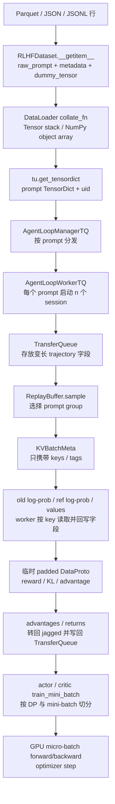

# 04. 数据与协议：一条样本如何穿过 verl

这一章只回答一个问题：**磁盘里的一行数据，怎样一步步变成一次策略梯度更新？**

这是理解 verl 最重要的切入点之一。模型、Ray、FSDP、vLLM 等模块看起来很多，但它们最终都在围绕同一批数据协作。只要能持续回答下面三个问题，阅读源码就不会迷路：

1. 此刻一行代表一个 prompt，还是一条已经生成好的 trajectory？
2. 此刻数据是定长张量、变长张量，还是普通 Python 对象？
3. 此刻拿在 controller 手里的是真数据，还是只指向真数据的 key？

> 本章以当前仓库的 `0.9.0.dev` 实现为准。默认配置已经启用 V1 trainer：[`trainer.use_v1: true`](https://github.com/verl-project/verl/blob/d33ddd7140f44d392e0e10b48a8902651a1340f4/verl/trainer/config/ppo_trainer.yaml#L222-L228)，入口据此选择 V1 或已弃用的 legacy trainer（[`main_ppo.py`](https://github.com/verl-project/verl/blob/d33ddd7140f44d392e0e10b48a8902651a1340f4/verl/trainer/main_ppo.py#L167-L193)）。许多旧教程把 `DataProto` 描述成贯穿全链路的唯一数据总线；这对 legacy trainer 大致成立，但对当前 V1 已经不准确。

## 4.1 先统一五个词

### Sample

数据集中的一行。刚从 Parquet/JSONL 读出时，它通常包含 prompt、答案、数据来源和其他元数据。

### Prompt

送给 rollout 系统的一份输入。它通常是聊天消息列表，而不一定已经是 token ids。

### Trajectory

一个 prompt 经过一次 rollout 得到的一条完整轨迹。对普通单轮生成，它近似于“一条回答”；对 tool agent loop，它可能是：

```text
用户问题 -> 模型调用工具 -> 工具 observation -> 模型继续回答 -> ... -> 终止
```

同一个 prompt 可以采样 `n` 条 trajectory。若本次取出 `P` 个 prompt，则正常情况下会产生：

```text
trajectory 数量 = P * n
```

### Batch

一组并行处理的数据。verl 中“batch size”不是只有一种：

| 名称 | 单位 | 作用 |
| --- | --- | --- |
| `gen_batch_size` | prompt | DataLoader 一次取多少个 prompt |
| `train_batch_size` | prompt | 一个训练 step 需要多少个 prompt |
| rollout 后的 batch | trajectory | 通常有 `train_batch_size * n` 条轨迹 |
| `ppo_mini_batch_size` | 配置层按 prompt 计，controller 会乘 `n` | 一次 PPO mini-batch 的全局大小 |
| `ppo_micro_batch_size_per_gpu` | 静态模式下每个 DP replica 的 trajectory 数 | 为显存进一步拆分的 micro-batch；动态模式改由 `ppo_max_token_len_per_gpu` 约束 token budget |

不要把 DataLoader batch、rollout batch、PPO mini-batch 和 GPU micro-batch 混为一谈。

### Token mask

mask 用来说明“哪些 token 存在”或“哪些 token 应参与损失”。在 tool agent loop 中尤其要分清：

- `attention_mask`：该位置是不是有效 token，padding 才是 0。
- `response_mask` / `loss_mask`：该 response token 是否由模型生成、是否参与策略损失。工具返回的 observation 虽然是有效 token，但 mask 可以是 0。

因此：

```text
attention_mask == 1  不代表  loss_mask == 1
```

## 4.2 磁盘中的一行应该长什么样

verl 自带的 GSM8K 预处理脚本给出了一个典型 schema（[`examples/data_preprocess/gsm8k.py`](https://github.com/verl-project/verl/blob/d33ddd7140f44d392e0e10b48a8902651a1340f4/examples/data_preprocess/gsm8k.py#L59-L100)）：

```json
{
  "data_source": "demo/math",
  "prompt": [
    {"role": "user", "content": "小明有 2 个苹果，又买了 3 个，一共有几个？"}
  ],
  "ability": "math",
  "reward_model": {
    "style": "rule",
    "ground_truth": "5"
  },
  "extra_info": {
    "index": 0,
    "split": "train"
  }
}
```

最需要记住的字段是：

| 字段 | 含义 | 后续消费者 |
| --- | --- | --- |
| `prompt` | chat messages | AgentLoop，用 chat template 转为 token |
| `data_source` | 数据来源/任务类型 | reward routing、日志、分析 |
| `reward_model.ground_truth` | 标准答案 | rule-based reward function |
| `extra_info.index` | 数据集索引 | 追踪、分组、调试 |
| `extra_info.tools_kwargs` | 每条样本的工具初始化参数 | ToolAgentLoop/tool implementation |
| `extra_info.interaction_kwargs` | interaction 初始化参数 | 多轮交互环境 |

`prompt_key`、`image_key` 等名字都能通过 data config 修改，所以这是默认约定，不是不可改变的硬编码格式。

## 4.3 `RLHFDataset`：文件行变成 Python sample

默认数据集类是 [`RLHFDataset`](https://github.com/verl-project/verl/blob/d33ddd7140f44d392e0e10b48a8902651a1340f4/verl/utils/dataset/rl_dataset.py#L72-L160)。它的处理可以分为四步。

### 第一步：把远程文件放到本地

`_download()` 调用 `copy_to_local()`，将输入路径复制或缓存到本地（[`rl_dataset.py`](https://github.com/verl-project/verl/blob/d33ddd7140f44d392e0e10b48a8902651a1340f4/verl/utils/dataset/rl_dataset.py#L162-L167)）。因此 `train_files` 可以不是 controller 本地磁盘上已经存在的普通文件。

### 第二步：用 Hugging Face Datasets 读取并拼接

真实实现不只支持类注释中写的 Parquet，还支持：

- `.parquet`
- `.json`
- `.jsonl`

每个文件先变成一个 `datasets.Dataset`，再通过 `concatenate_datasets` 拼在一起（[`rl_dataset.py`](https://github.com/verl-project/verl/blob/d33ddd7140f44d392e0e10b48a8902651a1340f4/verl/utils/dataset/rl_dataset.py#L169-L195)）。

### 第三步：过滤过长 prompt

如果 `filter_overlong_prompts=True`，数据集会应用 chat template、临时 tokenize，并删除超过 `max_prompt_length` 的行（[`rl_dataset.py`](https://github.com/verl-project/verl/blob/d33ddd7140f44d392e0e10b48a8902651a1340f4/verl/utils/dataset/rl_dataset.py#L197-L275)）。

这里有一个容易误解的细节：**filter 阶段 tokenize，不等于 `__getitem__` 最终会返回 token ids。** filter 只是为了估计真实 prompt 长度。

### 第四步：`__getitem__` 返回原始消息与元数据

当前实现明确写着：chat template 已经移入 AgentLoop，所以数据集返回 `raw_prompt`（[`rl_dataset.py`](https://github.com/verl-project/verl/blob/d33ddd7140f44d392e0e10b48a8902651a1340f4/verl/utils/dataset/rl_dataset.py#L386-L411)）。核心逻辑可简化为：

```python
row = dataframe[item]
row["raw_prompt"] = build_messages(row["prompt"])
row["dummy_tensor"] = torch.tensor([0], dtype=torch.uint8)
row["index"] = row["extra_info"].get("index", 0)
row["tools_kwargs"] = row["extra_info"].get("tools_kwargs", {})
row["interaction_kwargs"] = row["extra_info"].get("interaction_kwargs", {})
```

`dummy_tensor` 不包含训练信息。它只是保证 legacy `DataProto.batch` 不为空；源码中的 TODO 也说明，希望在完全迁移到 TensorDict 后删除它。

所以，当前默认路径中有这样一个重要边界：

```text
RLHFDataset：整理原始消息，但不负责最终 tokenization
AgentLoop：应用 chat template、tokenize，并运行 rollout
```

## 4.4 第一个 `collate_fn`：sample list 变成 prompt batch

DataLoader 使用的是 [`verl.utils.dataset.rl_dataset.collate_fn`](https://github.com/verl-project/verl/blob/d33ddd7140f44d392e0e10b48a8902651a1340f4/verl/utils/dataset/rl_dataset.py#L41-L69)：

- 对 `torch.Tensor` 字段执行 `torch.stack(..., dim=0)`。
- 对其他 Python 值构造 `dtype=object` 的 NumPy 数组。

假设 DataLoader 取出两个 sample：

```python
sample_0 = {
    "dummy_tensor": tensor([0], dtype=uint8),
    "raw_prompt": [{"role": "user", "content": "2+3=?"}],
    "data_source": "demo/math",
}
sample_1 = {
    "dummy_tensor": tensor([0], dtype=uint8),
    "raw_prompt": [{"role": "user", "content": "10-4=?"}],
    "data_source": "demo/math",
}
```

collate 后的关键 shape 是：

```text
dummy_tensor: torch.uint8 [2, 1]
raw_prompt:   np.ndarray(dtype=object) [2]
data_source:  np.ndarray(dtype=object) [2]
```

V1 trainer 使用 `StatefulDataLoader`，默认训练 loader 的 batch size 是 `gen_batch_size`，未设置时退回 `train_batch_size`（[`trainer_base.py`](https://github.com/verl-project/verl/blob/d33ddd7140f44d392e0e10b48a8902651a1340f4/verl/trainer/ppo/v1/trainer_base.py#L653-L704)）。异步模式或需要精确 refill 的模式会把 `gen_batch_size` 调整为 1，再由 trainer 合并多个 chunk。

> 项目中还有另一个同名函数：[`verl.protocol.collate_fn`](https://github.com/verl-project/verl/blob/d33ddd7140f44d392e0e10b48a8902651a1340f4/verl/protocol.py#L296-L306)。它服务于 `DataProto.make_iterator()`，输入是 `DataProtoItem`，输出是 mini-batch `DataProto`。这两个 `collate_fn` 处在完全不同的阶段，不要混淆。

## 4.5 当前 V1 的三层数据模型

V1 不再让 controller 一直搬运一个巨大的 padded `DataProto`。理解它最简单的方法，是把数据系统分成三层。

### 1. `TensorDict`：一批字段的容器

trainer 从 DataLoader 取到普通 dict 后：

1. 为每个 prompt 创建一个 UUID，放到 `uid`。
2. 调用 `tu.get_tensordict(batch_dict)` 转成 TensorDict。

对应源码是 [`_fetch_one_gen_batch`](https://github.com/verl-project/verl/blob/d33ddd7140f44d392e0e10b48a8902651a1340f4/verl/trainer/ppo/v1/trainer_base.py#L1315-L1343)。转换规则在 [`get_tensordict`](https://github.com/verl-project/verl/blob/d33ddd7140f44d392e0e10b48a8902651a1340f4/verl/utils/tensordict_utils.py#L377-L455)：

- `torch.Tensor` 保持为 tensor。
- list/NumPy array 变成 `NonTensorStack`，每个 batch row 对应一个 Python 对象。
- 与整个 batch 共享的配置用 `NonTensorData` 表示。

TensorDict 的价值不是“把一切都变成 tensor”，而是让 tensor 字段与 non-tensor 字段仍然能按同一个 batch 维度 slice、chunk 和 dispatch。

### 2. `TransferQueue`：真正存 trajectory 字段的 data plane

V1 的 AgentLoop worker 不把一个完整结果同步返回给 trainer。它把每条 trajectory 写入 TransferQueue（[`agent_loop_tq.py`](https://github.com/verl-project/verl/blob/d33ddd7140f44d392e0e10b48a8902651a1340f4/verl/trainer/ppo/v1/agent_loop_tq.py#L150-L227)）。

trajectory key 的格式是：

```text
{uid}_{session_id}_{index}
```

- `uid`：原始 prompt 的唯一 id。
- `session_id`：同一 prompt 的第几次采样，范围通常是 `[0, n)`。
- `index`：一次 AgentLoop session 返回多段 output 时的序号。

ReplayBuffer 的源码也用这套格式解释 GRPO group（[`replay_buffer.py`](https://github.com/verl-project/verl/blob/d33ddd7140f44d392e0e10b48a8902651a1340f4/verl/trainer/ppo/v1/replay_buffer.py#L63-L91)）。

AgentLoop 写入的核心字段包括：

| 字段 | 单条 trajectory 的 shape/类型 | 含义 |
| --- | --- | --- |
| `prompts` | `[prompt_len]` | 最终送入模型的 prompt token ids |
| `responses` | `[response_len]` | 模型 token 与工具 observation token 组成的 response |
| `response_mask` | `[response_len]` | 模型生成 token 为 1，工具 observation 为 0 |
| `loss_mask` | `[response_len]` | 当前实现先等于 `response_mask` |
| `input_ids` | `[prompt_len + response_len]` | prompt 与 response 拼接 |
| `position_ids` | `[seq_len]` 或多模态位置 shape | 位置编码索引 |
| `rollout_log_probs` | `[response_len]`，可选 | rollout engine 记录的 log probability |
| `rm_scores` | `[response_len]`，可选 | token-level reward，通常只有末端位置非零 |
| `raw_prompt` 等 | Python object | 数据集原始字段，供 reward/调试使用 |

这些序列保持**实际长度**，并不先 pad 到统一宽度。`list_of_dict_to_tensordict()` 遇到长度不同的 tensor 时，会构造 jagged `NestedTensor`；只有 shape 完全相同才直接 stack（[`tensordict_utils.py`](https://github.com/verl-project/verl/blob/d33ddd7140f44d392e0e10b48a8902651a1340f4/verl/utils/tensordict_utils.py#L918-L949)）。

### 3. `KVBatchMeta`：controller 手中的 control plane

ReplayBuffer 选出可训练的 prompt group 后，不把所有 token 拉回 controller，而是返回一个 `KVBatchMeta`：

```text
KVBatchMeta
├── partition_id    # 例如 "train"
├── keys            # trajectory keys
├── tags            # seq_len、status、global_steps 等轻量元数据
└── extra_info      # 本次计算需要的控制参数
```

`ReplayBuffer._materialize_batch()` 只组装 keys 与 tags（[`replay_buffer.py`](https://github.com/verl-project/verl/blob/d33ddd7140f44d392e0e10b48a8902651a1340f4/verl/trainer/ppo/v1/replay_buffer.py#L366-L389)）。真正的 tensor 字段仍然留在 TransferQueue，需要某个 worker 计算时才按 key 拉取。

可以把它类比为：

```text
TransferQueue = 仓库
trajectory key = 货架编号
KVBatchMeta = 一张拣货单
controller = 调度员，而不是搬运工
```

## 4.6 V1 主数据流



trainer 的一次本地更新顺序在 [`PPOTrainer._step_once`](https://github.com/verl-project/verl/blob/d33ddd7140f44d392e0e10b48a8902651a1340f4/verl/trainer/ppo/v1/trainer_base.py#L536-L586) 中非常清楚：

```text
sample trajectories
  -> optional reward model
  -> balance batch
  -> old_log_prob
  -> optional ref_log_prob
  -> optional critic values
  -> advantage / returns
  -> optional critic update
  -> actor update
```

这段顺序是阅读其他模块时最有用的“主干地图”。

## 4.7 Rollout：`P` 个 prompt 如何变成 `P * n` 条轨迹

V1 的 AgentLoopManager 收到 TensorDict 后，将 prompt batch chunk 给多个 worker（[`AgentLoopManagerTQ.generate_sequences`](https://github.com/verl-project/verl/blob/d33ddd7140f44d392e0e10b48a8902651a1340f4/verl/trainer/ppo/v1/agent_loop_tq.py#L230-L257)）。每个 worker 为 batch 中的每个 prompt 建立后台任务，再为该 prompt 启动 `n` 个 AgentLoop session（[`AgentLoopWorkerTQ`](https://github.com/verl-project/verl/blob/d33ddd7140f44d392e0e10b48a8902651a1340f4/verl/trainer/ppo/v1/agent_loop_tq.py#L59-L149)）。

这意味着 V1 不需要先在 controller 上执行 `repeat(n)`。扩张发生在 AgentLoop worker 内部：

```text
prompt uid=A -> A_0_0, A_1_0, ..., A_(n-1)_0
prompt uid=B -> B_0_0, B_1_0, ..., B_(n-1)_0
```

AgentLoop 的标准输出结构 `AgentLoopOutput` 定义了 `prompt_ids`、`response_ids`、`response_mask`、reward 和 metrics（[`agent_loop.py`](https://github.com/verl-project/verl/blob/d33ddd7140f44d392e0e10b48a8902651a1340f4/verl/experimental/agent_loop/agent_loop.py#L90-L157)）。其中 scalar reward 会被放到一个 response token 位置，形成 token-level `rm_scores`。

## 4.8 完整 shape 例子：`P=2, n=3`

设定：

```text
P = train_batch_size = 2 个 prompt
n = rollout.n = 3 条 trajectory / prompt
trajectory 总数 B = P * n = 6
```

为便于观察，假设两个 prompt tokenize 后的真实长度分别为 4 和 6；六条 response 的真实长度依次为：

```text
prompt A: 3, 5, 4
prompt B: 2, 4, 6
```

### 阶段 A：DataLoader 输出

```text
raw_prompt:   object array [2]
uid:          尚未加入
dummy_tensor: uint8 [2, 1]
```

trainer 加入两个 uid 后：

```text
uid = [A, B]
```

### 阶段 B：AgentLoop 产生六条 trajectory

key 顺序可以表示为：

```text
A_0_0, A_1_0, A_2_0, B_0_0, B_1_0, B_2_0
```

各字段的 row length 是：

```text
prompts:   [4, 4, 4, 6, 6, 6]
responses: [3, 5, 4, 2, 4, 6]
input_ids: [7, 9, 8, 8, 10, 12]
```

TransferQueue 中它们可以是 jagged NestedTensor。以 `responses` 为例，底层可用 offsets 表示行边界：

```text
response lengths = [3, 5, 4, 2, 4, 6]
offsets          = [0, 3, 8, 12, 14, 18, 24]
values           = 一个长度为 24 的连续 token buffer
logical shape    = [6, j]
```

这里的 `j` 表示每一行长度可以不同，而不是“第二维恰好等于某个固定数字”。

### 阶段 C：计算 advantage 时临时 padding

V1 的 `_compute_advantage()` 从 TransferQueue 取出需要的 response-level 字段，然后执行：

```python
data = DataProto(batch=data.to_padded_tensor())
```

见 [`trainer_base.py`](https://github.com/verl-project/verl/blob/d33ddd7140f44d392e0e10b48a8902651a1340f4/verl/trainer/ppo/v1/trainer_base.py#L1588-L1647)。这个例子中最大 response 长度是 6，于是临时得到：

```text
response_mask:       [6, 6]
rm_scores:           [6, 6]
old_log_probs:       [6, 6]
ref_log_prob:        [6, 6]   # 启用 reference policy 时
values:              [6, 6]   # GAE/critic 路径
token_level_rewards: [6, 6]
advantages:          [6, 6]
returns:             [6, 6]
```

padding 位置由 mask 排除。计算结束后，`response_to_nested()` 按原始 response lengths 把 `[6, 6]` 再裁回 `[6, j]`，然后将 `advantages`、`returns` 等写回 TransferQueue（[`padding.py`](https://github.com/verl-project/verl/blob/d33ddd7140f44d392e0e10b48a8902651a1340f4/verl/workers/utils/padding.py#L215-L231)）。

### 阶段 D：PPO mini-batch

假设：

```text
actor.ppo_mini_batch_size = 2
rollout.n = 3
data parallel size = 2
ppo_epochs = 2
```

当前 controller 的真实计算是：

```text
effective global trajectory mini-batch
  = configured ppo_mini_batch_size * rollout.n
  = 2 * 3
  = 6
```

代码位于 [`_update_actor`](https://github.com/verl-project/verl/blob/d33ddd7140f44d392e0e10b48a8902651a1340f4/verl/trainer/ppo/v1/trainer_base.py#L1672-L1711)。dispatch 到两个 data-parallel rank 后，每个 rank 的 local mini-batch 是：

```text
6 / 2 = 3 trajectories
```

每个 rank 会对这 3 条本地 trajectory 迭代 2 个 PPO epoch。之后 backend 还可能根据 `ppo_micro_batch_size_per_gpu` 或动态 token budget 继续拆成更小的 micro-batch。

## 4.9 Reward、KL 与 advantage 的字段演化

### Reward 先表示为 `rm_scores`

AgentLoop 或 reward model 最终都需要提供 token-level `rm_scores`。对于 outcome reward，常见做法是只有 response 末端 token 非零：

```text
rm_scores = [0, 0, 0, ..., scalar_reward]
```

V1 `_compute_advantage()` 将它暂时命名为：

```python
token_level_scores = rm_scores
```

### 可选 KL penalty

如果 `algorithm.use_kl_in_reward=True`，代码使用：

```text
KL_t = kl(old_log_probs_t, ref_log_prob_t)
token_level_rewards_t = token_level_scores_t - beta * KL_t
```

实现见 [`apply_kl_penalty`](https://github.com/verl-project/verl/blob/d33ddd7140f44d392e0e10b48a8902651a1340f4/verl/trainer/ppo/ray_trainer.py#L78-L117)。如果未启用，`token_level_rewards` 就等于 `token_level_scores`。

### GAE 路径

GAE 需要：

```text
token_level_rewards + values + response_mask
```

它从 response 尾部向前递推，输出 `[B, R]` 的 `advantages` 与 `returns`（[`compute_gae_advantage_return`](https://github.com/verl-project/verl/blob/d33ddd7140f44d392e0e10b48a8902651a1340f4/verl/trainer/ppo/core_algos.py#L215-L263)）。工具 observation 位置的 `response_mask=0`：该位置自身的 value 与 TD error 会被跳过，已有的 running advantage 会继续向前传递；真正计算策略损失时，`loss_mask=0` 再将 observation 位置排除。

### GRPO 路径

GRPO 首先对每条 trajectory 的 token reward 求和得到 scalar score，再按相同 `uid` 分组：

```text
adv_i = (score_i - group_mean) / (group_std + epsilon)
```

最后将同一个 scalar advantage 广播到该 trajectory 中所有 `response_mask=1` 的 token（[`compute_grpo_outcome_advantage`](https://github.com/verl-project/verl/blob/d33ddd7140f44d392e0e10b48a8902651a1340f4/verl/trainer/ppo/core_algos.py#L266-L331)）。

对可能一次返回多段 output 的 AgentLoop，V1 会只用每个 session 的最后一段 output 计算 GRPO，再把结果广播回同 session 的其他 output（[`compute_advantage_for_multi_trajectories`](https://github.com/verl-project/verl/blob/d33ddd7140f44d392e0e10b48a8902651a1340f4/verl/trainer/ppo/v1/utils.py#L148-L216)）。

## 4.10 Mini-batch 到底在哪里切

controller 在 `KVBatchMeta.extra_info` 中放入：

```text
global_batch_size
mini_batch_size
epochs
seed
dataloader_kwargs.shuffle
temperature
```

worker 收到 batch 后，`train_mini_batch()` 做三件事（[`engine_workers.py`](https://github.com/verl-project/verl/blob/d33ddd7140f44d392e0e10b48a8902651a1340f4/verl/workers/engine_workers.py#L241-L320)）：

1. 根据 data-parallel size 将 global mini-batch size 换算成本 rank 的 local mini-batch size。
2. `tu.make_iterator()` 用 index DataLoader 做 shuffle，并重复 `ppo_epochs` 次。
3. 对每个 mini-batch 调用 backend 的 `train_batch()`。

`tu.make_iterator()` 要求本地 batch size 能被 local mini-batch size 整除（[`tensordict_utils.py`](https://github.com/verl-project/verl/blob/d33ddd7140f44d392e0e10b48a8902651a1340f4/verl/utils/tensordict_utils.py#L559-L612)）。这就是许多 batch-size 配置错误最终报出“不能整除”的来源。

真正进入 FSDP forward 前，micro-batch 才被移动到当前 accelerator device（[`fsdp/transformer_impl.py`](https://github.com/verl-project/verl/blob/d33ddd7140f44d392e0e10b48a8902651a1340f4/verl/workers/engine/fsdp/transformer_impl.py#L1507-L1524)）。worker 对 controller 返回的统计结果会转回 CPU（[`engine_workers.py`](https://github.com/verl-project/verl/blob/d33ddd7140f44d392e0e10b48a8902651a1340f4/verl/workers/engine_workers.py#L687-L707)）。

所以不要想象成“controller 先把整个训练 batch 放上某一张 GPU”。实际过程更接近：

```text
controller 调度 keys
  -> DP worker 拉取自己的数据 shard
  -> worker 切 mini-batch
  -> backend 切 micro-batch
  -> 当前 micro-batch 上 GPU
  -> 只把轻量输出/metrics 返回 CPU
```

## 4.11 `DataProto` 是什么，V1 中还在哪里使用

`DataProto` 定义在 [`verl/protocol.py`](https://github.com/verl-project/verl/blob/d33ddd7140f44d392e0e10b48a8902651a1340f4/verl/protocol.py#L317-L341)。它有三个命名空间：

```text
DataProto
├── batch: TensorDict
│   └── 有共同 batch dim 的 torch.Tensor
├── non_tensor_batch: dict[str, np.ndarray]
│   └── 每个样本一个 Python object，dim 0 必须等于 batch size
└── meta_info: dict
    └── 整批共享的配置或 metrics，没有 batch dim
```

例如：

```python
import numpy as np
import torch

from tensordict import TensorDict
from verl import DataProto

data = DataProto(
    batch=TensorDict(
        {
            "responses": torch.tensor([[11, 12], [21, 0]]),
            "response_mask": torch.tensor([[1, 1], [1, 0]]),
        },
        batch_size=2,
    ),
    non_tensor_batch={
        "uid": np.array(["A", "B"], dtype=object),
    },
    meta_info={
        "temperature": 1.0,
    },
)
```

一致性检查要求：

- `batch` 目前只支持一个 batch dimension。
- `non_tensor_batch` 的值必须是 NumPy array。
- 每个 non-tensor array 的第 0 维必须与 tensor batch size 一致。

实现见 [`DataProto.check_consistency`](https://github.com/verl-project/verl/blob/d33ddd7140f44d392e0e10b48a8902651a1340f4/verl/protocol.py#L454-L477)。

### V1 边界

当前 V1 主干中：

- 长期 trajectory 存储：TransferQueue 中的 jagged TensorDict。
- controller 调度：KVBatchMeta。
- worker 训练：TensorDict/NestedTensor。
- reward model 适配与 advantage 算法复用：临时构造 padded DataProto。

例如，V1 的 colocated reward adapter 会从 TransferQueue 取 `prompts`/`responses`，临时 pad、重建 attention mask，再构造 `DataProto` 调 reward manager（[`trainer_base.py`](https://github.com/verl-project/verl/blob/d33ddd7140f44d392e0e10b48a8902651a1340f4/verl/trainer/ppo/v1/trainer_base.py#L1374-L1426)）。advantage 路径同样临时构造 padded DataProto。

因此准确的说法是：

> `DataProto` 仍是重要的算法与兼容协议，但它已经不是 V1 全链路唯一、长期驻留的数据容器。

## 4.12 `DataProto` 的关键操作

即使以 V1 为主，理解这些操作仍然很有价值：legacy trainer、大量算法函数和扩展 recipe 仍会使用它们。

### `from_single_dict`：按类型分流

[`DataProto.from_single_dict`](https://github.com/verl-project/verl/blob/d33ddd7140f44d392e0e10b48a8902651a1340f4/verl/protocol.py#L479-L543) 将：

- `torch.Tensor` 放进 `batch`。
- `np.ndarray` 放进 `non_tensor_batch`。
- 其他类型直接报错。

这正好接得上 dataset `collate_fn` 的输出。

### `to(device)`：只移动 tensor

[`DataProto.to`](https://github.com/verl-project/verl/blob/d33ddd7140f44d392e0e10b48a8902651a1340f4/verl/protocol.py#L586-L598) 是原地操作：

```python
data.to("cuda")
```

它只移动 `batch` 中的 TensorDict；NumPy object arrays 和 `meta_info` 仍留在 CPU/Python 世界。

### `repeat(n, interleave=True)`：prompt 扩成 rollout group

[`DataProto.repeat`](https://github.com/verl-project/verl/blob/d33ddd7140f44d392e0e10b48a8902651a1340f4/verl/protocol.py#L971-L1013) 返回一个新 DataProto。

```text
原顺序:                [A, B]
repeat(3, True):       [A, A, A, B, B, B]
repeat(3, False):      [A, B, A, B, A, B]
```

GRPO 希望同一 prompt 的多条 rollout 易于分组，所以 legacy trainer 使用 `interleave=True`。tensor 通过 `repeat_interleave` 扩张，non-tensor NumPy array 也执行对应的 `np.repeat`。

### `union(other)`：按列合并同一批 row

[`DataProto.union`](https://github.com/verl-project/verl/blob/d33ddd7140f44d392e0e10b48a8902651a1340f4/verl/protocol.py#L781-L798) 是原地操作：

```text
原 batch:      input_ids, responses
other batch:   old_log_probs
union 后:      input_ids, responses, old_log_probs
```

约束是：

- 两边 batch size 必须相同。
- 重名 tensor 字段必须逐元素相等。
- 重名 non-tensor/meta 字段也必须一致。

所以 `union` 是数据库式的“同一批 row 增加列”，不是沿 batch 维拼接更多 row。

### `concat([...])`：沿 batch 维增加 row

[`DataProto.concat`](https://github.com/verl-project/verl/blob/d33ddd7140f44d392e0e10b48a8902651a1340f4/verl/protocol.py#L916-L961) 才是沿 dim 0 拼接：

```text
[A, B] + [C, D] -> [A, B, C, D]
```

tensor 用 `torch.cat`，non-tensor 用 `np.concatenate`。

### `reorder(indices)`：所有字段必须一起重排

[`DataProto.reorder`](https://github.com/verl-project/verl/blob/d33ddd7140f44d392e0e10b48a8902651a1340f4/verl/protocol.py#L963-L969) 是原地操作，同时重排 tensor 与 non-tensor 字段：

```python
data.reorder(torch.tensor([2, 0, 1]))
```

这保证 token、uid、reward ground truth 不会错位。当前实现直接对 indices 调用 `.detach().numpy()`，所以传入的 index tensor 应位于 CPU。

trainer 会按每条 trajectory 的 token workload 计算一个新顺序，使不同 data-parallel rank 的 token 总量更接近，然后调用 reorder。顺序变化不影响按 uid 分组计算 advantage，但可能改变 mini-batch 中样本的组合。

### `make_iterator()`：DataProto 内部再切 mini-batch

[`DataProto.make_iterator`](https://github.com/verl-project/verl/blob/d33ddd7140f44d392e0e10b48a8902651a1340f4/verl/protocol.py#L800-L838) 使用本章前面提到的第二个 `collate_fn`，要求：

```text
len(data) % mini_batch_size == 0
```

它会遍历 `epochs` 次，每次 yield 一个 mini-batch DataProto。当前 V1 worker 更常使用等价的 TensorDict iterator，但思路完全相同。

### 一段最小操作例子

```python
import numpy as np
import torch

from verl import DataProto

prompts = DataProto.from_dict(
    tensors={"dummy": torch.tensor([[0], [1]])},
    non_tensors={"uid": np.array(["A", "B"], dtype=object)},
)

# [A, B] -> [A, A, A, B, B, B]
trajectories = prompts.repeat(repeat_times=3, interleave=True)

scores = DataProto.from_dict(
    tensors={"score": torch.tensor([1.0, 0.0, 0.5, 1.0, 1.0, 0.0])}
)

# 给相同的 6 行增加 score 列
trajectories.union(scores)

# 按新顺序同时重排 dummy、uid、score
trajectories.reorder(torch.tensor([0, 3, 1, 4, 2, 5]))
```

## 4.13 Legacy trainer 的 DataProto 流：用于读旧代码

legacy trainer 已弃用，但很多现有文章和 recipe 仍按它解释 verl。它的主循环在 [`ray_trainer.py`](https://github.com/verl-project/verl/blob/d33ddd7140f44d392e0e10b48a8902651a1340f4/verl/trainer/ppo/ray_trainer.py#L1380-L1665)，数据流可以压缩成：

```python
batch = DataProto.from_single_dict(batch_dict)       # P 个 prompt
gen_batch = batch.repeat(n, interleave=True)         # P*n 个 rollout 输入
gen_output = agent_loop.generate_sequences(gen_batch)

batch = batch.repeat(n, interleave=True)             # 原始 metadata 也扩成 P*n
batch = batch.union(gen_output)                       # 加 prompts/responses/masks

batch = batch.union(compute_old_log_prob(batch))
batch = batch.union(compute_ref_log_prob(batch))      # 可选
batch = batch.union(compute_values(batch))            # 可选
batch["token_level_scores"] = reward
batch = compute_advantage(batch)
update_actor(batch)
```

legacy AgentLoop 会直接产出固定宽度 padded TensorDict：

```text
prompts:        [B, max_prompt_length]
responses:      [B, max_response_length]
input_ids:      [B, max_prompt_length + max_response_length]
attention_mask: [B, max_prompt_length + max_response_length]
response_mask:  [B, max_response_length]
position_ids:   [B, sequence_length] 或多模态 shape
```

字段组装见 [`AgentLoopWorker._postprocess`](https://github.com/verl-project/verl/blob/d33ddd7140f44d392e0e10b48a8902651a1340f4/verl/experimental/agent_loop/agent_loop.py#L1050-L1141)。这正是旧版教程中“一个 DataProto 不断 union 新列”的由来。

V1 的语义没有完全改变：仍然是 prompt -> trajectory -> reward/log-prob/value -> advantage -> update；变化的是**物理存储与调度方式**。

## 4.14 常见误区与调试检查单

### 误区 1：`RLHFDataset` 已经返回模型输入 token

当前默认实现返回 `raw_prompt`；最终 chat template 与 tokenization 在 AgentLoop。过滤长度时虽然 tokenize 过，但不会把那份结果作为训练输入保存。

### 误区 2：`response_mask` 只是 padding mask

tool agent loop 中 observation token 也在 response 序列里，但 `response_mask=0`。策略只学习模型动作，而不是把环境返回的文本当作模型动作。

### 误区 3：`train_batch_size=2, n=3` 仍然只有两条训练样本

DataLoader 层是两个 prompt；rollout 后通常是六条 trajectory。所有 reward、log-prob、advantage 和 batch divisibility 问题都应从六条 trajectory 的层次继续推理。

### 误区 4：V1 controller 手中一直有全部 token tensors

controller 更多时候持有 `KVBatchMeta`。序列留在 TransferQueue，worker 按 key 取用和回写。

### 误区 5：`union` 会增加 batch size

`union` 增加字段；`concat` 才增加 row。

### 误区 6：tensor 重排后，Python metadata 可以不动

任何重排都必须同步作用于 uid、ground truth、tool kwargs 等 non-tensor 字段，否则 reward 会发给错误的 trajectory。使用 DataProto/TensorDict/KVBatchMeta 的统一 reorder，而不要只重排某一个 tensor。

### 调试时逐层打印什么

1. 数据集行：确认 `prompt`、`reward_model`、`extra_info`。
2. collate 输出：确认 tensor 的 dim 0 与 object array 长度相同。
3. rollout key：确认每个 uid 有期望数量的 session。
4. trajectory tag：确认 `prompt_len`、`response_len`、`seq_len`。
5. mask：分别统计有效 response token 与 loss token。
6. reward：确认每条 trajectory 的 `rm_scores.sum()`。
7. group：确认 GRPO 的相同 uid 恰好包含期望的 `n` 条 rollout。
8. update：确认 effective mini-batch、DP size 与本地 batch 的整除关系。

一个实用的 shape 日志模板是：

```python
def describe(name, tensor):
    if tensor.is_nested:
        lengths = tensor.offsets().diff().tolist()
        print(name, "nested", "rows=", len(lengths), "lengths=", lengths)
    else:
        print(name, tuple(tensor.shape), tensor.dtype, tensor.device)
```

只要沿着这一章的主线持续记录“单位、容器、shape、device”，就能把看似复杂的分布式 RL 系统还原成一系列明确的数据变换。
