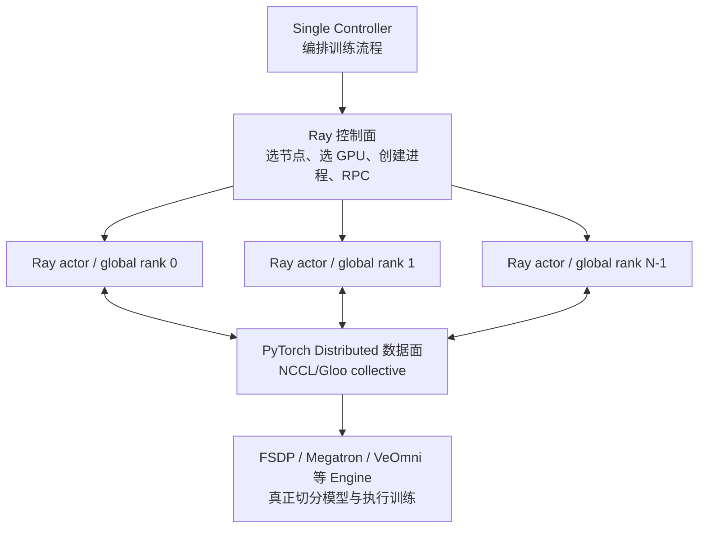
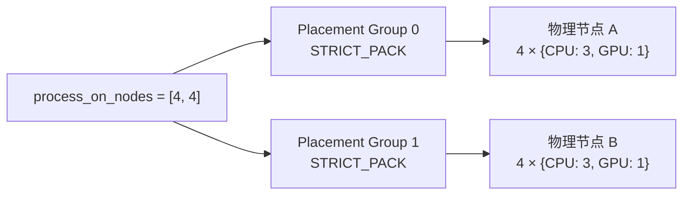
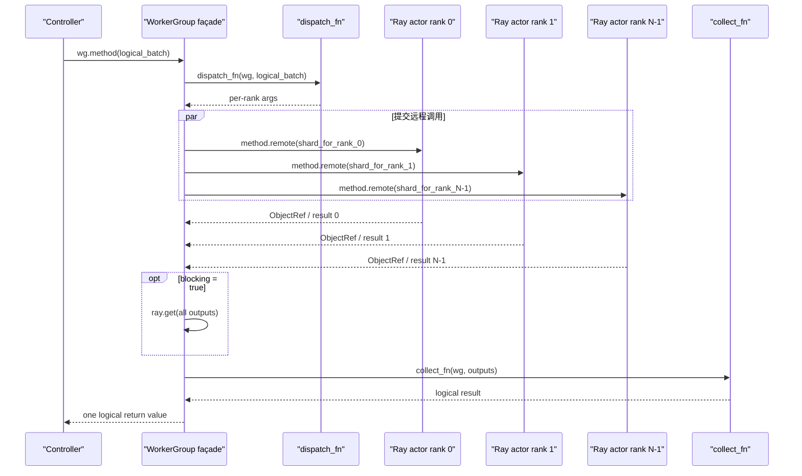
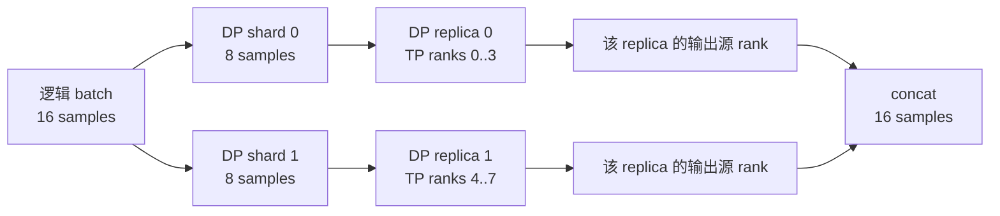
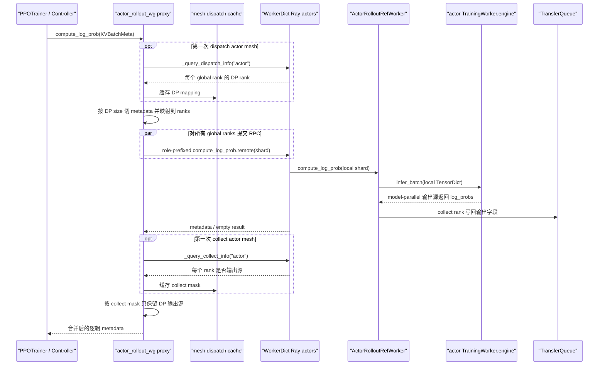
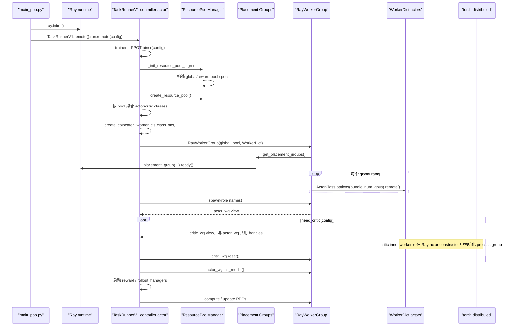

# 05. Ray Controller、资源池与 Worker：verl 如何把一次调用变成分布式执行

> 本章基于仓库 `main@d33ddd71`（`verl 0.9.0.dev`）的实际源码。默认讲解当前启用的 V1 trainer；旧版 `RayPPOTrainer` 只在必要处对比。

这一章回答一个看似简单、实际上贯穿 verl 全框架的问题：

> 当 trainer 写下 `actor_rollout_wg.update_actor(batch)` 时，哪段代码决定用哪些 GPU、启动哪些进程、把 batch 发给哪些 rank，又怎样把结果收回来？

学完本章，你应该能区分下面这些经常被混为一谈的概念：

- Ray actor 与普通 Python 对象；
- placement group、resource pool 与显存；
- `Role`、`Worker`、`WorkerGroup` 与真实进程；
- `@ray.remote` 与 verl 的 `@register`；
- global rank、data-parallel rank、TP/PP rank；
- dispatch、execute、collect 与 `blocking=False`；
- “共用同一张 GPU”与“运行在同一个进程”之间的区别。

---

## 1. 先看全景：verl 同时用了两套分布式系统

理解 verl 的第一把钥匙，是不要把 Ray 和 PyTorch Distributed 当成同一层。



两层各自负责不同的事情：

| 层 | 主要问题 | verl 中的代表对象 |
|---|---|---|
| Ray | “进程在哪里运行？能看见哪张 GPU？Controller 如何调用它？” | `RayResourcePool`、`RayWorkerGroup`、Ray actor handle |
| PyTorch Distributed / Model Engine | “模型怎样分片？梯度怎样同步？哪些 rank 属于 DP/TP/PP？” | `TrainingWorker.engine`、FSDP、Megatron、device mesh |

因此，`RayResourcePool` **不会**替你完成 FSDP，也不会把一个大模型自动切成八片。它先让八个 Ray actor 各自占据一个 GPU 位置；actor 内部的 model engine 才建立 process group、加载模型并选择并行策略。

### 1.1 本章会反复使用的词

| 词 | 小白版解释 |
|---|---|
| node | 一台物理服务器或虚拟机 |
| process | 一个操作系统进程，有独立 Python 解释器和地址空间 |
| Ray actor | Ray 管理的有状态远程对象；通常在一个长期存活的 worker 进程中执行 |
| controller | 编排整个训练流程的一侧；调用 worker，但通常不持有模型参数 |
| actor handle | controller 手里的远程引用，不是模型对象本身 |
| rank | 一个分布式进程的编号 |
| world size | 参与该分布式组的 rank 总数 |
| local rank | 一个 rank 在本机内的编号 |
| DP rank | 数据并行副本编号；同一 DP 副本内的 TP/PP rank 要看到同一份样本 |
| TP / PP | tensor parallel / pipeline parallel，分别沿张量与模型层切分模型 |

---

## 2. Controller 本身在哪里运行？

当前 PPO 入口是 [`verl/trainer/main_ppo.py`](https://github.com/verl-project/verl/blob/d33ddd7140f44d392e0e10b48a8902651a1340f4/verl/trainer/main_ppo.py#L33)。它先初始化 Ray，然后创建一个 `TaskRunnerV1` Ray actor：

```python
# 简化自 main_ppo.py
ray.init(...)
runner = TaskRunnerV1.remote()
ray.get(runner.run.remote(config))
```

准确源码位置：

- 初始化 Ray：[`main_ppo.py:57-75`](https://github.com/verl-project/verl/blob/d33ddd7140f44d392e0e10b48a8902651a1340f4/verl/trainer/main_ppo.py#L57)
- `TaskRunnerV1` 的 `@ray.remote` 定义：[`main_ppo.py:103-105`](https://github.com/verl-project/verl/blob/d33ddd7140f44d392e0e10b48a8902651a1340f4/verl/trainer/main_ppo.py#L103)
- 创建 runner 并等待：[`main_ppo.py:77-95`](https://github.com/verl-project/verl/blob/d33ddd7140f44d392e0e10b48a8902651a1340f4/verl/trainer/main_ppo.py#L77)
- V1 默认开启：[`ppo_trainer.yaml:221-228`](https://github.com/verl-project/verl/blob/d33ddd7140f44d392e0e10b48a8902651a1340f4/verl/trainer/config/ppo_trainer.yaml#L221)

所以更准确的进程关系是：

```text
启动 Python 进程
└── ray.init()
    └── TaskRunnerV1 Ray actor       ← 逻辑上的 single controller
        ├── PPOTrainer Python 对象
        ├── RayWorkerGroup proxy
        └── 多个远程模型 actor handles
```

`TaskRunnerV1.run()` 会选择 trainer、初始化 TransferQueue、调用 `trainer.init()`，最后进入 `trainer.fit()`；见 [`main_ppo.py:134-164`](https://github.com/verl-project/verl/blob/d33ddd7140f44d392e0e10b48a8902651a1340f4/verl/trainer/main_ppo.py#L134)。

这就是 “single controller” 的含义：训练步骤的控制流集中在一处，并不意味着训练只有一个进程或一张 GPU。

---

## 3. 从资源声明到 GPU：ResourcePool 与 placement group

### 3.1 `ResourcePool` 只是一个逻辑规格

最底层的 [`ResourcePool`](https://github.com/verl-project/verl/blob/d33ddd7140f44d392e0e10b48a8902651a1340f4/verl/single_controller/base/worker_group.py#L27) 保存一个整数列表：

```python
ResourcePool(process_on_nodes=[4, 4])
```

它表达：

```text
逻辑节点 0：4 个进程槽位
逻辑节点 1：4 个进程槽位
总 world_size：8
```

`world_size` 只是列表求和，见 [`worker_group.py:51-54`](https://github.com/verl-project/verl/blob/d33ddd7140f44d392e0e10b48a8902651a1340f4/verl/single_controller/base/worker_group.py#L51)。这个 base class 不调用 Ray，不创建进程，也不分配 GPU。

### 3.2 `RayResourcePool` 把逻辑规格变成 placement groups

真正对接 Ray 的类是 [`RayResourcePool`](https://github.com/verl-project/verl/blob/d33ddd7140f44d392e0e10b48a8902651a1340f4/verl/single_controller/ray/base.py#L113)。它在第一次调用 `get_placement_groups()` 时，为 `process_on_nodes` 的每一项创建一个 placement group。

假设：

```python
pool = RayResourcePool(
    process_on_nodes=[8, 8],
    use_gpu=True,
    max_colocate_count=3,
)
```

它会请求两个 placement groups，每组包含 8 个 bundle。每个 bundle 的资源形状是：

```python
{"CPU": 3, "GPU": 1}
```

构造 bundle 的源码在 [`ray/base.py:131-157`](https://github.com/verl-project/verl/blob/d33ddd7140f44d392e0e10b48a8902651a1340f4/verl/single_controller/ray/base.py#L131)。

placement group 可以理解成一份**原子预订计划**：Ray 要么找到能同时容纳这些 bundles 的资源，要么继续等待。默认 `RayWorkerGroup(bin_pack=True)` 使用 `STRICT_PACK`，因此同一个 placement group 的 bundles 会被严格装进同一物理节点。



这里的 A、B 由 Ray 调度器选择；列表本身不是物理 node ID，而且 A、B **不保证是不同物理节点**。`STRICT_PACK` 只约束单个 placement group 内的 bundles 共处一台节点，并不在两个 placement groups 之间建立 anti-affinity；容量允许时二者可以落在同一节点。placement group 就绪后，verl 按节点 IP 排序，使跨重启的 rank 顺序更稳定，相关实现见 [`sort_placement_group_by_node_ip()`](https://github.com/verl-project/verl/blob/d33ddd7140f44d392e0e10b48a8902651a1340f4/verl/single_controller/ray/base.py#L70)。

### 3.3 `ResourcePoolManager` 管理“角色 → 池”

[`ResourcePoolManager`](https://github.com/verl-project/verl/blob/d33ddd7140f44d392e0e10b48a8902651a1340f4/verl/single_controller/ray/base.py#L184) 接收两张表：

```python
resource_pool_spec = {
    "global_pool": [8, 8],
    "reward_pool": [8],
}

mapping = {
    Role.ActorRolloutRef: "global_pool",
    Role.Critic: "global_pool",
    Role.RewardModel: "reward_pool",
}
```

它的职责是：

1. 为每个 pool spec 构造 `RayResourcePool`；
2. 根据 `Role` 找到对应 pool；
3. 在启动前检查集群的 GPU **总数**是否足够。

对应源码：[`ray/base.py:195-242`](https://github.com/verl-project/verl/blob/d33ddd7140f44d392e0e10b48a8902651a1340f4/verl/single_controller/ray/base.py#L195)。

注意两个细节：

- `create_resource_pool()` 此时主要是创建 `RayResourcePool` Python 对象；placement group 仍是后续首次使用时惰性创建的。
- 可用性检查只比较 GPU 总数。某个单独节点能否容纳一个 `STRICT_PACK` placement group，最终仍由 `pg.ready()` 决定。

### 3.4 `max_colocate_count=3` 不等于“每个模型只能用三分之一显存”

这是最容易误解的一点。

pool 的 bundle 预订一整张 GPU，但 `RayWorkerGroup` 创建单个 actor 时只向 Ray 申领：

```python
num_gpus = 1 / resource_pool.max_colocate_count
```

见 [`ray/base.py:623-630`](https://github.com/verl-project/verl/blob/d33ddd7140f44d392e0e10b48a8902651a1340f4/verl/single_controller/ray/base.py#L623)。CUDA 平台最终转成 Ray 的 `{"num_gpus": num_gpus}`，见 [`platform_cuda.py:127-131`](https://github.com/verl-project/verl/blob/d33ddd7140f44d392e0e10b48a8902651a1340f4/verl/plugin/platform/platform_cuda.py#L127)。

若 `max_colocate_count=3`，含义是：

```text
一个 bundle 预订 1 GPU
每个此类 Ray actor 消耗 1/3 GPU 的调度额度
理论上可把 3 个 actor 调度到同一个 bundle / GPU
```

它**只是 Ray 调度记账**：

- 不会把 VRAM 切成三个硬隔离分区；
- 不会阻止其中一个进程占满显存；
- 不等于一个 Ray actor 内只能放一个模型；
- 真正的显存共存依赖 offload、sleep/resume、执行时序与模型大小。

测试 [`test_high_level_scheduling_api.py:43-62`](https://github.com/verl-project/verl/blob/d33ddd7140f44d392e0e10b48a8902651a1340f4/tests/single_controller/test_high_level_scheduling_api.py#L43) 直接验证了多个 worker groups 可以看到同一批 GPU 编号。

---

## 4. Ray actor 是怎样被创建到指定 GPU 上的？

### 4.1 先区分两个装饰器

verl 代码里常同时出现两个“装饰器”，但它们不在同一层：

```python
@ray.remote
class MyWorker(Worker):
    @register(dispatch_mode=Dispatch.ONE_TO_ALL)
    def init_model(self):
        ...
```

| 写法 | 作用 |
|---|---|
| `@ray.remote` | 把 Python class 变成 Ray `ActorClass`，建立进程/RPC 边界 |
| `@register(...)` | 声明一个 worker 方法如何被整个 `WorkerGroup` 调用；本身不提交 Ray RPC |

仓库没有另一套 verl 自己实现的 `remote` decorator。真正发送 RPC 的代码最终仍是：

```python
remote_call.remote(*args, **kwargs)
```

见 [`RayWorkerGroup._execute_remote_single_worker()`](https://github.com/verl-project/verl/blob/d33ddd7140f44d392e0e10b48a8902651a1340f4/verl/single_controller/ray/base.py#L782)。

### 4.2 `RayClassWithInitArgs` 是延迟创建工厂

[`RayClassWithInitArgs`](https://github.com/verl-project/verl/blob/d33ddd7140f44d392e0e10b48a8902651a1340f4/verl/single_controller/ray/base.py#L339) 保存：

- Ray ActorClass；
- actor 构造参数；
- 后续附加的 Ray `.options(...)`。

它不是 actor handle，也不会在构造时启动远程进程。真正创建发生在：

```python
self.cls.options(**options).remote(*self.args, **self.kwargs)
```

见 [`ray/base.py:369-415`](https://github.com/verl-project/verl/blob/d33ddd7140f44d392e0e10b48a8902651a1340f4/verl/single_controller/ray/base.py#L369)。

`options` 中最关键的是 `PlacementGroupSchedulingStrategy`：它把 actor 固定到某个 placement group 的某个 bundle。

### 4.3 `RayWorkerGroup` 为每个 rank 创建一个 actor

[`RayWorkerGroup`](https://github.com/verl-project/verl/blob/d33ddd7140f44d392e0e10b48a8902651a1340f4/verl/single_controller/ray/base.py#L418) 的普通初始化路径是：

```text
RayWorkerGroup.__init__
  → _init_with_resource_pool
    → resource_pool.get_placement_groups
    → 选择 MASTER_ADDR / MASTER_PORT
    → 对每个 global rank 调 _create_worker
      → 固定 placement group + bundle index
      → ActorClass.options(...).remote(...)
```

核心源码：

- 普通 pool 初始化：[`ray/base.py:538-581`](https://github.com/verl-project/verl/blob/d33ddd7140f44d392e0e10b48a8902651a1340f4/verl/single_controller/ray/base.py#L538)
- 单 rank actor 创建：[`ray/base.py:623-683`](https://github.com/verl-project/verl/blob/d33ddd7140f44d392e0e10b48a8902651a1340f4/verl/single_controller/ray/base.py#L623)
- 获取 rendezvous 地址：[`ray/base.py:520-536`](https://github.com/verl-project/verl/blob/d33ddd7140f44d392e0e10b48a8902651a1340f4/verl/single_controller/ray/base.py#L520)

每个 actor 会获得这些关键环境变量：

```text
WORLD_SIZE
RANK
MASTER_ADDR
MASTER_PORT
WG_BACKEND=ray
RAY_LOCAL_WORLD_SIZE
```

见 [`ray/base.py:631-650`](https://github.com/verl-project/verl/blob/d33ddd7140f44d392e0e10b48a8902651a1340f4/verl/single_controller/ray/base.py#L631)。Ray 还会为 CUDA actor 设置 `CUDA_VISIBLE_DEVICES`；`Worker` 会统一处理 CUDA/HIP/ROCR 的可见设备语义，见 [`worker.py:181-220`](https://github.com/verl-project/verl/blob/d33ddd7140f44d392e0e10b48a8902651a1340f4/verl/single_controller/base/worker.py#L181) 与 [`worker.py:231-281`](https://github.com/verl-project/verl/blob/d33ddd7140f44d392e0e10b48a8902651a1340f4/verl/single_controller/base/worker.py#L231)。

这一步完成的是：

> “rank 3 这个进程被 Ray 安排到某节点的某 GPU，并且知道自己是 global rank 3。”

它还没有保证模型参数已加载。真正的训练 process group 在 `TrainingWorker` 内通过 `initialize_global_process_group_ray()` 建立；见 [`engine_workers.py:83-149`](https://github.com/verl-project/verl/blob/d33ddd7140f44d392e0e10b48a8902651a1340f4/verl/workers/engine_workers.py#L83) 与 [`distributed.py:82-98`](https://github.com/verl-project/verl/blob/d33ddd7140f44d392e0e10b48a8902651a1340f4/verl/utils/distributed.py#L82)。

---

## 5. `WorkerGroup`：把 N 个远程 actor 伪装成一个本地对象

`RayWorkerGroup` 在 controller 侧保存：

```python
self._workers = [actor_handle_rank_0, actor_handle_rank_1, ...]
```

没有装饰器时，可以直接使用底层 API：

```python
refs = wg.execute_all_async("foo", arg)
results = ray.get(refs)
```

但 trainer 想写的是更自然的接口：

```python
result = wg.foo(arg)
```

为此，`WorkerGroup._bind_worker_method()` 会扫描 worker class 的所有方法，寻找 `@register` 写入的特殊元数据，然后在 `wg` 对象上动态添加同名方法。实现见 [`worker_group.py:185-253`](https://github.com/verl-project/verl/blob/d33ddd7140f44d392e0e10b48a8902651a1340f4/verl/single_controller/base/worker_group.py#L185)。

### 5.1 `@register` 在 class 定义阶段做什么？

[`register()`](https://github.com/verl-project/verl/blob/d33ddd7140f44d392e0e10b48a8902651a1340f4/verl/single_controller/base/decorator.py#L398) 做三件事：

1. 用 `tqbridge` 包装原方法，以支持 V1 TransferQueue 数据路径；
2. 默认在 worker 侧物化顶层 `DataProtoFuture`；
3. 把 `dispatch_mode`、`execute_mode`、`blocking` 写进一个特殊函数属性。

元数据形状近似：

```python
{
    "dispatch_mode": Dispatch.ONE_TO_ALL,
    "execute_mode": Execute.ALL,
    "blocking": True,
}
```

特殊属性名 `MAGIC_ATTR` 定义在 [`decorator.py:22-23`](https://github.com/verl-project/verl/blob/d33ddd7140f44d392e0e10b48a8902651a1340f4/verl/single_controller/base/decorator.py#L22)。

重点是：`@register` 此时仍没有创建 actor，也没有执行 `.remote()`。它只是让后续 `RayWorkerGroup` 知道如何生成代理方法。

### 5.2 一次 `wg.method(...)` 的四段式流水线

Ray 版本的动态代理由 [`func_generator()`](https://github.com/verl-project/verl/blob/d33ddd7140f44d392e0e10b48a8902651a1340f4/verl/single_controller/ray/base.py#L49) 生成：

```python
args, kwargs = dispatch_fn(worker_group, *args, **kwargs)
output = execute_fn(method_name, *args, **kwargs)
if blocking:
    output = ray.get(output)
output = collect_fn(worker_group, output)
return output
```

因此一次逻辑调用分成四步：

1. **dispatch**：把逻辑输入变成每个 rank 的输入；
2. **execute**：选择全体 rank 或 rank 0，并提交 `.remote()`；
3. **wait**：若 `blocking=True`，在这里 `ray.get()`；
4. **collect**：筛选、拼接或保留各 rank 输出。



真正遍历 actor handles 并提交远程调用的代码在 [`ray/base.py:866-894`](https://github.com/verl-project/verl/blob/d33ddd7140f44d392e0e10b48a8902651a1340f4/verl/single_controller/ray/base.py#L866)。

---

## 6. Dispatch 与 Execute 是两个不同维度

`Dispatch` 回答：

> 每个 rank 拿到什么参数？各 rank 的结果如何重新组成逻辑结果？

`Execute` 回答：

> 这次方法在所有 rank 上执行，还是只在 rank 0 上执行？

预定义 `Execute` 只有：

- `Execute.ALL` → `RayWorkerGroup.execute_all()`；
- `Execute.RANK_ZERO` → `RayWorkerGroup.execute_rank_zero()`。

映射见 [`decorator.py:357-366`](https://github.com/verl-project/verl/blob/d33ddd7140f44d392e0e10b48a8902651a1340f4/verl/single_controller/base/decorator.py#L357)。

一个源码陷阱是：`Dispatch.RANK_ZERO` 虽然注册了名字，却没有对应的 dispatch/collect registry 实现。只想在 rank 0 执行，应写：

```python
@register(
    dispatch_mode=Dispatch.ALL_TO_ALL,
    execute_mode=Execute.RANK_ZERO,
)
def only_once(...):
    ...
```

仓库中的例子见 [`Worker.execute_func_rank_zero()`](https://github.com/verl-project/verl/blob/d33ddd7140f44d392e0e10b48a8902651a1340f4/verl/single_controller/base/worker.py#L335)。

### 6.1 常见 dispatch 模式

registry 位于 [`decorator.py:307-331`](https://github.com/verl-project/verl/blob/d33ddd7140f44d392e0e10b48a8902651a1340f4/verl/single_controller/base/decorator.py#L307)。

| 模式 | Controller 输入 | 每个 rank 收到什么 | collect 结果 |
|---|---|---|---|
| `ONE_TO_ALL` | 一个普通值 | 所有 rank 收到同一个值 | 所有 rank 结果列表 |
| `ALL_TO_ALL` | 通常是一 rank一份的 list | `list[i]` 给 rank `i` | 原样结果列表 |
| `DP_COMPUTE` | 调用方已经准备好 N 份 | 第 `i` 份给 rank `i` | per-rank list |
| `DP_COMPUTE_PROTO` | 一个 batch | 沿 batch 维切 N 份 | 沿 batch 维 concat |
| `DP_COMPUTE_PROTO_WITH_FUNC` | 函数 + batch | 函数广播，batch 切分 | concat |
| `DP_COMPUTE_METRIC` | 一个 batch | 沿 batch 维切 N 份 | 保留各 rank metrics |

`ALL_TO_ALL` 的名字不要按 MPI collective 理解。这里没有执行 all-to-all 通信；dispatch 函数只是保持参数不变。随后 `execute_all_async()` 只有在**所有位置参数和 kwargs 值都是长度等于 world size 的 list**时，才会逐 rank 取第 `i` 项；否则会把整个参数组合广播到所有 rank，见 [`ray/base.py:877-894`](https://github.com/verl-project/verl/blob/d33ddd7140f44d392e0e10b48a8902651a1340f4/verl/single_controller/ray/base.py#L877)。

### 6.2 最小例子：一个 batch 怎样被四个 worker 切开？

```python
import ray

from verl import DataProto
from verl.single_controller.base import Worker
from verl.single_controller.base.decorator import Dispatch, register
from verl.single_controller.ray import (
    RayClassWithInitArgs,
    RayResourcePool,
    RayWorkerGroup,
)


@ray.remote
class ScoreWorker(Worker):
    @register(dispatch_mode=Dispatch.DP_COMPUTE_PROTO)
    def score(self, data: DataProto) -> DataProto:
        data.batch["score"] += self.rank
        return data


pool = RayResourcePool(
    process_on_nodes=[4],
    use_gpu=True,
    max_colocate_count=1,
)
wg = RayWorkerGroup(
    resource_pool=pool,
    ray_cls_with_init=RayClassWithInitArgs(ScoreWorker),
)

result = wg.score(batch_of_8_samples)
```

逻辑数据流是：

```text
8 条样本
  → dispatch: 连续切成 4 份，每份 2 条
  → rank 0/1/2/3 各自处理本地 2 条
  → collect: 按 rank 顺序 concat
  → 重新得到 8 条样本
```

`DataProto.chunk()` 会同时切 `TensorDict batch` 与 batch-aligned 的 NumPy `non_tensor_batch`，并把 `meta_info` 复制给每个 shard；见 [`protocol.py:864-903`](https://github.com/verl-project/verl/blob/d33ddd7140f44d392e0e10b48a8902651a1340f4/verl/protocol.py#L864)。`DataProto.concat()` 的逆向拼接见 [`protocol.py:916-961`](https://github.com/verl-project/verl/blob/d33ddd7140f44d392e0e10b48a8902651a1340f4/verl/protocol.py#L916)。

若 batch size 不能整除 worker 数，普通模式会报错。启用 DataProto auto padding 后，dispatch 会复制尾部样本补齐，collect 后再移除 padding；实现见 [`decorator.py:91-117`](https://github.com/verl-project/verl/blob/d33ddd7140f44d392e0e10b48a8902651a1340f4/verl/single_controller/base/decorator.py#L91) 与 [`ray/base.py:53-63`](https://github.com/verl-project/verl/blob/d33ddd7140f44d392e0e10b48a8902651a1340f4/verl/single_controller/ray/base.py#L53)。

---

## 7. 为什么真实训练不能简单地“一 GPU 一份 batch”？

`DP_COMPUTE_PROTO` 默认按 `WorkerGroup.world_size` 切 batch。但模型并行时，world size 不等于 data-parallel size。

假设 8 个 global ranks 使用：

```text
DP = 2
TP = 4
PP = 1
world_size = DP × TP × PP = 8
```

同一 DP replica 内的 4 个 TP ranks 必须看到**同一份** batch shard，因为它们共同计算同一个模型副本，不能各自拿四份不同数据。

因此当前模型 worker 使用：

```python
@register(
    dispatch_mode=make_nd_compute_dataproto_dispatch_fn(mesh_name="actor")
)
def compute_log_prob(...):
    ...
```

真实例子见：

- actor log-prob：[`engine_workers.py:694-700`](https://github.com/verl-project/verl/blob/d33ddd7140f44d392e0e10b48a8902651a1340f4/verl/workers/engine_workers.py#L694)
- actor update：[`engine_workers.py:702-707`](https://github.com/verl-project/verl/blob/d33ddd7140f44d392e0e10b48a8902651a1340f4/verl/workers/engine_workers.py#L702)
- reference log-prob：[`engine_workers.py:687-692`](https://github.com/verl-project/verl/blob/d33ddd7140f44d392e0e10b48a8902651a1340f4/verl/workers/engine_workers.py#L687)

### 7.1 每个 worker 注册自己的 DP 身份

`TrainingWorker` 从实际 engine 查询：

```python
self._register_dispatch_collect_info(
    mesh_name="train",
    dp_rank=self.engine.get_data_parallel_rank(),
    is_collect=self.engine.is_mp_src_rank_with_outputs(),
)
```

见 [`engine_workers.py:144-149`](https://github.com/verl-project/verl/blob/d33ddd7140f44d392e0e10b48a8902651a1340f4/verl/workers/engine_workers.py#L144)。

controller 第一次调用某个 mesh 时，会向所有 ranks 查询并缓存两张表：

```python
dp_rank_mapping = [0, 0, 0, 0, 1, 1, 1, 1]
collect_mask    = [T, F, F, F, T, F, F, F]
```

这里的具体 rank 排列由 engine 的真实并行拓扑决定；上表只是 DP=2、TP=4 的直观示意。

### 7.2 dispatch 只按 DP size 切，再复制给 TP/PP ranks



完整逻辑是：

1. 首次查询每个 global rank 的 DP rank；
2. batch 只切成 `dp_size` 份；
3. 每个 shard 通过 `ray.put()` 只放入 object store 一次；
4. 属于同一 DP replica 的 TP/PP ranks 以同一个 `ObjectRef` 作为 RPC 依赖，共享同一份 object-store shard；Ray 在调用 worker 方法前解析顶层引用，因此方法实参是 shard 对象本身；
5. 所有 ranks 都参与模型并行计算；
6. collect 只保留 `is_collect=True` 的 model-parallel 输出源；
7. 将每个 DP replica 的输出沿 batch 维拼接。

实现入口：

- lazy mesh dispatch：[`decorator.py:266-279`](https://github.com/verl-project/verl/blob/d33ddd7140f44d392e0e10b48a8902651a1340f4/verl/single_controller/base/decorator.py#L266)
- N-D 映射与 `parallel_put`：[`decorator.py:202-233`](https://github.com/verl-project/verl/blob/d33ddd7140f44d392e0e10b48a8902651a1340f4/verl/single_controller/base/decorator.py#L202)
- collect mask：[`decorator.py:236-263`](https://github.com/verl-project/verl/blob/d33ddd7140f44d392e0e10b48a8902651a1340f4/verl/single_controller/base/decorator.py#L236)
- object store 优化：[`ray_utils.py:51-84`](https://github.com/verl-project/verl/blob/d33ddd7140f44d392e0e10b48a8902651a1340f4/verl/utils/ray_utils.py#L51)

“lazy” 指的是 DP mapping 在第一次调用时才查询并缓存，不是模型张量的 lazy execution。

---

## 8. `Role`、`WorkerDict` 与“谁真正和谁 colocate”

### 8.1 当前源码没有 `WorkerRole`，准确名称是 `Role`

角色枚举定义在 [`verl/trainer/ppo/utils.py:27-56`](https://github.com/verl-project/verl/blob/d33ddd7140f44d392e0e10b48a8902651a1340f4/verl/trainer/ppo/utils.py#L27)：

```python
class Role(Enum):
    Actor = 0
    Rollout = 1
    ActorRollout = 2
    Critic = 3
    RefPolicy = 4
    RewardModel = 5
    ActorRolloutRef = 6
    ...
```

`Role` 只是 controller 侧的**语义标签**，不是进程，也不占 GPU。真正影响运行位置的是两张映射：

```python
role_worker_mapping[Role] -> Ray remote worker class
mapping[Role]             -> resource pool name
```

当前 V1 trainer 建立映射的代码在 [`trainer_base.py:733-787`](https://github.com/verl-project/verl/blob/d33ddd7140f44d392e0e10b48a8902651a1340f4/verl/trainer/ppo/v1/trainer_base.py#L733)。

### 8.2 `WorkerDict` 才实现“多个逻辑角色，同一个 Ray actor 进程”

actor 映射到 `global_pool`；当 `need_critic(config)` 为真时，critic 也映射到这个 pool。actor 的 key 并不固定：[只有需要独立 reference policy 时](https://github.com/verl-project/verl/blob/d33ddd7140f44d392e0e10b48a8902651a1340f4/verl/trainer/ppo/v1/trainer_base.py#L740-L748)才是 `actor_rollout_ref`；否则是 `actor_rollout`。本快照默认 reward-side KL 与 actor KL loss 都关闭，所以默认 key 是 `actor_rollout`。trainer 会先按 pool 把 classes 聚合：

```python
actor_role = str(
    Role.ActorRolloutRef
    if need_reference_policy(config) and not ref_in_actor
    else Role.ActorRollout
)
resource_pool_to_cls[global_pool] = {actor_role: RayClassWithInitArgs(...)}
if need_critic(config):
    resource_pool_to_cls[global_pool]["critic"] = RayClassWithInitArgs(...)
```

然后调用：

```python
worker_dict_cls = create_colocated_worker_cls(class_dict)
wg_dict = RayWorkerGroup(global_pool, worker_dict_cls)
all_wg.update(wg_dict.spawn(class_dict.keys()))
```

当前 V1 的真实调用点见 [`trainer_base.py:290-301`](https://github.com/verl-project/verl/blob/d33ddd7140f44d392e0e10b48a8902651a1340f4/verl/trainer/ppo/v1/trainer_base.py#L290)。

[`create_colocated_worker_cls()`](https://github.com/verl-project/verl/blob/d33ddd7140f44d392e0e10b48a8902651a1340f4/verl/single_controller/ray/base.py#L987) 动态定义一个 `WorkerDict` class。每个外层 `WorkerDict` 是一个真正的 Ray actor；其内部则直接实例化多个普通 Python worker 对象：

```text
WorkerDict Ray actor process / global rank i
├── worker_dict[actor_role]  # "actor_rollout" 或 "actor_rollout_ref"
│   └── ActorRolloutRefWorker
└── worker_dict["critic"]         # 仅当 need_critic(config)
    └── TrainingWorker
```

内部对象不是新的 Ray actors，所以它们共享：

- 同一个 OS 进程；
- 同一个 `CUDA_VISIBLE_DEVICES`；
- 同一个 global rank；
- 同一份进程级 PyTorch distributed 状态；
- 同一张 GPU 的显存空间。

工厂将内部注册方法加上 role 前缀，例如：

```text
actor_rollout_init_model       # 无独立 ref 时
actor_rollout_ref_init_model   # 有独立 ref 时
critic_reset                       # 仅当 need_critic(config)
```

绑定逻辑见 [`ray/base.py:919-965`](https://github.com/verl-project/verl/blob/d33ddd7140f44d392e0e10b48a8902651a1340f4/verl/single_controller/ray/base.py#L919)。

随后 [`RayWorkerGroup.spawn()`](https://github.com/verl-project/verl/blob/d33ddd7140f44d392e0e10b48a8902651a1340f4/verl/single_controller/ray/base.py#L718) 一定创建 actor 的 controller 侧视图，并仅在需要 critic 时创建 critic 视图：

```python
actor_rollout_wg = all_wg[actor_role]
if need_critic(config):
    critic_wg = all_wg["critic"]
```

critic 存在时，这两个视图看起来是两个 group，底层却复用同一批 actor handles。`spawn()` 没有创建新进程，只是给同一批 handles 重新绑定不同的方法名，见 [`ray/base.py:730-751`](https://github.com/verl-project/verl/blob/d33ddd7140f44d392e0e10b48a8902651a1340f4/verl/single_controller/ray/base.py#L730)。

> 源码现状：`create_colocated_worker_cls()` 已标记 deprecated，新版 `FusedWorker` 工厂位于同文件 [`ray/base.py:1035-1125`](https://github.com/verl-project/verl/blob/d33ddd7140f44d392e0e10b48a8902651a1340f4/verl/single_controller/ray/base.py#L1035)；但当前默认 V1 trainer 仍实际使用旧 `WorkerDict` 路径。因此理解当前运行时，应以 `WorkerDict` 为准。

### 8.3 actor、rollout 与 ref 的内部关系

[`ActorRolloutRefWorker`](https://github.com/verl-project/verl/blob/d33ddd7140f44d392e0e10b48a8902651a1340f4/verl/workers/engine_workers.py#L446) 本身又是一个组合 worker：

```text
ActorRolloutRefWorker
├── actor: TrainingWorker
├── ref: TrainingWorker       # 仅需要独立 reference 权重时
└── rollout: BaseRollout
```

`init_model()` 的构造顺序是：

1. ref model：[`engine_workers.py:536-583`](https://github.com/verl-project/verl/blob/d33ddd7140f44d392e0e10b48a8902651a1340f4/verl/workers/engine_workers.py#L536)
2. actor model：[`engine_workers.py:585-641`](https://github.com/verl-project/verl/blob/d33ddd7140f44d392e0e10b48a8902651a1340f4/verl/workers/engine_workers.py#L585)
3. rollout adapter/engine：[`engine_workers.py:643-664`](https://github.com/verl-project/verl/blob/d33ddd7140f44d392e0e10b48a8902651a1340f4/verl/workers/engine_workers.py#L643)

当前 V1 的 reference 有两种情况：

| 情况 | 实际实现 |
|---|---|
| 需要 ref，且不是 LoRA adapter reference | role 使用 `ActorRolloutRef`；同一 `ActorRolloutRefWorker` 内再构造一个 `TrainingWorker ref` |
| 使用 LoRA | 不再加载独立 ref；调用 actor log-prob 时设置 `no_lora_adapter=True`，临时禁用 adapter |

LoRA reference 的调用见 [`trainer_base.py:1540-1554`](https://github.com/verl-project/verl/blob/d33ddd7140f44d392e0e10b48a8902651a1340f4/verl/trainer/ppo/v1/trainer_base.py#L1540)，engine 的 `disable_adapter()` 上下文见 [`engine_workers.py:391-421`](https://github.com/verl-project/verl/blob/d33ddd7140f44d392e0e10b48a8902651a1340f4/verl/workers/engine_workers.py#L391)。

rollout 的模型侧 adapter 与 actor worker handles 走 hybrid 路径。trainer 把 `actor_rollout_wg` 传给 `LLMServerManager`，见 [`trainer_base.py:350-353`](https://github.com/verl-project/verl/blob/d33ddd7140f44d392e0e10b48a8902651a1340f4/verl/trainer/ppo/v1/trainer_base.py#L350)；replica 再切片复用同一批 handles，见 [`replica.py:131-141`](https://github.com/verl-project/verl/blob/d33ddd7140f44d392e0e10b48a8902651a1340f4/verl/workers/rollout/replica.py#L131)。vLLM/SGLang 还会启动 node-affined HTTP server actors 来接请求，但 hybrid 模型执行仍与这些训练 workers 协作，而不是再随意申请一套训练 GPU。

### 8.4 reward model 为什么不同？

V1 不把 `Role.RewardModel` 塞进上述 `WorkerDict`；它只用这个 Role 选择 resource pool，然后交给 `RewardLoopManager`。

| reward 配置 | GPU 放置 | 与 actor 是否同进程 |
|---|---|---|
| reward model 关闭 | `RewardLoopWorker` 使用 CPU，执行规则/custom reward | 否 |
| `enable_resource_pool: false` | RM 复用 `global_pool` 的 placement-group bundles，即同一批物理 GPU | 否；另建 Ray actor 进程 |
| `enable_resource_pool: true` | RM 使用额外 `reward_pool` GPU | 否；另建 Ray actor 进程 |

源码链路：

- V1 reward pool 映射：[`trainer_base.py:761-774`](https://github.com/verl-project/verl/blob/d33ddd7140f44d392e0e10b48a8902651a1340f4/verl/trainer/ppo/v1/trainer_base.py#L761)
- 创建 manager：[`trainer_base.py:326-335`](https://github.com/verl-project/verl/blob/d33ddd7140f44d392e0e10b48a8902651a1340f4/verl/trainer/ppo/v1/trainer_base.py#L326)
- CPU reward-loop actors：[`reward_loop.py:304-321`](https://github.com/verl-project/verl/blob/d33ddd7140f44d392e0e10b48a8902651a1340f4/verl/experimental/reward_loop/reward_loop.py#L304)
- RM 按 TP×DP×PP 切 replica subpools：[`reward_model.py:65-105`](https://github.com/verl-project/verl/blob/d33ddd7140f44d392e0e10b48a8902651a1340f4/verl/experimental/reward_loop/reward_model.py#L65)
- RM 的独立 `RayWorkerGroup`：[`replica.py:160-187`](https://github.com/verl-project/verl/blob/d33ddd7140f44d392e0e10b48a8902651a1340f4/verl/workers/rollout/replica.py#L160)

所以要严格区分：

```text
同 resource pool  → 复用同一批 placement-group GPU bundles
同 WorkerDict     → 运行在同一个 Ray actor / OS 进程
```

前者不必然推出后者。

---

## 9. 默认 1 节点 × 8 GPU：逐步看 actor/critic/ref/reward 放在哪里

假设配置：

```yaml
trainer:
  nnodes: 1
  n_gpus_per_node: 8

reward:
  reward_model:
    enable: true
    enable_resource_pool: false
```

### 第 1 步：创建 global pool

V1 生成：

```python
resource_pool_spec = {"global_pool": [8]}
```

见 [`trainer_base.py:755-759`](https://github.com/verl-project/verl/blob/d33ddd7140f44d392e0e10b48a8902651a1340f4/verl/trainer/ppo/v1/trainer_base.py#L755)。默认 manager 的 `max_colocate_count=3`。

### 第 2 步：预订 8 个 GPU bundles

```text
global placement group
├── bundle 0: {CPU: 3, GPU: 1}
├── bundle 1: {CPU: 3, GPU: 1}
├── ...
└── bundle 7: {CPU: 3, GPU: 1}
```

### 第 3 步：创建 8 个外层 `WorkerDict` actors

```text
global rank 0 → bundle 0 → Ray num_gpus=1/3
global rank 1 → bundle 1 → Ray num_gpus=1/3
...
global rank 7 → bundle 7 → Ray num_gpus=1/3
```

每个进程内部近似为：

```text
WorkerDict process rank i
├── ActorRolloutRefWorker
│   ├── actor TrainingWorker
│   ├── optional ref TrainingWorker
│   └── rollout adapter
└── critic TrainingWorker            # 仅 GAE/显式启用 critic 时
```

### 第 4 步：真正初始化模型

GPU 可见性建立后，trainer 才依次调用：

```python
self.critic_wg.reset()
self.actor_rollout_wg.init_model()
```

见 [`trainer_base.py:303-314`](https://github.com/verl-project/verl/blob/d33ddd7140f44d392e0e10b48a8902651a1340f4/verl/trainer/ppo/v1/trainer_base.py#L303)。`reset()` / `init_model()` 才驱动 engine 初始化和模型加载；资源调度成功不代表模型已成功放进显存。

### 第 5 步：reward model 复用 GPU，但不是复用进程

因为 `enable_resource_pool=false`，RM 使用 global pool，并在相同 bundles 上创建自己的 Ray actors。每张 GPU 的概念图近似：

```text
GPU i
├── WorkerDict actor process       Ray 调度额度：1/3
│   ├── actor / rollout
│   ├── optional ref
│   └── optional critic
└── reward-model process           Ray 调度额度：1/3
```

两个进程可能同时看见同一 GPU，但 VRAM 没有硬隔离。verl 需要通过不同阶段的 wake/sleep、offload 和执行顺序控制峰值。

若改成：

```yaml
reward:
  reward_model:
    enable_resource_pool: true
    n_gpus_per_node: 8
    nnodes: 1
```

则请求会变成：

```text
global_pool: 8 GPUs
reward_pool: 8 GPUs
总需求: 16 GPUs
```

---

## 10. 追踪一次真实调用：`compute_log_prob`

现在把前面的机制串起来。

V1 trainer 调用：

```python
output = self.actor_rollout_wg.compute_log_prob(batch)
```

见 [`trainer_base.py:1490-1507`](https://github.com/verl-project/verl/blob/d33ddd7140f44d392e0e10b48a8902651a1340f4/verl/trainer/ppo/v1/trainer_base.py#L1490)。真实调用链如下：



这条链路同时穿过四种“数据载体”：

1. controller 中的 `KVBatchMeta`；
2. Ray RPC 参数或 object refs；
3. worker 从 TransferQueue 取出的真实 `TensorDict`；
4. GPU 上由 model engine 使用的 tensor。

### 10.1 为什么当前 V1 还要讲 TransferQueue？

`TaskRunnerV1.run()` 会强制启用并初始化 TransferQueue，见 [`main_ppo.py:138-150`](https://github.com/verl-project/verl/blob/d33ddd7140f44d392e0e10b48a8902651a1340f4/verl/trainer/main_ppo.py#L138)。`@register` 内部的 [`tqbridge`](https://github.com/verl-project/verl/blob/d33ddd7140f44d392e0e10b48a8902651a1340f4/verl/utils/transferqueue_utils.py#L347) 在收到 `BatchMeta` / `KVBatchMeta` 时：

1. 用 metadata 取回真实 `TensorDict`；
2. 调原 worker 方法；
3. 仅让应 collect 的 rank 把输出字段写回；
4. 返回更新后的 metadata。

若参数里没有 TransferQueue metadata，wrapper 会直接调用原方法，见 [`transferqueue_utils.py:375-419`](https://github.com/verl-project/verl/blob/d33ddd7140f44d392e0e10b48a8902651a1340f4/verl/utils/transferqueue_utils.py#L375)。因此经典 `DataProto` dispatch 与当前 V1 metadata dispatch 共用同一套 `@register` / WorkerGroup 控制面。

一句话概括：

> Ray 负责“调用哪几个进程”，dispatch 负责“哪份逻辑数据属于哪个 rank”，TransferQueue 负责“真实 batch 如何绕过 controller 流动”，model engine 负责“GPU 上怎样计算”。

---

## 11. `blocking=False`、`async def` 与 `DataProtoFuture` 不是一回事

这三个概念经常被误认为等价：

| 概念 | 控制什么 |
|---|---|
| worker 方法写成 `async def` | worker 侧函数是否是 Python coroutine |
| `@register(..., blocking=False)` | controller façade 是否立即执行 `ray.get()` |
| `DataProtoFuture` | 如何把一组 Ray ObjectRefs 包装成可继续切分/拼接的延迟 batch |

`blocking=False` 并不要求 worker 方法是 `async def`。

若一个 concat 型 dispatch 非阻塞返回，collect 会把 `list[ObjectRef]` 包成 [`DataProtoFuture`](https://github.com/verl-project/verl/blob/d33ddd7140f44d392e0e10b48a8902651a1340f4/verl/protocol.py#L1173)：

```python
future = producer_wg.compute(batch)       # controller 不取回结果
future2 = consumer_wg.compute(future)     # 直接传给下一组 workers
result = future2.get()                    # 真正需要时再等待
```

worker 的 `@register(materialize_futures=True)` 默认会在目标 worker 内对顶层 `DataProtoFuture` 调 `.get()`，从而避免上游数据先回 controller；见 [`decorator.py:383-395`](https://github.com/verl-project/verl/blob/d33ddd7140f44d392e0e10b48a8902651a1340f4/verl/single_controller/base/decorator.py#L383)。

但这不是“零通信”：当前 `DataProtoFuture.chunk()` 会让目标 worker 拿到上游全部 refs，先 materialize/concat，再选择自己的 shard；源码也明确记录了未来优化空间，见 [`protocol.py:1173-1228`](https://github.com/verl-project/verl/blob/d33ddd7140f44d392e0e10b48a8902651a1340f4/verl/protocol.py#L1173)。

返回类型还取决于 collect mode：

- `ONE_TO_ALL + blocking=False` 通常得到 `list[ObjectRef]`；
- concat 型 DP dispatch 通常得到 `DataProtoFuture`；
- 不是所有非阻塞调用都返回同一种 Future。

---

## 12. 从启动到第一次训练调用：完整时序



图中的 `spawn(role names)` 只是 controller 侧复用并重绑已经拿到的 actor handles，不是 constructor/process-group 初始化屏障。有 critic 时，Ray actor constructor 实例化 critic `TrainingWorker` 并建立 process group；无 critic 时，要到随后 `actor_wg.init_model()` 创建 actor 的内部 `TrainingWorker` 才建立。constructor 可以与 `spawn()` 并行，随后第一次真正的 worker RPC 才会等待 constructor 完成。

对应关键源码索引：

1. 入口与 controller：[`main_ppo.py:33-95`](https://github.com/verl-project/verl/blob/d33ddd7140f44d392e0e10b48a8902651a1340f4/verl/trainer/main_ppo.py#L33)
2. trainer 初始化：[`trainer_base.py:217-235`](https://github.com/verl-project/verl/blob/d33ddd7140f44d392e0e10b48a8902651a1340f4/verl/trainer/ppo/v1/trainer_base.py#L217)
3. role/pool 映射：[`trainer_base.py:733-787`](https://github.com/verl-project/verl/blob/d33ddd7140f44d392e0e10b48a8902651a1340f4/verl/trainer/ppo/v1/trainer_base.py#L733)
4. actor/critic class 聚合：[`trainer_base.py:237-271`](https://github.com/verl-project/verl/blob/d33ddd7140f44d392e0e10b48a8902651a1340f4/verl/trainer/ppo/v1/trainer_base.py#L237)
5. WorkerDict 与 WorkerGroup：[`trainer_base.py:290-301`](https://github.com/verl-project/verl/blob/d33ddd7140f44d392e0e10b48a8902651a1340f4/verl/trainer/ppo/v1/trainer_base.py#L290)
6. actor 创建：[`ray/base.py:538-683`](https://github.com/verl-project/verl/blob/d33ddd7140f44d392e0e10b48a8902651a1340f4/verl/single_controller/ray/base.py#L538)
7. 方法绑定：[`worker_group.py:185-253`](https://github.com/verl-project/verl/blob/d33ddd7140f44d392e0e10b48a8902651a1340f4/verl/single_controller/base/worker_group.py#L185)
8. dispatch/execute/collect façade：[`ray/base.py:49-67`](https://github.com/verl-project/verl/blob/d33ddd7140f44d392e0e10b48a8902651a1340f4/verl/single_controller/ray/base.py#L49)

---

## 13. 常见误解与源码边界

### 误解 1：“Role 就是一个 Ray actor”

不是。`Role` 只是查 worker class 与 resource pool 的 key。一个 `WorkerDict` actor 可以包含多个 roles，一个 reward role 也可能通过 manager 创建另一套 actors。

### 误解 2：“actor_wg 和 critic_wg 是两套进程”

当前默认 V1 的 global-pool 路径不是。它们通常是 `WorkerDict.spawn()` 返回的两个 proxy 视图，底层复用同一批 handles。

### 误解 3：“共用 resource pool 就一定同进程”

不是。colocated reward model 与 actor 可以复用同一批 GPU bundles，却仍在不同 Ray actor 进程中。

### 误解 4：“Ray 的 `num_gpus=1/3` 自动限制显存到三分之一”

不是。它是调度 token，不是 VRAM quota。

### 误解 5：“WorkerGroup world size 就是 DP size”

只在纯数据并行时成立。有 TP/PP 时，多个 global ranks 属于同一 DP replica，必须使用真实 mesh mapping dispatch。

### 误解 6：“`ALL_TO_ALL` 会执行分布式 all-to-all collective”

不会。它只是不改参数，具体逐 rank slicing 由 `execute_all_async()` 的 list 约定完成。

### 误解 7：“`@register` 会把方法变成 Ray remote method”

不会。class 的 Ray 边界由 `ray.remote(class)` 建立；`@register` 只是让 `WorkerGroup` 能以逻辑分布式调用方式代理该方法，并附带 Future/TQ 处理。

### 误解 8：“`process_on_nodes` 完整支持每台机器不同 GPU 数”

`ResourcePool` 的数据结构看起来允许异构列表，但当前 `RayWorkerGroup._init_with_resource_pool()` 使用 `resource_pool.store[0]` 作为各 placement group 的 `local_world_size`，见 [`ray/base.py:563-570`](https://github.com/verl-project/verl/blob/d33ddd7140f44d392e0e10b48a8902651a1340f4/verl/single_controller/ray/base.py#L563)。默认 trainer 使用同构的 `[n_gpus_per_node] * nnodes`。入门阶段不要假设任意异构布局已经完整覆盖。

### 误解 9：“默认 trainer 已切换到新的 FusedWorker”

尚未。当前源码虽提供 `create_colocated_worker_cls_fused()`，默认 V1 仍调用被标记 deprecated 的 `create_colocated_worker_cls()`。这是正在演进的实现细节，阅读源码时要以调用点而不是函数注释推断真实路径。

### 误解 10：“`Dispatch.RANK_ZERO` 就能只跑 rank 0”

当前 registry 没有它的实现。应使用 `Execute.RANK_ZERO`。

---

## 14. 建议的源码阅读顺序

如果你想亲自跟一次调用，不要从巨大 trainer 文件随机跳转。按下面顺序读，认知负担最低：

1. [`tests/single_controller/test_worker_group_basics.py`](https://github.com/verl-project/verl/blob/d33ddd7140f44d392e0e10b48a8902651a1340f4/tests/single_controller/test_worker_group_basics.py#L55)

   先看一个最小 Ray worker 与 `ONE_TO_ALL` / `ALL_TO_ALL`。

2. [`verl/single_controller/base/decorator.py`](https://github.com/verl-project/verl/blob/d33ddd7140f44d392e0e10b48a8902651a1340f4/verl/single_controller/base/decorator.py#L120)

   看 dispatch/collect 函数如何把参数变成 per-rank lists。

3. [`verl/single_controller/base/worker_group.py`](https://github.com/verl-project/verl/blob/d33ddd7140f44d392e0e10b48a8902651a1340f4/verl/single_controller/base/worker_group.py#L185)

   看 `@register` 元数据如何变成 group 方法。

4. [`verl/single_controller/ray/base.py`](https://github.com/verl-project/verl/blob/d33ddd7140f44d392e0e10b48a8902651a1340f4/verl/single_controller/ray/base.py#L49)

   先看 `func_generator()`，再看 `RayWorkerGroup._create_worker()` 与 `execute_all_async()`。

5. [`tests/single_controller/test_device_mesh_register.py`](https://github.com/verl-project/verl/blob/d33ddd7140f44d392e0e10b48a8902651a1340f4/tests/single_controller/test_device_mesh_register.py#L101)

   用可运行测试理解 DP/TP/PP mapping 为什么需要 lazy mesh dispatch。

6. [`verl/trainer/ppo/v1/trainer_base.py`](https://github.com/verl-project/verl/blob/d33ddd7140f44d392e0e10b48a8902651a1340f4/verl/trainer/ppo/v1/trainer_base.py#L733)

   最后再跟 Role → pool → WorkerDict → role views 的完整 trainer 路径。

### 14.1 调试时建议打印什么？

遇到“某些 GPU 没工作”“batch 数量变了”“两个模型不该共卡却共卡”等问题时，依次核对：

```text
1. Ray 集群：node resources / placement groups 是否 ready？
2. ResourcePool：store、world_size、max_colocate_count 是什么？
3. WorkerGroup：worker_names、world_size、每个 actor 的 visible devices 是什么？
4. torch.distributed：global rank/world size 是否一致？
5. model engine：DP/TP/PP size 与 rank mapping 是什么？
6. dispatch cache：_dispatch_info[mesh] 与 _collect_info[mesh] 是什么？
7. logical batch：切分前后长度、padding 数与 concat 后顺序是否一致？
```

不要只看 `nvidia-smi` 就判断 Ray 调度是否正确；也不要只看 Ray Dashboard 就判断 FSDP/TP 切分是否正确。它们分别属于不同层。

---

## 15. 本章小结

把本章压缩成一条调用链，就是：

```text
Role
  → 选择 Ray ActorClass 与 ResourcePool
  → RayResourcePool 创建 placement-group bundles
  → RayWorkerGroup 把每个 rank actor 固定到 bundle / GPU
  → WorkerDict 在同一 actor 进程内组合逻辑角色
  → @register 给方法声明 dispatch / execute / collect
  → WorkerGroup façade 提交 actor.method.remote(...)
  → model engine 按真实 DP/TP/PP 拓扑完成 GPU 计算
  → collect 将各 DP 输出源还原成一个逻辑结果
```

最值得记住的三句话：

1. **Ray 决定进程在哪里运行，model engine 决定模型怎样并行。**
2. **ResourcePool 管调度位置，不管显存硬隔离；WorkerDict 才代表真正同进程。**
3. **`@register` 把一个 worker 方法定义成一次逻辑分布式调用：dispatch 输入、execute RPC、collect 输出。**
