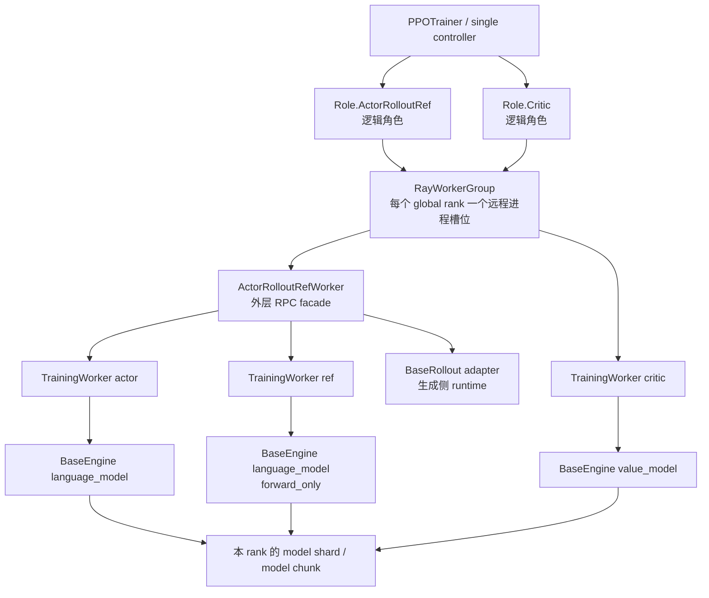

# 06. Model Engine 与并行：从角色语义到每个 rank 上的一次反向传播

> 本章基于仓库 `main@d33ddd71`（`verl 0.9.0.dev`）的当前 V1 实现。这里尤其要区分“配置中出现了某个字段”和“当前 engine 已经实现并注册了该能力”；后文的后端矩阵以实际 `EngineRegistry` 装饰器为准。

上一章讲了 Ray 怎样创建进程、占用 GPU 并调用 worker。本章继续向进程内部走：一个 worker 收到 batch 后，究竟由谁加载模型、建立 FSDP/TP/PP process group、拆 micro-batch、执行 backward 和 optimizer step？

先记住一句话：

> **Role 说明模型在 RL 算法里“为什么存在”，Worker 说明 controller“怎样调用它”，Engine 说明这些 rank“怎样共同完成模型计算”。**

学完本章，你应该能够：

1. 区分 actor、reference、critic、rollout，以及 `Role`、`Worker`、`BaseEngine`；
2. 解释 `TrainingWorker` 如何通过 `EngineRegistry` 选择 FSDP、Megatron、VeOmni 等实现；
3. 说清 DP、TP、PP、SP/CP、EP 分别切什么，为什么 TP/PP rank 不能拿不同样本；
4. 从 `P=2, n=3` 推导 global batch、local mini-batch 和 micro-batch 的 shape；
5. 解释为什么“训练侧 forward-only scoring”和“rollout 自回归生成”仍然是两套 engine；
6. 根据当前源码而不是后端名，判断一个后端能不能训练 critic、能不能使用 PP。

---

## 1. 第一张地图：Role → Worker → Engine → Module

下面这四层经常被统称为“模型 worker”，但它们回答的是不同问题。

| 层 | 回答的问题 | 当前代码中的例子 |
|---|---|---|
| Role | 这个逻辑角色在 RL 中做什么？ | actor、rollout、critic、ref |
| Worker / WorkerGroup | controller 通过什么 RPC 调它？数据怎样 dispatch/collect？ | `ActorRolloutRefWorker`、`TrainingWorker`、`RayWorkerGroup` |
| Model Engine | 多个 rank 如何建立并行拓扑并完成 forward/backward/step？ | `FSDPEngine`、`MegatronEngine`、`VeOmniEngine` |
| Module | 真正执行 Transformer 算子的模型对象 | HF model、Megatron model chunks、DTensor/FSDP module |



图中有三个容易忽略的事实。

### 1.1 Role 是逻辑身份，不保证对应独占进程

[`Role`](https://github.com/verl-project/verl/blob/d33ddd7140f44d392e0e10b48a8902651a1340f4/verl/trainer/ppo/utils.py#L27-L56) 定义了 `Actor`、`Rollout`、`ActorRollout`、`Critic`、`RefPolicy`、`ActorRolloutRef` 等身份。V1 trainer 会把 actor/rollout/ref 和 critic 放入资源池，再用 [`create_colocated_worker_cls`](https://github.com/verl-project/verl/blob/d33ddd7140f44d392e0e10b48a8902651a1340f4/verl/single_controller/ray/base.py#L988-L1027) 把同一资源池中的逻辑 worker 组合起来。

所以：

- 两个 role 可以映射到同一个 `global_pool`；
- 它们甚至可以作为两个普通 Python 子对象存在于同一个外层 Ray actor 进程中；
- “actor 和 critic 共用 GPU”不等于“actor 和 critic 是同一个模型”或“共用 optimizer”。

V1 的资源映射和 colocated worker 构造见 [`trainer_base.py:733-787`](https://github.com/verl-project/verl/blob/d33ddd7140f44d392e0e10b48a8902651a1340f4/verl/trainer/ppo/v1/trainer_base.py#L733-L787) 与 [`trainer_base.py:290-313`](https://github.com/verl-project/verl/blob/d33ddd7140f44d392e0e10b48a8902651a1340f4/verl/trainer/ppo/v1/trainer_base.py#L290-L313)。Ray/资源层的完整解释见[第 05 章](05_ray_controller_and_workers.md)。

### 1.2 一个 Engine 对象只是一个 rank 的本地视角

假设有 8 个训练 rank。每个进程中各有一个 `FSDPEngine` Python 对象；八个对象通过 PyTorch Distributed process group 共同表示一份分片模型。不要把某个进程里的 `self.engine` 理解成“包含整个集群模型的中央对象”。

`TrainingWorker` 构造 engine 后，会把本 rank 的 DP rank 和“本 rank 是否负责返回模型输出”登记给 dispatch 层，见 [`engine_workers.py:134-149`](https://github.com/verl-project/verl/blob/d33ddd7140f44d392e0e10b48a8902651a1340f4/verl/workers/engine_workers.py#L134-L149)。这正是 controller 能够按 DP 切 batch、又只从正确的 TP/PP rank 收结果的基础。

### 1.3 `model_type` 有两种含义，不要混淆

本章中的 registry key：

```text
language_model
value_model
```

是 verl 用来选择 LM head 或 value head engine 的逻辑类型。它不同于 Hugging Face config 中的 `model_type="qwen3"`、`"llama"` 等模型家族名。`TrainingWorker` 会把前者写入 model config，再交给 registry，见 [`engine_workers.py:134-142`](https://github.com/verl-project/verl/blob/d33ddd7140f44d392e0e10b48a8902651a1340f4/verl/workers/engine_workers.py#L134-L142)。

---

## 2. Actor、Reference 与 Critic 到底是什么

### 2.1 Actor：正在被优化的策略

actor 表示当前策略 $\pi_\theta$。它承担两种训练侧计算：

> **公式含义：** 这里把 actor 写成“一套由当前可训练参数决定的概率规则”：给定已经看到的 token，它会为下一个 token 的各个候选值分配概率。
>
> **符号说明：** `π`（读作 pi）表示策略，也就是模型的概率分布规则；下标 `θ`（读作 theta）表示 actor 的整组可训练参数。下标表示“这套策略由这些参数决定”，不是相乘。

- forward-only：默认 decoupled 路径会重算 trajectory 中 token 的 `old_log_probs` 和 entropy；`bypass_mode=True` 时则直接复用 `rollout_log_probs`，跳过这次 actor scoring；
- train：根据 advantage 和 PPO/GRPO loss 做 backward、更新 $\theta$。

> **公式含义（更新参数）：** 这里的单个符号指 optimizer 要改变 actor 的参数，使策略更符合当前 loss 给出的优化方向。
>
> **符号说明：** `θ` 仍是上面那组 actor 参数的统称，不是某一个标量；它通常包含模型中许多权重张量。

当前默认是 `bypass_mode=false`，因此会走上述重算分支；但这不是所有配置的必经步骤。两个分支的真实控制流见 [`trainer_base.py:1479-1516`](https://github.com/verl-project/verl/blob/d33ddd7140f44d392e0e10b48a8902651a1340f4/verl/trainer/ppo/v1/trainer_base.py#L1479-L1516)，默认值见 [`rollout_correction.yaml:19-20`](https://github.com/verl-project/verl/blob/d33ddd7140f44d392e0e10b48a8902651a1340f4/verl/trainer/config/algorithm/rollout_correction.yaml#L19-L20)。

在当前统一 engine 路径里，actor 的 `TrainingWorkerConfig.model_type` 是 `language_model`。外层 [`ActorRolloutRefWorker.init_model`](https://github.com/verl-project/verl/blob/d33ddd7140f44d392e0e10b48a8902651a1340f4/verl/workers/engine_workers.py#L585-L641) 创建内部 `TrainingWorker`，安装 PPO loss，然后初始化具体 model engine。

### 2.2 Reference policy：冻结的比较基准

reference policy 通常表示 $\pi_{\mathrm{ref}}$，用于 KL reward 或 KL loss。它仍然是带 LM head 的 `language_model`，不是 `value_model`；区别在于它只做 forward，不需要 optimizer update。

> **公式含义：** 这个公式表示“作为比较基准的那套策略概率分布”，训练时用它衡量 actor 偏离基准的程度。
>
> **符号说明：** `π` 表示策略；下标 `ref` 是 reference（参考）的缩写，用来区分它与正在更新的 actor 策略。这个下标是名称标签，不表示乘法；KL 指两种概率分布之间的差异度量。

Engine 的公共配置明确保留了 `forward_only`，见 [`EngineConfig`](https://github.com/verl-project/verl/blob/d33ddd7140f44d392e0e10b48a8902651a1340f4/verl/workers/config/engine.py#L77-L117)。例如 Megatron 初始化时若 `forward_only=True`，就不创建 optimizer、scheduler 和 checkpoint manager，见 [`megatron/transformer_impl.py:463-469`](https://github.com/verl-project/verl/blob/d33ddd7140f44d392e0e10b48a8902651a1340f4/verl/workers/engine/megatron/transformer_impl.py#L463-L469)。

LoRA 还有一个重要优化：reference 不一定是第二份模型。如果 actor 是“冻结 base model + 可训练 adapter”，V1 可以在 actor forward 时临时关闭 adapter，把 base model 当成 reference。真实分支在 [`_compute_ref_log_prob`](https://github.com/verl-project/verl/blob/d33ddd7140f44d392e0e10b48a8902651a1340f4/verl/trainer/ppo/v1/trainer_base.py#L1540-L1564)：`no_lora_adapter=True` 时仍调用 actor worker，而不是创建独立 ref engine。

### 2.3 Critic：预测每个 token 的 value

critic 近似价值函数 $V_\phi$，在 GAE 中用来估计 advantage/return。它是独立参数 $\phi$、独立 optimizer 的 `value_model`，输出每个 token 的 scalar value，而不是词表 logits。

> **公式含义：** 第一个公式表示 critic 用自己的参数，根据当前 token 上下文预测“从这里继续下去大约能获得多少未来回报”；后面的单个符号专门指这组 critic 参数。
>
> **符号说明：** `V` 是 value（价值）函数；下标 `φ`（读作 phi）是 critic 的整组可训练参数，表示价值预测由这些参数决定；单独出现的 `φ` 仍指同一组参数。它与 actor 的 `θ` 分开训练，两者不是同一个变量。

V1 把 critic 配成独立的 `TrainingWorker(model_type="value_model")`，见 [`trainer_base.py:248-271`](https://github.com/verl-project/verl/blob/d33ddd7140f44d392e0e10b48a8902651a1340f4/verl/trainer/ppo/v1/trainer_base.py#L248-L271)。是否需要 critic 由 [`need_critic`](https://github.com/verl-project/verl/blob/d33ddd7140f44d392e0e10b48a8902651a1340f4/verl/trainer/ppo/utils.py#L96-L107) 决定：默认只有 GAE 自动启用；GRPO 一类不依赖 value model 的算法通常不创建 critic。

这会直接限制后端选择：一个后端只有 `language_model` 注册但没有 `value_model` 注册时，可以训练 actor，却不能通过当前统一路径训练 critic。

### 2.4 Rollout 也使用“策略”，为什么不属于这里的 training engine？

rollout 的确也执行策略 $\pi$，但工作负载是逐 token 自回归生成，而不是对完整 trajectory 做 loss/backward。因此它走独立的 [`BaseRollout` registry](https://github.com/verl-project/verl/blob/d33ddd7140f44d392e0e10b48a8902651a1340f4/verl/workers/rollout/base.py#L29-L109)，不经过 `EngineRegistry`。

> **公式含义：** 这里的公式泛指 rollout 用来逐 token 采样的策略概率分布，并未指定它是训练前还是训练后的某个参数版本。
>
> **符号说明：** `π` 表示策略；这里没有参数下标，意味着作者只强调“它是一套策略”，不在这个句子里区分具体权重版本。

先用一张表固定边界：

| 计算 | 使用哪个对象 | 是否经过 `EngineRegistry` |
|---|---|---:|
| actor log-prob / entropy scoring | `TrainingWorker.infer_batch` → training-side `BaseEngine` | 是 |
| reference log-prob scoring | ref/actor `TrainingWorker.infer_batch` → `BaseEngine` | 是 |
| critic value scoring | critic `TrainingWorker.infer_batch` → value `BaseEngine` | 是 |
| actor / critic backward | `TrainingWorker.train_mini_batch` → `BaseEngine` | 是 |
| 逐 token 生成 trajectory | vLLM/SGLang/TRT-LLM rollout server | 否 |

---

## 3. `TrainingWorker`：后端无关的计算门面

[`TrainingWorker`](https://github.com/verl-project/verl/blob/d33ddd7140f44d392e0e10b48a8902651a1340f4/verl/workers/engine_workers.py#L76-L178) 可以理解成“一个 engine + optimizer + profiler 的 RPC facade”。它不自己实现 attention，也不关心当前是 FSDP 还是 Megatron；它负责把 controller 的统一调用翻译成 engine 调用。

构造链路是：

```python
# 简化自 TrainingWorker.__init__
self.engine = EngineRegistry.new(
    model_type=self.config.model_type,          # language_model / value_model
    backend=self.engine_config.strategy,       # fsdp2 / megatron / ...
    model_config=self.model_config,
    engine_config=self.engine_config,
    optimizer_config=self.optimizer_config,
    checkpoint_config=self.checkpoint_config,
)
```

对应源码是 [`engine_workers.py:83-142`](https://github.com/verl-project/verl/blob/d33ddd7140f44d392e0e10b48a8902651a1340f4/verl/workers/engine_workers.py#L83-L142)。`EngineRegistry.new()` 会立即执行具体 backend 的 constructor；FSDP、Megatron、VeOmni 和 Automodel 主要把 model/optimizer 构建留到 `reset()` 调用的 `engine.initialize()`，见 [`engine_workers.py:172-178`](https://github.com/verl-project/verl/blob/d33ddd7140f44d392e0e10b48a8902651a1340f4/verl/workers/engine_workers.py#L172-L178)。这不是全后端保证：TorchTitan constructor 已创建 `Trainer`，其 `initialize()` 再取出 model/optimizer/scheduler 容器并加载初始权重，见 [`torchtitan/transformer_impl.py:106-193`](https://github.com/verl-project/verl/blob/d33ddd7140f44d392e0e10b48a8902651a1340f4/verl/workers/engine/torchtitan/transformer_impl.py#L106-L193) 与 [`torchtitan/transformer_impl.py:248-266`](https://github.com/verl-project/verl/blob/d33ddd7140f44d392e0e10b48a8902651a1340f4/verl/workers/engine/torchtitan/transformer_impl.py#L248-L266)。因此不要把 `new()` 当成对所有 backend 都零成本的纯配置步骤。

### 3.1 两条核心调用链

训练一批数据：

```text
update_actor / critic.train_mini_batch
  → TrainingWorker.train_mini_batch
    → 按 PPO epoch 和 mini-batch 迭代
      → TrainingWorker.train_batch
        → engine.train_mode()
        → BaseEngine.train_batch
          → zero_grad
          → forward_backward_batch  # 内部再拆 micro-batch
          → optimizer_step
```

只做 scoring：

```text
compute_log_prob / compute_ref_log_prob / compute_values
  → TrainingWorker.infer_batch
    → engine.eval_mode()
    → BaseEngine.infer_batch
      → torch.no_grad()
      → forward_backward_batch(..., forward_only=True)
```

worker 两条入口分别见 [`train_batch`](https://github.com/verl-project/verl/blob/d33ddd7140f44d392e0e10b48a8902651a1340f4/verl/workers/engine_workers.py#L335-L389) 和 [`infer_batch`](https://github.com/verl-project/verl/blob/d33ddd7140f44d392e0e10b48a8902651a1340f4/verl/workers/engine_workers.py#L391-L435)；actor/ref 的薄包装见 [`engine_workers.py:687-707`](https://github.com/verl-project/verl/blob/d33ddd7140f44d392e0e10b48a8902651a1340f4/verl/workers/engine_workers.py#L687-L707)。

这解释了为什么 reference 计算虽叫“推理”，却仍使用 FSDP/Megatron training-side engine：它是在完整已知序列上做 teacher-forced scoring，不是 autoregressive rollout。

---

## 4. `BaseEngine`：所有训练后端必须遵守的协议

[`BaseEngine`](https://github.com/verl-project/verl/blob/d33ddd7140f44d392e0e10b48a8902651a1340f4/verl/workers/engine/base.py#L30-L295) 不是一个可直接训练的完整实现，而是一组后端协议。

| 能力 | 关键方法 | 这一层屏蔽的后端差异 |
|---|---|---|
| 初始化 | `initialize()` | 怎样建模型、optimizer、scheduler |
| 模式切换 | `train_mode()`、`eval_mode()` | `.train()`/`.eval()`、load/offload、特殊 process group context |
| 一批计算 | `forward_backward_batch()` | FSDP 梯度累积、Megatron pipeline schedule、DTensor mesh |
| optimizer | `optimizer_zero_grad()`、`optimizer_step()`、`lr_scheduler_step()` | 分布式 optimizer、grad norm、overflow |
| 拓扑查询 | `get_data_parallel_size/rank/group()` | controller 应如何按 DP dispatch |
| 输出 rank | `is_mp_src_rank_with_outputs()` | 哪个 TP/PP/CP rank 拥有最终输出 |
| 在线权重导出 | `get_per_tensor_param()` 及 shard/delta 变体 | 训练权重如何转换为 rollout 可加载的 HF key/tensor |
| 训练断点 | `save_checkpoint()`、`load_checkpoint()` | 模型、optimizer、scheduler 的分片保存 |

### 4.1 公共模板决定了 optimizer step 的边界

[`BaseEngine.train_batch`](https://github.com/verl-project/verl/blob/d33ddd7140f44d392e0e10b48a8902651a1340f4/verl/workers/engine/base.py#L113-L132) 的结构很短，却非常关键：

```python
self.optimizer_zero_grad()
outputs = self.forward_backward_batch(data, loss_function, forward_only=False)
grad_norm = self.optimizer_step()
```

因此：

- 一个 **PPO mini-batch** 对应一次 `optimizer.step()`；
- engine 内部的多个 **micro-batch** 只是为这一次 step 累积梯度；
- 不应该把“走了 4 个 micro-batch”解读成“参数更新了 4 次”。

`infer_batch` 则复用同一个 `forward_backward_batch`，但包在 `torch.no_grad()` 中，见 [`base.py:134-149`](https://github.com/verl-project/verl/blob/d33ddd7140f44d392e0e10b48a8902651a1340f4/verl/workers/engine/base.py#L134-L149)。

### 4.2 `BaseEngineCtx` 统一 train/eval 与显存换入换出

[`BaseEngineCtx`](https://github.com/verl-project/verl/blob/d33ddd7140f44d392e0e10b48a8902651a1340f4/verl/workers/engine/base.py#L298-L335) 会根据 `param_offload`、`optimizer_offload` 和当前 mode，在进入/退出 context 时调用 `engine.to(device/cpu, ...)`：

- eval 只需要参数，不需要 optimizer/gradient；
- train 需要参数、gradient 和 optimizer state；
- context 退出后可以把相应状态移回 CPU。

具体后端再扩展这个 context。例如 FSDP train context 会设置 Ulysses SP group、切换 `module.train()`，退出时清 gradient，见 [`fsdp/transformer_impl.py:1096-1112`](https://github.com/verl-project/verl/blob/d33ddd7140f44d392e0e10b48a8902651a1340f4/verl/workers/engine/fsdp/transformer_impl.py#L1096-L1112)。

### 4.3 Engine 的边界不包括什么

`BaseEngine` 不负责：

- dataset 读取与 tokenizer；
- Ray placement group 和远程进程创建；
- reward/advantage 算法；
- 自回归 rollout request 调度；
- Controller 上的训练阶段顺序。

这几个边界分别属于 dataset/protocol、Ray controller、RL algorithm、rollout server 和 trainer。遇到 bug 时先判断它属于哪一层，通常比立刻钻进 FSDP 更有效。

---

## 5. `EngineRegistry` 怎样选择实现

### 5.1 Registry 的真实 key 是四维的

[`EngineRegistry.register`](https://github.com/verl-project/verl/blob/d33ddd7140f44d392e0e10b48a8902651a1340f4/verl/workers/engine/base.py#L337-L394) 最终保存的是：

```python
_engines[model_type][backend][device_or_(device, vendor)] = EngineClass
```

例如 FSDP LM head 的装饰器：

```python
@EngineRegistry.register(
    model_type="language_model",
    backend=["fsdp", "fsdp2"],
    device=["cuda", "npu"],
)
class FSDPEngineWithLMHead(FSDPEngine):
    ...
```

选择时先尝试 `(device, vendor)`，再回退到普通 `device`；若设备是 `cuda`、检测到的 vendor 又不是 `nvidia`，前两项都未命中时还会最后尝试 `("cuda", "nvidia")`。设备与 vendor 可由 `VERL_ENGINE_DEVICE`、`VERL_ENGINE_VENDOR` 覆盖，见 [`get_engine_cls`](https://github.com/verl-project/verl/blob/d33ddd7140f44d392e0e10b48a8902651a1340f4/verl/workers/engine/base.py#L396-L427)。当前本章讨论的六类内置注册都没有指定 vendor，因此它们直接使用 `cuda` 或 `npu` key。

### 5.2 注册在 import 时发生

装饰器不是静态配置文件。只有 Python import 到实现模块时，注册代码才会执行。

[`verl/workers/engine/__init__.py`](https://github.com/verl-project/verl/blob/d33ddd7140f44d392e0e10b48a8902651a1340f4/verl/workers/engine/__init__.py#L14-L64) 的当前行为是：

- FSDP 无条件 import；
- TorchTitan、VeOmni、Automodel、MindSpeed、Megatron 分别放在 `try/except ImportError` 中；
- 可选依赖缺失时，对应模块不会完成 import，也不会写入 registry；
- MindSpeed 特意先于 Megatron import，以便 NPU monkey patch/注册先发生。

所以“源码中有 decorator”不代表“当前 Python 环境中一定能选到它”。遇到 `Unknown backend` 时，可以先做只读诊断：

```python
from verl.workers.engine import EngineRegistry

print(EngineRegistry._engines.keys())
print(EngineRegistry._engines.get("language_model", {}).keys())

# 再直接 import 目标模块，让真正的可选依赖错误显现出来
from verl.workers.engine.torchtitan import TorchTitanEngineWithLMHead
```

### 5.3 Registry 只选择 model engine

不要把下面三种 registry 合并成一个概念：

| Registry | 选择什么 |
|---|---|
| `EngineRegistry` | actor/ref/critic 的 training-side model engine |
| rollout registry | vLLM/SGLang/TRT-LLM server adapter |
| `CheckpointEngineRegistry` | actor → rollout 的在线权重传输实现 |

它们连接在一起，但生命周期、接口和 backend 名空间互不相同。

---

## 6. 六类后端的当前真实注册边界

下面的表以当前源码中的 `@EngineRegistry.register(...)` 为准，而不是根据 YAML 文件名推断。

| backend / `strategy` | `language_model` | `value_model` | 注册设备 | 当前训练并行边界 |
|---|---:|---:|---|---|
| `fsdp` / `fsdp2` | 是 | 是 | CUDA、NPU | FSDP1/2、HSDP、Ulysses SP；无通用 TP/PP 配置 |
| `megatron` | 是 | 是 | 原生类默认 CUDA；MindSpeed 另注册 NPU aliases | DP、TP、PP/virtual PP、CP、EP |
| `mindspeed_megatron` | 是 | **否** | NPU | 继承 Megatron 调度并应用 MindSpeed patches；DP、TP、PP/virtual PP、CP、EP |
| `veomni` | 是 | 是 | CUDA、NPU | FSDP2/HSDP、Ulysses SP、EP |
| `torchtitan` | 是 | **否** | CUDA、NPU | FSDP2/HSDP、TP、CP、EP；PP 字段存在但当前 forward 明确拒绝 |
| `automodel` | 是 | **否** | CUDA | 内层可选 FSDP2/Megatron-FSDP/DDP，支持 TP/CP/EP；当前 `pp_size` 必须为 1 |

精确注册位置：

- FSDP LM/value：[`FSDPEngineWithLMHead`](https://github.com/verl-project/verl/blob/d33ddd7140f44d392e0e10b48a8902651a1340f4/verl/workers/engine/fsdp/transformer_impl.py#L1115-L1116)、[`FSDPEngineWithValueHead`](https://github.com/verl-project/verl/blob/d33ddd7140f44d392e0e10b48a8902651a1340f4/verl/workers/engine/fsdp/transformer_impl.py#L1562-L1568)；
- Megatron LM/value：[`MegatronEngineWithLMHead`](https://github.com/verl-project/verl/blob/d33ddd7140f44d392e0e10b48a8902651a1340f4/verl/workers/engine/megatron/transformer_impl.py#L969-L970)、[`MegatronEngineWithValueHead`](https://github.com/verl-project/verl/blob/d33ddd7140f44d392e0e10b48a8902651a1340f4/verl/workers/engine/megatron/transformer_impl.py#L1288-L1318)；
- MindSpeed：`backend="megatron"` 的 NPU LM/value aliases 见 [`mindspeed/transformer_impl.py:61-95`](https://github.com/verl-project/verl/blob/d33ddd7140f44d392e0e10b48a8902651a1340f4/verl/workers/engine/mindspeed/transformer_impl.py#L61-L95)，独立 `backend="mindspeed_megatron"` 的 NPU LM 注册见 [`mindspeed/transformer_impl.py:116-129`](https://github.com/verl-project/verl/blob/d33ddd7140f44d392e0e10b48a8902651a1340f4/verl/workers/engine/mindspeed/transformer_impl.py#L116-L129)；
- VeOmni LM/value：[`VeOmniEngineWithLMHead`](https://github.com/verl-project/verl/blob/d33ddd7140f44d392e0e10b48a8902651a1340f4/verl/workers/engine/veomni/transformer_impl.py#L865-L870)、[`VeOmniEngineWithValueHead`](https://github.com/verl-project/verl/blob/d33ddd7140f44d392e0e10b48a8902651a1340f4/verl/workers/engine/veomni/transformer_impl.py#L1069-L1075)；
- TorchTitan LM：[`TorchTitanEngineWithLMHead`](https://github.com/verl-project/verl/blob/d33ddd7140f44d392e0e10b48a8902651a1340f4/verl/workers/engine/torchtitan/transformer_impl.py#L598-L600)；
- Automodel LM：[`AutomodelEngineWithLMHead`](https://github.com/verl-project/verl/blob/d33ddd7140f44d392e0e10b48a8902651a1340f4/verl/workers/engine/automodel/transformer_impl.py#L473-L475)。

### 6.1 FSDP / FSDP2

[`FSDPEngineConfig`](https://github.com/verl-project/verl/blob/d33ddd7140f44d392e0e10b48a8902651a1340f4/verl/workers/config/engine.py#L231-L292) 的核心是：

- `strategy="fsdp"` 或 `"fsdp2"`；
- `fsdp_size=-1` 时在完整可用组内分片；较小的 `fsdp_size` 构造 HSDP 的 replicate × shard mesh；
- `ulysses_sequence_parallel_size` 可沿序列维进一步切计算；
- parameter/optimizer offload、activation checkpoint、remove padding 等降低显存峰值。

FSDP 的 mesh 构造见 [`create_device_mesh`](https://github.com/verl-project/verl/blob/d33ddd7140f44d392e0e10b48a8902651a1340f4/verl/workers/engine/fsdp/utils.py#L35-L53)。Engine 对 controller 暴露的 DP size 是 `world_size / Ulysses_SP`，见 [`fsdp/transformer_impl.py:626-639`](https://github.com/verl-project/verl/blob/d33ddd7140f44d392e0e10b48a8902651a1340f4/verl/workers/engine/fsdp/transformer_impl.py#L626-L639)。

它是理解统一 engine 最直接的起点：模型仍是 HF 风格，LM/value 两种 head 都有实现，且当前 `model_engine=dp` 组合默认使用 FSDP。需要注意，默认 actor YAML 仍写着切换 FSDP2 的 TODO，而 critic YAML 已把 FSDP1 标为 deprecating；见 [`dp_actor.yaml:22-34`](https://github.com/verl-project/verl/blob/d33ddd7140f44d392e0e10b48a8902651a1340f4/verl/trainer/config/actor/dp_actor.yaml#L22-L34) 与 [`dp_critic.yaml:22-36`](https://github.com/verl-project/verl/blob/d33ddd7140f44d392e0e10b48a8902651a1340f4/verl/trainer/config/critic/dp_critic.yaml#L22-L36)。因此新实验是否切到 `fsdp2`，应在自己的模型、PyTorch 与硬件组合上验证，而不是只根据名字判断。

### 6.2 Megatron

[`McoreEngineConfig`](https://github.com/verl-project/verl/blob/d33ddd7140f44d392e0e10b48a8902651a1340f4/verl/workers/config/engine.py#L150-L227) 显式提供：

```text
tensor_model_parallel_size
pipeline_model_parallel_size
virtual_pipeline_model_parallel_size
context_parallel_size
expert_model_parallel_size
```

这些值会传入 Megatron 的 `initialize_model_parallel`，见 [`megatron/transformer_impl.py:152-179`](https://github.com/verl-project/verl/blob/d33ddd7140f44d392e0e10b48a8902651a1340f4/verl/workers/engine/megatron/transformer_impl.py#L152-L179)。它及继承该实现的 MindSpeed 路径，是本章六类后端中当前明确把 micro-batch 交给成熟 pipeline schedule 的路径，见 [`megatron/transformer_impl.py:725-790`](https://github.com/verl-project/verl/blob/d33ddd7140f44d392e0e10b48a8902651a1340f4/verl/workers/engine/megatron/transformer_impl.py#L725-L790)。

Megatron 的代价是模型必须能通过当前 Bridge/Megatron provider 建模和转换权重；并行维度越多，checkpoint、权重导出和通信拓扑也越复杂。它更适合模型已经超出单纯 FSDP 扩展范围、确实需要 TP/PP/CP/EP 的场景。

设备还有一个细节：原生 Megatron decorator 未传 `device`，默认是 CUDA；NPU 上 `backend="megatron"` 的 key 由 MindSpeed 类另外注册，见 [`mindspeed/transformer_impl.py:61-95`](https://github.com/verl-project/verl/blob/d33ddd7140f44d392e0e10b48a8902651a1340f4/verl/workers/engine/mindspeed/transformer_impl.py#L61-L95)。这不是“原生 `MegatronEngine` 自动支持 NPU”。

### 6.3 MindSpeed：两种 registry key 不要混在一起

MindSpeed 模块当前同时提供两种 NPU 路由：

- `backend="megatron"` 下同时有 `language_model` 和 `value_model` aliases。这是上节所说的“Megatron key 在 NPU 上由 MindSpeed 实现”；
- 独立 `backend="mindspeed_megatron"` 只有 NPU `language_model` 注册，没有同 key 的 `value_model`。`model_engine=mindspeed` 会组合出这条路径，见 [`model_engine/mindspeed.yaml:1-2`](https://github.com/verl-project/verl/blob/d33ddd7140f44d392e0e10b48a8902651a1340f4/verl/trainer/config/model_engine/mindspeed.yaml#L1-L2) 与 [`engine/mindspeed.yaml:1-5`](https://github.com/verl-project/verl/blob/d33ddd7140f44d392e0e10b48a8902651a1340f4/verl/trainer/config/engine/mindspeed.yaml#L1-L5)。

因此，不能因为仓库里有 `mindspeed_critic.yaml` 就推断独立 `mindspeed_megatron` key 能训练 critic；当前 unified critic 只能走上面 `backend="megatron"` 的 NPU value alias。同样，[`MindSpeedEngineConfig`](https://github.com/verl-project/verl/blob/d33ddd7140f44d392e0e10b48a8902651a1340f4/verl/workers/config/engine.py#L649-L670) 虽然允许 `mindspeed_fsdp` 字符串，当前 `EngineRegistry` 没有对应 decorator；可选值通过 dataclass 校验仍不等于 engine 已注册。

### 6.4 VeOmni

[`VeOmniEngineConfig`](https://github.com/verl-project/verl/blob/d33ddd7140f44d392e0e10b48a8902651a1340f4/verl/workers/config/engine.py#L296-L445) 聚焦 FSDP2、Ulysses SP 和 expert parallel。实现中固定 `data_parallel_mode="fsdp2"`，并从 `world_size / ulysses_parallel_size` 推导 DP，再拆 replicate/shard，见 [`veomni/transformer_impl.py:142-173`](https://github.com/verl-project/verl/blob/d33ddd7140f44d392e0e10b48a8902651a1340f4/verl/workers/engine/veomni/transformer_impl.py#L142-L173)。

它同时注册 LM head 和 value head，因此 actor/ref/critic 的统一路径都可选。仓库当前也有大型 MoE、VL 的 VeOmni 示例；不过端到端可用性仍取决于 VeOmni 自身的模型 registry、kernel 与硬件依赖，不能由 registry 表单独保证。

### 6.5 TorchTitan

[`TorchtitanEngineConfig`](https://github.com/verl-project/verl/blob/d33ddd7140f44d392e0e10b48a8902651a1340f4/verl/workers/config/engine.py#L449-L524) 暴露 DP shard/replicate、TP、PP、CP 和 EP degree，并把这些值传给 TorchTitan `ParallelismConfig`，见 [`torchtitan/transformer_impl.py:138-147`](https://github.com/verl-project/verl/blob/d33ddd7140f44d392e0e10b48a8902651a1340f4/verl/workers/engine/torchtitan/transformer_impl.py#L138-L147)。

但“字段存在”不等于“当前 forward 跑得通”：[`model_forward_step`](https://github.com/verl-project/verl/blob/d33ddd7140f44d392e0e10b48a8902651a1340f4/verl/workers/engine/torchtitan/transformer_impl.py#L370-L395) 在 `pp_enabled` 时明确抛出 `NotImplementedError`。当前应将 PP 设为 1。

另外，TorchTitan 只注册了 `language_model`，没有 `value_model`。仓库虽然仍有 [`TorchTitanCriticConfig`](https://github.com/verl-project/verl/blob/d33ddd7140f44d392e0e10b48a8902651a1340f4/verl/workers/config/critic.py#L237-L255) 与 YAML，但统一 critic 路径会因 registry 缺少 `(value_model, torchtitan, ...)` 而失败。当前端到端示例使用不需要 critic 的 GRPO；依赖还要求匹配的 PyTorch/TorchTitan nightly，详见仓库的 [`torchtitan_workers.rst`](https://github.com/verl-project/verl/blob/d33ddd7140f44d392e0e10b48a8902651a1340f4/docs/workers/torchtitan_workers.rst#L16-L36)。

### 6.6 Automodel

[`AutomodelEngineConfig`](https://github.com/verl-project/verl/blob/d33ddd7140f44d392e0e10b48a8902651a1340f4/verl/workers/config/engine.py#L528-L646) 有两层 strategy：

```text
外层 EngineRegistry backend: automodel
内层 distributed_strategy: fsdp2 / megatron_fsdp / ddp
```

它还配置 TP、CP、EP、DP replicate；但当前 dataclass 直接断言 `pp_size == 1`。mesh 和 distributed config 的转换集中在 [`automodel/utils.py:67-124`](https://github.com/verl-project/verl/blob/d33ddd7140f44d392e0e10b48a8902651a1340f4/verl/workers/engine/automodel/utils.py#L67-L124)。

Automodel 当前只有 CUDA `language_model` 注册，没有 value engine。仓库中现成示例集中在 SFT，见 [`automodel_workers.rst`](https://github.com/verl-project/verl/blob/d33ddd7140f44d392e0e10b48a8902651a1340f4/docs/workers/automodel_workers.rst#L36-L65)；把它用于 RL actor 前，应先验证自己的配置组合、online weight export 与 rollout backend，而不要根据通用 `TrainingWorker` 接口推断整条 PPO 配置已经覆盖。

### 6.7 一个反直觉但重要的结论

存在下面任意一项，都不足以证明后端能力已经可用：

- dataclass 中有字段；
- Hydra 目录中有 YAML；
- 上游训练框架宣称支持；
- verl 中有一个未注册的 class。

本地源码的最低判定链应是：

```text
实际 decorator 注册
  → 当前环境 import 成功
  → 目标 model_type 有实现
  → 目标模型能被 backend 构建/转换
  → 所需并行路径没有显式 NotImplemented
  → 端到端测试通过
```

---

## 7. DP、TP、PP：到底切了什么

### 7.1 Data Parallel：切 batch 中的样本

DP 的不同 replica 处理不同 trajectory。每个 replica 在语义上都有完整模型计算能力；训练时梯度或参数状态通过 collective 同步。

FSDP 仍然属于数据并行家族，只是把参数、梯度、optimizer state 也沿 DP rank 分片，从而避免每张 GPU 常驻完整状态。HSDP 再把“跨副本复制”和“副本内分片”组合起来。

### 7.2 Tensor Parallel：切一个 layer 内的张量/矩阵

TP group 内的 rank **必须看到同一批样本**。它们共同完成同一个 Transformer layer，例如把一个 column-parallel 权重：

```text
W: [H, 4H]
```

在 TP=2 时概念性拆成：

```text
rank tp0: [H, 2H]
rank tp1: [H, 2H]
```

随后用 all-reduce/all-gather/reduce-scatter 拼出下一步需要的数据。具体切哪一维由模型和 parallel plan 决定；不要机械地认为每层所有 activation 都必然变成 `[B, S, H/TP]`。

### 7.3 Pipeline Parallel：切模型层

PP=2 时可以把 32 层模型概念性分为：

```text
stage 0: layers 0..15
stage 1: layers 16..31 + output head
```

同一个 micro-batch 先过 stage 0，再把 activation 发到 stage 1；backward 反向流回。为了减少 pipeline bubble，需要把 local mini-batch 拆成足够多 micro-batch 并调度交错执行。

因此 PP rank 也不能各自拿不同样本。当前六类后端里，真正可执行的通用 PP 由 Megatron 实现，并由继承该实现的 MindSpeed 路径复用；TorchTitan 的字段已暴露但当前 forward 拒绝，Automodel 当前强制 PP=1。

### 7.4 SP/CP 与 EP 为什么也会出现

- Sequence/Context Parallel：沿 token/sequence 方向切 activation 或 attention 计算，主要用于长上下文。FSDP/VeOmni 使用 Ulysses SP；Megatron 有 CP。
- Expert Parallel：MoE 中不同 rank 持有不同 experts，token 经过路由后 all-to-all 到目标 expert。

对 dense Megatron，初学时可用：

$$
world\_size \approx DP \times TP \times PP \times CP
$$

> **公式含义：** 在这个简化的 dense Megatron 场景中，训练总进程数大致等于四个并行轴大小的乘积。例如每个轴分别取 2、2、1、1 时，总进程数约为 4。
>
> **符号说明：** `world_size` 是参加分布式训练的总进程数，通常一个进程对应一个 GPU rank；`≈` 表示“近似等于”，说明这不是所有后端都必须满足的恒等式；`DP`、`TP`、`PP`、`CP` 分别是数据、张量、流水线、上下文并行的规模；`×` 是乘法，表示把四个独立并行轴的规模组合起来。

但加入 EP、HSDP replicate/shard、virtual PP 或动态 CP 后，各轴可能嵌套或共享 process group。此时必须读取 backend 建出的 device mesh，不能继续盲乘所有配置值。

---

## 8. Controller 怎样保证 TP/PP rank 收到同一份样本

Engine 向 worker 报告两个信息：

```python
dp_rank = engine.get_data_parallel_rank()
is_collect = engine.is_mp_src_rank_with_outputs()
```

controller 先把 global batch 切成 `dp_size` 份。随后 [`dispatch_nd_compute`](https://github.com/verl-project/verl/blob/d33ddd7140f44d392e0e10b48a8902651a1340f4/verl/single_controller/base/decorator.py#L202-L233) 根据每个 global rank 对应的 `dp_rank` 做复制：具有相同 DP rank 的 TP/PP/CP ranks 收到同一个 local batch shard。

计算结束后，[`collect_nd_compute`](https://github.com/verl-project/verl/blob/d33ddd7140f44d392e0e10b48a8902651a1340f4/verl/single_controller/base/decorator.py#L236-L263) 只保留 `is_collect=True` 的 rank。例如 Megatron 只有满足下面条件的 rank 返回最终输出：

```text
TP rank == 0
PP rank == 最后一个 stage
CP rank == 0
```

真实判断见 [`MegatronEngine.is_mp_src_rank_with_outputs`](https://github.com/verl-project/verl/blob/d33ddd7140f44d392e0e10b48a8902651a1340f4/verl/workers/engine/megatron/transformer_impl.py#L433-L438)。

这套机制让 worker 层不需要分别实现 `FSDP_DISPATCH`、`MEGATRON_PP_DISPATCH`：它只询问具体 engine 的实际拓扑。

---

## 9. Batch、mini-batch 与 micro-batch 的三层边界

先把数据层级画出来：

```text
一个训练 step 的 trajectory batch
  │ controller 按 DP 切分
  ▼
每个 DP replica 的 local batch
  │ TrainingWorker 按 PPO mini-batch 与 epoch 迭代
  ▼
一次 optimizer step 的 local mini-batch
  │ engine 按固定行数，或按 token 目标值与 workload 启发式切分
  ▼
若干 forward/backward micro-batch
  │ 梯度累积
  ▼
一次 optimizer.step()
```

### 9.1 V1 的 global PPO mini-batch 以 trajectory 数计

在当前 V1 actor/critic update 中，配置的 `ppo_mini_batch_size` 会先乘 `rollout.n`：

```python
ppo_mini_batch_size = config.actor.ppo_mini_batch_size
ppo_mini_batch_size *= config.rollout.n
```

actor 与 critic 的真实位置分别是 [`trainer_base.py:1672-1705`](https://github.com/verl-project/verl/blob/d33ddd7140f44d392e0e10b48a8902651a1340f4/verl/trainer/ppo/v1/trainer_base.py#L1672-L1705) 和 [`trainer_base.py:1649-1663`](https://github.com/verl-project/verl/blob/d33ddd7140f44d392e0e10b48a8902651a1340f4/verl/trainer/ppo/v1/trainer_base.py#L1649-L1663)。所以配置层的值可以按 prompt group 理解，进入 worker 的 global mini-batch 已展开为 trajectory 行数。

### 9.2 Worker 再把 global mini-batch 除以 DP size

[`TrainingWorker.train_mini_batch`](https://github.com/verl-project/verl/blob/d33ddd7140f44d392e0e10b48a8902651a1340f4/verl/workers/engine_workers.py#L241-L333) 收到的 `data` 已是一个 DP replica 的 local shard。若 controller 传入 global `mini_batch_size`：

```python
mini_batch_size_per_gpu = mini_batch_size // engine.get_data_parallel_size()
```

然后 [`make_iterator`](https://github.com/verl-project/verl/blob/d33ddd7140f44d392e0e10b48a8902651a1340f4/verl/utils/tensordict_utils.py#L559-L612) 按这个 local mini-batch size 和 PPO epochs 迭代。

变量名 `mini_batch_size_per_gpu` 容易误导。TP/PP > 1 时，它实际表示：

> **一个 data-parallel replica 的逻辑 local mini-batch；同一 model-parallel replica 内的多张 GPU 共同处理这些样本。**

它不是“每张 TP GPU 各取一组不同的行”。

### 9.3 Engine 最后拆 micro-batch

公共 [`prepare_micro_batches`](https://github.com/verl-project/verl/blob/d33ddd7140f44d392e0e10b48a8902651a1340f4/verl/workers/engine/utils.py#L83-L121) 支持两种方式：

- 固定模式：按 `micro_batch_size_per_gpu` 切行；
- 动态模式：先由 token 目标值推导 micro-batch 数量，再按 attention workload 重排样本。该目标是拆分启发式，不是每个 micro-batch 的硬上限。

公共函数读取 backend 写入 batch 元数据的 `sp_size`，并计算：

$$
T_{\mathrm{target}}
= \mathrm{max\_token\_len\_per\_gpu}\times s_{\mathrm{backend}}
$$

> **公式含义：** 把单 GPU 的基础 token 配置乘以当前 backend 传入的倍率，得到用来推导 micro-batch 数量的 token 目标值。它回答的是“大约需要拆几批”，不是“每批绝对不得超过多少 token”。
>
> **符号说明：** $T_{\mathrm{target}}$ 是用于拆批的目标 token 数，下标 `target` 表示“目标值”；$\mathrm{max\_token\_len\_per\_gpu}$ 就是配置项 `max_token_len_per_gpu`，表示单 GPU 的基础值，直立字体和下划线说明这是一个完整配置名；$s_{\mathrm{backend}}$ 是具体 backend 写入的 `sp_size`，下标 `backend` 表示它由后端决定；$\times$ 是乘号。

$s_{\mathrm{backend}}$ 不是全后端通用的“SP/CP size”，当前实际映射是：

- FSDP 与 VeOmni 写入 Ulysses size，见 [`fsdp/transformer_impl.py:700-703`](https://github.com/verl-project/verl/blob/d33ddd7140f44d392e0e10b48a8902651a1340f4/verl/workers/engine/fsdp/transformer_impl.py#L700-L703) 与 [`veomni/transformer_impl.py:385-408`](https://github.com/verl-project/verl/blob/d33ddd7140f44d392e0e10b48a8902651a1340f4/verl/workers/engine/veomni/transformer_impl.py#L385-L408)；
- Megatron 写入 `context_parallel_size`，见 [`megatron/transformer_impl.py:693-696`](https://github.com/verl-project/verl/blob/d33ddd7140f44d392e0e10b48a8902651a1340f4/verl/workers/engine/megatron/transformer_impl.py#L693-L696)；
- TorchTitan 当前写入的是 `tensor_parallel_size`，不是 CP size，见 [`torchtitan/transformer_impl.py:337-353`](https://github.com/verl-project/verl/blob/d33ddd7140f44d392e0e10b48a8902651a1340f4/verl/workers/engine/torchtitan/transformer_impl.py#L337-L353)；
- Automodel 当前没有写入 `sp_size`，因此公共函数使用默认值 1，见 [`automodel/transformer_impl.py:224-234`](https://github.com/verl-project/verl/blob/d33ddd7140f44d392e0e10b48a8902651a1340f4/verl/workers/engine/automodel/transformer_impl.py#L224-L234)。

实现先用 `ceil(total_seqlen / T_target)` 推导批数，再按近似 attention workload 分区，见 [`seqlen_balancing.py:394-438`](https://github.com/verl-project/verl/blob/d33ddd7140f44d392e0e10b48a8902651a1340f4/verl/utils/seqlen_balancing.py#L394-L438)。因此动态 micro-batch 的行数不是常量，而且某一批的 token 数可能超过 `T_target`；FSDP 源码对此有明确注释，见 [`fsdp/transformer_impl.py:647-654`](https://github.com/verl-project/verl/blob/d33ddd7140f44d392e0e10b48a8902651a1340f4/verl/workers/engine/fsdp/transformer_impl.py#L647-L654)。`same_micro_num_in_dp=True` 会让不同 DP replica 拥有相同 micro-batch 数，避免 collective 或 pipeline schedule 次数不一致。

FSDP 还会在非最后一个 micro-batch 暂停梯度同步，只在最后一次 backward 同步，见 [`fsdp/transformer_impl.py:672-748`](https://github.com/verl-project/verl/blob/d33ddd7140f44d392e0e10b48a8902651a1340f4/verl/workers/engine/fsdp/transformer_impl.py#L672-L748)。

---

## 10. `P=2, n=3` 的等长并行推导例子

假设：

本节只沿用第 04 章的 `P=2, n=3, B=6` 计数关系，为展示 TP 数据复制和固定 shape，特意把六条 trajectory 简化成等长。这不是第 04 章那组 jagged 样本的同一组具体长度：那一例的 `input_ids` 总 token 数是 54，本节的等长变体是 60，见[第 04 章的完整 shape 例子](04_data_and_protocols.md)。

为展示 TP 数据复制关系，这里假设使用当前真正支持 TP 的 engine（例如 Megatron）；若沿用全书默认 FSDP，应把 `TP=1`，并把额外 GPU 放在 DP/FSDP 轴上。

```text
P = 2 prompts
n = 3 rollouts / prompt
B = P × n = 6 trajectories

每条 prompt 长度 = 4
每条 response 长度 = 6
总序列长度 S = 10

训练 world_size = 4
TP = 2, PP = 1, CP = 1
所以 DP = 4 / 2 = 2

actor.ppo_mini_batch_size = 2 prompts
rollout.n = 3
ppo_micro_batch_size_per_gpu = 1
ppo_epochs = 2
```

### 10.1 trajectory 的语义 shape 与 worker 视图

V1 controller 主要持有 `KVBatchMeta`，不会直接读取这些 token tensor。为方便理解一批 trajectory 在 worker materialize 后的语义，先用等长 dense 视图：

| 字段 | shape |
|---|---|
| `input_ids`、`position_ids` | `[6, 10]` |
| `attention_mask` | `[6, 10]`（不作为 trajectory 字段持久化；Agent Loop 仅在生成 `position_ids` 时按 `input_ids` 临时构造） |
| `responses` | `[6, 6]` |
| `old_log_probs`、`advantages`、`response_mask` | `[6, 6]` |

当前 V1 在 TransferQueue/worker 主路径常用 nested/jagged TensorDict；更准确的表示是：

```text
TensorDict batch_size = [6]
input_ids.shape ≈ [6, j1]
input_ids.values().shape = [60]     # 本例恰好等长
```

真实样本长度不同时，`values()` 是所有有效 token 的拼接，不会强制等于 `6 × max_length`。数据协议细节见[第 04 章](04_data_and_protocols.md)。

### 10.2 按 DP=2 dispatch

global batch 被分为两个 local batch：

```text
DP replica 0: 3 trajectories → input_ids [3, 10]
DP replica 1: 3 trajectories → input_ids [3, 10]
```

一种可能的物理 rank 映射是：

| global rank | DP rank | TP rank | 收到的样本 |
|---:|---:|---:|---|
| 0 | 0 | 0 | trajectories 0..2 |
| 1 | 0 | 1 | trajectories 0..2 |
| 2 | 1 | 0 | trajectories 3..5 |
| 3 | 1 | 1 | trajectories 3..5 |

rank 0 和 rank 1 看到同样 3 条 trajectory，但持有/计算不同 tensor shard；rank 2 和 rank 3 同理。

### 10.3 global mini-batch → local mini-batch

V1 会乘 rollout 数：

```text
global PPO mini-batch
= actor.ppo_mini_batch_size × rollout.n
= 2 × 3
= 6 trajectories
```

再除以 DP：

```text
local mini-batch = 6 / 2 = 3 trajectories
```

因此每个 epoch 中，每个 DP replica 的整个 `[3, 10]` local batch 恰好构成一个 local mini-batch。

### 10.4 local mini-batch → micro-batches → optimizer step

固定 micro-batch size 为 1：

```text
local mini-batch [3, 10]
  → micro-batch 0 [1, 10] → forward/backward
  → micro-batch 1 [1, 10] → forward/backward
  → micro-batch 2 [1, 10] → forward/backward + 最终梯度同步
  → optimizer.step() 一次
```

`ppo_epochs=2` 会对这 6 条 trajectory 再迭代一次，因此本例总计 **2 次 optimizer update**，而不是 `3 micro-batches × 2 epochs = 6 次`。

若启用动态 batch，shape 可能变成：

```text
micro-batch 0: 2 条短序列，packed tokens = 14
micro-batch 1: 1 条长序列，packed tokens = 10
```

此时 token 目标值先决定批数，近似 attention workload 再决定样本组合，而不是按固定第一维切行；这个目标值仍不是逐个 micro-batch 的硬上限。

---

## 11. 并行与显存：三个可计算的例子

下面都是数量级估算，不是某个 backend 的峰值承诺。dtype、optimizer 实现、offload、重计算、通信 buffer 和 allocator 碎片都会改变结果。

### 11.1 8B 模型状态为什么单卡放不下训练

以 8B 参数、BF16 参数/梯度、Adam FP32 moments 为例：

```text
参数：       8B × 2 bytes = 16 GB
梯度：       8B × 2 bytes = 16 GB
Adam m、v：  8B × 8 bytes = 64 GB
--------------------------------
最低约                         96 GB
```

如果还保留 FP32 master weights 或 FP32 gradient，可能进一步接近 128 GB；这里尚未计算 activation 和临时 buffer。

理想化地全分片到 8 个 FSDP ranks，96 GB 持久状态约降为每 rank 12 GB。但实际峰值不会严格除以 8，因为 forward 时需要 parameter all-gather，还要保留 activation、通信 bucket 和未及时释放的临时 tensor。

TP 和 PP 也能分担模型状态，但机制不同：TP 切每层矩阵，PP 切层；二者都会增加通信或调度开销。

### 11.2 Micro-batch 怎样影响 activation

一个 BF16 hidden tensor：

```text
[micro_batch=2, sequence=4096, hidden=4096]
2 × 4096 × 4096 × 2 bytes
= 64 MiB
```

若粗略只按 32 层、每层保存一个这种 tensor，已经约 2 GiB；真实 Transformer 每层通常保存多个中间结果，所以会更高。

- micro-batch 从 2 降到 1，batch 维相关 activation 约减半；
- activation checkpointing 不保存部分中间结果，backward 时重算，以计算换显存；
- dynamic token batch 会按长度/workload 重组长短样本，通常能减少 padding 和 OOM 风险；但 token 目标值不是硬上限，单条过长样本仍可能 OOM。

### 11.3 Rollout KV cache 为什么又是另一套压力

KV cache 每个 token 的粗略大小：

$$
B_{\mathrm{token}}
= 2 \times L \times H_{\mathrm{KV}} \times d_{\mathrm{head}} \times b_{\mathrm{elem}}
$$

> **公式含义：** 这个乘积估算一条序列中“每缓存一个 token”需要多少字节：每层都要为该 token 保存 key 和 value，并覆盖所有 KV head 及每个 head 的向量维度。
>
> **符号说明：** $B_{\mathrm{token}}$ 是每个 token 的 KV cache 字节数，$B$ 在这里表示 bytes，不是 batch size，下标 `token` 限定了统计单位；$2$ 表示 key（$K$）和 value（$V$）两份缓存；$L$ 是 Transformer 层数；$H_{\mathrm{KV}}$ 是每层的 KV head 数，下标 `KV` 说明这是 key/value heads；$d_{\mathrm{head}}$ 是每个 head 的向量维度；$b_{\mathrm{elem}}$ 是每个数值元素占用的字节数，例如 BF16 为 2，下标 `elem` 是 element（元素）的缩写；$=$ 表示两边是同一个估算量，每个 $\times$ 都表示把各维度规模相乘。

这是标准 MHA/GQA 的**未分片逻辑总量**，不能直接当作任意并行配置的单卡用量：TP 可能切分或复制 KV heads，PP 会切层；MLA、量化 KV cache、prefix sharing 等机制也会改变这个估算。

若有 32 层、8 个 KV heads、head dim 128、BF16：

```text
每 token = 2 × 32 × 8 × 128 × 2 bytes = 128 KiB
8192 cached tokens ≈ 1 GiB / sequence
32 条并发 sequence ≈ 32 GiB
```

这还不含权重、paged block 元数据和碎片。它解释了 rollout runtime 为什么围绕 Paged KV cache、continuous batching、prefix cache 和 request scheduling 设计，而 training engine 围绕 optimizer state、activation、backward 和 collective 设计。

---

## 12. 为什么训练 engine 与 rollout engine 必须分离

它们都“运行同一个策略模型”，但优化目标完全不同。

| 维度 | Training-side model engine | Rollout engine |
|---|---|---|
| 输入 | 完整 prompt + response，常为 packed/nested batch | prompt，随后逐 token decode |
| 关键状态 | 参数 shard、gradient、optimizer state、activation | decode 权重布局、KV cache、request state |
| 核心操作 | forward、backward、optimizer step | prefill、decode、sampling |
| 吞吐策略 | micro-batch、gradient accumulation、TP/PP/FSDP | continuous batching、Paged KV、replica/load balancing |
| 生命周期 | train/eval/offload、checkpoint | sleep/resume、abort request、clear cache |
| 常见实现 | FSDP、Megatron、VeOmni、TorchTitan | vLLM、SGLang、TensorRT-LLM |

如果强行用普通 training engine 做 rollout：

- 缺少高效 KV cache 与连续批处理；
- 每生成一个 token 都会重复大量前缀工作或使用不合适的数据布局；
- optimizer/gradient state 会与大量并发 KV cache 争抢显存。

如果反过来用 rollout server 做训练：

- 它通常没有 autograd graph、optimizer 和训练 checkpoint；
- 为 decode 优化的权重/并行布局不一定适合 backward；
- request scheduler 也不表达 PPO loss 所需的全序列张量。

### 12.1 分离后怎样保持“同一个策略”

两个 runtime 只在语义上代表同一策略，物理上是两份权重表示：

```text
actor training engine --optimizer.step()--> θ_new
        │
        ├─ get_per_tensor_param() / shard export
        ▼
checkpoint / weight-sync engine
        ▼
rollout.update_weights(...)
        ▼
rollout runtime 使用 θ_new 生成下一批 trajectory
```

`BaseEngine.get_per_tensor_param()` 的协议在 [`base.py:151-227`](https://github.com/verl-project/verl/blob/d33ddd7140f44d392e0e10b48a8902651a1340f4/verl/workers/engine/base.py#L151-L227)，actor worker 的同步路径在 [`engine_workers.py:719-805`](https://github.com/verl-project/verl/blob/d33ddd7140f44d392e0e10b48a8902651a1340f4/verl/workers/engine_workers.py#L719-L805)。完整 sleep/resume、replica 与传输后端见[第 07 章](07_rollout_and_weight_sync.md)。

### 12.2 “Scoring inference”仍不等于 rollout

actor/ref/critic 的 `infer_batch` 是：给定整段已知 token，一次 forward 得到每个位置的 log-prob/value。rollout 是：只给 prompt，重复 decode 和 sampling 产生未知 token。

所以准确说法是：

```text
training-side forward-only scoring != autoregressive rollout generation
```

这也解释了为什么 rollout log-prob 与 actor 重算 log-prob 可能存在小的数值差异：它们使用不同 kernel、batching 和权重布局。默认 decoupled 路径会把 rollout 计算的 `rollout_log_probs` 与 actor 重算的 `old_log_probs` 区分保存；`bypass_mode=True` 时则直接把前者复用为后者，并不执行这次重算。

---

## 13. 如何选择后端：先按必要能力排除

不存在对所有模型、硬件和规模都最好的后端。更可靠的顺序是先做“硬约束过滤”，再用 benchmark 比较吞吐和显存。

### 13.1 决策表

| 需求 | 当前优先考察 | 原因与限制 |
|---|---|---|
| 第一次读源码、复现默认小/中型 HF 模型 | FSDP/FSDP2 | 拓扑最直观；LM/value 都注册；默认 `model_engine=dp` 路径覆盖较完整 |
| 必须使用统一 critic/value model | FSDP/FSDP2、Megatron、VeOmni | 当前只有这些 backend key 有 `value_model` 注册；NPU 上的 Megatron key 由 MindSpeed value alias 实现，独立 `mindspeed_megatron` key 没有 value 注册 |
| 大 dense 模型必须 TP + PP | Megatron | 当前明确实现 pipeline schedule；模型需有 Bridge/provider 支持 |
| 长上下文，需要序列/上下文并行 | FSDP/VeOmni 的 Ulysses SP，或 Megatron CP；也可评估 TorchTitan CP | 先验证目标 attention/model 路径 |
| 大型 MoE，需要显式 EP | Megatron、VeOmni；也可评估 TorchTitan/Automodel | kernel、router、weight export 和目标模型支持比“EP 字段存在”更重要 |
| 希望研究 TorchTitan N-D/SPMD 路径 | TorchTitan | 需要匹配 nightly；PP 当前不可用；无 value engine |
| 已使用 NeMo Automodel/TE/DeepEP 生态或做 SFT | Automodel | 当前现成例子以 SFT 为主；PP=1；无 value engine |
| NPU | FSDP、VeOmni、TorchTitan 的静态注册；Megatron key 与独立 `mindspeed_megatron` key 由 MindSpeed 路由 | 独立 `mindspeed_megatron` 只有 LM；Automodel 当前仅 CUDA；静态注册仍需端到端模型/依赖验证 |

### 13.2 一套实际选择流程

1. **算法是否需要 critic？** 需要就先排除当前独立 `mindspeed_megatron`、TorchTitan 和 Automodel value 路径；NPU 上可用的是 `backend="megatron"` 的 MindSpeed value alias。GRPO 无 critic 时选择面更大。
2. **最小并行方案能否装下？** 先尝试最少的并行维度。多一个 TP/PP/CP/EP 轴，就多一类通信和故障模式。
3. **是否真的需要 PP？** 当前六类内置路径中应优先看 Megatron 及继承其调度的 MindSpeed 路径；不要因为 TorchTitan/Automodel config 有字段就打开。
4. **目标模型是否被后端建模和权重转换支持？** 检查 Bridge、VeOmni registry、TorchTitan model registry 或 Automodel loader。
5. **rollout 权重能否正确同步？** 至少验证一次 actor update 后的 HF-keyed export、rollout reload 和 logits/log-prob 数值。
6. **再比较吞吐。** 在相同 global batch、token 数、dtype、checkpointing 和 rollout 配置下比较 MFU、step time 与 peak memory。

### 13.3 配置不要只改一个字符串

Hydra 当前通过 `model_engine` 同时选择 actor、ref 和 critic 组合：

```yaml
# ppo_trainer.yaml 中的概念结构
defaults:
  - model_engine: dp
  - actor@actor_rollout_ref.actor: ${model_engine}_actor
  - ref@actor_rollout_ref.ref: ${model_engine}_ref
  - critic@critic: ${model_engine}_critic
```

真实默认组合见 [`ppo_trainer.yaml:7-31`](https://github.com/verl-project/verl/blob/d33ddd7140f44d392e0e10b48a8902651a1340f4/verl/trainer/config/ppo_trainer.yaml#L7-L31)。因此从 FSDP 切 Megatron、MindSpeed、VeOmni 或 TorchTitan 时，应优先使用完整 `model_engine=...` composition，再调整对应的并行字段。只覆盖外层 `actor.strategy`，却留下另一类 engine config/optimizer/checkpoint，可能得到一个表面能解析、运行时才失败的混合配置。还要注意，`model_engine=mindspeed` 选择的是只有 LM 注册的独立 `mindspeed_megatron` key，不能与需要统一 critic 的算法组合。

Automodel 当前没有对应的 PPO `model_engine/automodel.yaml` 组合，仓库提供的是独立 engine/optimizer 配置和 SFT 示例；这也是为什么不应把它当作当前 turnkey PPO backend 宣传。

---

## 14. 从哪里下断点，怎样判断是哪一层错了

### 14.1 Engine 没选到

建议顺序：

1. 看 `TrainingWorkerConfig.model_type` 是 `language_model` 还是 `value_model`；
2. 看 `engine_config.strategy` 的最终 Hydra 值；
3. 打印 `EngineRegistry._engines`；
4. 直接 import 目标 backend，检查被 `try/except ImportError` 隐藏的依赖错误；
5. 对照本章注册矩阵检查 device/model_type key。

推荐断点：

- [`TrainingWorker.__init__`](https://github.com/verl-project/verl/blob/d33ddd7140f44d392e0e10b48a8902651a1340f4/verl/workers/engine_workers.py#L83-L142)
- [`EngineRegistry.get_engine_cls`](https://github.com/verl-project/verl/blob/d33ddd7140f44d392e0e10b48a8902651a1340f4/verl/workers/engine/base.py#L396-L427)
- 目标 backend 的注册装饰器

### 14.2 Batch shape 或 collective 卡住

依次打印：

```text
global world_size
engine.get_data_parallel_size/rank()
worker 收到的 data.shape[0]
global mini_batch_size
local mini_batch_size
micro_batch 数量与每批 token 数
TP/PP/CP rank
```

重点验证：

- global mini-batch 是否能被 DP size 整除；
- local batch 是否能被 local mini-batch 整除；
- 不同 DP rank 是否得到相同 micro-batch 数；
- 同一 TP/PP group 是否收到相同 local data；
- 只有正确的 MP source rank 在返回输出。

对应源码入口：

- dispatch：[`decorator.py:202-304`](https://github.com/verl-project/verl/blob/d33ddd7140f44d392e0e10b48a8902651a1340f4/verl/single_controller/base/decorator.py#L202-L304)
- PPO mini-batch：[`engine_workers.py:241-333`](https://github.com/verl-project/verl/blob/d33ddd7140f44d392e0e10b48a8902651a1340f4/verl/workers/engine_workers.py#L241-L333)
- micro-batch：[`engine/utils.py:83-121`](https://github.com/verl-project/verl/blob/d33ddd7140f44d392e0e10b48a8902651a1340f4/verl/workers/engine/utils.py#L83-L121)
- FSDP forward/backward loop：[`fsdp/transformer_impl.py:700-748`](https://github.com/verl-project/verl/blob/d33ddd7140f44d392e0e10b48a8902651a1340f4/verl/workers/engine/fsdp/transformer_impl.py#L700-L748)
- Megatron pipeline schedule：[`megatron/transformer_impl.py:731-830`](https://github.com/verl-project/verl/blob/d33ddd7140f44d392e0e10b48a8902651a1340f4/verl/workers/engine/megatron/transformer_impl.py#L731-L830)

### 14.3 OOM 应先判断是哪一类显存

| OOM 阶段 | 首先怀疑 | 常见控制项 |
|---|---|---|
| engine initialize | 参数/optimizer 常驻状态 | FSDP/TP/PP、dtype、optimizer offload |
| actor/ref scoring forward | logits、长序列 activation | infer micro-batch、dynamic token target、remove padding、chunked entropy |
| backward | saved activation、gradient、临时 logits | training micro-batch、activation checkpointing、TP/SP、fused loss |
| weight sync | full parameter gather、格式转换副本 | shard/delta export 支持、bucket size、offload 时机 |
| rollout generation | KV cache 与并发请求 | max tokens、并发数、rollout TP、cache utilization |

只降低 `ppo_mini_batch_size` 不一定能修复单次 forward OOM；固定模式下，micro-batch 行数会直接影响单次 forward 规模；动态模式下，token 目标值只启发式地决定拆批数量，并不保证每批都低于它，单条过长样本仍可能 OOM。反过来，micro-batch 很小也不会减少 optimizer state 常驻显存。

---

## 15. 本章总结

把本章压缩成十条结论：

1. Role 是 RL 语义身份，不等于进程、GPU 或模型对象。
2. Worker 是 controller 可调用的 RPC/dispatch facade；Engine 才实现模型并行计算。
3. 每个分布式进程各有一个本地 engine 对象，整个 worker group 共同表示分片模型。
4. actor/ref 都是 `language_model`；critic 是 `value_model`；rollout 不走 `EngineRegistry`。
5. `BaseEngine.train_batch` 的一次调用只做一次 optimizer step；micro-batch 在内部累积梯度。
6. DP 切样本；TP 切层内张量；PP 切模型层。相同 DP rank 的 TP/PP ranks 必须收到同一份数据。
7. 当前六类后端中，有统一 `value_model` 注册的是 FSDP/FSDP2、Megatron（NPU key 由 MindSpeed alias 实现）和 VeOmni；独立 `mindspeed_megatron`、TorchTitan、Automodel 没有。
8. TorchTitan 虽有 PP 配置字段，当前 forward 仍拒绝 PP；Automodel 当前也强制 `pp_size=1`。
9. training-side scoring 与 rollout generation 是不同工作负载，因此使用两套 runtime，并通过权重同步保持策略版本一致。
10. 选择后端时，以“registry + import + model support + 实际实现 + e2e 验证”为证据链，而不是看名字或 YAML 文件。

下一章将沿着本章最后的权重同步箭头继续：训练 engine 更新出 $\theta_{\mathrm{new}}$ 后，vLLM/SGLang 等 rollout server 如何 sleep、接收参数、恢复 KV cache 并开始下一轮采样。

> **公式含义：** 这个公式表示 actor 完成一次或多次 optimizer update 后得到的新版参数，rollout server 随后需要加载这版参数。
>
> **符号说明：** `θ` 表示 actor 的整组参数；下标 `new` 表示“更新后的新版本”，用来和更新前参数区分。它是版本标签，不表示相乘。

---

## 源码阅读索引

| 问题 | 入口 |
|---|---|
| Role 如何定义？ | [`verl/trainer/ppo/utils.py`](https://github.com/verl-project/verl/blob/d33ddd7140f44d392e0e10b48a8902651a1340f4/verl/trainer/ppo/utils.py#L27-L107) |
| V1 怎样创建 actor/ref/critic worker？ | [`verl/trainer/ppo/v1/trainer_base.py`](https://github.com/verl-project/verl/blob/d33ddd7140f44d392e0e10b48a8902651a1340f4/verl/trainer/ppo/v1/trainer_base.py#L237-L313) |
| Worker 怎样创建 engine？ | [`verl/workers/engine_workers.py`](https://github.com/verl-project/verl/blob/d33ddd7140f44d392e0e10b48a8902651a1340f4/verl/workers/engine_workers.py#L76-L149) |
| actor/ref/rollout 怎样组合？ | [`ActorRolloutRefWorker.init_model`](https://github.com/verl-project/verl/blob/d33ddd7140f44d392e0e10b48a8902651a1340f4/verl/workers/engine_workers.py#L532-L685) |
| `BaseEngine` 协议是什么？ | [`verl/workers/engine/base.py`](https://github.com/verl-project/verl/blob/d33ddd7140f44d392e0e10b48a8902651a1340f4/verl/workers/engine/base.py#L30-L335) |
| Registry 如何注册/选择？ | [`EngineRegistry`](https://github.com/verl-project/verl/blob/d33ddd7140f44d392e0e10b48a8902651a1340f4/verl/workers/engine/base.py#L337-L443) |
| mini/micro-batch 在哪里切？ | [`TrainingWorker.train_mini_batch`](https://github.com/verl-project/verl/blob/d33ddd7140f44d392e0e10b48a8902651a1340f4/verl/workers/engine_workers.py#L241-L333)、[`prepare_micro_batches`](https://github.com/verl-project/verl/blob/d33ddd7140f44d392e0e10b48a8902651a1340f4/verl/workers/engine/utils.py#L83-L121) |
| DP dispatch 如何复制给 MP ranks？ | [`verl/single_controller/base/decorator.py`](https://github.com/verl-project/verl/blob/d33ddd7140f44d392e0e10b48a8902651a1340f4/verl/single_controller/base/decorator.py#L202-L304) |
| 六类 backend 配置有哪些字段？ | [`verl/workers/config/engine.py`](https://github.com/verl-project/verl/blob/d33ddd7140f44d392e0e10b48a8902651a1340f4/verl/workers/config/engine.py#L77-L670) |
| rollout 为什么是另一套接口？ | [`verl/workers/rollout/base.py`](https://github.com/verl-project/verl/blob/d33ddd7140f44d392e0e10b48a8902651a1340f4/verl/workers/rollout/base.py#L29-L109) |
