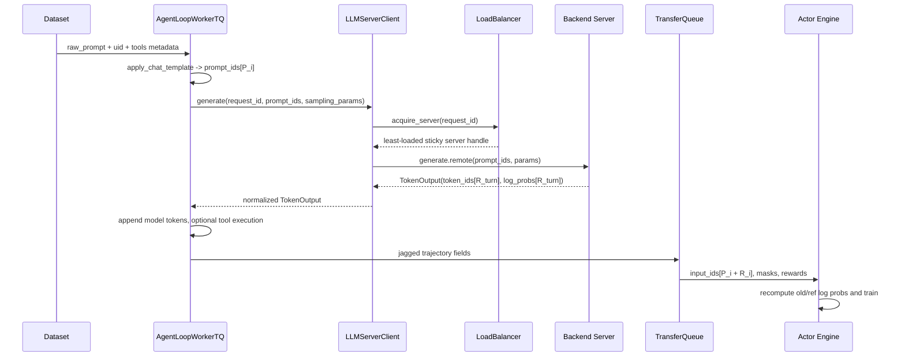
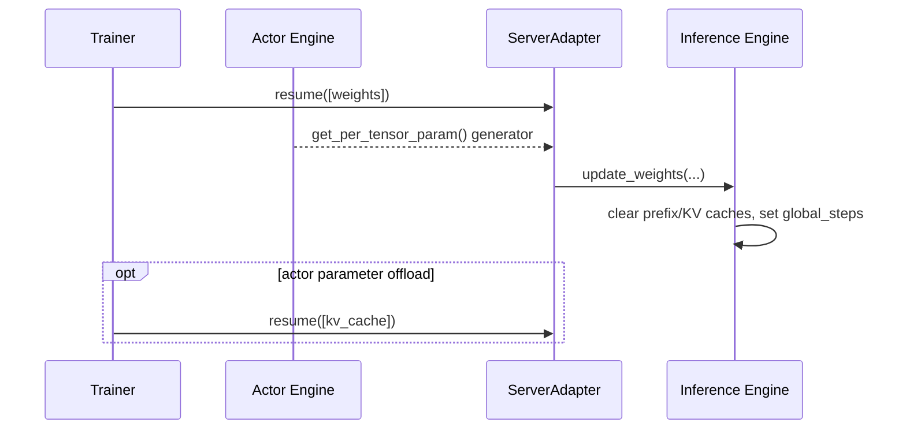

# 07. Rollout、推理后端与权重同步

> 本章基于源码快照 `d33ddd7140f44d392e0e10b48a8902651a1340f4` 的 V1 主路径讲解。这里的“当前”很重要：verl 的 rollout 架构已经从旧的同步 SPMD 接口迁移到原生异步 server 模式。读旧博客时如果看到 `sharding_manager`、同步 `generate_sequences()` 或把 `hf` 当成正式 rollout backend，请先对照本章的“版本边界”。

## 本章目标

学完后，你应该能回答以下问题：

1. actor、rollout engine、server、replica、client 和 load balancer 分别是什么？
2. 一条 prompt 如何变成 token，再如何进入 PPO/GRPO 的训练 batch？
3. vLLM、SGLang、TensorRT-LLM 和 Hugging Face Transformers 在当前代码中的真实边界是什么？
4. 为什么同一个模型要同时有“训练副本”和“推理副本”，更新后又如何同步权重？
5. `rollout_log_probs`、`old_log_probs` 和 `ref_log_prob` 为什么不是同一个东西？
6. hybrid 模式为什么要让推理引擎睡眠、释放 KV cache，再切回训练？

---

## 1. 先建立一个最重要的心智模型

在 RL post-training 中，同一个策略模型承担两种工作：

- **rollout / 采样**：给定 prompt，让模型高速自回归生成 token，必要时调用工具，形成 trajectory。
- **actor training / 策略训练**：对完整 trajectory 做 forward/backward，用 reward、advantage 和 PPO/GRPO loss 更新参数。

这两种工作对系统的要求不同：

| 工作 | 最关心什么 | 典型引擎 |
|---|---|---|
| rollout | token/s、连续批处理、Paged KV cache、prefix cache | vLLM、SGLang、TensorRT-LLM |
| actor training | 梯度、optimizer state、参数分片、反向传播 | FSDP、Megatron、VeOmni、TorchTitan 等训练 engine |

所以 verl 通常不是让一个对象同时做 `model.generate()` 和 `backward()`，而是维护两个逻辑副本：

```text
训练 actor：保存参数分片、梯度、optimizer state；负责更新 θ
推理 rollout：保存适合 decoding 的权重布局和 KV cache；负责用 θ_rollout 生成 token
```

每次 actor 更新后，需要把新参数从 `θ` 同步到 `θ_rollout`。这就是 checkpoint engine / weight sync 子系统存在的原因。

```mermaid
flowchart LR
    D["Dataset / raw_prompt"] --> A["AgentLoopWorkerTQ"]
    A --> C["LLMServerClient"]
    C --> LB["GlobalRequestLoadBalancer"]
    LB --> R0["Rollout Replica 0"]
    LB --> R1["Rollout Replica 1"]
    R0 --> I0["vLLM / SGLang / TRT-LLM"]
    R1 --> I1["vLLM / SGLang / TRT-LLM"]
    I0 --> T["TokenOutput"]
    I1 --> T
    T --> Q["TransferQueue: trajectory"]
    Q --> ACT["Actor forward/backward"]
    ACT --> CE["CheckpointEngineManager"]
    CE --> SA["ServerAdapter"]
    SA --> R0
    SA --> R1
```



源码入口：

- rollout 抽象与正式 backend registry：[`verl/workers/rollout/base.py:L29-L109`](https://github.com/verl-project/verl/blob/d33ddd7140f44d392e0e10b48a8902651a1340f4/verl/workers/rollout/base.py#L29-L109)
- replica 与部署模式：[`verl/workers/rollout/replica.py:L39-L141`](https://github.com/verl-project/verl/blob/d33ddd7140f44d392e0e10b48a8902651a1340f4/verl/workers/rollout/replica.py#L39-L141)
- server manager、client 和负载均衡：[`verl/workers/rollout/llm_server.py:L46-L278`](https://github.com/verl-project/verl/blob/d33ddd7140f44d392e0e10b48a8902651a1340f4/verl/workers/rollout/llm_server.py#L46-L278)
- actor 与 rollout 的组合 worker：[`verl/workers/engine_workers.py:L446-L470`](https://github.com/verl-project/verl/blob/d33ddd7140f44d392e0e10b48a8902651a1340f4/verl/workers/engine_workers.py#L446-L470)
- checkpoint engine 抽象：[`verl/checkpoint_engine/base.py:L49-L205`](https://github.com/verl-project/verl/blob/d33ddd7140f44d392e0e10b48a8902651a1340f4/verl/checkpoint_engine/base.py#L49-L205)

---

## 2. 必要前置知识

### 2.1 自回归生成、logits 和 log probability

假设当前已有 token `x_0, ..., x_t`。语言模型输出下一个 token 的 logits：

$$
z_{t+1}=f_\theta(x_0,\ldots,x_t)
$$

经过 temperature、top-k、top-p 等处理后得到采样分布 `π_rollout`，从中采出 `x_{t+1}`。被选中 token 的 log probability 是：

$$
\log \pi_{rollout}(x_{t+1}\mid x_{\le t})
$$

生成一个长度为 `R` 的 response，就有 `R` 个被采样 token，也应有 `R` 个逐 token log probability。verl 的 backend 返回的核心结构正是：

```python
TokenOutput(
    token_ids=[21, 22, 23],
    log_probs=[-0.31, -0.74, -0.08],
    stop_reason="completed",
    extra_fields={"global_steps": 42},
)
```

真实定义见 [`TokenOutput`](https://github.com/verl-project/verl/blob/d33ddd7140f44d392e0e10b48a8902651a1340f4/verl/workers/rollout/replica.py#L39-L51)。这里的 `global_steps` 表示产生这些 token 时 rollout 权重的版本。

### 2.2 KV cache 是什么

自回归生成第 `t+1` 个 token 时，不需要重新计算前 `t` 个 token 的全部 attention key/value；推理引擎会把它们保存在 **KV cache** 中。它提高生成速度，但会占用大量显存。

需要区分两种 cache：

- **一次请求内部的 KV cache**：让后续 token 复用前缀计算。
- **prefix/radix cache**：让多个请求或多轮对话复用相同 prompt 前缀。

模型权重更新后，旧权重产生的 KV cache 不再可信。因此权重同步流程必须释放或清空相关 cache，而不能只覆盖权重后继续使用旧 cache。

### 2.3 TP、DP、PP 与 replica

一个 rollout replica 是一个可以独立接收请求的推理服务实例。普通情况下，一个 replica 占用的 worker/GPU 数为：

$$
world\_size_{replica}=TP\times DP\times PP
$$

计算发生在 [`RolloutReplica.__init__`](https://github.com/verl-project/verl/blob/d33ddd7140f44d392e0e10b48a8902651a1340f4/verl/workers/rollout/replica.py#L93-L117)。server manager 再用总 GPU 数除以每个 replica 的 footprint，得到 replica 数量，见 [`LLMServerManager._initialize_llm_servers`](https://github.com/verl-project/verl/blob/d33ddd7140f44d392e0e10b48a8902651a1340f4/verl/workers/rollout/llm_server.py#L499-L558)。

例如有 8 张 GPU，`TP=2, DP=1, PP=1`：

```text
每个 replica 占 2 张 GPU
8 / 2 = 4 个 replica
负载均衡器可以把不同 trajectory 分发到 4 个 replica
```

当前内置 rollout backend 虽然保留了 `pipeline_model_parallel_size` 字段，但 vLLM、SGLang、TRT-LLM 都会拒绝 `PP > 1`，见 [`RolloutConfig.__post_init__`](https://github.com/verl-project/verl/blob/d33ddd7140f44d392e0e10b48a8902651a1340f4/verl/workers/config/rollout.py#L317-L321)。所以当前常见公式实际上是 `TP × DP`。

如果启用 prefill/decode disaggregation，footprint 会变成：

$$
(TP_{prefill}\times N_{prefill}+TP_{decode}\times N_{decode})\times DP\times PP
$$

当前只有 vLLM 和 SGLang 支持该路径，见 [`get_rollout_replica_class`](https://github.com/verl-project/verl/blob/d33ddd7140f44d392e0e10b48a8902651a1340f4/verl/workers/rollout/replica.py#L383-L408) 与配置校验 [`rollout.py:L339-L342`](https://github.com/verl-project/verl/blob/d33ddd7140f44d392e0e10b48a8902651a1340f4/verl/workers/config/rollout.py#L339-L342)。

---

## 3. 六个容易混淆的对象

### 3.1 `BaseRollout`：训练侧控制推理引擎的最小接口

[`BaseRollout`](https://github.com/verl-project/verl/blob/d33ddd7140f44d392e0e10b48a8902651a1340f4/verl/workers/rollout/base.py#L29-L85) 只有三个关键异步控制动作：

```python
await rollout.resume(tags=["weights"])
await rollout.update_weights(named_tensor_generator)
await rollout.release()
```

它不等于“真正执行 token decoding 的模型”。当前实现通常是一个 **ServerAdapter**：它负责找到 backend server，并向它发送恢复内存、释放内存、更新权重等控制请求。

`generate_sequences()` 仍留在基类中作为旧同步接口，但当前正式 server adapter 不使用它。

### 3.2 server：实际托管推理 backend 的 Ray actor

vLLM、SGLang、TRT-LLM 都会启动 Ray server actor，并在其内部启动对应推理引擎。多节点 replica 通常每个节点有一个 server actor，node-rank 0 暴露主地址和 token-in/token-out handle。

- vLLM server 启动：[`vllm_async_server.py:L1102-L1198`](https://github.com/verl-project/verl/blob/d33ddd7140f44d392e0e10b48a8902651a1340f4/verl/workers/rollout/vllm_rollout/vllm_async_server.py#L1102-L1198)
- SGLang server 启动：[`async_sglang_server.py:L744-L856`](https://github.com/verl-project/verl/blob/d33ddd7140f44d392e0e10b48a8902651a1340f4/verl/workers/rollout/sglang_rollout/async_sglang_server.py#L744-L856)
- TRT-LLM 的 replica 到 server 是 1:1：[`trtllm_async_server.py:L570-L631`](https://github.com/verl-project/verl/blob/d33ddd7140f44d392e0e10b48a8902651a1340f4/verl/workers/rollout/trtllm_rollout/trtllm_async_server.py#L570-L631)

### 3.3 replica：一组共同完成一次推理的 workers + servers

`RolloutReplica` 负责：

- 选择并占用 GPU workers；
- 在这些 workers 所在节点启动 server；
- 对整组 server 执行 `sleep`、`wake_up`、`abort_all_requests`、`clear_kv_cache`；
- 对外提供主 server handle/address。

公共控制方法见 [`replica.py:L228-L291`](https://github.com/verl-project/verl/blob/d33ddd7140f44d392e0e10b48a8902651a1340f4/verl/workers/rollout/replica.py#L228-L291)。

### 3.4 `LLMServerManager`：创建很多 replica

`LLMServerManager` 计算每个 replica 的 GPU footprint、创建全部 replica、启动全局 load balancer，并提供 client，见 [`llm_server.py:L453-L608`](https://github.com/verl-project/verl/blob/d33ddd7140f44d392e0e10b48a8902651a1340f4/verl/workers/rollout/llm_server.py#L453-L608)。

### 3.5 `GlobalRequestLoadBalancer`：选哪一个 replica

负载均衡规则不是简单 round-robin，而是：

1. 同一个高层 `request_id` 优先粘到之前的 server，便于多轮对话复用 prefix cache。
2. 新 request 选择当前 in-flight 请求最少的 server。
3. server 动态移除后，旧 sticky mapping 会失效并重新选择。

实现见 [`GlobalRequestLoadBalancer`](https://github.com/verl-project/verl/blob/d33ddd7140f44d392e0e10b48a8902651a1340f4/verl/workers/rollout/llm_server.py#L46-L191)。注意 client 用高层 `request_id` 做 sticky routing，但发送给 backend 的每一轮实际请求会换成新的 UUID，见 [`LLMServerClient.generate`](https://github.com/verl-project/verl/blob/d33ddd7140f44d392e0e10b48a8902651a1340f4/verl/workers/rollout/llm_server.py#L228-L278)。

### 3.6 `LLMServerClient`：AgentLoop 看到的统一 token API

AgentLoop 不直接 import vLLM/SGLang API。它调用统一接口：

```python
output = await client.generate(
    request_id=trajectory_id,
    prompt_ids=[...],
    sampling_params={...},
)
```

client 选择 server，再通过 Ray actor RPC 调用 `server.generate`，最后返回统一 `TokenOutput`。这使 ToolAgentLoop 不需要知道底层是 vLLM 还是 SGLang。

`FullyAsyncLLMServerClient` 还支持 partial rollout：如果训练切换导致请求被 abort，它会把已经生成的 token 追加到 prompt，再继续生成，并缩减剩余 token budget。整个 trajectory 可能跨越多个权重版本，因此同时记录 `min_global_steps` 和 `max_global_steps`，见 [`llm_server.py:L281-L450`](https://github.com/verl-project/verl/blob/d33ddd7140f44d392e0e10b48a8902651a1340f4/verl/workers/rollout/llm_server.py#L281-L450)。

---

## 4. 当前真实可用的 rollout backend

不要仅相信 YAML 注释；运行时 registry 才是 source of truth。当前 [`_ROLLOUT_REGISTRY`](https://github.com/verl-project/verl/blob/d33ddd7140f44d392e0e10b48a8902651a1340f4/verl/workers/rollout/base.py#L88-L109) 只有：

| `rollout.name` | 当前正式模式 | 主要特点 |
|---|---|---|
| `vllm` | `async` | 高吞吐 decoding、prefix cache、vLLM sleep mode、可做 PD disaggregation |
| `sglang` | `async` | radix/prefix cache、真实的分标签显存释放、可做 PD disaggregation、支持 `delta_sharded` 应用路径 |
| `trtllm` | `async` | TensorRT-LLM backend、独立的 sampler/logprob 映射、当前无 PD 路径 |

replica registry 也只注册这三个名字，见 [`replica.py:L320-L408`](https://github.com/verl-project/verl/blob/d33ddd7140f44d392e0e10b48a8902651a1340f4/verl/workers/rollout/replica.py#L320-L408)。

### 4.1 `mode=sync` 已删除

`RolloutConfig.mode` 的默认值虽然仍是字符串 `async`，但设置为 `sync` 会直接抛错，见 [`rollout.py:L276-L290`](https://github.com/verl-project/verl/blob/d33ddd7140f44d392e0e10b48a8902651a1340f4/verl/workers/config/rollout.py#L276-L290)。vLLM ServerAdapter 的 `generate_sequences()` 也明确说明旧 SPMD 同步生成已经退役，见 [`vllm_rollout.py:L252-L267`](https://github.com/verl-project/verl/blob/d33ddd7140f44d392e0e10b48a8902651a1340f4/verl/workers/rollout/vllm_rollout/vllm_rollout.py#L252-L267)。

这里要区分：

- `rollout.mode=async`：推理 API 采用异步 server 模式。
- `trainer.v1.trainer_mode=sync`：PPO 训练步骤之间是否同步推进。

两者不是一回事。默认配置正是“异步 rollout server + 同步 PPO trainer”，见 [`ppo_trainer.yaml:L221-L231`](https://github.com/verl-project/verl/blob/d33ddd7140f44d392e0e10b48a8902651a1340f4/verl/trainer/config/ppo_trainer.yaml#L221-L231)。

### 4.2 Transformers 到底还算不算 rollout backend

当前答案是：**Hugging Face Transformers 仍是模型、tokenizer、chat template 和部分训练实现的重要基础，但 `hf` 不是当前 V1 registry 中的一等 rollout backend。**

仓库仍导出 [`HFRollout`](https://github.com/verl-project/verl/blob/d33ddd7140f44d392e0e10b48a8902651a1340f4/verl/workers/rollout/__init__.py#L15-L20)，它直接调用 `module.generate()`，也仍有测试；但：

- 它不在 `_ROLLOUT_REGISTRY` 中，不能走当前 `get_rollout_class(name, mode)` 正式路径。
- 文件自己标记了待重构，并说明 FSDP HybridShard 下可能 hang，见 [`hf_rollout.py:L14-L18`](https://github.com/verl-project/verl/blob/d33ddd7140f44d392e0e10b48a8902651a1340f4/verl/workers/rollout/hf_rollout.py#L14-L18)。
- 它采用旧的 dense `DataProto` + 同步 `generate_sequences()` 接口，见 [`hf_rollout.py:L39-L51`](https://github.com/verl-project/verl/blob/d33ddd7140f44d392e0e10b48a8902651a1340f4/verl/workers/rollout/hf_rollout.py#L39-L51)。

`NaiveRollout` 也类似：源码存在，但不在当前正式 registry。阅读旧教程时，应把这些类当作 legacy/test/reference implementation，而不是 V1 生产主路径。

> 配置文件 [`rollout.yaml:L4`](https://github.com/verl-project/verl/blob/d33ddd7140f44d392e0e10b48a8902651a1340f4/verl/trainer/config/rollout/rollout.yaml#L4) 的注释仍列出了 `hf`。这是注释与当前 registry 不一致的例子，判断真实支持边界应以 Python registry 和配置校验为准。

---

## 5. 三种部署含义，以及两个名字相似的 “colocate”

[`RolloutMode`](https://github.com/verl-project/verl/blob/d33ddd7140f44d392e0e10b48a8902651a1340f4/verl/workers/rollout/replica.py#L54-L67) 定义了 replica 的资源布局：

| `RolloutMode` | 训练与推理的关系 | 是否共享 GPU | 典型用途 |
|---|---|---:|---|
| `HYBRID` | training engine 与 rollout engine 融合在同一组 worker/process 资源中，按阶段切换 | 是 | 常见 on-policy RL |
| `COLOCATED` | 不同进程，但放在同一个 Ray placement group/GPU 上 | 是 | 例如 LLM-as-judge 等角色共置 |
| `STANDALONE` | rollout 独占单独 GPU resource pool | 否 | 异步/解耦训练 |

初始化分别在 [`init_hybrid`](https://github.com/verl-project/verl/blob/d33ddd7140f44d392e0e10b48a8902651a1340f4/verl/workers/rollout/replica.py#L131-L157)、[`init_colocated`](https://github.com/verl-project/verl/blob/d33ddd7140f44d392e0e10b48a8902651a1340f4/verl/workers/rollout/replica.py#L159-L187) 和 [`init_standalone`](https://github.com/verl-project/verl/blob/d33ddd7140f44d392e0e10b48a8902651a1340f4/verl/workers/rollout/replica.py#L189-L226)。

一个很容易踩的坑是：`trainer_mode=colocate_async` 并不等于 `RolloutMode.COLOCATED`。V1 base trainer 把 actor worker group 传给 `LLMServerManager`，后者对 vLLM/SGLang 调用 `init_hybrid`，见 [`trainer_base.py:L350-L353`](https://github.com/verl-project/verl/blob/d33ddd7140f44d392e0e10b48a8902651a1340f4/verl/trainer/ppo/v1/trainer_base.py#L350-L353) 和 [`llm_server.py:L547-L558`](https://github.com/verl-project/verl/blob/d33ddd7140f44d392e0e10b48a8902651a1340f4/verl/workers/rollout/llm_server.py#L547-L558)。`colocate_async` 的意思是“trainer 与 rollout 共用 GPU，但允许 partial rollout”，其 replica 仍是 hybrid 资源布局。

---

## 6. 一条 prompt 的完整 token 生命周期



### 6.1 Dataset 不再提前 tokenize rollout prompt

当前 RL dataset 的 `__getitem__` 主要返回 `raw_prompt` message list；chat template 被移到 AgentLoop 中。它只保留一个临时 dummy tensor 兼容旧 `DataProto`，见 [`rl_dataset.py:L386-L411`](https://github.com/verl-project/verl/blob/d33ddd7140f44d392e0e10b48a8902651a1340f4/verl/utils/dataset/rl_dataset.py#L386-L411)。

V1 trainer 为每个 prompt 分配唯一 `uid`，把 prompt 状态注册进 TransferQueue，然后 fire-and-forget 地交给 AgentLoop，见 [`trainer_base.py:L1315-L1361`](https://github.com/verl-project/verl/blob/d33ddd7140f44d392e0e10b48a8902651a1340f4/verl/trainer/ppo/v1/trainer_base.py#L1315-L1361)。

### 6.2 `n` 不是 backend 一次返回 n 个 completion

在当前 TQ AgentLoop 中，`rollout.n` 会为同一 prompt 启动 `n` 个独立 session/task：

```python
for session_id in range(n):
    create_task(run_agent_loop(..., session_id=session_id))
```

具体实现在 [`AgentLoopWorkerTQ._run_prompt`](https://github.com/verl-project/verl/blob/d33ddd7140f44d392e0e10b48a8902651a1340f4/verl/trainer/ppo/v1/agent_loop_tq.py#L107-L148)。所以 GRPO 的多条回答在系统里是多条独立 trajectory，而不是依赖 backend 的 `num_return_sequences=n`。

### 6.3 sampling 参数如何一路传到底层

TQ AgentLoop 创建的核心请求参数是：

```python
sampling_params = {
    "temperature": config.temperature,
    "top_p": config.top_p,
    "top_k": config.top_k,
    "repetition_penalty": 1.0,
    "logprobs": config.calculate_log_probs,
}
```

源码见 [`agent_loop_tq.py:L59-L76`](https://github.com/verl-project/verl/blob/d33ddd7140f44d392e0e10b48a8902651a1340f4/verl/trainer/ppo/v1/agent_loop_tq.py#L59-L76)。几点细节：

- 当前这个路径固定传 `repetition_penalty=1.0`；它不是从 `RolloutConfig.repetition_penalty` 读取的。
- per-sample `__do_sample__=False` 会被编码成 `temperature=0, top_p=1, top_k=-1`，而不是把布尔 `do_sample` 传给 backend，见 [`agent_loop_tq.py:L107-L126`](https://github.com/verl-project/verl/blob/d33ddd7140f44d392e0e10b48a8902651a1340f4/verl/trainer/ppo/v1/agent_loop_tq.py#L107-L126)。
- validation 会用 `val_kwargs` 覆盖 temperature/top-p/top-k。
- 每个 backend 再把统一字典翻译为自己的 API。

backend 翻译边界：

| backend | token budget | 请求 logprob 的方式 | 返回 |
|---|---|---|---|
| vLLM | `max_tokens`，同时受剩余 context 与 `response_length` 限制 | 布尔值转为 `logprobs=0`，只要 sampled-token logprob | 对每个生成 token 取其 logprob |
| SGLang | `max_new_tokens`，同样限制 context | `return_logprob=True` | 校验 output ids 与 logprob 长度一致 |
| TRT-LLM | `max_tokens` | TorchSampler 用 `0`，TRTLLMSampler 用 `1` | 每个位置取被采 token 的 logprob |

对应源码：

- vLLM：[`vllm_async_server.py:L511-L587`](https://github.com/verl-project/verl/blob/d33ddd7140f44d392e0e10b48a8902651a1340f4/verl/workers/rollout/vllm_rollout/vllm_async_server.py#L511-L587)、[`L624-L696`](https://github.com/verl-project/verl/blob/d33ddd7140f44d392e0e10b48a8902651a1340f4/verl/workers/rollout/vllm_rollout/vllm_async_server.py#L624-L696)
- SGLang：[`async_sglang_server.py:L526-L628`](https://github.com/verl-project/verl/blob/d33ddd7140f44d392e0e10b48a8902651a1340f4/verl/workers/rollout/sglang_rollout/async_sglang_server.py#L526-L628)、[`L634-L702`](https://github.com/verl-project/verl/blob/d33ddd7140f44d392e0e10b48a8902651a1340f4/verl/workers/rollout/sglang_rollout/async_sglang_server.py#L634-L702)
- TRT-LLM：[`trtllm_async_server.py:L321-L390`](https://github.com/verl-project/verl/blob/d33ddd7140f44d392e0e10b48a8902651a1340f4/verl/workers/rollout/trtllm_rollout/trtllm_async_server.py#L321-L390)

### 6.4 ToolAgentLoop 如何把工具观察插进 token stream

`AgentLoopOutput.response_ids` 不只包含模型生成 token，还包含工具 response/observation token。`response_mask` 用于区分来源：

```text
response_ids:       [模型A, 模型B, 工具X, 工具Y, 模型C]
response_mask:      [  1,     1,     0,     0,     1  ]
rollout_log_probs:  [lpA,   lpB,   0.0,   0.0,   lpC ]
```

模型 token 被追加 mask `1` 和 backend logprob，见 [`tool_agent_loop.py:L262-L280`](https://github.com/verl-project/verl/blob/d33ddd7140f44d392e0e10b48a8902651a1340f4/verl/experimental/agent_loop/tool_agent_loop.py#L262-L280)；工具 response token 被追加 mask `0` 和 logprob `0.0`，见 [`tool_agent_loop.py:L433-L449`](https://github.com/verl-project/verl/blob/d33ddd7140f44d392e0e10b48a8902651a1340f4/verl/experimental/agent_loop/tool_agent_loop.py#L433-L449)。结束时再按 `response_mask` 的长度把初始 prompt 与完整 response 切开，见 [`tool_agent_loop.py:L176-L204`](https://github.com/verl-project/verl/blob/d33ddd7140f44d392e0e10b48a8902651a1340f4/verl/experimental/agent_loop/tool_agent_loop.py#L176-L204)。

这里的 `response_mask` 后续就是 loss mask 的基础：工具输出提供上下文，但不应该被当作 actor 自己采取的 action 来优化。

---

## 7. 数据 shape、padding 与 jagged tensor

令 batch size 为 `B`，第 `i` 条样本的 prompt/response 真正长度为 `P_i` 和 `R_i`。

### 7.1 当前 V1 TQ 主路径：每条 trajectory 先保持无 padding

AgentLoop postprocess 为每条 trajectory 产生：

| 字段 | 单样本 shape | 含义 |
|---|---:|---|
| `prompts` | `[P_i]` | 初始 prompt token |
| `responses` | `[R_i]` | 模型 token + 工具观察 token |
| `input_ids` | `[P_i + R_i]` | 两者拼接 |
| `position_ids` | `[P_i + R_i]`，VLM 可有额外前缀维 | token 位置 |
| `response_mask` | `[R_i]` | 模型 token 为 1，工具 token 为 0 |
| `loss_mask` | `[R_i]` | 当前直接复制 `response_mask` |
| `rollout_log_probs` | `[R_i]`，可选 | backend 采样时的逐 token logprob |

实现见 [`agent_loop_tq.py:L150-L227`](https://github.com/verl-project/verl/blob/d33ddd7140f44d392e0e10b48a8902651a1340f4/verl/trainer/ppo/v1/agent_loop_tq.py#L150-L227)。代码会临时构造全 1 的 attention mask 来算 position ids，但普通文本 trajectory 不需要保存全局 padded attention mask。

同一 batch 中长度不同的 tensor 会由 `list_of_dict_to_tensordict` 自动变成 jagged nested tensor；长度相同才 `torch.stack`，见 [`tensordict_utils.py:L918-L950`](https://github.com/verl-project/verl/blob/d33ddd7140f44d392e0e10b48a8902651a1340f4/verl/utils/tensordict_utils.py#L918-L950)。因此 batch 逻辑 shape 是：

```text
input_ids:      NestedTensor[B, j_i]，其中 j_i = P_i + R_i
response_mask:  NestedTensor[B, R_i]
```

而不是先强行补成 `[B, P_max + R_max]`。

### 7.2 一个具体例子

假设：

```text
prompt_ids  = [11, 12, 13]
response_ids = [21, 22, 31, 32, 23]
```

其中 `21,22,23` 是模型生成，`31,32` 是工具观察。存进 TQ 的字段为：

```text
prompts           [11, 12, 13]                    shape [3]
responses         [21, 22, 31, 32, 23]            shape [5]
input_ids         [11, 12, 13, 21, 22, 31, 32, 23] shape [8]
response_mask     [ 1,  1,  0,  0,  1]            shape [5]
loss_mask         [ 1,  1,  0,  0,  1]            shape [5]
rollout_log_probs [a,  b, 0., 0.,  c]              shape [5]
```

注意：工具 token 仍在 `input_ids` 里，因为后续模型生成要以工具结果为条件；只是 loss 被 mask 掉。

### 7.3 actor forward 时如何处理 variable length

FSDP Transformer 实现默认读取 nested `input_ids`：

- `use_remove_padding=True`：取 `input_ids.values()`，把全 batch 的有效 token 打包成 `[1, total_nnz]`；必要时再为 sequence parallel 做少量尾部 padding。
- `use_remove_padding=False`：临时转成 `[B, max_i(P_i+R_i)]` 的右 padding tensor，并构造 attention mask。

源码见 [`transformer_impl.py:L1128-L1243`](https://github.com/verl-project/verl/blob/d33ddd7140f44d392e0e10b48a8902651a1340f4/verl/workers/engine/fsdp/transformer_impl.py#L1128-L1243) 和 [`L1245-L1280`](https://github.com/verl-project/verl/blob/d33ddd7140f44d392e0e10b48a8902651a1340f4/verl/workers/engine/fsdp/transformer_impl.py#L1245-L1280)。

### 7.4 为什么 response logprob 的切片要左移一位

模型在位置 `t` 的 logits 预测位置 `t+1` 的 token。因此 full-sequence forward 得到的 logprob 逻辑长度是 `[P_i+R_i]`，但第一枚 response token 的概率位于最后一枚 prompt token 的输出位置。

verl 对第 `i` 条序列使用近似如下的切片：

```python
full_seq_log_probs[seq_end - R_i - 1 : seq_end - 1]
```

得到 shape `[R_i]`。实现见 [`response_from_nested`](https://github.com/verl-project/verl/blob/d33ddd7140f44d392e0e10b48a8902651a1340f4/verl/workers/utils/padding.py#L196-L212)。这不是 off-by-one bug，而是 causal LM 的 next-token shift。

### 7.5 旧 dense 路径长什么样

旧的非 TQ/dense postprocess 仍有助于理解传统 shape：

```text
prompts:        [B, P]      左 padding
responses:      [B, R]      右 padding
input_ids:      [B, P+R]
attention_mask: [B, P+R]
response_mask:  [B, R]
position_ids:   [B, P+R]
```

定义和多轮 mask 示例见 [`agent_loop.py:L581-L600`](https://github.com/verl-project/verl/blob/d33ddd7140f44d392e0e10b48a8902651a1340f4/verl/experimental/agent_loop/agent_loop.py#L581-L600)，具体左右 padding 见 [`agent_loop.py:L741-L795`](https://github.com/verl-project/verl/blob/d33ddd7140f44d392e0e10b48a8902651a1340f4/verl/experimental/agent_loop/agent_loop.py#L741-L795)。`HFRollout` 也是这种 dense 风格，见 [`hf_rollout.py:L96-L170`](https://github.com/verl-project/verl/blob/d33ddd7140f44d392e0e10b48a8902651a1340f4/verl/workers/rollout/hf_rollout.py#L96-L170)。

### 7.6 batch size 不可整除时的“样本 padding”

除了 token padding，还有另一种完全不同的 padding：为了让 trajectory 数能被 DP size 和 mini-batch size 整除，V1 trainer 可能追加 synthetic no-op sample。

这个样本只有：

```text
prompt  = [EOS]
response = [EOS]
input_ids shape = [2]
response_mask = [0]
reward/logprob = 0
tag.is_padding = true
```

实现见 [`padding_utils.py:L70-L124`](https://github.com/verl-project/verl/blob/d33ddd7140f44d392e0e10b48a8902651a1340f4/verl/trainer/ppo/padding_utils.py#L70-L124) 与 [`upsample_batch_to_divisible_size`](https://github.com/verl-project/verl/blob/d33ddd7140f44d392e0e10b48a8902651a1340f4/verl/trainer/ppo/padding_utils.py#L127-L198)。它解决的是“样本数整除”，不是“token 长度对齐”；不要把两者混为一谈。

---

## 8. 三种 log probability 的生命周期

### 8.1 `rollout_log_probs`

它来自 vLLM/SGLang/TRT-LLM 实际采样时的分布，shape 为每条 trajectory 的 `[R_i]`。工具观察位置补 `0.0`，并由 `response_mask=0` 屏蔽。

若 `calculate_log_probs=False`，backend 不必返回它。当前默认 YAML 为 `True`，见 [`rollout.yaml:L231-L233`](https://github.com/verl-project/verl/blob/d33ddd7140f44d392e0e10b48a8902651a1340f4/verl/trainer/config/rollout/rollout.yaml#L231-L233)；dataclass 自身的默认值则是 `False`，见 [`rollout.py:L208-L220`](https://github.com/verl-project/verl/blob/d33ddd7140f44d392e0e10b48a8902651a1340f4/verl/workers/config/rollout.py#L208-L220)，最终以 Hydra 合成后的运行配置为准。

### 8.2 `old_log_probs`

PPO 的 proximal anchor 通常不是直接信任 backend 返回值，而是让训练 actor 对同一条 `input_ids` 再 forward 一次，重新计算 logprob。当前 trainer 流程：

1. actor engine 生成 full-sequence `log_probs`；
2. `response_from_nested` 切出 `[R_i]`；
3. 写回 `old_log_probs`；
4. 若有 `rollout_log_probs`，计算二者差异用于 debug/rollout correction。

源码见 [`trainer_base.py:L1479-L1538`](https://github.com/verl-project/verl/blob/d33ddd7140f44d392e0e10b48a8902651a1340f4/verl/trainer/ppo/v1/trainer_base.py#L1479-L1538)。只有 rollout-correction 的 bypass mode 会直接做：

```python
old_log_probs = rollout_log_probs
```

### 8.3 `ref_log_prob`

这是固定 reference policy 对相同 action token 的 logprob，用于 KL penalty。它同样通过训练/ref engine forward，再切成 `[R_i]`，见 [`trainer_base.py:L1540-L1564`](https://github.com/verl-project/verl/blob/d33ddd7140f44d392e0e10b48a8902651a1340f4/verl/trainer/ppo/v1/trainer_base.py#L1540-L1564)。

三者可以概括为：

| 字段 | 哪个模型算 | 什么时候算 | 主要用途 |
|---|---|---|---|
| `rollout_log_probs` | 推理 backend 中的 `π_rollout` | token 被采样时 | 记录 behavior policy、校正与 debug |
| `old_log_probs` | 训练 actor 中的 `π_old` | PPO update 前 | importance ratio 的分母/proximal anchor |
| `ref_log_prob` | 固定 reference policy | PPO update 前 | KL regularization |

即使权重名义上相同，也不要假设 `rollout_log_probs == old_log_probs`。推理 backend 和训练 engine 可能使用不同 kernel、dtype、logits 处理与并行布局。vLLM 的 `logprobs_mode` 默认还是 `processed_logprobs`，见 [`RolloutConfig`](https://github.com/verl-project/verl/blob/d33ddd7140f44d392e0e10b48a8902651a1340f4/verl/workers/config/rollout.py#L196-L212)。

完整 trainer step 的顺序是：sample → reward → balance → old logprob → ref logprob → value → advantage → critic update → actor update，见 [`trainer_base.py:L536-L586`](https://github.com/verl-project/verl/blob/d33ddd7140f44d392e0e10b48a8902651a1340f4/verl/trainer/ppo/v1/trainer_base.py#L536-L586)。

---

## 9. 当前代码中的“sharding manager”去了哪里

旧资料经常把训练/推理之间的上下文切换统称为 sharding manager。当前 V1 主路径并没有一个统一的 `sharding_manager` 类；原来的职责被拆成三层：

1. **训练 `BaseEngine`**：维护 FSDP/Megatron 等训练分片，并导出参数流。
2. **`CheckpointEngine` / `CheckpointEngineManager`**：建立传输拓扑，发送/接收权重。
3. **backend `ServerAdapter`**：把收到的 tensor 按 backend 能理解的方式加载，并管理 weight/KV cache 显存。

训练 engine 的标准导出接口是：

```python
generator, peft_config = engine.get_per_tensor_param()
# generator yields: (parameter_name, tensor)
```

此外还提供 local shard 和 delta shard 导出接口，见 [`BaseEngine`](https://github.com/verl-project/verl/blob/d33ddd7140f44d392e0e10b48a8902651a1340f4/verl/workers/engine/base.py#L151-L227)。

---

## 10. 权重同步：从 actor shard 到 inference layout

### 10.1 CheckpointEngine 的抽象

[`CheckpointEngine`](https://github.com/verl-project/verl/blob/d33ddd7140f44d392e0e10b48a8902651a1340f4/verl/checkpoint_engine/base.py#L96-L205) 把同步拆成：

```text
prepare
  -> build_topology
  -> init_process_group
  -> actor.send_weights(...) || rollout.receive_weights(...)
  -> finalize
```

默认 wire format 是一串完整 `(name, tensor)`，名为 `named_tensors`。`delta_sharded` 使用特殊 `delta_flush` wire format；当前只有 SGLang adapter 能消费它，限制写在 [`CheckpointEngineWorker`](https://github.com/verl-project/verl/blob/d33ddd7140f44d392e0e10b48a8902651a1340f4/verl/checkpoint_engine/base.py#L283-L341)。

### 10.2 同 GPU 的 `naive` 路径

`naive` 不是“低质量算法”，而是“actor 与 rollout 共置时，不需要跨节点传输 backend”的意思。`ColocatedCheckpointEngine` 只是暂存 generator 再交给 receiver，见 [`base.py:L225-L280`](https://github.com/verl-project/verl/blob/d33ddd7140f44d392e0e10b48a8902651a1340f4/verl/checkpoint_engine/base.py#L225-L280)。

actor worker 的实际顺序见 [`engine_workers.py:L719-L805`](https://github.com/verl-project/verl/blob/d33ddd7140f44d392e0e10b48a8902651a1340f4/verl/workers/engine_workers.py#L719-L805)：



V1 base trainer 会把 hybrid checkpoint manager 强制设置为 `naive`，见 [`trainer_base.py:L355-L362`](https://github.com/verl-project/verl/blob/d33ddd7140f44d392e0e10b48a8902651a1340f4/verl/trainer/ppo/v1/trainer_base.py#L355-L362)。

backend 仍需完成最后一跳：

- vLLM adapter 把 tensor 分 bucket，经 CUDA IPC 发送；不支持 IPC 时退回 shared memory，并在更新后清 cache/版本，见 [`vllm_rollout.py:L208-L246`](https://github.com/verl-project/verl/blob/d33ddd7140f44d392e0e10b48a8902651a1340f4/verl/workers/rollout/vllm_rollout/vllm_rollout.py#L208-L246)。
- SGLang adapter 分 bucket、跨 TP gather/序列化，再调用 SGLang weight update；更新后 flush cache，见 [`sglang_rollout.py:L291-L370`](https://github.com/verl-project/verl/blob/d33ddd7140f44d392e0e10b48a8902651a1340f4/verl/workers/rollout/sglang_rollout/sglang_rollout.py#L291-L370)。
- TRT-LLM 有自己的 ServerAdapter 和 CUDA IPC weight loader，见 [`trtllm_rollout.py:L268-L544`](https://github.com/verl-project/verl/blob/d33ddd7140f44d392e0e10b48a8902651a1340f4/verl/workers/rollout/trtllm_rollout/trtllm_rollout.py#L268-L544)。

### 10.3 独立 GPU 的 checkpoint-engine 路径

当 rollout 是 `STANDALONE`，actor 和 rollout 不共享进程/GPU，不能直接把 generator 交给同 GPU adapter。`CheckpointEngineManager.update_weights()` 的真实状态机是：

1. abort 未完成请求；已经产出的 partial tokens 由 FullyAsync client 保留，稍后用于重试；
2. 汇总所有 rollout `CheckpointEngineWorker`；
3. 只释放 KV cache，保留现有 weight buffer；
4. 为 actor 与 rollout workers 建通信拓扑；
5. actor `send_weights` 与 rollout `receive_weights + ServerAdapter.update_weights` 并发执行；
6. finalize，释放传输 bucket/process group；
7. 恢复 KV cache；
8. 继续 partial rollout。

实现见 [`CheckpointEngineManager.update_weights`](https://github.com/verl-project/verl/blob/d33ddd7140f44d392e0e10b48a8902651a1340f4/verl/checkpoint_engine/base.py#L485-L538)。拓扑中训练侧 checkpoint engine 与 rollout 侧 checkpoint worker 的关系，可直接看源码内图示 [`base.py:L361-L382`](https://github.com/verl-project/verl/blob/d33ddd7140f44d392e0e10b48a8902651a1340f4/verl/checkpoint_engine/base.py#L361-L382)。

### 10.4 当前注册的 checkpoint engine 名称

这些 backend 是条件 import 的；环境没有相应依赖时不一定可用，见 [`checkpoint_engine/__init__.py:L33-L73`](https://github.com/verl-project/verl/blob/d33ddd7140f44d392e0e10b48a8902651a1340f4/verl/checkpoint_engine/__init__.py#L33-L73)。当前代码实际注册键包括：

| registry key | 实现文件 | 说明 |
|---|---|---|
| `naive` | [`base.py:L225`](https://github.com/verl-project/verl/blob/d33ddd7140f44d392e0e10b48a8902651a1340f4/verl/checkpoint_engine/base.py#L225) | 同 GPU/共置直接同步 |
| `nccl` | [`nccl_checkpoint_engine.py:L103`](https://github.com/verl-project/verl/blob/d33ddd7140f44d392e0e10b48a8902651a1340f4/verl/checkpoint_engine/nccl_checkpoint_engine.py#L103) | CUDA/NCCL 传输 |
| `nixl` | [`nixl_checkpoint_engine.py:L238`](https://github.com/verl-project/verl/blob/d33ddd7140f44d392e0e10b48a8902651a1340f4/verl/checkpoint_engine/nixl_checkpoint_engine.py#L238) | NIXL 传输 |
| `mooncake` | [`mooncake_checkpoint_engine.py:L38`](https://github.com/verl-project/verl/blob/d33ddd7140f44d392e0e10b48a8902651a1340f4/verl/checkpoint_engine/mooncake_checkpoint_engine.py#L38) | Mooncake backend |
| `kimi_ckpt_engine` | [`kimi_checkpoint_engine.py:L222`](https://github.com/verl-project/verl/blob/d33ddd7140f44d392e0e10b48a8902651a1340f4/verl/checkpoint_engine/kimi_checkpoint_engine.py#L222) | Kimi checkpoint engine |
| `delta_sharded` | [`delta_checkpoint_engine.py:L218`](https://github.com/verl-project/verl/blob/d33ddd7140f44d392e0e10b48a8902651a1340f4/verl/checkpoint_engine/delta_checkpoint_engine.py#L218) | shard-local diff；当前仅 SGLang apply |

Ascend 的 HCCL 实现当前也注册到键 `nccl`，见 [`hccl_checkpoint_engine.py:L106`](https://github.com/verl-project/verl/blob/d33ddd7140f44d392e0e10b48a8902651a1340f4/verl/checkpoint_engine/hccl_checkpoint_engine.py#L106)。因此不要根据 YAML 中“`hccl` backend”注释自行假设 registry key；应在目标环境检查实际 registry。

---

## 11. sleep、wake、abort 与 cache：四个动作不要混用

| 动作 | 影响新请求 | 处理进行中的请求 | 权重显存 | KV cache |
|---|---|---|---|---|
| `abort_all_requests` | backend 暂停/阻止继续生成 | 中止并让 FullyAsync client 可重试 | 保留 | backend 相关 |
| `sleep` / `release` | 推理阶段暂停 | 通常先 drain/abort | 可释放 | 可释放 |
| `release_kv_cache` | 用于 weight sync 临界区 | 应先 abort | 保留 | 释放 |
| `clear_kv_cache` | 不一定暂停 | 不负责保存 partial request | 保留 | 失效/清空 prefix cache |

公共控制面见 [`RolloutReplica`](https://github.com/verl-project/verl/blob/d33ddd7140f44d392e0e10b48a8902651a1340f4/verl/workers/rollout/replica.py#L265-L291)。各 backend 的实现并不完全对称：

- **SGLang** 能按 `weights` / `kv_cache` tags 真实 release/resume；LoRA adapter 模式只释放 KV cache，保留 base weights，见 [`async_sglang_server.py:L461-L524`](https://github.com/verl-project/verl/blob/d33ddd7140f44d392e0e10b48a8902651a1340f4/verl/workers/rollout/sglang_rollout/async_sglang_server.py#L461-L524)。
- **TRT-LLM** 实现了独立 `release_kv_cache` / `resume_kv_cache`，见 [`trtllm_async_server.py:L411-L450`](https://github.com/verl-project/verl/blob/d33ddd7140f44d392e0e10b48a8902651a1340f4/verl/workers/rollout/trtllm_rollout/trtllm_async_server.py#L411-L450)。
- **vLLM** 的 hybrid sleep 会根据普通 full weights、LoRA/MTP/NPU 选择 level 2 或 level 1，见 [`vllm_async_server.py:L1071-L1099`](https://github.com/verl-project/verl/blob/d33ddd7140f44d392e0e10b48a8902651a1340f4/verl/workers/rollout/vllm_rollout/vllm_async_server.py#L1071-L1099)。但当前独立的 `release_kv_cache` / `resume_kv_cache` 方法仍是 TODO/no-op，见 [`vllm_async_server.py:L813-L824`](https://github.com/verl-project/verl/blob/d33ddd7140f44d392e0e10b48a8902651a1340f4/verl/workers/rollout/vllm_rollout/vllm_async_server.py#L813-L824)。

所以 `CheckpointEngineManager` 的统一状态机表达的是协议意图，但实际显存行为必须再看所选 backend 的实现。

---

## 12. actor training 与 inference engine 如何切换

### 12.1 `trainer_mode=sync`：同一批 GPU 分时复用

默认 V1 mode 是 `sync`。关键 hooks 见 [`trainer_sync.py:L24-L42`](https://github.com/verl-project/verl/blob/d33ddd7140f44d392e0e10b48a8902651a1340f4/verl/trainer/ppo/v1/trainer_sync.py#L24-L42)：

```text
初始化/step 结束：把 actor 新权重同步到 rollout，并恢复推理所需内存
rollout 采样结束：sleep rollout，释放 weights/KV cache
随后：actor 计算 old/ref logprob，做 forward/backward/update
下一 step：再同步新权重，切回 rollout
```

可以把同一张 GPU 想成只有一间工作室：采样时摆推理设备，训练时收起 KV cache/推理权重，摆梯度和 optimizer state。

### 12.2 `trainer_mode=colocate_async`：同 GPU，但保留 partial rollout

该模式仍共享 GPU，不过采样时可以有后台 trajectory。训练前：

```text
abort unfinished requests -> sleep replicas -> train
```

step 结束后：

```text
update weights -> resume generation
```

源码见 [`trainer_colocate_async.py:L25-L59`](https://github.com/verl-project/verl/blob/d33ddd7140f44d392e0e10b48a8902651a1340f4/verl/trainer/ppo/v1/trainer_colocate_async.py#L25-L59)。`FullyAsyncLLMServerClient` 会让 AgentLoop 感觉 abort/retry 是透明的。

### 12.3 `trainer_mode=separate_async`：rollout 有独立 GPU

该模式要求 `rollout.nnodes > 0` 且 checkpoint backend 不能是 `naive`，见 [`trainer_separate_async.py:L39-L67`](https://github.com/verl-project/verl/blob/d33ddd7140f44d392e0e10b48a8902651a1340f4/verl/trainer/ppo/v1/trainer_separate_async.py#L39-L67)。它会创建 standalone rollout server 和独立 checkpoint manager，见 [`L81-L101`](https://github.com/verl-project/verl/blob/d33ddd7140f44d392e0e10b48a8902651a1340f4/verl/trainer/ppo/v1/trainer_separate_async.py#L81-L101)。

standalone rollout 可以在 actor 训练时继续生成；step 结束后通过 NCCL/NIXL/Mooncake 等同步新权重。代码还提供把 hybrid actor GPU 临时加入/移出 load balancer 的切换框架，见 [`L180-L203`](https://github.com/verl-project/verl/blob/d33ddd7140f44d392e0e10b48a8902651a1340f4/verl/trainer/ppo/v1/trainer_separate_async.py#L180-L203)，但当前 `should_switch_to_rollout()` 固定返回 `False`，动态闲置 GPU spillover 策略仍未实现，见 [`L205-L207`](https://github.com/verl-project/verl/blob/d33ddd7140f44d392e0e10b48a8902651a1340f4/verl/trainer/ppo/v1/trainer_separate_async.py#L205-L207)。

---

## 13. 一个最小配置阅读例子

下面不是完整可运行命令，而是学习 rollout 子系统时最值得先看的配置切片：

```yaml
trainer:
  use_v1: true
  v1:
    trainer_mode: sync       # sync | colocate_async | separate_async

actor_rollout_ref:
  rollout:
    name: vllm               # vllm | sglang | trtllm
    mode: async              # 当前只有 async

    prompt_length: 2048
    response_length: 1024
    temperature: 1.0
    top_p: 1.0
    top_k: -1
    n: 4                     # 每个 prompt 启动 4 条独立 trajectory
    calculate_log_probs: true

    tensor_model_parallel_size: 2
    data_parallel_size: 1
    pipeline_model_parallel_size: 1
    max_num_batched_tokens: 8192
    max_num_seqs: 256
    gpu_memory_utilization: 0.5
    enable_prefix_caching: true
    free_cache_engine: true

    checkpoint_engine:
      backend: naive         # hybrid sync 的常见路径
      update_weights_bucket_megabytes: 2048
```

字段定义集中在 [`RolloutConfig`](https://github.com/verl-project/verl/blob/d33ddd7140f44d392e0e10b48a8902651a1340f4/verl/workers/config/rollout.py#L145-L274)，默认 YAML 及说明见 [`verl/trainer/config/rollout/rollout.yaml`](https://github.com/verl-project/verl/blob/d33ddd7140f44d392e0e10b48a8902651a1340f4/verl/trainer/config/rollout/rollout.yaml)。

如果切换为 `separate_async`，还需为 standalone rollout 配置 `nnodes` / `n_gpus_per_node`，并把 checkpoint engine 改为目标环境实际可用的非 `naive` backend。

---

## 14. 推荐的源码追踪顺序

第一次读源码时，不建议从数千行 backend server 实现开始。按一条 trajectory 的调用链追：

1. [`RLHFDataset.__getitem__`](https://github.com/verl-project/verl/blob/d33ddd7140f44d392e0e10b48a8902651a1340f4/verl/utils/dataset/rl_dataset.py#L386-L411)：确认最初只有 `raw_prompt`。
2. [`PPOTrainer._submit_batch_to_rollout`](https://github.com/verl-project/verl/blob/d33ddd7140f44d392e0e10b48a8902651a1340f4/verl/trainer/ppo/v1/trainer_base.py#L1345-L1361)：确认 prompt 怎样进入 TQ/AgentLoop。
3. [`AgentLoopWorkerTQ.generate_sequences`](https://github.com/verl-project/verl/blob/d33ddd7140f44d392e0e10b48a8902651a1340f4/verl/trainer/ppo/v1/agent_loop_tq.py#L59-L149)：确认 sampling 和 `n`。
4. [`ToolAgentLoop`](https://github.com/verl-project/verl/blob/d33ddd7140f44d392e0e10b48a8902651a1340f4/verl/experimental/agent_loop/tool_agent_loop.py#L150-L206)：确认模型 token 与工具 token 如何拼接。
5. [`LLMServerClient.generate`](https://github.com/verl-project/verl/blob/d33ddd7140f44d392e0e10b48a8902651a1340f4/verl/workers/rollout/llm_server.py#L228-L278)：确认 routing 与统一 `TokenOutput`。
6. 选择一个 backend 的 `generate`：vLLM、SGLang 或 TRT-LLM。
7. [`AgentLoopWorkerTQ._agent_loop_postprocess`](https://github.com/verl-project/verl/blob/d33ddd7140f44d392e0e10b48a8902651a1340f4/verl/trainer/ppo/v1/agent_loop_tq.py#L150-L227)：确认 TQ 中的 shape。
8. [`PPOTrainer._compute_old_log_prob`](https://github.com/verl-project/verl/blob/d33ddd7140f44d392e0e10b48a8902651a1340f4/verl/trainer/ppo/v1/trainer_base.py#L1479-L1538)：确认 rollout 概率如何转成训练 anchor。
9. [`ActorRolloutRefWorker.update_weights`](https://github.com/verl-project/verl/blob/d33ddd7140f44d392e0e10b48a8902651a1340f4/verl/workers/engine_workers.py#L719-L805)：确认 actor 参数如何进入 adapter。
10. [`CheckpointEngineManager.update_weights`](https://github.com/verl-project/verl/blob/d33ddd7140f44d392e0e10b48a8902651a1340f4/verl/checkpoint_engine/base.py#L485-L538)：最后再看跨 GPU/跨节点权重同步。

---

## 15. 自检题

1. 为什么 `trainer_mode=sync` 仍然要求 `rollout.mode=async`？
2. `rollout.n=8` 为什么不等于 backend `num_return_sequences=8`？
3. 工具观察 token 为什么必须在 `input_ids` 中，却必须在 `response_mask` 中为 0？
4. 为什么 causal LM 的 response logprob 切片起点是 `seq_end - R - 1`？
5. actor 和 rollout 权重相同，为什么仍然建议重新计算 `old_log_probs`？
6. standalone rollout 为什么不能使用 `naive` checkpoint engine？
7. 在 vLLM 当前实现中，统一的 `release_kv_cache` 协议与 backend 实际行为有什么差异？

如果你能沿源码回答这七题，就已经掌握了 verl rollout 子系统从 high-level 到 low-level 的主干。
