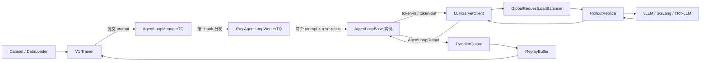
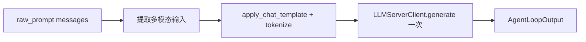

# 08. Agent Loop：把一次 rollout 变成可编程协程

> 本章对应源码快照：`main@d33ddd71`。Agent Loop 仍是 experimental API，后续版本可能改变接口。

## 本章目标

学完本章，你应该能回答：

1. `AgentLoopManager`、`AgentLoopWorker`、`AgentLoopBase`、`LLMServerManager` 分别管理什么；
2. 一行 dataset 数据如何被路由到 `single_turn_agent` 或自定义 agent；
3. 当前默认的 V1 + TransferQueue 路径与旧 V0 路径有什么区别；
4. `prompt_ids`、`response_ids`、`response_mask`、`attention_mask` 和 `rollout_log_probs` 各自表示什么；
5. 为什么 agentic RL 必须尽量保留模型真正采样出的 token，而不能在最后重新渲染整段聊天记录；
6. 如何写一个最小的自定义 `AgentLoopBase`。

本章先讲通用 Agent Loop。[下一章](09_tool_agent_loop.md)再把 `ToolAgentLoop` 的状态机、parser 和自定义工具逐层拆开。

---

## 1. 先区分三个容易混淆的“循环”

在 verl 中，“loop”至少可能指三件不同的事：

| 循环 | 做什么 | 典型时间尺度 |
|---|---|---|
| 训练循环 | 取 batch、rollout、算 reward/advantage、更新 actor | 一个 PPO/GRPO step |
| Agent Loop | 针对一条 prompt，决定何时问模型、何时访问环境、何时结束 | 一条 trajectory |
| 解码循环 | inference engine 逐 token 生成 | 一次 LLM 请求 |

本章所说的 **Agent Loop** 是第二层。它并不负责反向传播，也不实现 vLLM/SGLang 的逐 token 解码。它是这两层之间的“控制程序”：

```text
输入 prompt
  → 调一次模型
  → 可选：访问工具或环境
  → 再调模型
  → ...
  → 返回可用于 RL 训练的 token trajectory
```

因此，Agent Loop 不等于某一种特定 agent 算法。ReAct、代码解释器、游戏环境、多阶段验证器，甚至最普通的 single-turn generation，都可以实现成一个 Agent Loop。

---

## 2. 最小前置知识

### 2.1 Chat message 与 token trajectory 不是同一件事

人更喜欢读这种结构：

```python
messages = [
    {"role": "user", "content": "2 + 2 等于多少？"},
    {"role": "assistant", "content": "4"},
]
```

模型和 PPO 实际处理的是 token id：

```text
[151644, 872, 198, ..., 19, 151645]
```

`tokenizer.apply_chat_template()` 会把 role、分隔符、generation prompt 等结构编码成 token。不同模型的模板不同；同一段 message 在“整段重新渲染”与“逐轮增量拼接”时，也可能产生不同 token。

对于普通聊天服务，这一点通常只影响格式。对于 on-policy RL，它会改变训练样本到底是不是当前 policy 真正采样出的动作。

### 2.2 Coroutine 与 Ray actor

Agent Loop 的 `run()` 是 `async def`。这意味着某条 trajectory 在等待 GPU inference 或网络工具时，同一个 worker 可以继续推进其他 trajectory。

Ray actor 则提供跨进程、跨节点的 worker：

- `AgentLoopWorker` 通常是 CPU-side Ray actor；
- inference server 是另外的 Ray actor；
- actor 之间通过 Ray RPC 和异步客户端交互。

### 2.3 Trajectory

在本教程里，一条 trajectory 指“一次完整 rollout”：从初始 prompt 开始，到 agent 决定结束为止。它可能只有一个 assistant turn，也可能包含多次模型生成和环境 observation。

注意：源码中的 [`get_trajectory_info()`](https://github.com/verl-project/verl/blob/d33ddd7140f44d392e0e10b48a8902651a1340f4/verl/experimental/agent_loop/agent_loop.py#L1144-L1163) 生成每条样本的调度/trace 元数据 `step/sample_index/rollout_n/validate`。其中 `validate` 还会继续传给 postprocess，用于控制 teacher logprob 和结果写入 train/val partition 的行为；但这个字典本身不承载 token，真正的终态数据由 `AgentLoopOutput` 承载。

---

## 3. 一张图建立整体心智模型

当前默认配置 `trainer.use_v1=true` 使用 V1 trainer 与 TransferQueue：



这里有两个名字非常容易看错：

- **`AgentLoopManager`** 管的是 CPU-side agent workers；
- **`LLMServerManager`** 管的是 GPU-side inference replicas。

而 [`AgentLoopBase.server_manager`](https://github.com/verl-project/verl/blob/d33ddd7140f44d392e0e10b48a8902651a1340f4/verl/experimental/agent_loop/agent_loop.py#L219-L232) 这个属性虽然叫 `server_manager`，实际注入的是一个 **`LLMServerClient`**，不是 `LLMServerManager`。

---

## 4. 六个核心对象

### 4.1 `AgentLoopBase`：每条 trajectory 的控制程序

抽象接口在 [`AgentLoopBase`](https://github.com/verl-project/verl/blob/d33ddd7140f44d392e0e10b48a8902651a1340f4/verl/experimental/agent_loop/agent_loop.py#L206)：

```python
class AgentLoopBase(ABC):
    @abstractmethod
    async def run(
        self,
        sampling_params: dict[str, Any],
        **kwargs,
    ) -> AgentLoopOutput:
        ...
```

其中：

- `sampling_params` 是 temperature、top-p、top-k、是否返回 logprob 等生成参数；
- V0 中的 `kwargs` 主要来自 dataset 的 `non_tensor_batch`；V1 会同时传入 tensor/non-tensor row 字段，以及 `uid`、`global_steps`、`session_id` 等框架字段。自定义 loop 应保留 `**kwargs`，但只读取自己需要的 key；
- 返回值必须描述 policy 实际经历的 token trajectory。

基类还提供：

- chat template 与 tokenization；
- text/multimodal prompt 处理；
- Continuous Token 边界合并；
- 指向 inference server 的 `LLMServerClient`。

### 4.2 `AgentLoopOutput`：agent 与训练系统的边界

核心 schema 在 [`AgentLoopOutput`](https://github.com/verl-project/verl/blob/d33ddd7140f44d392e0e10b48a8902651a1340f4/verl/experimental/agent_loop/agent_loop.py#L90-L114)：

```python
class AgentLoopOutput(BaseModel):
    prompt_ids: list[int]
    response_ids: list[int]
    response_mask: list[int]
    response_logprobs: list[float] | None = None
    routed_experts: Any | None = None
    multi_modal_data: dict | None = None
    reward_score: float | None = None
    num_turns: int = 0
    metrics: AgentLoopMetrics
    extra_fields: dict[str, Any] = {}
    mm_processor_kwargs: dict[str, Any] | None = None
```

它故意不强制 agent 必须使用 message、tool 或某一种状态机。训练侧真正需要的最小信息只是：

1. 初始 prompt token；
2. prompt 之后发生的全部 token；
3. 哪些 response token 是 policy 自己生成的 action。

这三项指的是 **token 语义上的最小边界**。要实际构造当前 Pydantic schema，仍必须传入 `metrics`；VLM 或 audio/video 路径还应保留 `mm_processor_kwargs`，使 rollout 与训练侧 processor/backend 参数保持对齐。

### 4.3 `AgentLoopWorker`：并发运行很多 trajectory

[`AgentLoopWorker`](https://github.com/verl-project/verl/blob/d33ddd7140f44d392e0e10b48a8902651a1340f4/verl/experimental/agent_loop/agent_loop.py#L497) 在启动时完成相对昂贵且可复用的初始化：

- tokenizer / processor；
- dataset class；
- tool catalog；
- custom agent-loop registry；
- rollout trace 配置。

随后它为每条样本创建 agent-loop 实例并调用 `run()`。

### 4.4 `AgentLoopManager`：把 batch 分给 workers

[`AgentLoopManager`](https://github.com/verl-project/verl/blob/d33ddd7140f44d392e0e10b48a8902651a1340f4/verl/experimental/agent_loop/agent_loop.py#L1166-L1220) 创建多个 Ray `AgentLoopWorker`，round-robin 选择目标节点的 **soft node affinity**，再把 batch 切成 chunks 下发。因为 `soft=True`，目标节点资源不可用时 Ray 可以把 actor 调度到其他节点；这不是硬 placement 保证。

`agent.num_workers` 表示 **AgentLoop Ray actor 数量**，不是：

- inference server 数量；
- GPU 数量；
- 全局最大并发请求数。

一个 worker 的 chunk 内仍会同时调度多条 coroutine。

### 4.5 `AgentLoopManagerTQ` / `AgentLoopWorkerTQ`：V1 adapter

V1 没有复制一套 agent 实现，而是用 [`agent_loop_tq.py`](https://github.com/verl-project/verl/blob/d33ddd7140f44d392e0e10b48a8902651a1340f4/verl/trainer/ppo/v1/agent_loop_tq.py) 包装通用 manager/worker：

- manager fire-and-forget 地提交任务；
- worker 按 `rollout.n` 为一个 prompt 建立多个 session；
- 结果以变长 tensor 写入 TransferQueue；
- ReplayBuffer 根据 prompt group 收集完整 rollout。

adapter 能为一个 session 返回的多个 `AgentLoopOutput` 分配独立 key 并写入 TQ，但支持尚未完全覆盖所有辅助路径：当前 distillation teacher logprob 只对最后一个 output 计算，[源码仍有明确 TODO](https://github.com/verl-project/verl/blob/d33ddd7140f44d392e0e10b48a8902651a1340f4/verl/trainer/ppo/v1/agent_loop_tq.py#L150-L175)。因此“multi-output 支持”应理解为 **存储、key 和 reward 主路径已接线**，不是所有训练功能都已对每个 output 完整接线。

### 4.6 `LLMServerManager` / `LLMServerClient`

[`LLMServerManager`](https://github.com/verl-project/verl/blob/d33ddd7140f44d392e0e10b48a8902651a1340f4/verl/workers/rollout/llm_server.py#L453) 负责：

- 创建 vLLM、SGLang 或 TRT-LLM replicas；
- 启动 hybrid 或 standalone server；
- 建立全局 load balancer；
- 向 Agent Loop 提供轻量 client。

[`LLMServerClient`](https://github.com/verl-project/verl/blob/d33ddd7140f44d392e0e10b48a8902651a1340f4/verl/workers/rollout/llm_server.py#L194) 则负责每次 `generate()` 的路由和 RPC。

---

## 5. 当前默认调用链：V1 + TransferQueue

默认入口可按下面顺序阅读。

### 5.1 入口选择 V1

[`main_ppo.py`](https://github.com/verl-project/verl/blob/d33ddd7140f44d392e0e10b48a8902651a1340f4/verl/trainer/main_ppo.py#L184-L193) 根据 `trainer.use_v1` 选择 `TaskRunnerV1`。当前默认值在 [`ppo_trainer.yaml`](https://github.com/verl-project/verl/blob/d33ddd7140f44d392e0e10b48a8902651a1340f4/verl/trainer/config/ppo_trainer.yaml#L221) 中是 `true`。

### 5.2 Trainer 先建 inference server，再建 Agent Loop manager

V1 trainer 初始化 [`LLMServerManager`](https://github.com/verl-project/verl/blob/d33ddd7140f44d392e0e10b48a8902651a1340f4/verl/trainer/ppo/v1/trainer_base.py#L350)。随后 `TaskRunnerV1.init_agent_loop_manager()` 默认创建 [`AgentLoopManagerTQ`](https://github.com/verl-project/verl/blob/d33ddd7140f44d392e0e10b48a8902651a1340f4/verl/trainer/main_ppo.py#L112)，并把以下依赖传进去：

- `llm_client`；
- 可选 teacher clients；
- reward-loop worker handles。

### 5.3 Prompt 先注册进 TransferQueue

训练侧 [`_submit_batch_to_rollout()`](https://github.com/verl-project/verl/blob/d33ddd7140f44d392e0e10b48a8902651a1340f4/verl/trainer/ppo/v1/trainer_base.py#L1345-L1361)：

1. 用 `uid` 把 prompt 标记为 pending；
2. 在非 `sync` 的异步 trainer mode 中，把 prompt 字段额外写入 TransferQueue，供 checkpoint recovery 使用；当前默认 `sync` mode 只写 key 和 pending tag，不在这一步持久化 prompt fields；
3. 把原始 batch 直接交给 manager 的 `generate_sequences()`。

### 5.4 Manager 只负责下发

[`AgentLoopManagerTQ.generate_sequences()`](https://github.com/verl-project/verl/blob/d33ddd7140f44d392e0e10b48a8902651a1340f4/verl/trainer/ppo/v1/agent_loop_tq.py#L243) 将 TensorDict 切块并发给 workers。它等待“worker 已接受任务”，但不等待所有 trajectory 完成。

这也是为什么 V1 的 `generate_sequences()` 没有直接返回 rollout batch。

### 5.5 一个 prompt 产生 $n$ 个 session

[`AgentLoopWorkerTQ._run_prompt()`](https://github.com/verl-project/verl/blob/d33ddd7140f44d392e0e10b48a8902651a1340f4/verl/trainer/ppo/v1/agent_loop_tq.py#L107) 读取：

- 训练时的 `rollout.n`；
- 验证时的 `val_kwargs.n`；
- 可选每样本覆盖 `__rollout_n__`。

每个 session 都独立调用一次 `_run_agent_loop()`。

### 5.6 结果写入 TQ

[`_agent_loop_postprocess()`](https://github.com/verl-project/verl/blob/d33ddd7140f44d392e0e10b48a8902651a1340f4/verl/trainer/ppo/v1/agent_loop_tq.py#L150) 使用 key：

```text
{uid}_{session_id}_{output_index}
```

其中：

- `uid`：prompt group 标识；
- `session_id`：同一 prompt 的第几个 rollout；
- `output_index`：自定义 agent 一次返回多个 `AgentLoopOutput` 时的顺序。

内置 single-turn/tool agent 都只返回一个 output，所以 `output_index` 通常是 `0`。

---

## 6. V1 与旧 V0 路径不要混着读

旧 V0 trainer 仍在仓库中，但已经 deprecated。两条路径的关键差异如下：

| 维度 | V1（当前默认） | V0（旧路径） |
|---|---|---|
| Manager | `AgentLoopManagerTQ` | `AgentLoopManager` |
| 输入容器 | `TensorDict` | `DataProto` |
| `rollout.n` | worker 内为每个 prompt 建 sessions | trainer 先把 batch interleave repeat |
| 调度 | fire-and-forget，结果进入 TQ | 阻塞 gather，直接返回 `DataProto` |
| trajectory 存储 | 变长/ragged | prompt 左 pad、response 右 pad |
| 多 output agent | TQ 存储/key/reward 主路径支持；teacher logprob 仍只处理 final output | 普通 postprocess 按单 output 处理 |
| 消费方 | ReplayBuffer | 当前训练 step 直接 union 回 batch |

V0 manager 的阻塞实现见 [`AgentLoopManager.generate_sequences()`](https://github.com/verl-project/verl/blob/d33ddd7140f44d392e0e10b48a8902651a1340f4/verl/experimental/agent_loop/agent_loop.py#L1223)，V0 trainer 的 repeat 与调用见 [`ray_trainer.py`](https://github.com/verl-project/verl/blob/d33ddd7140f44d392e0e10b48a8902651a1340f4/verl/trainer/ppo/ray_trainer.py#L1461)。

### 一个命名陷阱：`trainer.v1.trainer_mode=sync`

这里的 `sync` 表示“训练与 rollout 的宏观调度模式”，不表示 Agent Loop 改成同步 Python 函数。`AgentLoopBase.run()` 仍然是 coroutine，inference RPC 和工具 I/O 仍可异步并发。

---

## 7. 一条 dataset row 如何选择 Agent Loop

### 7.1 两个内置 registry key

内置 agent 通过 decorator 注册：

- `single_turn_agent`：[`single_turn_agent_loop.py`](https://github.com/verl-project/verl/blob/d33ddd7140f44d392e0e10b48a8902651a1340f4/verl/experimental/agent_loop/single_turn_agent_loop.py#L28)
- `tool_agent`：[`tool_agent_loop.py`](https://github.com/verl-project/verl/blob/d33ddd7140f44d392e0e10b48a8902651a1340f4/verl/experimental/agent_loop/tool_agent_loop.py#L99)

包的 [`__init__.py`](https://github.com/verl-project/verl/blob/d33ddd7140f44d392e0e10b48a8902651a1340f4/verl/experimental/agent_loop/__init__.py#L15) 显式 import 两个模块，使注册副作用在每个 worker 进程中发生。

registry 本身只是进程内字典：

```python
_agent_loop_registry: dict[str, dict] = {}

def register(agent_name: str):
    def decorator(subclass):
        _agent_loop_registry[agent_name] = {
            "_target_": f"{subclass.__module__}.{subclass.__qualname__}"
        }
        return subclass
    return decorator
```

实现见 [`agent_loop.py`](https://github.com/verl-project/verl/blob/d33ddd7140f44d392e0e10b48a8902651a1340f4/verl/experimental/agent_loop/agent_loop.py#L478)。

### 7.2 路由优先级

对每条样本：

1. 如果 batch 有顶层 `agent_name`，使用该值；
2. 如果整个 batch 没有这个字段，填入 `agent.default_agent_loop`；
3. `_run_agent_loop()` 查 registry；
4. Hydra 为这条 trajectory 实例化一个 agent object。

实例化代码见 [`_run_agent_loop()`](https://github.com/verl-project/verl/blob/d33ddd7140f44d392e0e10b48a8902651a1340f4/verl/experimental/agent_loop/agent_loop.py#L675)。

一个 dataset row 可以是：

```python
row = {
    "data_source": "my/math",
    "agent_name": "tool_agent",      # 顶层字段
    "prompt": [
        {"role": "user", "content": "计算 18 * 7"},
    ],
    "reward_model": {
        "style": "rule",
        "ground_truth": "126",
    },
    "extra_info": {
        "index": 42,
    },
}
```

标准示例可参考 [`gsm8k_tool_agent_loop.py`](https://github.com/verl-project/verl/blob/d33ddd7140f44d392e0e10b48a8902651a1340f4/examples/data_preprocess/gsm8k_tool_agent_loop.py#L70)。

### 7.3 两个坑

第一，**`multi_turn.enable=true` 不是 agent 路由开关**。单独设置它不会把默认的 `single_turn_agent` 变成 `tool_agent`；必须设置顶层 `agent_name`，或显式设置：

```yaml
actor_rollout_ref:
  rollout:
    agent:
      default_agent_loop: tool_agent
```

第二，只有“字段完全不存在”才会填默认值。如果混合 dataset 产生了 `agent_name: null`，它不会自动回退，而会在 registry lookup 时失败。

---

## 8. SingleTurnAgentLoop：理解接口的最短路径

[`SingleTurnAgentLoop.run()`](https://github.com/verl-project/verl/blob/d33ddd7140f44d392e0e10b48a8902651a1340f4/verl/experimental/agent_loop/single_turn_agent_loop.py#L37) 基本等于：



关键步骤：

1. 从 `kwargs["raw_prompt"]` 取得 messages；
2. 提取 image/video/audio；
3. 渲染 chat template，得到 `prompt_ids`；
4. 调一次 token-in/token-out generation；
5. 将所有生成 token 的 `response_mask` 设为 `1`；
6. 返回 `num_turns=2` 的 output。

这是排查 Agent Loop 基础设施的最好 baseline：如果 single-turn 都无法工作，先不要调试 tool parser。

---

## 9. Server、replica 与 sticky routing

### 9.1 `LLMServerManager` 如何得到 replicas

replica backend registry 在 [`replica.py`](https://github.com/verl-project/verl/blob/d33ddd7140f44d392e0e10b48a8902651a1340f4/verl/workers/rollout/replica.py#L302)，当前内置：

- `vllm`
- `sglang`
- `trtllm`

普通情况下，一个 rollout replica 占用的 world size 近似为：

```text
TP × DP × PP
```

`LLMServerManager` 根据可用 worker world size 与单 replica world size 计算 replica 数，然后调用：

- `init_hybrid(worker_group)`：训练与 rollout 共享 GPU 资源；
- `init_standalone()`：rollout 使用独立资源。

实现见 [`_initialize_llm_servers()`](https://github.com/verl-project/verl/blob/d33ddd7140f44d392e0e10b48a8902651a1340f4/verl/workers/rollout/llm_server.py#L499) 与 [`RolloutReplica`](https://github.com/verl-project/verl/blob/d33ddd7140f44d392e0e10b48a8902651a1340f4/verl/workers/rollout/replica.py#L70)。

### 9.2 全局 least-loaded + sticky session

[`GlobalRequestLoadBalancer`](https://github.com/verl-project/verl/blob/d33ddd7140f44d392e0e10b48a8902651a1340f4/verl/workers/rollout/llm_server.py#L46) 是一个共享 Ray actor：

1. trajectory 第一次请求时选择 inflight 最少的 server；
2. 缓存 `request_id → server_id`；
3. 后续 turn 使用相同 `request_id`；只要 LRU cache entry 尚未淘汰且对应 server 仍处于 active pool，就继续路由到同一 replica；
4. 请求完成后 inflight counter 减一。

若 cache entry 已被淘汰，或 sticky server 已被动态移除，load balancer 会重新选择当前 inflight 最少的 server。因此这里是 **best-effort sticky routing**，有利于 inference engine 复用相同前缀的 KV cache，但不是 trajectory 生命周期内不可打破的硬绑定。

一个细节是：

- Agent Loop 的外层 `request_id` 用于 sticky routing；
- [`LLMServerClient.generate()`](https://github.com/verl-project/verl/blob/d33ddd7140f44d392e0e10b48a8902651a1340f4/verl/workers/rollout/llm_server.py#L228) 给真正 server 的每个 turn 再生成新的 UUID。

所以即使在 sticky cache 命中的期间，“同一 trajectory 路由到同一 replica”也不等于“所有 turn 共用 backend request id”。

### 9.3 当前 wake/sleep 由谁控制

旧 Agent Loop 文档把 wake/sleep 描述成 manager 的职责，但当前源码中，训练/rollout 权重同步和 replica sleep 主要由 trainer 的 `CheckpointEngineManager` 控制，而不是 `AgentLoopManager.generate_sequences()` 自己控制。

阅读当前调用链时，应以 trainer 和 checkpoint engine 为准，不要把旧架构图当成逐行实现。

---

## 10. 为什么使用 token-in/token-out

假设模型真实生成：

```text
Let me call <tool_call>{...}</tool_call><eos>
```

parser 为了执行工具，可能把它转成结构化 message：

```python
{
    "role": "assistant",
    "content": "Let me call ",
    "tool_calls": [...],
}
```

如果结束后对整个 message history 再调用 `apply_chat_template()`，新的 token 序列不一定等于模型当时采样出的 token 序列。常见原因包括：

- parser 删除或规范化了文本；
- decode → encode 不是严格可逆；
- chat template 在完整历史与单轮增量模式下插入不同分隔符；
- reasoning/tool-call special tokens 被模板重写。

这会让 PPO 以为某些 token 是 policy 的 action，但 policy 实际没有采样过它们。

因此当前 Agent Loop 的核心设计是：

1. inference server 接收 token ids；
2. 模型返回 token ids；
3. policy 生成的 ids 原样保留；
4. environment 注入的 token 单独标记为非 action；
5. 下一轮把累计 token stream 再送回 server。

### Continuous Token

默认 `data.continuous_token.enable=false`。开启后，模型族专用 builder 会在合并 assistant 与 non-assistant turn 时同步修正 token 边界、`response_mask` 和 logprob 对齐。由 builder 插入的 boundary token 不是 policy 采样的 action，因此它们会得到 `response_mask=0` 和 logprob `0.0`，即使它们不是工具 observation。

builder factory 在 [`continuous_token_wiring.py`](https://github.com/verl-project/verl/blob/d33ddd7140f44d392e0e10b48a8902651a1340f4/verl/utils/tokenizer/continuous_token_wiring.py#L172)，mask/logprob 对齐逻辑在 [`continuous_token.py`](https://github.com/verl-project/verl/blob/d33ddd7140f44d392e0e10b48a8902651a1340f4/verl/utils/tokenizer/continuous_token.py#L300-L350)；默认配置见 [`legacy_data.yaml`](https://github.com/verl-project/verl/blob/d33ddd7140f44d392e0e10b48a8902651a1340f4/verl/trainer/config/data/legacy_data.yaml#L121)。当前 multimodal processor 路径会回退到 legacy 增量方式。

---

## 11. Token 字段与 mask：本章最重要的一节

先看一个两轮 agent trajectory：

```text
初始 prompt P
模型第一次生成 A1
环境返回 observation O
模型第二次生成 A2
```

Agent Loop 应返回：

```text
prompt_ids   = P
response_ids = A1 || O || A2
response_mask=  1...1 0...0 1...1
```

### 11.1 字段表

| 字段 | 包含什么 | observation / 非 action boundary 的取值或行为 | 是否直接作为 policy action |
|---|---|---:|---:|
| `prompt_ids` / `prompts` | 初始 chat template token | 若初始 prompt 已含这类内容，它们仍属于 prompt | 否 |
| `response_ids` / `responses` | 初始 prompt 之后的完整 trajectory | token 本身会被保留 | 由 mask 决定 |
| `response_mask` | response 每个 token 的 action 标记 | observation 位置为 0；CT 插入的 boundary token 也为 0 | 是 |
| `input_ids` | <code>prompts &#124;&#124; responses</code> | token 本身会被保留 | 否，模型输入序列 |
| `attention_mask` | 哪些位置是真实 token、哪些是 padding | 真实 observation/boundary 为 1 | 否 |
| `loss_mask` | 训练 loss 的有效 action 位置 | observation 和 CT boundary 为 0 | 是 |
| `position_ids` | 模型位置编码 | observation/boundary 也占位置 | 否 |
| `rollout_log_probs` | rollout engine 生成时的 token logprob | observation 和 CT boundary 用 0 占位 | 由 response mask 消费 |

### 11.2 `attention_mask` 不等于 `response_mask`

工具 observation 虽然不应成为 actor 的预测目标，但它必须进入后续模型上下文：

```text
                    assistant A1   observation O   assistant A2   padding
attention_mask          1              1               1            0
response_mask           1              0               1            0
```

如果把 observation 的 `attention_mask` 也置零，第二轮模型就无法读取工具结果。

### 11.3 `loss_mask` 与 `response_mask`

`AgentLoopOutput` 本身没有独立 `loss_mask`。语义上，agentic PPO/GRPO 的 loss mask 就是 `response_mask`：

- V1 TQ adapter 显式写入 `field["loss_mask"] = field["response_mask"]`，见 [`agent_loop_tq.py`](https://github.com/verl-project/verl/blob/d33ddd7140f44d392e0e10b48a8902651a1340f4/verl/trainer/ppo/v1/agent_loop_tq.py#L194-L200)；
- V0 在 padding 转 no-padding 时再复制该 mask；
- PPO/GRPO advantage 与 policy loss 也使用 response mask 排除 observation 和 CT boundary 位置。

### 11.4 Position ids

文本模型通常根据 `attention_mask` 计算连续 position。所有真实 observation token 都会占用位置，因为它们确实处在模型上下文中。

multimodal processor 如果提供 `get_rope_index()`，position ids 可能是多通道 tensor，而不再是简单的 $[B,L]$。当前实现见 [`_compute_position_ids()`](https://github.com/verl-project/verl/blob/d33ddd7140f44d392e0e10b48a8902651a1340f4/verl/experimental/agent_loop/agent_loop.py#L914)。不要在自定义 manager 中硬编码 position tensor rank。

---

## 12. V1 变长 trajectory 与 V0 padding

### 12.1 V1：先保存真实长度

[`AgentLoopOutput.as_dict()`](https://github.com/verl-project/verl/blob/d33ddd7140f44d392e0e10b48a8902651a1340f4/verl/experimental/agent_loop/agent_loop.py#L116) 将 Python lists 转成未 padding tensor。TQ adapter 保存：

- ragged `prompts`；
- ragged `responses`；
- ragged `response_mask/loss_mask`；
- `input_ids` 和 `position_ids`。

它在写 TQ 时不会持久化一个 fixed-width `attention_mask`。后续需要 dense reward-model input 时，trainer 可以根据 prompt/response 长度重建 attention mask。

### 12.2 V0：prompt 左 pad，response 右 pad

V0 的 [`_agent_loop_postprocess()`](https://github.com/verl-project/verl/blob/d33ddd7140f44d392e0e10b48a8902651a1340f4/verl/experimental/agent_loop/agent_loop.py#L741) 会生成：

```text
prompts:       [PAD PAD P0 P1 P2]
responses:     [A1 O A2 PAD PAD]
response_mask: [ 1 0  1  0   0]
attention:     [ 0   0  1  1  1 | 1 1 1 0 0]
```

这样 batch 中每条 sequence 形状一致，但会带来 padding 开销。V1 的 ragged/TQ 设计把 padding 尽量推迟到真正需要它的计算阶段。

---

## 13. 四种 logprob 不要混淆

训练日志或 batch 中可能同时出现：

| 名称 | 谁计算 | 何时计算 | 用途 |
|---|---|---|---|
| `rollout_log_probs` | vLLM/SGLang/TRT-LLM | 生成当时 | 描述行为 policy 的实际采样概率 |
| `old_log_probs` | actor training engine | rollout 后、更新前重算 | 标准 PPO ratio 的分母 |
| `log_prob` | 当前 actor | minibatch update 时 | PPO ratio 的分子 |
| `ref_log_prob` | reference policy | KL 阶段 | reference KL penalty |

### 13.1 rollout logprob 如何产生

Worker 把 `rollout.calculate_log_probs` 放进 generation sampling params；当前 V1 adapter 的实现见 [`AgentLoopWorkerTQ.generate_sequences()`](https://github.com/verl-project/verl/blob/d33ddd7140f44d392e0e10b48a8902651a1340f4/verl/trainer/ppo/v1/agent_loop_tq.py#L63-L70)，V0 通用 worker 也有同样逻辑。Inference backend 返回当前 turn 生成 token 的 logprob，例如 vLLM 路径见 [`vllm_async_server.py`](https://github.com/verl-project/verl/blob/d33ddd7140f44d392e0e10b48a8902651a1340f4/verl/workers/rollout/vllm_rollout/vllm_async_server.py#L648-L651)。

多轮 Agent Loop 会：

- 追加每个 assistant turn 的 logprob；
- 给 observation token 追加 `0.0` 占位；
- 最终与 `response_ids` 等长。

这些 observation 位置不会参与 ratio/KL，因为 `response_mask=0`。Continuous Token 插入的 boundary token 同样使用 `0.0` 占位和 `response_mask=0`。

### 13.2 为什么还要重算 `old_log_probs`

rollout engine 与 training engine 可能在 kernel、数值精度、并行策略上不同。标准 PPO 路径通常让 actor 对完整 trajectory 再计算一次 `old_log_probs`。rollout correction/bypass 等高级模式才会显式比较或直接使用 `rollout_log_probs`。

所以不要把“配置了 rollout logprob”理解为“训练一定不再前向重算旧 policy 概率”。

### 13.3 `AgentLoopMetrics` 在 V0 与 V1 中的去向

当前 [`AgentLoopMetrics`](https://github.com/verl-project/verl/blob/d33ddd7140f44d392e0e10b48a8902651a1340f4/verl/experimental/agent_loop/agent_loop.py#L81-L87) 有四个字段：

- `generate_sequences`：所有 inference turn 的累计耗时；
- `tool_calls`：所有工具执行阶段的累计耗时；
- `compute_score`：worker-side async reward 的耗时；
- `num_preempted`：backend 报告的 preemption 次数，`-1` 表示 unavailable。

[`simple_timer`](https://github.com/verl-project/verl/blob/d33ddd7140f44d392e0e10b48a8902651a1340f4/verl/utils/profiler/performance.py#L145-L168) 对同名字段做累加，所以多轮 agent 的前两个时间不是单独某一轮的耗时。[V0 manager](https://github.com/verl-project/verl/blob/d33ddd7140f44d392e0e10b48a8902651a1340f4/verl/experimental/agent_loop/agent_loop.py#L1249-L1287) 会把这些 per-trajectory metrics 汇总成 min/max/mean 和 slowest-sample timing；V1 TQ adapter 则把 `metrics` 随每个 trajectory field 写入 TransferQueue，但 [`AgentLoopManagerTQ.generate_sequences()`](https://github.com/verl-project/verl/blob/d33ddd7140f44d392e0e10b48a8902651a1340f4/verl/trainer/ppo/v1/agent_loop_tq.py#L243-L257) 只负责 dispatch，不调用 V0 的 `_performance_metrics()`。因此在这个快照中，不应期待 V1 自动产出与 V0 完全相同的 `agent_loop/*` timing 汇总。

---

## 14. Reward 在 trajectory 中如何落位

`AgentLoopOutput.reward_score` 是一个 trajectory scalar。它有三种常见来源：

1. 自定义 Agent Loop 自己已经算好；
2. AgentLoopWorker 调 streaming RewardLoop；
3. rollout 完成后，trainer 再调用 colocated reward model / reward function。

转换成 token-level `rm_scores` 时，scalar 通常被放在最后一个真实 response token：

```text
response_ids: [A1, O1, A2, EOS]
rm_scores:    [ 0,  0,  0,  R ]
```

随后 PPO/GRPO 算法再根据 `response_mask`、KL penalty 和 advantage estimator 传播或广播 credit。

`reward_score` 与工具自己的 step reward 不是同一个字段；工具 reward 的当前行为会在下一章单独说明。

---

## 15. 长度预算与截断

### 15.1 初始 prompt

[`AgentLoopBase.apply_chat_template()`](https://github.com/verl-project/verl/blob/d33ddd7140f44d392e0e10b48a8902651a1340f4/verl/experimental/agent_loop/agent_loop.py#L381) 会保证初始 prompt 不超过 `rollout.prompt_length`：

- text-only prompt：过长时保留右侧 token，即 left truncation；
- multimodal prompt：不会盲目切 token，而是抛错，因为切掉 placeholder 会破坏 feature 对齐。

### 15.2 Response budget

`rollout.response_length` 是初始 prompt 之后 **整条 trajectory** 的预算，不只是最后一个 assistant answer：

```text
response budget = assistant turn 1
                + observation 1
                + assistant turn 2
                + observation 2
                + ...
```

因此，工具输出即使不参与 loss，仍会消耗：

- context length；
- response length；
- attention 计算量；
- position ids。

这是 agentic rollout 比 single-turn 更容易撞到长度上限的根本原因。

---

## 16. 写一个最小自定义 Agent Loop

下面实现一个仅适用于 text-only prompt 的 legacy-token、single-turn 变体。为了让最小示例保持紧凑，它假定 `data.continuous_token.enable=false` 且 `actor_rollout_ref.rollout.full_determinism=false`。若启用 Continuous Token，应像内置 `SingleTurnAgentLoop` 一样调用 `ct_build_initial_tokens()` / `ct_merge_assistant_token()`；若启用 full determinism，还应接收 per-sample `priority` 并据此构造 deterministic request id。VLM 还要额外处理 image/video/audio 与 processor kwargs。

```python
# my_package/my_agent_loop.py
from typing import Any
from uuid import uuid4

from verl.experimental.agent_loop.agent_loop import (
    AgentLoopBase,
    AgentLoopOutput,
)
from verl.utils.profiler import simple_timer


class MySingleTurnLoop(AgentLoopBase):
    async def run(
        self,
        sampling_params: dict[str, Any],
        **kwargs,
    ) -> AgentLoopOutput:
        messages = list(kwargs["raw_prompt"])
        prompt_ids = await self.apply_chat_template(messages)

        metrics = {}
        with simple_timer("generate_sequences", metrics):
            token_output = await self.server_manager.generate(
                request_id=uuid4().hex,
                prompt_ids=prompt_ids,
                sampling_params=sampling_params,
            )

        metrics["num_preempted"] = (
            token_output.num_preempted
            if token_output.num_preempted is not None
            else -1
        )
        response_ids = token_output.token_ids[: self.rollout_config.response_length]

        return AgentLoopOutput(
            prompt_ids=prompt_ids,
            response_ids=response_ids,
            response_mask=[1] * len(response_ids),
            response_logprobs=(
                token_output.log_probs[: len(response_ids)]
                if token_output.log_probs
                else None
            ),
            num_turns=2,
            metrics=metrics,
            extra_fields=token_output.extra_fields,
        )
```

注册自定义 loop 的 YAML 是一个列表：

```yaml
# my_agent_loops.yaml
- name: my_single_turn
  _target_: my_package.my_agent_loop.MySingleTurnLoop
```

训练配置：

```yaml
actor_rollout_ref:
  rollout:
    agent:
      agent_loop_config_path: /absolute/path/to/my_agent_loops.yaml
      default_agent_loop: my_single_turn
```

Worker 启动时加载 YAML 并写入 registry，见 [`AgentLoopWorker.__init__()`](https://github.com/verl-project/verl/blob/d33ddd7140f44d392e0e10b48a8902651a1340f4/verl/experimental/agent_loop/agent_loop.py#L547)。

### 自定义 loop 必须满足的约束

1. Python module 在每个 Ray worker 节点都能 import；
2. `run()` 接受 `sampling_params` 和 dataset/framework kwargs；
3. policy-generated token 与 `response_mask=1` 对齐；
4. environment-injected token 以及 CT 插入的 boundary token 与 `response_mask=0` 对齐；
5. `response_ids`、`response_mask`、非空 `response_logprobs` 长度一致；
6. 不要通过“最终 messages 全量重编码”伪造 trajectory；
7. 自定义 `__init__` 时应接收并向父类转发框架注入的 kwargs；
8. `AgentLoopOutput` 必须提供 `metrics`，未知的 preemption 状态用 `num_preempted=-1`，不要伪装成 0 次。

---

## 17. Trace 与调试

普通 manager 路径支持 rollout trace backend：

```yaml
actor_rollout_ref:
  rollout:
    trace:
      backend: weave       # 也可 mlflow / trackio
      token2text: true
      max_samples_per_step_per_worker: 5
```

`rollout_trace_attr` 给一条 trajectory 标记：

- `step`
- `sample_index`
- `rollout_n`
- `validate`

`rollout_trace_op` 装饰了 Agent Loop、server client 和 parser/tool 等关键异步函数。配置说明见 [`rollout_trace.rst`](https://github.com/verl-project/verl/blob/d33ddd7140f44d392e0e10b48a8902651a1340f4/docs/advance/rollout_trace.rst)。

### 当前 V1 注意事项

在本章对应的 commit 中，[`AgentLoopWorkerTQ`](https://github.com/verl-project/verl/blob/d33ddd7140f44d392e0e10b48a8902651a1340f4/verl/trainer/ppo/v1/agent_loop_tq.py#L85) 仍将 `trace_this_sample=False` 写死，并有 TODO。因此不要假定旧 trace 文档中的“每个 V1 rollout 都会被采样记录”已经接通。

调试当前 V1 trajectory 时，还可以直接检查 TransferQueue 中的：

- key 与 status tag；
- `prompts` / `responses`；
- `response_mask` / `loss_mask`；
- `rollout_log_probs`；
- `extra_fields` 与 model-version tags。

---

## 18. 常见误解与源码事实

| 误解 | 当前源码事实 |
|---|---|
| `multi_turn.enable=true` 会自动启用工具 agent | 路由由顶层 `agent_name` 或 `agent.default_agent_loop` 决定 |
| `AgentLoopManager` 管 inference servers | 它管 agent workers；servers 由 `LLMServerManager` 管 |
| `server_manager` 属性就是 server manager | `AgentLoopBase.server_manager` 实际是 `LLMServerClient` |
| `response_ids` 只有模型答案 | 多轮时还包含 tool/environment observation |
| `attention_mask=1` 就会计算 policy loss | loss/action 由 `response_mask` 决定 |
| 开启 rollout logprob 后不再重算 old logprob | 标准 PPO 路径通常仍由 actor 重算 |
| `rollout.n` 在 manager 前统一 repeat | V1 是 worker 内为每个 prompt 建 n 个 session；V0 才是 trainer 先 repeat |
| AgentLoopManager 负责每步 wake/sleep | 当前主要由 trainer + CheckpointEngineManager 控制 |
| `trajectory_info` 就是 trajectory 数据 | 它只是 trace metadata；token 终态是 `AgentLoopOutput` |

---

## 19. 建议的源码阅读顺序

第一次阅读时不要一上来钻进 vLLM engine。按边界逐层下沉：

1. [`AgentLoopOutput`](https://github.com/verl-project/verl/blob/d33ddd7140f44d392e0e10b48a8902651a1340f4/verl/experimental/agent_loop/agent_loop.py#L90)
2. [`SingleTurnAgentLoop.run()`](https://github.com/verl-project/verl/blob/d33ddd7140f44d392e0e10b48a8902651a1340f4/verl/experimental/agent_loop/single_turn_agent_loop.py#L37)
3. [`AgentLoopWorker._run_agent_loop()`](https://github.com/verl-project/verl/blob/d33ddd7140f44d392e0e10b48a8902651a1340f4/verl/experimental/agent_loop/agent_loop.py#L675)
4. [`AgentLoopWorkerTQ`](https://github.com/verl-project/verl/blob/d33ddd7140f44d392e0e10b48a8902651a1340f4/verl/trainer/ppo/v1/agent_loop_tq.py#L52)
5. [`AgentLoopManager`](https://github.com/verl-project/verl/blob/d33ddd7140f44d392e0e10b48a8902651a1340f4/verl/experimental/agent_loop/agent_loop.py#L1166)
6. [`LLMServerClient.generate()`](https://github.com/verl-project/verl/blob/d33ddd7140f44d392e0e10b48a8902651a1340f4/verl/workers/rollout/llm_server.py#L228)
7. [`GlobalRequestLoadBalancer`](https://github.com/verl-project/verl/blob/d33ddd7140f44d392e0e10b48a8902651a1340f4/verl/workers/rollout/llm_server.py#L46)
8. [`vLLMHttpServer.generate()`](https://github.com/verl-project/verl/blob/d33ddd7140f44d392e0e10b48a8902651a1340f4/verl/workers/rollout/vllm_rollout/vllm_async_server.py#L511) 或对应 backend

每读一层，都问自己三个问题：

1. 输入对象是什么；
2. 这一层改变了哪些字段；
3. 哪些状态是 per-trajectory，哪些状态被 worker 共享。

---

## 20. 本章小结

Agent Loop 的本质不是“框架替你实现了一个 agent”，而是提供一个 **可编程 rollout 边界**：

```text
dataset kwargs
  → async AgentLoopBase.run()
  → 若干次 token-in/token-out generation / environment interaction
  → AgentLoopOutput
  → response_mask 标出真正的 policy actions
  → TransferQueue / PPO trainer
```

最重要的三个结论是：

1. 当前默认执行路径是 V1 + `AgentLoopManagerTQ`，旧 V0 代码只能作为迁移背景；
2. `response_ids` 保存完整交互轨迹，而 `response_mask` 决定哪些 token 参与 RL；
3. agentic RL 必须保护真实 token trajectory，不能只保存“看起来等价”的最终 message history。

[下一章](09_tool_agent_loop.md)将沿着这一抽象，逐状态解释 `ToolAgentLoop` 如何把模型输出解析成工具调用，再把 observation 安全地接回 token trajectory。
