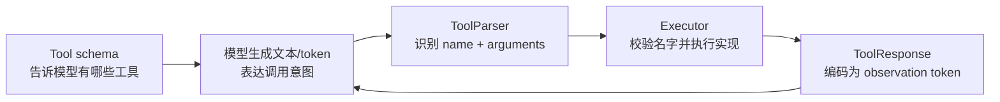
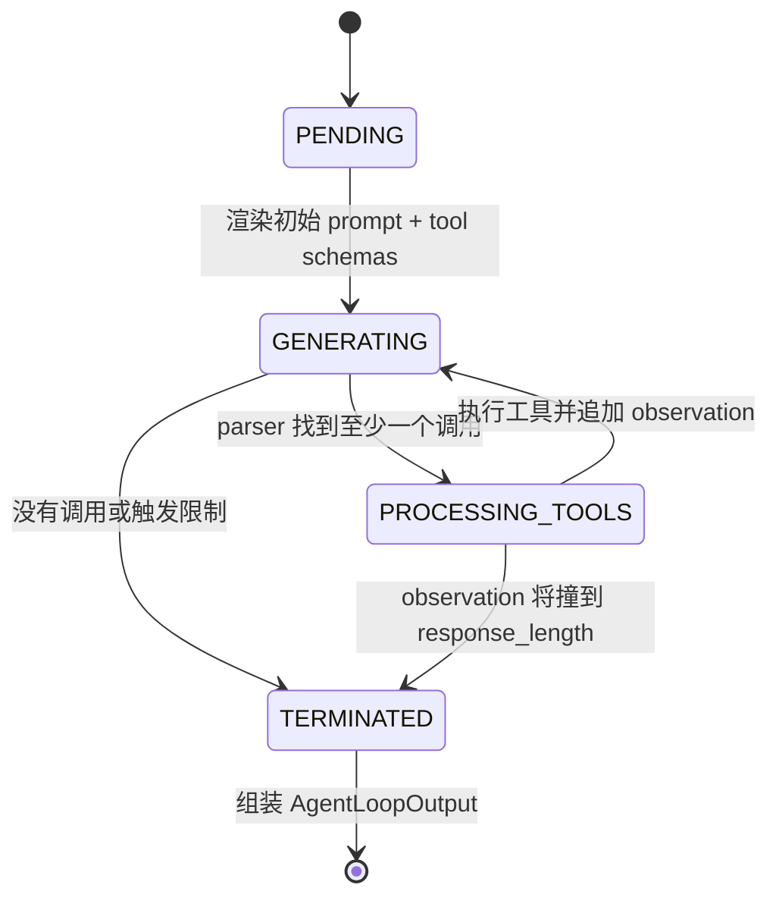
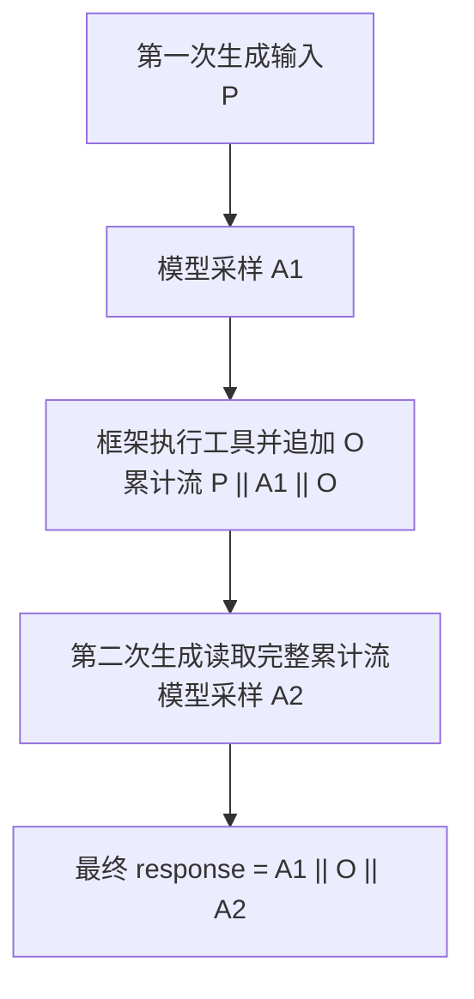
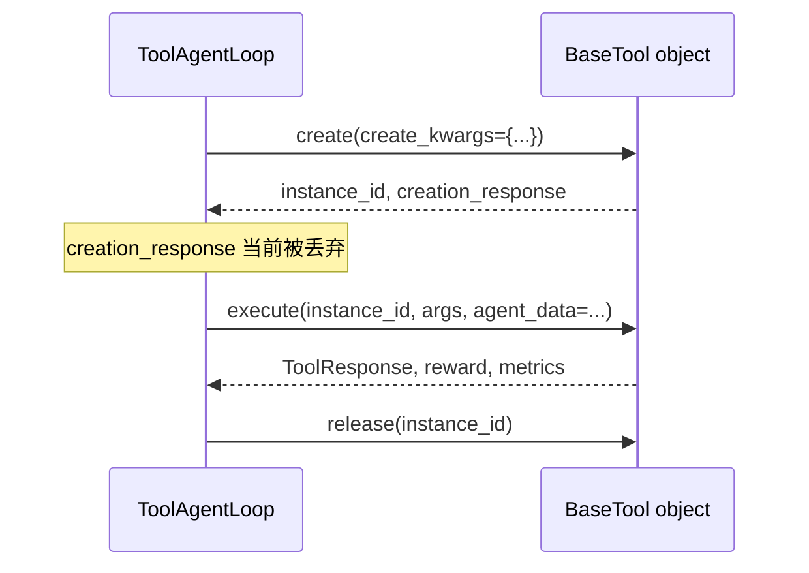
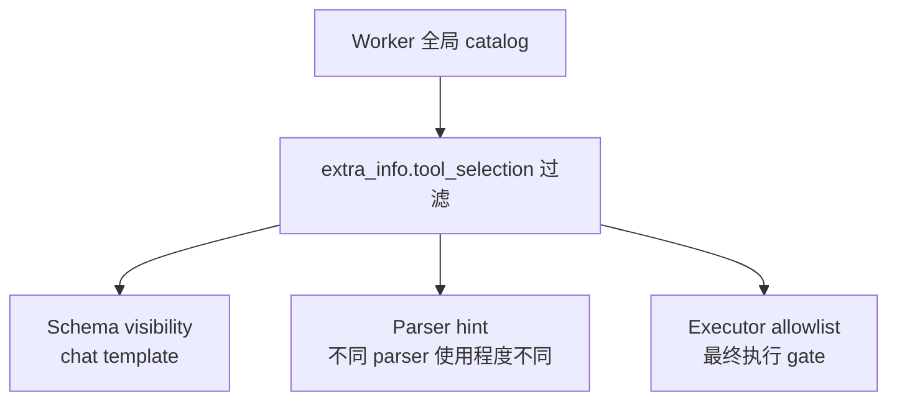

# 09. Tool Agent Loop：模型、parser 与工具如何组成一条 trajectory

> 本章对应源码快照：`main@d33ddd71`。`ToolAgentLoop` 位于 experimental 目录；尤其是 per-sample tool selection 和部分生命周期契约，后续版本可能变化。

## 本章目标

学完本章，你应该能回答：

1. 模型“会输出工具调用”与框架“真的执行了工具”之间还缺哪些步骤；
2. `ToolAgentLoop` 的四个状态如何循环，什么时候结束；
3. assistant token、tool observation、logprob 和各种 mask 如何对齐；
4. tool schema、tool parser、工具实现分别负责什么，又不负责什么；
5. 如何用 `@function_tool` 或 `BaseTool + YAML` 接入自定义工具；
6. 如何为每条样本选择不同工具，以及当前实现有哪些边界和陷阱；
7. 工具返回的 reward 为什么不会自动变成 PPO/GRPO reward。

本章默认你已经读过[上一章](08_agent_loop.md)的 `AgentLoopOutput`、token-in/token-out 和 `response_mask`。

---

## 1. 先拆掉一个误解：工具调用不是 Python 函数调用

模型不会直接执行 Python。一个完整的 tool-calling round 至少包含五层：



例如，模型可能生成：

```text
<tool_call>{"name":"calculator","arguments":{"expression":"18*7"}}</tool_call>
```

这仍然只是一串 token。随后：

1. `HermesToolParser` 找到 `<tool_call>...</tool_call>`；
2. parser 产出 `FunctionCall(name="calculator", arguments="{...}")`；
3. `ToolAgentLoop._call_tool()` 在当前样本允许的工具中查找 `calculator`；
4. Python 工具算出 `126`；
5. chat template 把 tool message 编码成 observation token；
6. 下一次模型生成读取这些 token，再生成最终答案。

这五层是相互独立的。只注册 Python 函数，不代表模型知道它；只把 schema 放进 prompt，不代表模型输出格式能被 parser 识别；parser 成功，也不代表 arguments 已经过 schema 校验。

---

## 2. 最小配置：先让路由和格式都对上

一个典型配置如下：

```yaml
actor_rollout_ref:
  rollout:
    # V1 训练中，一个初始 prompt 默认产生多少条独立 trajectory。
    n: 4

    agent:
      default_agent_loop: tool_agent

    multi_turn:
      enable: true
      tool_config_path: /absolute/path/to/native_tools.yaml
      function_tool_path: /absolute/path/to/function_tools.py
      format: hermes
      max_assistant_turns: 8
      max_user_turns: 8
      max_parallel_calls: 2
      max_tool_response_length: 2048
      tool_response_truncate_side: middle
```

也可以不改 default，而是在 dataset 每一行写顶层字段：

```python
row["agent_name"] = "tool_agent"
```

### 2.1 `enable=true` 不是路由开关

当前 Agent Loop 路由只看：

- dataset 顶层 `agent_name`；
- 或 `rollout.agent.default_agent_loop`。

因此，仅设置 `multi_turn.enable=true` **不会**把 `single_turn_agent` 变成 `tool_agent`。`enable` 建议按语义一起开启，但不能替代路由。默认 fallback 见 [`AgentLoopWorker.generate_sequences()`](https://github.com/verl-project/verl/blob/d33ddd7140f44d392e0e10b48a8902651a1340f4/verl/experimental/agent_loop/agent_loop.py#L623-L626)，registry lookup 见 [`AgentLoopWorker._run_agent_loop()`](https://github.com/verl-project/verl/blob/d33ddd7140f44d392e0e10b48a8902651a1340f4/verl/experimental/agent_loop/agent_loop.py#L675-L693)。

默认值还是 batch 字段级 fallback，而不是逐行 fallback：只有整个 batch 都没有 `agent_name` 这个 key 时才会填 `default_agent_loop`。若该列存在但某行是 `None`、空字符串或未知名字，那一行不会回退，而会在 registry lookup 时失败。

### 2.2 几个配置名的当前真实语义

| 配置 | 当前 `ToolAgentLoop` 的实际行为 |
|---|---|
| `rollout.n` | 训练时每个初始 prompt 的默认 rollout 数；validation 改用 `val_kwargs.n`，单个样本还可用内部字段 `__rollout_n__` 覆盖这两者 |
| `max_assistant_turns` | 最多 inference 调用次数；应设为正整数；`null` 就是不设 turn cap |
| `max_user_turns` | 最多 tool-response rounds；应设为正整数；不是自然语言 user 消息数；`null` 不设 cap |
| `max_parallel_calls` | 同一 assistant turn 最多执行前 N 个调用；只应设为正整数 |
| `max_tool_response_length` | 成功执行返回文本的 **Python 字符数截断阈值**，不是 token 数或最终硬上限；只应设为正整数 |
| `tool_response_truncate_side` | `left`、`right` 或 `middle`；当前实现未做枚举校验，任何其他值或拼写错误都会静默按 `middle` 处理 |
| `format` | 选择 `ToolParser`，不会自动更换模型 chat template |

当前 [`rollout.yaml`](https://github.com/verl-project/verl/blob/d33ddd7140f44d392e0e10b48a8902651a1340f4/verl/trainer/config/rollout/rollout.yaml#L181) 中“`null` 默认 `max_length // 3`”的注释已经与实现漂移：代码用 truthiness 检查，`None` 就是不限制 turn 数，最终主要由 `response_length` 兜底。

这两个 turn cap 当前没有范围校验：`0` 也是 falsy，实际等同“不设限制”；负数则会在第一次 generation 后命中 `turns >= cap`。实际配置只应使用正整数或 `null`。

`max_parallel_calls` 和 `max_tool_response_length` 同样没有正数校验，但只能安全地使用正整数。前者直接进入 Python slice：`0` 会执行零个调用，负数会按负切片语义执行“除末尾若干个以外”的调用；后者若为 `0` 或负数，字符切片也会产生非预期结果。

同一配置块里还有三个字段：

- `use_inference_chat_template`
- `tokenization_sanity_check_mode`
- `num_repeat_rollouts`

在本章对应 commit 的 production `experimental.agent_loop.ToolAgentLoop` 主链中，它们没有被读取。前两个主要留在旧的 `AsyncRolloutRequest` schema 路径；真正的重复 rollout 看 `rollout.n`。不要只凭 YAML 字段名推断运行行为。

---

## 3. Dataset 一行数据如何进入 ToolAgentLoop

下面是一条完整的概念示例：

```python
row = {
    "data_source": "my/arithmetic",
    "agent_name": "tool_agent",        # 必须是顶层字段
    "prompt": [
        {
            "role": "user",
            "content": "查出芝加哥当前温度，再换算成华氏度。",
        }
    ],
    "reward_model": {
        "style": "rule",
        "ground_truth": "...",
    },
    "extra_info": {
        "index": 42,
        # 当前样本只暴露这两个工具；它们必须先在全局 catalog 注册。
        "tool_selection": ["get_weather", "convert_temperature"],
        "need_tools_kwargs": True,
        "tools_kwargs": {
            "get_weather": {
                "create_kwargs": {
                    "api_region": "us-central"
                }
            }
        },
    },
}
```

[`RLHFDataset.__getitem__()`](https://github.com/verl-project/verl/blob/d33ddd7140f44d392e0e10b48a8902651a1340f4/verl/utils/dataset/rl_dataset.py#L386) 会：

1. 把 `prompt` 转成 `raw_prompt`，暂不渲染 chat template；
2. 原样保留整行 `extra_info`；
3. 把 `extra_info.index` 抬到顶层 `index`；
4. 把 `extra_info.tools_kwargs` 抬到顶层 `tools_kwargs`。

所以两个字段的位置不能混：

```text
agent_name                   → row 顶层
extra_info.tool_selection    → 必须留在 extra_info 内
extra_info.tools_kwargs      → dataset 会再抬出顶层 tools_kwargs
```

把 `tool_selection` 写在 row 顶层不会生效。

示例中的 `need_tools_kwargs` 只控制“本样本缺少 `tools_kwargs` 时是否记录 warning”，不决定字段是否抬升，也不启用/禁用工具执行。

---

## 4. 工具 catalog 什么时候加载

每个 [`AgentLoopWorker`](https://github.com/verl-project/verl/blob/d33ddd7140f44d392e0e10b48a8902651a1340f4/verl/experimental/agent_loop/agent_loop.py#L539) 启动时调用一次 `load_all_tools()`：

```text
multi_turn.tool_config_path      → BaseTool subclasses
multi_turn.function_tool_path    → @function_tool functions
                                  ↓
                          一个 worker 级 tool list
                                  ↓
                  该 worker 的所有并发 trajectories 复用
```

合并逻辑在 [`tool_registry.py`](https://github.com/verl-project/verl/blob/d33ddd7140f44d392e0e10b48a8902651a1340f4/verl/tools/tool_registry.py#L83)：

- native tool 与 function tool 可以共存；
- 两类之间名字冲突会报错；
- function registry 内的重复名字也会拒绝覆盖；
- 当前 native YAML 内部的重名没有显式检查。

最后一种情况尤其隐蔽：`ToolAgentLoop` 构造 `self.tools` 字典时，后一个同名工具会覆盖前一个；但 `self.tool_schemas` list 中可能仍保留重复 schema。工具配置生成阶段应主动检查全局 name 唯一。

### Dataset 长度预过滤也会加载 schema

[`RLHFDataset`](https://github.com/verl-project/verl/blob/d33ddd7140f44d392e0e10b48a8902651a1340f4/verl/utils/dataset/rl_dataset.py#L123) 会用同一组路径加载工具 schema，以便计算“带 tools 的初始 prompt”长度。生成的 trainer config 会把 rollout 中的两个路径传给 data config。

但这里有两个边界：

1. 预过滤始终使用**全部全局 schemas**，不看每行 `tool_selection`，因此 subset 数据的长度估计偏保守；
2. dataset 侧加载失败只记录 warning 并退回无 schema 估长，而 worker runtime 加载失败会让初始化失败。

---

## 5. 四状态状态机

主循环在 [`ToolAgentLoop.run()`](https://github.com/verl-project/verl/blob/d33ddd7140f44d392e0e10b48a8902651a1340f4/verl/experimental/agent_loop/tool_agent_loop.py#L124)：



运行中的一条 trajectory 由 [`AgentData`](https://github.com/verl-project/verl/blob/d33ddd7140f44d392e0e10b48a8902651a1340f4/verl/experimental/agent_loop/tool_agent_loop.py#L56) 保存。重要字段包括：

| 字段 | 含义 |
|---|---|
| `messages` | 用于构造增量 chat message 的结构化状态；legacy 路径并不完整 |
| `prompt_ids` | 名字有些误导：运行中是不断增长的**累计 token stream** |
| `response_ids` | 仅暂存当前 assistant turn 的输出 token |
| `response_mask` | 初始 prompt 之后，累计 token 的 action mask |
| `response_logprobs` | 与累计 response 对齐的 rollout logprob/占位值 |
| `tool_calls` | parser 从当前 assistant turn 提取的调用 |
| `assistant_turns` | 已进行的模型 generation 次数 |
| `user_turns` | 已追加的 tool-response round 数 |
| `tool_rewards` | 每次工具执行返回的 step reward 列表 |
| `extra_fields` | 自定义 trajectory 状态与 backend extra fields |

接下来逐状态下沉。

---

## 6. `PENDING`：把 schema 注入初始 prompt

进入 [`_handle_pending_state()`](https://github.com/verl-project/verl/blob/d33ddd7140f44d392e0e10b48a8902651a1340f4/verl/experimental/agent_loop/tool_agent_loop.py#L208) 前，`run()` 已经：

1. 复制 `raw_prompt`；
2. 提取 image/video/audio；
3. 创建随机 `request_id`；
4. 根据 `extra_info.tool_selection` 得到本样本的 active tools/schemas。

默认 legacy tokenization 路径等价于：

```python
prompt_ids = await self.apply_chat_template(
    messages,
    tools=active_tool_schemas,
    images=image_data,
    videos=video_data,
    audios=audio_data,
)
```

`add_generation_prompt=True` 由基类处理。此时 tool schema 是否真的出现在 prompt 中，取决于模型 tokenizer/processor 的 chat template。

### 一个常见失败：template 忽略 `tools=`

框架把 `tools=schemas` 传进 template，不代表 template 一定使用它。若自定义 template 没有渲染 tools，模型根本看不到工具描述。

最直接的检查方式是离线打印：

```python
rendered = tokenizer.apply_chat_template(
    messages,
    tools=schemas,
    add_generation_prompt=True,
    tokenize=False,
)
print(rendered)
```

确认其中同时存在：

- tool name；
- description；
- parameter names；
- 模型预期的 tool-calling instruction/special tokens。

即使 template 忽略 schema，后面的 executor allowlist 仍然有效；只是模型更难生成正确调用。

---

## 7. `GENERATING`：生成、记账、parse

[`_handle_generating_state()`](https://github.com/verl-project/verl/blob/d33ddd7140f44d392e0e10b48a8902651a1340f4/verl/experimental/agent_loop/tool_agent_loop.py#L225) 每一轮做四件事。

### 7.1 注入 parser 的 stop token

有些模型生成完整工具调用后自然输出 EOS；有些会继续生成。parser 可通过 `stop_token_ids` 提供额外停止符。`ToolAgentLoop` 把它与用户已有的 `sampling_params.stop_token_ids` 去重合并。

### 7.2 把整个累计 token stream 发给 server

```python
output = await self.server_manager.generate(
    request_id=agent_data.request_id,
    prompt_ids=agent_data.prompt_ids,
    sampling_params=sampling_params,
    ...,
)
```

同一 trajectory 的每个 turn 使用同一个外层 `request_id`，因此会 sticky route 到同一 inference replica。输入不是“最后一个 message”，而是：

```text
初始 prompt || assistant 1 || observation 1 || ... || assistant k-1 || observation k-1
```

### 7.3 把当前 assistant token 记为 action

legacy 路径的关键更新是：

```python
agent_data.prompt_ids += output.token_ids
agent_data.response_mask += [1] * len(output.token_ids)
if output.log_probs:
    agent_data.response_logprobs += output.log_probs
```

Continuous Token 路径会通过 builder 合并边界，并同步重新对齐 mask/logprob。无论哪条路径，语义都相同：assistant sampling token 是 policy action，mask 为 1。

### 7.4 先检查限制，再 parse 当前 turn

达到 response/turn 限制时直接结束；否则只把**当前 turn 的 `output.token_ids`**交给 parser：

```python
assistant_content, tool_calls = await parser.extract_tool_calls(
    current_response_ids,
    active_tool_schemas,
)
```

有调用就转 `PROCESSING_TOOLS`，没有调用就结束。最终自然语言答案通常就是“没有 tool call 的最后一轮”。

检查顺序还有一个可见后果：本轮 assistant token 已经追加到 trajectory 后才判断 turn cap，但 parser 在判断之后。若刚好在最后一个允许的 assistant turn 生成了 tool call，这段调用 token 会保留，工具却不会执行。

---

## 8. ToolParser：把模型方言翻译成统一 `FunctionCall`

统一中间格式定义在 [`tool_parser.py`](https://github.com/verl-project/verl/blob/d33ddd7140f44d392e0e10b48a8902651a1340f4/verl/experimental/agent_loop/tool_parser.py#L32)：

```python
class FunctionCall(BaseModel):
    name: str
    arguments: str
    tool_call_id: str | None = None
```

`arguments` 仍是 JSON string；parser 的主要职责是识别模型格式，而不是做完整业务校验。

### 8.1 当前内置 parser keys

| `multi_turn.format` | 典型模型/格式 | 注册位置 |
|---|---|---|
| `hermes` | `<tool_call>{...}</tool_call>` 风格 | [`HermesToolParser`](https://github.com/verl-project/verl/blob/d33ddd7140f44d392e0e10b48a8902651a1340f4/verl/experimental/agent_loop/tool_parser.py#L96) |
| `gpt-oss` | OpenAI Harmony channel/call token | [`GptOssToolParser`](https://github.com/verl-project/verl/blob/d33ddd7140f44d392e0e10b48a8902651a1340f4/verl/experimental/agent_loop/tool_parser.py#L132) |
| `qwen3_coder` | Qwen3 Coder XML 风格 | [`Qwen3XMLToolParser`](https://github.com/verl-project/verl/blob/d33ddd7140f44d392e0e10b48a8902651a1340f4/verl/experimental/agent_loop/tool_parser.py#L189) |
| `glm` | GLM tool-call special tokens | [`GLMToolParser`](https://github.com/verl-project/verl/blob/d33ddd7140f44d392e0e10b48a8902651a1340f4/verl/experimental/agent_loop/tool_parser.py#L377) |
| `seed` | Seed tool-call 格式 | [`SeedToolParser`](https://github.com/verl-project/verl/blob/d33ddd7140f44d392e0e10b48a8902651a1340f4/verl/experimental/agent_loop/tool_parser.py#L452) |
| `minimax` | MiniMax tool-call 格式 | [`MiniMaxToolParser`](https://github.com/verl-project/verl/blob/d33ddd7140f44d392e0e10b48a8902651a1340f4/verl/experimental/agent_loop/tool_parser.py#L510) |
| `kimi` | Kimi tool-call 格式，保留 call id | [`KimiToolParser`](https://github.com/verl-project/verl/blob/d33ddd7140f44d392e0e10b48a8902651a1340f4/verl/experimental/agent_loop/tool_parser.py#L563) |
| `deepseek_v4` | DeepSeek V4 tool-call 格式 | [`DeepSeekV4ToolParser`](https://github.com/verl-project/verl/blob/d33ddd7140f44d392e0e10b48a8902651a1340f4/verl/experimental/agent_loop/tool_parser.py#L651) |
| `gemma4` | Gemma 4 tool-call 格式 | [`Gemma4ToolParser`](https://github.com/verl-project/verl/blob/d33ddd7140f44d392e0e10b48a8902651a1340f4/verl/experimental/agent_loop/tool_parser.py#L742) |

当前没有名为 `llama3_json` 的注册项，尽管 YAML 注释仍把它写成示例。传入不存在的 key 会在 `ToolParser.get_tool_parser()` 直接报错。

### 8.2 `format` 不会改变 chat template

设置 `format: hermes` 只会实例化 Hermes parser。它不会：

- 给 tokenizer 安装 Hermes template；
- 把一个不支持 tool use 的 checkpoint 变成 tool-use model；
- 强制模型按 Hermes 格式输出。

必须让 **checkpoint 行为、chat template、parser** 三者匹配。排错时先保存一轮原始 generated token 的 decode 文本，再判断究竟是模型没生成调用，还是 parser 没认出来。

### 8.3 `tools` 参数不是最终安全边界

`extract_tool_calls(response_ids, tools)` 会收到 active schema list，但不同 parser 对该参数的使用并不一致；例如 Hermes parser 只按文本正则解析，并不根据 schema 拒绝未知名字。

真正的执行 gate 是 [`_call_tool()`](https://github.com/verl-project/verl/blob/d33ddd7140f44d392e0e10b48a8902651a1340f4/verl/experimental/agent_loop/tool_agent_loop.py#L477)：

```python
if tool_name not in active_tools:
    return ToolResponse(
        text=f"Unknown function ... Available tools: ..."
    ), 0.0, {}
```

因此，per-sample tool selection 的安全性最终来自 executor membership check，而不是 parser。

### 8.4 Schema 也不是 runtime validator

当前 executor 只执行：

```python
tool_args = json.loads(tool_call.arguments)
```

它没有根据 JSON Schema 自动验证：

- `required`；
- property type；
- `enum`；
- 未声明字段；
- 数值范围或业务约束。

工具实现必须自行校验。`FunctionCall` 的源码注释也明确提醒模型可能生成无效 JSON 或 hallucinated parameters。

---

## 9. `PROCESSING_TOOLS`：并发执行并追加 observation

[`_handle_processing_tools_state()`](https://github.com/verl-project/verl/blob/d33ddd7140f44d392e0e10b48a8902651a1340f4/verl/experimental/agent_loop/tool_agent_loop.py#L307) 首先只取：

```python
tool_calls[:max_parallel_calls]
```

再用 `asyncio.gather()` 并行执行。超过上限的其余调用当前会被静默忽略，而不是排队到下一批，也不会自动生成“超过限制”的 observation。

每个成功结果被标准化为：

```python
(ToolResponse, tool_reward, tool_metrics)
```

然后构造 `role="tool"` message。若 parser 提供 `tool_call_id`，它也会复制到 tool message，让需要 call-id 对齐的模板正常工作。

### 9.1 Tool observation 不是 policy action

默认文本路径把新增 tool messages 单独渲染成 token，随后：

```python
agent_data.prompt_ids += observation_ids
agent_data.response_mask += [0] * len(observation_ids)
if agent_data.response_logprobs:
    agent_data.response_logprobs += [0.0] * len(observation_ids)
```

所以 observation：

- 会被下一轮模型 attention 读取；
- 会消耗 response/context length；
- 会占 position ids；
- 不参加 PPO/GRPO policy loss；
- 若本次 rollout 请求了 logprob，对应的 `0.0` 只是占位；关闭 logprob 计算时整个 `response_logprobs` 字段为 `None`。

处理完成后 `user_turns += 1`，状态回到 `GENERATING`。

### 9.2 不同模型的 observation 序列化

通常，框架对本轮新增 tool messages 调一次 chat template，并恢复必要的 `turn_separator`。两个 parser 有专门分支：

- `gpt-oss`：手工构造 Harmony tool response 文本；
- `gemma4`：手工构造 `<|tool_response>...`，因为孤立渲染 tool message 时其 template 会丢失该内容。

Continuous Token 只在 `processor is None` 的 text-only 路径启用，此时通过 model-family builder 把 tool-message diff 合并进累计 token stream，同时修正边界 metadata。VLM 一旦配置 processor，就会在 Agent Loop 初始化时整体回退到 legacy multimodal 路径。

---

## 10. 一条完整 trajectory 的 token 数据流

假设：

```text
初始 prompt token        P  = [11, 12, 13]
assistant 工具调用       A1 = [21, 22]
tool observation         O  = [31, 32, 33]
assistant 最终回答       A2 = [41, 42]
```

生成时的累计输入变化为：



最终 `AgentLoopOutput` 的核心字段是：

```python
prompt_ids = [11, 12, 13]
response_ids = [21, 22, 31, 32, 33, 41, 42]
response_mask = [1, 1, 0, 0, 0, 1, 1]
response_logprobs = [-0.2, -0.1, 0.0, 0.0, 0.0, -0.3, -0.05]
```

这个 logprob 例子假设 `rollout.calculate_log_probs=true`；关闭时最终 `response_logprobs=None`，不会建立一条全零 observation 占位列表。

逐段看：

| 段 | 谁产生 | `attention_mask` | `response_mask` | rollout logprob | policy loss |
|---|---|---:|---:|---|---|
| 初始 `P` | dataset + template | 1 | 不在 response 中 | 无 | 否 |
| `A1` | policy | 1 | 1 | 真实生成 logprob | 是 |
| `O` | environment/tool | 1 | 0 | `0.0` 占位 | 否 |
| `A2` | policy | 1 | 1 | 真实生成 logprob | 是 |
| padding | postprocess | 0 | 0 | `0.0` | 否 |

终态组装时，代码根据 `len(response_mask)` 从累计 `prompt_ids` 的尾部切出整个 interleaved response，见 [`ToolAgentLoop.run()`](https://github.com/verl-project/verl/blob/d33ddd7140f44d392e0e10b48a8902651a1340f4/verl/experimental/agent_loop/tool_agent_loop.py#L176)。这解释了为什么运行中的 `prompt_ids` 不是“永远不变的初始 prompt”。

### 不同 reward 路径看到什么

这里必须区分两类接口：

- 内置且未配置 `custom_reward_function` 的 discriminative RM（disrm）路径不会原样使用 rollout 的完整 `input_ids`。它从 `raw_prompt` 重建 chat，把 `responses = A1 || O || A2` decode 后作为**一个 assistant message**追加，再用 reward-model tokenizer 重新套 chat template；原始 assistant/tool role 边界不会作为结构化 messages 保留。配置自定义 reward function（genrm 也要求如此）时则直接进入 reward manager 的 `run_single()`，不会经过这一步。实现见 [`RewardLoopWorker._preprocess_reward_inputs()`](https://github.com/verl-project/verl/blob/d33ddd7140f44d392e0e10b48a8902651a1340f4/verl/experimental/reward_loop/reward_loop.py#L145-L155) 与 [输入重建逻辑](https://github.com/verl-project/verl/blob/d33ddd7140f44d392e0e10b48a8902651a1340f4/verl/experimental/reward_loop/reward_loop.py#L197-L229)；
- 内置 rule/streaming `NaiveRewardManager` 传给 `compute_score()` 的 `solution_str` 只 decode `responses = A1 || O || A2`，不含初始 prompt。

两条路径都基于整段 response，而不是只看最后一个 assistant answer，但上述内置 disrm 路径会经过 decode/re-template。默认 rule manager 调用 `compute_score()` 时只传 `data_source`、`solution_str`、`ground_truth` 和 `extra_info`；自定义 rule function 若需要原始问题，应把它放进 `extra_info`，不能假定它已包含在 `solution_str`，也不能直接读取任意顶层 dataset 字段。若必须使用其他顶层字段，需要自定义 reward manager 显式转发。接口见 [`NaiveRewardManager.run_single()`](https://github.com/verl-project/verl/blob/d33ddd7140f44d392e0e10b48a8902651a1340f4/verl/experimental/reward_loop/reward_manager/naive.py#L34)。reward scalar 随后稀疏放到最后一个真实 response token；GRPO 等算法再按 prompt group 处理 advantage。

---

## 11. Tool schema：给模型看的“说明书”

verl 当前的 schema 是 OpenAI function-tool 形状：

```json
{
  "type": "function",
  "function": {
    "name": "convert_temperature",
    "description": "Convert a temperature between Celsius and Fahrenheit.",
    "parameters": {
      "type": "object",
      "properties": {
        "value": {
          "type": "number",
          "description": "The numeric temperature."
        },
        "to_unit": {
          "type": "string",
          "description": "Target unit.",
          "enum": ["celsius", "fahrenheit"]
        }
      },
      "required": ["value", "to_unit"]
    }
  }
}
```

对应 Pydantic 类型在 [`schemas.py`](https://github.com/verl-project/verl/blob/d33ddd7140f44d392e0e10b48a8902651a1340f4/verl/tools/schemas.py#L21)。当前手写 property schema 明确支持：

- `type`；
- `description`；
- `enum`。

不要在未验证的情况下假定任意复杂 JSON Schema keyword 都能通过该 Pydantic 模型。更重要的是，schema 的主要消费者是 chat template/model；它不是 executor 的自动输入验证器。

---

## 12. 推荐的简单接入：`@function_tool`

对于无会话状态、输入输出简单的工具，优先使用 [`@function_tool`](https://github.com/verl-project/verl/blob/d33ddd7140f44d392e0e10b48a8902651a1340f4/verl/tools/function_tool.py#L67)。

### 12.1 完整示例

```python
# /absolute/path/to/function_tools.py
from typing import Literal

from verl.tools.function_tool import function_tool


@function_tool
def convert_temperature(
    value: float,
    to_unit: Literal["celsius", "fahrenheit"],
) -> dict:
    """Convert a temperature to the requested unit.

    Args:
        value: The input temperature. It is Celsius when converting to
            Fahrenheit, and Fahrenheit when converting to Celsius.
        to_unit: The desired output unit.
    """
    if to_unit == "fahrenheit":
        result = value * 9 / 5 + 32
    else:
        result = (value - 32) * 5 / 9
    return {"value": round(result, 2), "unit": to_unit}
```

配置只需要指向这个文件：

```yaml
actor_rollout_ref:
  rollout:
    agent:
      default_agent_loop: tool_agent
    multi_turn:
      enable: true
      function_tool_path: /absolute/path/to/function_tools.py
      format: hermes
```

可运行的仓库示例见 [`function_tool_examples.py`](https://github.com/verl-project/verl/blob/d33ddd7140f44d392e0e10b48a8902651a1340f4/tests/experimental/agent_loop/function_tool_examples.py#L25)。

### 12.2 Schema 如何推导

decorator 使用 Transformers 的 `get_json_schema()` 检查函数。默认路径要求：

1. 每个参数有 type hint；
2. 函数有 Google-style docstring；
3. `Args:` 中描述每个参数；
4. 不使用 `*args` 或 `**kwargs`。

缺失时会在注册/加载阶段报 docstring 或 type-hint 解析错误，而不是等到 rollout 中途才发现。

也可以通过 `@function_tool(schema=...)` 显式提供 schema，但此时要自行保证：

- schema function name 与 decorator 注册 name 一致；
- schema 参数与 Python signature 一致。

当前代码没有强制检查显式 schema 的 `function.name` 与 registry entry name 相等；两者错位会导致 prompt、selection 和 executor 使用不同名字。

### 12.3 Sync、async 与返回值

- 普通 `def` 通过 `asyncio.to_thread()` 执行，不阻塞 event loop；
- `async def` 直接 `await`；
- 同一 turn 的多个 calls 仍由 `asyncio.gather()` 并发。

返回值会由 [`normalize_function_tool_return()`](https://github.com/verl-project/verl/blob/d33ddd7140f44d392e0e10b48a8902651a1340f4/verl/tools/function_tool.py#L213) 统一：

| Python 返回值 | 归一化结果 |
|---|---|
| `ToolResponse(...)` | 原样 response，reward `0.0`，metrics `{}` |
| `str` | `ToolResponse(text=value)` |
| `dict` | JSON string text，保留 Unicode |
| `(response,)` | response + 默认 reward/metrics |
| `(response, reward)` | 指定 step reward |
| `(response, reward, metrics)` | 完整 triple |
| 其他对象 | `str(value)` 作为 text |

长度为 0 或大于 3 的 tuple 会报 `TypeError`。`None` reward 归一为 `0.0`。

### 12.4 FunctionTool 的状态边界

Function tool 被定义为 stateless：

- 没有 `create/release`；
- `tools_kwargs` 被明确忽略；
- module 级或 closure 可变状态仍会被同一 worker 的并发 trajectories 共享。

不要用 module global 保存“当前用户”“当前 trajectory”或“上一次调用结果”。如果需要 per-trajectory state，应使用 `BaseTool`/`agent_data.extra_fields`，或写自定义 Agent Loop。

`function_tool_path` 在一个进程中按 absolute path 只加载一次。修改 Python 文件后，已经启动的 Ray worker 不会自动热重载；重启 worker/training 才能可靠生效。模块顶层代码也会在加载时执行，因此不要放有副作用的初始化。

---

## 13. 生命周期方法接入：`BaseTool + YAML`

需要 lifecycle hooks、访问 `AgentData`、返回图片或执行更复杂资源管理时，可以继承 [`BaseTool`](https://github.com/verl-project/verl/blob/d33ddd7140f44d392e0e10b48a8902651a1340f4/verl/tools/base_tool.py#L24)。它不是 Python `ABC`：这些方法都有默认实现，简单工具通常只需覆盖 `execute()`；内置 loop 提供的是后文所述 per-call lifecycle。

### 13.1 一个最小且会自行校验参数的工具

```python
# my_package/dictionary_tool.py
from typing import Any

from verl.tools.base_tool import BaseTool
from verl.tools.schemas import ToolResponse


class DictionaryTool(BaseTool):
    async def execute(
        self,
        instance_id: str,
        parameters: dict[str, Any],
        **kwargs,
    ) -> tuple[ToolResponse, float, dict]:
        word = parameters.get("word")
        if not isinstance(word, str) or not word.strip():
            raise ValueError("word must be a non-empty string")

        definitions = self.config.get("definitions", {})
        definition = definitions.get(word.lower())
        if definition is None:
            return ToolResponse(text=f"No definition for {word}"), 0.0, {"hit": False}

        return ToolResponse(text=definition), 0.0, {"hit": True}
```

YAML：

```yaml
# /absolute/path/to/native_tools.yaml
tools:
  - class_name: my_package.dictionary_tool.DictionaryTool
    config:
      type: native
      definitions:
        trajectory: A complete rollout from initial prompt to termination.
    tool_schema:
      type: function
      function:
        name: dictionary_lookup
        description: Look up a technical term.
        parameters:
          type: object
          properties:
            word:
              type: string
              description: The term to look up.
          required: [word]
```

在第 2 节的完整配置基础上增加：

```yaml
actor_rollout_ref:
  rollout:
    multi_turn:
      tool_config_path: /absolute/path/to/native_tools.yaml
```

更接近真实网络 sandbox 的实现可参考 [`sandbox.py`](https://github.com/verl-project/verl/blob/d33ddd7140f44d392e0e10b48a8902651a1340f4/examples/tutorial/agent_loop_get_started/sandbox.py#L22)。

### 13.2 `BaseTool` 提供的生命周期方法

`BaseTool` 暴露：

```python
async def create(instance_id=None, **kwargs) -> tuple[str, ToolResponse]
async def execute(instance_id, parameters, **kwargs) \
    -> tuple[ToolResponse, float, dict]
async def calc_reward(instance_id, **kwargs) -> float
async def release(instance_id, **kwargs) -> None
```

但要区分“抽象文档意图”与“当前 ToolAgentLoop 实际接线”。

### 13.3 当前真实生命周期：per-call，而不是 per-trajectory

当前 [`_call_tool()`](https://github.com/verl-project/verl/blob/d33ddd7140f44d392e0e10b48a8902651a1340f4/verl/experimental/agent_loop/tool_agent_loop.py#L505) 的顺序是：



更精确地说：每个通过 tool-name/JSON 检查、进入 native dispatch 的调用都会重新 create/execute；只有 `create()` 返回 truthy `instance_id` 时，`finally` 才会 release。未知工具、非法 JSON 会在 create 前返回；空字符串 instance ID 也不会触发 release。下一 turn 再调同一工具仍会重新 create，而不是复用 trajectory-wide instance。

同时，当前接线还有这些限制：

- `create()` 返回的 `ToolResponse` 被丢弃；
- `calc_reward()` 从未调用；
- dataset 只有 `tools_kwargs[name].create_kwargs` 被接线；
- 它以一个名为 `create_kwargs` 的嵌套 kwarg 传入 `create()`；
- `execute_kwargs`、`release_kwargs` 没有接线；
- `execute()` 的第三个 `metrics` 返回值在 processing loop 中被丢弃；
- `release()` 在 `finally` 中调用；若 `release()` 自己抛异常，它可能盖过原来的执行结果/错误。

因此，不要仅凭方法存在就假定 trainer 会消费它。

当前 `create/call/execute/release` 和外层 `asyncio.gather()` 都没有统一的 tool timeout。工具实现应给网络、子进程和外部服务设置自己的 timeout；否则一个永久阻塞的调用会卡住整条 trajectory。同步 FunctionTool 运行在 `asyncio.to_thread()` 中，即使上层 coroutine 取消，底层线程也未必立即停止。

### 13.4 并发安全比“能跑”更重要

工具 object 是 worker 级共享对象：

```text
一个 AgentLoopWorker
  └── 一个 DictionaryTool object
        ├── trajectory A / turn 1
        ├── trajectory B / turn 3
        └── trajectory C / 同一 turn 多个 parallel calls
```

不要这样写：

```python
self.current_user = user_id
self.last_result = result
```

因为另一条 coroutine 随时可能覆盖它。可选设计是：

1. 工具 object 只保存 immutable config 和并发安全 client/pool；
2. 单次调用资源用 `instance_id` 管理，并在 `release()` 清理；
3. 跨 turn 的轻量 trajectory 状态放在 `agent_data.extra_fields`；
4. 外部状态按 `agent_data.request_id` 分区；
5. 真正需要 trajectory-wide create/release 时，写一个自定义 Agent Loop 明确管理生命周期。

同一 turn 的 parallel calls 会共享同一个 `AgentData`。对 `extra_fields` 做 read-modify-write 时仍需锁或按 call ID 分区；按 `request_id` 建立的外部状态还要有 TTL/显式清理，因为内置 loop 没有 trajectory-end tool hook。

还有一个低层陷阱：默认 non-Continuous-Token 路径不会把 assistant messages 追加进 `agent_data.messages`。因此工具通过 `agent_data.messages` 读取到的并不是完整对话历史；累计 `prompt_ids` 才是实际送给模型的 token 真相。Continuous Token 路径才会构造并追加 assistant message。

---

## 14. ToolResponse：文本、图片与视频

[`ToolResponse`](https://github.com/verl-project/verl/blob/d33ddd7140f44d392e0e10b48a8902651a1340f4/verl/tools/schemas.py#L98) 有三个字段：

```python
ToolResponse(
    text="...",
    image=[pil_image_1, pil_image_2],
    video=[...],
)
```

当前边界：

1. `image` 和 `video` 必须是 list，单个对象也要包成 `[obj]`；
2. image observation 需要有 image processor 的 VLM；纯文本 LLM 会报错；
3. image 会加入后续 multimodal input；
4. video 字段虽然存在，但当前 processing path 明确抛 `NotImplementedError`；
5. 成功执行返回的 text 会经过 `max_tool_response_length` 截断；unknown tool、非法 JSON 和 create/execute 异常产生的 error observation 会在截断逻辑前直接返回，不受这个阈值限制。

### 截断是字符，不是 token

代码使用：

```python
len(tool_response_text)
```

因此它计算 Python 字符数。中文、代码、JSON 在 tokenizer 中可能对应完全不同的 token 数。截断之后还会添加 `...(truncated)...` 标记，所以即使是成功结果，最终字符串长度也可能大于配置值；它不是字符硬上限。error observation 绕过截断、以及非法 `tool_response_truncate_side` 回落到 middle 的控制流见 [`ToolAgentLoop._call_tool()`](https://github.com/verl-project/verl/blob/d33ddd7140f44d392e0e10b48a8902651a1340f4/verl/experimental/agent_loop/tool_agent_loop.py#L489-L540)。

更可靠的长度工程是：

- 工具自己返回结构化、紧凑摘要；
- 根据目标 tokenizer 做离线 token 分布统计；
- 为 observation 预留 response budget；
- 不把“字符 cap”当成硬 token cap。

---

## 15. Per-sample tool selection：每条数据只开放部分工具

当前实现位于 [`ToolAgentLoop.run()`](https://github.com/verl-project/verl/blob/d33ddd7140f44d392e0e10b48a8902651a1340f4/verl/experimental/agent_loop/tool_agent_loop.py#L150)：

```python
tool_selection = extra_info.get("tool_selection")
if tool_selection and self.tools:
    selected = {
        name: self.tools[name]
        for name in tool_selection
        if name in self.tools
    }
    active_tools = selected
else:
    active_tools = self.tools
```

它会让本样本的 subset 同时作用于：

1. 初始 prompt 注入的 schemas；
2. parser 收到的 tool list；
3. executor 最终允许执行的 tools。

### 15.1 它只能筛选全局 catalog

dataset 不能通过 `tool_selection` 动态注入一段 Python 实现。候选工具必须先由：

- `tool_config_path`；或
- `function_tool_path`

在 worker 初始化时加载。`tool_selection` 只是在这个全局边界内做过滤。

### 15.2 当前契约的几个尖锐边界

| 输入 | 当前结果 |
|---|---|
| 字段缺失或 `None` | 暴露全部全局 tools |
| `[]` | 因为 falsy，也会暴露**全部**，不能表达 zero tools |
| 非空 list，部分名字未知 | 未知项静默丢弃 |
| 非空 list，全部名字未知 | active set 为空 |
| string | 会按字符迭代，通常得到空 active set |
| NumPy array | truth-value 可能报 ambiguous truth value |
| 写在 row 顶层 | 被忽略 |

除本章外，当前实现缺少该字段的专门输入校验、正式文档与测试覆盖。它更像一个已经存在、但数据契约尚未收紧的 experimental seam。数据生成器不要直接信任任意输入。

### 15.3 没有“baseline tools 自动 union”

selection 表示精确 subset。例如希望每条样本都能用 `inspect_range`，再随机加入 distractors，必须在 builder 中显式 union：

```python
GLOBAL_TOOLS = {
    "inspect_range",
    "calculator",
    "web_search",
    "plot_chart",
}


def validate_selection(selected: list[str]) -> list[str]:
    if not isinstance(selected, list) or not selected:
        raise ValueError("tool_selection must be a non-empty list")

    names = ["inspect_range", *selected]
    names = list(dict.fromkeys(names))
    unknown = set(names) - GLOBAL_TOOLS
    if unknown:
        raise ValueError(f"unknown tools: {sorted(unknown)}")
    return names
```

然后：

```python
row["extra_info"]["tool_selection"] = validate_selection(sample_tools)
```

这既绕开 `[] → all`，也避免 typo 静默改变任务难度或让样本变得不可解。

### 15.4 两层安全与一层可见性

per-sample selection 可以用下图理解：



即使 template 忽略 tools，或 parser 没有使用 tools 参数，executor allowlist 仍能阻止未选工具执行。但这并不保证模型只会“说出”允许的名字；未知调用会变成文本 error observation。

---

## 16. Tool reward、trajectory reward 与 metrics

`execute()` 返回：

```python
(tool_response, tool_reward, tool_metrics)
```

当前 `ToolAgentLoop` 的处理是：

- `tool_response` → observation；
- `tool_reward` → `AgentLoopOutput.extra_fields["tool_rewards"]` list；
- `tool_metrics` → 当前被 `_` 丢弃。

此外，`AgentData.turn_scores` 会初始化并输出，但当前内置 loop 从未 append，通常一直是空 list。

### Tool reward 不会自动加进 PPO reward

`tool_rewards=[0.1, 0.2]` 不等于最终 `reward_score=0.3`。它不会自动写入：

- `rm_scores`；
- `token_level_scores`；
- `token_level_rewards`。

若要用工具 step reward 训练，需要让自定义 reward function/manager 显式读取 tool extra fields 并定义聚合方式，例如：

```text
final reward = answer_correctness
             + 0.1 × successful_tool_calls
             - 0.05 × redundant_tool_calls
```

streaming Agent RewardLoop 会把 tool extra fields 合进 reward function 可见的 `extra_info`，相关代码见 [`experimental/reward_loop/reward_manager/naive.py`](https://github.com/verl-project/verl/blob/d33ddd7140f44d392e0e10b48a8902651a1340f4/verl/experimental/reward_loop/reward_manager/naive.py#L34)。普通 non-streaming 默认 reward manager 不会自动做这次合并；仅替换 `compute_score()` 仍可能看不到 `tool_rewards`，需要自定义 reward manager 或在进入它之前显式搬运字段。无论哪条路径，聚合策略都由你实现。

---

## 17. 终止条件与预算陷阱

### 17.1 正常终止

当前主要结束条件是：

1. 当前 assistant turn 没有解析出 tool call；
2. 累计 `len(response_mask) >= response_length`；
3. 达到 `max_assistant_turns`；
4. 达到 `max_user_turns`；
5. 新 observation 加入后会触及 response budget。

注意第 5 条使用：

```python
if len(response_mask) + len(observation_ids) >= response_length:
    return TERMINATED
```

也就是说，恰好填满预算也不会追加该 observation。模型可能已经生成并执行工具调用，但最终 trajectory 中没有工具结果，更没有读取结果后的回答。

### 17.2 `response_length` 是整条轨迹预算

再次强调：

```text
response_length = assistant token
                + tool observation token
                + assistant token
                + ...
```

`response_mask.sum()` 只统计 action 数量；`len(response_mask)` 才是 response trajectory 的总 token 数。配置 tool-heavy 任务时，不要只按最终答案长度估算。

### 17.3 `num_turns` 不是 message 数

输出字段计算为：

```python
num_turns = user_turns + assistant_turns + 1
```

这里 `user_turns` 实际是 tool-response round 数。它不会精确反映：

- 初始 system/user message 数；
- 一轮中并行 tool messages 数；
- legacy/Continuous Token 内部 message 构造差异。

把它当粗略的 interaction-depth metric，不要当 transcript length。

### 17.4 Error 是否变成 observation，取决于失败位置

进入 `_call_tool()` 后，未知 tool name、legacy 路径中的非法 JSON，以及 tool implementation 抛出的异常，通常会变成文本 observation 和 reward `0.0`，让模型下一轮有机会自我修复。

但 Continuous Token 路径会先调用 `_build_assistant_message()`，把 arguments 解码成 JSON object；这里失败会直接抛 `ValueError`，尚未进入 executor 的错误 observation 分支。parser 若完全没识别出调用，状态机则会直接当作“无 tool call”终止，也不会自动重试。

### 17.5 可复现性

`ToolAgentLoop` 为 trajectory 使用随机 UUID，调用 server 时也没有传 per-sample priority。因此 `full_determinism` 并不能覆盖所有 multi-turn 调度差异；并发 tool I/O、request scheduling 和 backend preemption 仍可能改变时序。

---

## 18. Legacy tokenization 与 Continuous Token

### 18.1 默认 legacy 路径

默认 `data.continuous_token.enable=false`。其策略是：

1. 初始 messages 一次性渲染；
2. assistant 保留 inference backend 原始 token ids；
3. 新 tool messages 单独渲染并增量拼接；
4. 必要时在前面补 `turn_separator`。

优点是 assistant action token 不经过 decode/re-encode。代价是孤立渲染与整段渲染可能在边界处不完全一致，而且 `agent_data.messages` 不含完整 assistant history。

### 18.2 Continuous Token 路径

Continuous Token builder 会：

- 构造初始 token；
- 合并 assistant output；
- 合并 non-assistant message diff；
- 当边界 token 被插入、删除或合并时，同步修正 `response_mask` 和 logprob。

其核心不只是“把 messages 重新 tokenize”，而是保持 action metadata 对齐。当前只有 `processor is None` 才真正启用 Continuous Token；配置 multimodal processor 的 VLM 会从一开始回退到 legacy 路径。tool image 又要求 VLM image processor，因此当前受支持的 image-tool trajectory 不会在 Continuous Token 与 legacy 之间中途切换。

调试时始终检查三个长度：

```python
assert len(response_ids) == len(response_mask)
if response_logprobs is not None:
    assert len(response_ids) == len(response_logprobs)
```

---

## 19. 如果模型有新方言：接入自定义 parser

parser registry 是进程内字典，接口很小：

```python
from verl.experimental.agent_loop.tool_parser import (
    FunctionCall,
    ToolParser,
)


@ToolParser.register("my_xml")
class MyXmlParser(ToolParser):
    @property
    def stop_token_ids(self) -> list[int]:
        return []

    async def extract_tool_calls(self, responses_ids, tools=None):
        text = self.tokenizer.decode(responses_ids)
        # 解析模型真实输出；下面仅表示接口，不是完整 parser。
        calls: list[FunctionCall] = parse_my_xml(text)
        content = remove_my_xml_calls(text)
        return content, calls
```

当前没有独立的 `tool_parser_config_path`。自定义 parser module 必须在 `ToolAgentLoop.__init__()` 查 registry **之前**被 import。

一种可控做法是写薄包装 agent module：

```python
# my_package/my_tool_agent.py
from verl.experimental.agent_loop.tool_agent_loop import ToolAgentLoop

# import 会执行 @ToolParser.register("my_xml")
from my_package import my_parser  # noqa: F401


class MyToolAgentLoop(ToolAgentLoop):
    pass
```

再通过 Agent Loop YAML 动态加载：

```yaml
# my_agent_loops.yaml
- name: my_tool_agent
  _target_: my_package.my_tool_agent.MyToolAgentLoop
```

在第 2 节配置基础上设置自定义 agent：

```yaml
actor_rollout_ref:
  rollout:
    agent:
      agent_loop_config_path: /absolute/path/to/my_agent_loops.yaml
      default_agent_loop: my_tool_agent
    multi_turn:
      format: my_xml
```

一个 production parser 至少要测试：

1. 无 tool call；
2. 一个合法 call；
3. 多个 parallel calls；
4. malformed JSON；
5. tool text 前后的自然语言；
6. special tokens 是否被 decode 丢弃；
7. call id 是否正确传回 tool message；
8. stop token 是否在完整 call 结束后才停止。

---

## 20. 从症状反推故障层

| 症状 | 优先检查 |
|---|---|
| 模型从不调用工具 | rendered prompt 是否包含 schemas；checkpoint 是否学过 tool use；`format` 是否匹配 |
| 原始文本有调用，parser 返回空 | special-token decode、开始/结束 marker、parser key、生成 stop token |
| 模型调用正确名字却得到 unknown function | active `tool_selection`、schema name 与 registry name、全局加载路径 |
| arguments 看似合法但工具报错 | schema 不做 runtime validation；检查 required/type/enum 与 Python signature |
| `tool_selection=[]` 后模型看见全部工具 | 当前 falsy fallback 行为；不要用空 list 表示 zero tools |
| 工具偶发串 session | worker 级 tool object 保存了 per-trajectory mutable state |
| 工具调用有 step reward，训练 reward 不变 | `tool_rewards` 只在 extra fields；reward function 没有显式聚合 |
| response 提前耗尽 | observation 也计入 `response_length`；字符 cap 不等于 token cap |
| 生成工具调用后没有 observation | observation 编码将使总长度 `>= response_length`，因此在 append 前终止 |
| tool metrics 没进训练日志 | `execute()` 第三返回值当前被丢弃 |
| 修改 function tool 后 worker 仍用旧逻辑 | path 在进程内只加载一次；重启 Ray worker |
| multimodal tool 在文本模型报错 | image response 需要 processor/VLM；video 当前不支持 |

---

## 21. 建议的源码阅读与实验顺序

### 阅读顺序

1. [`AgentData` 与 `ToolAgentLoop.run()`](https://github.com/verl-project/verl/blob/d33ddd7140f44d392e0e10b48a8902651a1340f4/verl/experimental/agent_loop/tool_agent_loop.py#L56)
2. [`GENERATING`](https://github.com/verl-project/verl/blob/d33ddd7140f44d392e0e10b48a8902651a1340f4/verl/experimental/agent_loop/tool_agent_loop.py#L225)
3. [`PROCESSING_TOOLS`](https://github.com/verl-project/verl/blob/d33ddd7140f44d392e0e10b48a8902651a1340f4/verl/experimental/agent_loop/tool_agent_loop.py#L307)
4. [`_call_tool()`](https://github.com/verl-project/verl/blob/d33ddd7140f44d392e0e10b48a8902651a1340f4/verl/experimental/agent_loop/tool_agent_loop.py#L477)
5. [`ToolParser`](https://github.com/verl-project/verl/blob/d33ddd7140f44d392e0e10b48a8902651a1340f4/verl/experimental/agent_loop/tool_parser.py#L48)
6. [`FunctionTool`](https://github.com/verl-project/verl/blob/d33ddd7140f44d392e0e10b48a8902651a1340f4/verl/tools/function_tool.py#L44)
7. [`BaseTool`](https://github.com/verl-project/verl/blob/d33ddd7140f44d392e0e10b48a8902651a1340f4/verl/tools/base_tool.py#L24)
8. [`load_all_tools()`](https://github.com/verl-project/verl/blob/d33ddd7140f44d392e0e10b48a8902651a1340f4/verl/tools/tool_registry.py#L83)
9. [`RLHFDataset.__getitem__()`](https://github.com/verl-project/verl/blob/d33ddd7140f44d392e0e10b48a8902651a1340f4/verl/utils/dataset/rl_dataset.py#L386)

### 三个最有价值的小实验

1. **不训练，只跑一条 rollout**：保存每轮 raw decoded output、parser calls 和 observation text。
2. **手工检查 mask**：找一条两轮 trajectory，确认 tool observation 的 `attention_mask=1`、`response_mask=0`。
3. **故意制造失败**：让模型调用未知工具、缺 required 参数、返回超长文本，观察错误怎样进入下一轮上下文。

只有这三步都符合预期，再开始大规模 GRPO/PPO；否则 reward 曲线很可能只是在放大 rollout plumbing 的错误。

---

## 22. 本章小结

`ToolAgentLoop` 的核心链路可以压缩成：

```text
global tool catalog
  → per-sample selection
  → schemas 进入初始 prompt
  → policy 生成当前 turn token
  → parser 产出 FunctionCall
  → executor allowlist + json.loads + tool implementation validation
  → ToolResponse 编码为 mask=0 的 observation token
  → 下一轮 policy 读取完整累计 token stream
  → 最终 AgentLoopOutput
```

最重要的五个结论是：

1. `format`、chat template、checkpoint 必须匹配；schema 不是 parser，也不是 validator；
2. policy token 的 `response_mask=1`，tool observation 的 mask 为 0，但 observation 仍参与 attention 并消耗长度；
3. 简单无状态工具优先用 `@function_tool`；`BaseTool` 的当前 create/execute/release 是 per-call lifecycle；
4. `extra_info.tool_selection` 只能过滤全局 catalog，且 `[]` 当前会退回“全部工具”；
5. `tool_rewards` 只是 extra fields，必须由 reward function 显式聚合后才会影响训练。

理解这条数据流后，tool-agent 训练就不再是“模型输出一段神秘 XML，然后框架自动处理”，而是一条可以逐字段、逐 token、逐状态验证的 RL trajectory。

[下一章](10_reward_and_advantage.md)会继续解释这条 trajectory 的 scalar reward 如何变成 token-level score、advantage 和最终 policy update 信号。
