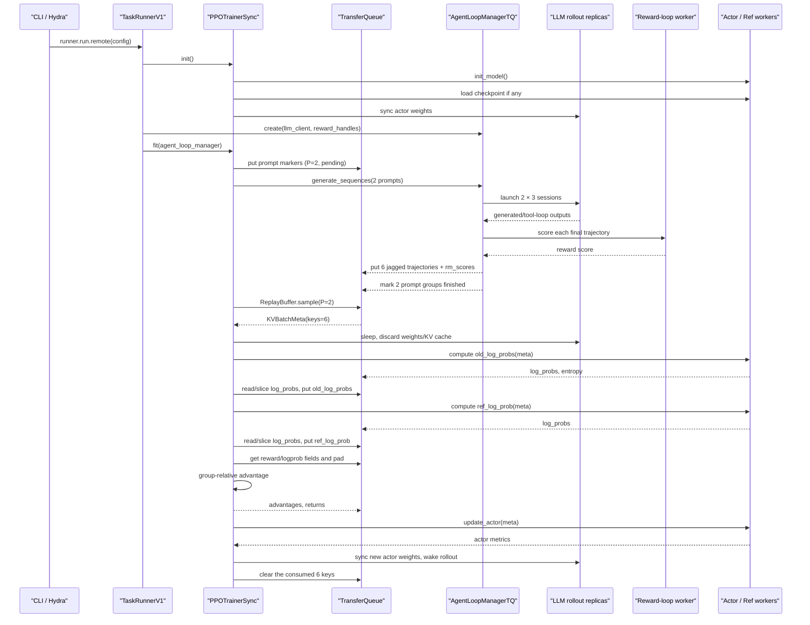

# 12. 一次 V1 Sync GRPO 训练如何跑完

> 本章基于仓库当前 `main` 分支的 `d33ddd71` 版本源码。verl 的训练器正在演进；如果以后代码结构变化，请优先相信你正在使用的版本。

这一章只回答一个问题：执行一条 GRPO 训练命令后，数据、模型和控制流究竟经过了哪些对象，最后怎样完成一次参数更新？

我们会固定一个贯穿全章的最小例子：

- 每个训练 step 读取 `P = 2` 个 prompt；
- 每个 prompt 采样 `n = 3` 条 trajectory；
- 因此在“六个 session 全部成功、每个 session 只产生一个最终输出”的简单情形下，共有 `N = P × n = 6` 条 trajectory；
- 使用当前默认的 **V1 sync trainer**；
- 使用 GRPO advantage；
- 使用 rule-based reward；
- actor loss 中启用 reference-policy KL；
- 不使用 critic。

这里的 `P=2, n=3` 是为了看清数据形状，不是推荐的生产配置。真实多 GPU 训练还必须满足 data-parallel world size、PPO mini-batch 和 token budget 的整除约束。

---

## 1. 先纠正一个最容易踩的版本陷阱

当前默认配置是：

```yaml
trainer:
  use_v1: true
  v1:
    trainer_mode: sync
```

源码见 [`ppo_trainer.yaml`](https://github.com/verl-project/verl/blob/d33ddd7140f44d392e0e10b48a8902651a1340f4/verl/trainer/config/ppo_trainer.yaml#L221-L231)。因此当前默认调用链是：

```text
main_ppo.py
└── TaskRunnerV1
    └── PPOTrainerSync
        └── PPOTrainer.fit / step / _step_once
```

旧教程中常见的 `RayPPOTrainer.fit()` 已经不是默认路径。它只有在显式设置：

```bash
trainer.use_v1=false
```

时才会走到，而且类本身已经标记为 deprecated，见 [`ray_trainer.py`](https://github.com/verl-project/verl/blob/d33ddd7140f44d392e0e10b48a8902651a1340f4/verl/trainer/ppo/ray_trainer.py#L284-L292)。本章正文全部以当前 V1 sync 为准，最后再对照 V0。

## 2. 一句话心智模型

把一次 GRPO step 想成下面这条流水线：

```text
2 个 prompt
→ rollout 对每个 prompt 各采样 3 次
→ 得到 6 条 trajectory
→ 对每条 trajectory 打分
→ 用同一 prompt 下的 3 个分数算相对 advantage
→ 重新计算 actor/ref log probability
→ 用 PPO clipped objective 更新 actor
→ 把新 actor 权重同步给 rollout engine
```

一个非常重要的认识是：

> 在 verl 中，GRPO 不是另一套训练入口。它主要替换 advantage estimator，并且通常不需要 critic；rollout、Ray worker、TransferQueue、PPO-like trainer 和 clipped policy loss 仍然复用同一套基础设施。

PPO/GAE 和 GRPO 都从 `python3 -m verl.trainer.main_ppo` 进入。主要分叉来自：

```text
# PPO/GAE
algorithm.adv_estimator=gae

# GRPO
algorithm.adv_estimator=grpo
actor_rollout_ref.rollout.n=3
```

`need_critic()` 默认只为 GAE 打开 critic，见 [`ppo/utils.py`](https://github.com/verl-project/verl/blob/d33ddd7140f44d392e0e10b48a8902651a1340f4/verl/trainer/ppo/utils.py#L96-L107)。因此典型 GRPO 的执行路径中不会出现 value inference 和 critic update。

### 2.1 五个容易混淆的角色

| 名称 | 本章中的作用 | 参数是否更新 |
|---|---|---:|
| actor | 训练模型；计算新/旧策略 log probability，并执行反向传播 | 是 |
| rollout | 用高吞吐推理后端采样 response，通常是 vLLM/SGLang | 通过 actor 同步而来 |
| reference policy | 固定的参考模型，用于 KL 约束 | 否 |
| critic | 估计 value，典型 GAE/PPO 使用 | 本章未启用 |
| reward | 对完整 trajectory 打分，可为规则、函数或 reward model | 否 |

actor 与 rollout 逻辑上是两个角色，但 sync hybrid engine 中可以共用同一批 GPU：生成阶段让 rollout 占用显存，训练阶段让 actor 占用显存，再在阶段切换时释放缓存、同步权重。

## 3. 从命令行到 trainer：真实入口调用链

官方 GRPO 示例最终执行的是：

```bash
python3 -m verl.trainer.main_ppo "${DATA[@]}" "${MODEL[@]}" \
  "${ACTOR[@]}" "${ROLLOUT[@]}" "${REF[@]}" "${TRAINER[@]}"
```

见 [`run_qwen3_8b_fsdp.sh`](https://github.com/verl-project/verl/blob/d33ddd7140f44d392e0e10b48a8902651a1340f4/examples/grpo_trainer/run_qwen3_8b_fsdp.sh#L128-L197)。为了对应本章例子，可以把关键覆盖项理解成：

```bash
# 这是配置示意，不是一条独立可运行命令；真实运行还需要数据、模型和 backend 配置。
python3 -m verl.trainer.main_ppo \
  algorithm.adv_estimator=grpo \
  algorithm.use_kl_in_reward=False \
  data.train_batch_size=2 \
  actor_rollout_ref.rollout.n=3 \
  actor_rollout_ref.actor.ppo_mini_batch_size=2 \
  actor_rollout_ref.actor.use_kl_loss=True \
  trainer.use_v1=true \
  trainer.v1.trainer_mode=sync
```

### 3.1 Hydra 做了什么

入口函数带有：

```python
@hydra.main(config_path="config", config_name="ppo_trainer", version_base=None)
def main(config):
    ...
```

见 [`main_ppo.py`](https://github.com/verl-project/verl/blob/d33ddd7140f44d392e0e10b48a8902651a1340f4/verl/trainer/main_ppo.py#L167-L197)。Hydra 大致按下面的优先级构造最终 `DictConfig`：

```text
各组件的默认 YAML
→ ppo_trainer.yaml 自己的字段
→ CLI 中的 a.b.c=value 覆盖项
→ 最终 DictConfig
```

根配置 [`ppo_trainer.yaml`](https://github.com/verl-project/verl/blob/d33ddd7140f44d392e0e10b48a8902651a1340f4/verl/trainer/config/ppo_trainer.yaml#L7-L50) 的 `defaults` 会组合 actor、rollout、reference、critic、reward、model 和 TransferQueue 等组件配置。例如 `model_engine=dp` 会选择 DP/FSDP 风格 actor/ref/critic 配置；改成 `model_engine=megatron` 时，相同插值会改选 Megatron 版本。

仓库中的 `_generated_ppo_trainer.yaml` 只是便于阅读的展开快照，不参与实际运行。

### 3.2 `main()` 到 `TaskRunnerV1`

真实调用链如下：

```text
python3 -m verl.trainer.main_ppo <Hydra overrides>
│
├── Hydra 组合配置
├── main(config)
│   ├── auto_set_device(config)
│   ├── validate_config(...)
│   └── run_ppo(config, TaskRunnerV1)
│
├── ray.init(...)
├── TaskRunnerV1.remote()
└── ray.get(runner.run.remote(config))
    └── TaskRunnerV1.run(config)
        ├── get_trainer_cls("sync")
        ├── 强制启用并初始化 TransferQueue
        ├── PPOTrainerSync(config)
        ├── trainer.init()
        ├── init_agent_loop_manager()
        └── trainer.fit(agent_loop_manager)
```

对应源码：

- Ray 初始化与远程 runner：[`main_ppo.py`](https://github.com/verl-project/verl/blob/d33ddd7140f44d392e0e10b48a8902651a1340f4/verl/trainer/main_ppo.py#L34-L100)；
- `TaskRunnerV1.run()`：[`main_ppo.py`](https://github.com/verl-project/verl/blob/d33ddd7140f44d392e0e10b48a8902651a1340f4/verl/trainer/main_ppo.py#L134-L164)；
- trainer registry：[`trainer_base.py`](https://github.com/verl-project/verl/blob/d33ddd7140f44d392e0e10b48a8902651a1340f4/verl/trainer/ppo/v1/trainer_base.py#L1830-L1857)；
- `sync` 注册：[`trainer_sync.py`](https://github.com/verl-project/verl/blob/d33ddd7140f44d392e0e10b48a8902651a1340f4/verl/trainer/ppo/v1/trainer_sync.py#L24-L42)。

注意，配置文件中 `transfer_queue.enable` 默认可以是 `false`，但进入 V1 后，`TaskRunnerV1.run()` 会强制将它设为 `true`，再调用 `tq.init()`。这不是可有可无的优化，而是 V1 trainer 的数据通路。

## 4. 进程与资源：谁在什么地方运行

不要把整个框架想成一个 Python 进程。典型 V1 sync 作业至少有以下逻辑组件：

| 组件 | 典型位置 | 主要职责 |
|---|---|---|
| launcher/main process | 提交作业的进程 | Hydra、`ray.init()`、等待 TaskRunner |
| `TaskRunnerV1` Ray actor | 单 controller | 创建 trainer、运行全局训练循环 |
| actor/ref/rollout worker group | GPU Ray actors | 模型初始化、logprob、反向传播、推理 engine |
| LLM server replicas | 与训练 GPU colocate | 响应 agent loop 的生成请求 |
| `AgentLoopWorkerTQ` | CPU Ray actors | 执行 single-turn/tool-agent loop，异步写 trajectory |
| reward-loop workers | 通常 CPU，或独立 reward GPU pool | 规则打分或 reward-model 请求 |
| TransferQueue | 共享数据层 | 按 key 存放变长 trajectory 字段与 tag |

V1 默认创建一个名为 `global_pool` 的资源池：

```python
resource_pool_spec = {
    "global_pool": [n_gpus_per_node] * nnodes,
}
```

`[4, 4]` 表示两个节点、每节点四个 GPU slot，world size 为 8。`Role`、worker class 和资源池是三件不同的事：

```text
role_worker_mapping : Role → 哪种 worker class
mapping             : Role → 去哪个资源池
resource_pool_spec  : 资源池 → 每个节点有多少 slot
```

初始化逻辑见 [`PPOTrainer._init_resource_pool_mgr()`](https://github.com/verl-project/verl/blob/d33ddd7140f44d392e0e10b48a8902651a1340f4/verl/trainer/ppo/v1/trainer_base.py#L733-L787)。多个角色映射到同一资源池时，verl 会动态构造 colocated worker class；`spawn()` 返回针对不同 role 的逻辑 worker-group 视图，但这些视图可以共享同一批 Ray actor handles。

## 5. `trainer.init()`：训练开始前创建了什么

`PPOTrainer.init()` 先执行 `_setup()`，再执行模式特有的 `on_init_end()`，见 [`trainer_base.py`](https://github.com/verl-project/verl/blob/d33ddd7140f44d392e0e10b48a8902651a1340f4/verl/trainer/ppo/v1/trainer_base.py#L217-L369)。初始化顺序可以简化为：

```text
1. 加载 tokenizer / processor
2. 创建 train/validation dataset 与 StatefulDataLoader
3. 创建 Ray resource pools
4. 创建 actor/ref/rollout worker group
5. 如需要，创建 critic worker group
6. actor_rollout_wg.init_model()
7. 创建 RewardLoopManager
8. 创建 LLMServerManager 和 rollout replicas
9. 创建 CheckpointEngineManager
10. 让 rollout replicas sleep
11. 从磁盘 checkpoint 恢复 actor/critic/dataloader
12. PPOTrainerSync.on_init_end(): actor → rollout 权重同步
```

### 5.1 worker 初始化的低层落点

`ActorRolloutRefWorker.init_model()` 会按照 role 初始化：

- fixed reference training worker；
- trainable actor training worker；
- rollout inference engine；
- 用于权重传输的 checkpoint engine。

见 [`engine_workers.py`](https://github.com/verl-project/verl/blob/d33ddd7140f44d392e0e10b48a8902651a1340f4/verl/workers/engine_workers.py#L533-L685)。actor 的 loss function 在这里绑定为 `ppo_loss`，真正的 worker RPC 则包括：

```text
compute_log_prob()      → actor.infer_batch()
compute_ref_log_prob()  → ref.infer_batch()
update_actor()          → actor.train_mini_batch()
```

见 [`engine_workers.py`](https://github.com/verl-project/verl/blob/d33ddd7140f44d392e0e10b48a8902651a1340f4/verl/workers/engine_workers.py#L687-L707)。

### 5.2 两种 “checkpoint manager” 不要混为一谈

代码里有两个容易混淆的概念：

- `trainer.checkpoint_manager` 是 `CheckpointEngineManager`，负责**训练 actor 与 rollout engine 之间的内存权重同步**；
- FSDP/Megatron 等 engine 内部的 checkpoint manager，负责把 model、optimizer、scheduler 等**写入磁盘**。

本章后面说“权重同步”时指前者，说“保存 checkpoint”时指后者。

## 6. V1 的核心数据容器：TransferQueue 与 `KVBatchMeta`

V0 常把一个完整、已 padding 的 `DataProto` 交给 controller。V1 的主要做法不同：

1. trajectory 的实际字段放在 TransferQueue 中；
2. controller 持有轻量的 `KVBatchMeta`，dispatch 层先把它转换为按 DP rank 分片的 `BatchMeta`，再通过 RPC 发送；
3. worker 收到 `BatchMeta` 后，TQ bridge 自动取出它需要的字段并物化为 `TensorDict`；
4. worker 输出的新字段再写回相同 keys。

一个 `KVBatchMeta` 可以近似理解为：

```python
KVBatchMeta(
    partition_id="train",
    keys=["uA_0_0", "uA_1_0", ...],
    tags=[{"seq_len": ...}, ...],
    fields=None,  # 也可以指定本次只读取哪些字段
    extra_info={"temperature": 1.0, ...},
)
```

它不是 trajectory 本身。真正的 `responses`、`rm_scores`、`old_log_probs` 等仍在 TransferQueue 中。

这个“meta 自动变成真实数据”的桥接由 RPC `@register` 装饰器加入，见 [`decorator.py`](https://github.com/verl-project/verl/blob/d33ddd7140f44d392e0e10b48a8902651a1340f4/verl/single_controller/base/decorator.py#L398-L442) 和 [`transferqueue_utils.py`](https://github.com/verl-project/verl/blob/d33ddd7140f44d392e0e10b48a8902651a1340f4/verl/utils/transferqueue_utils.py#L302-L419)。因此你在 trainer 侧看到：

```python
self.actor_rollout_wg.update_actor(batch)  # batch 是 KVBatchMeta
```

而 worker 方法签名里看到 `TensorDict`，并不矛盾。完整转换链是：controller 侧的 `KVBatchMeta` → RPC 载荷中的分 rank `BatchMeta` → worker 侧的 `TensorDict`。若 worker 返回需要写回 TQ 的 batch-aligned `TensorDict`，collect 才会把各 rank 的 `BatchMeta` 合并并转回 `KVBatchMeta`；`update_actor` 这类只返回 batchless metrics 的调用不走这条回程。分片与 collect 逻辑见 [`protocol.py`](https://github.com/verl-project/verl/blob/d33ddd7140f44d392e0e10b48a8902651a1340f4/verl/protocol.py#L1271-L1321)。

### 6.1 为什么要保存变长张量

两个 response 的 token 数通常不同。V1 不会一生成就把所有行永久 pad 到统一长度，而是用 jagged/nested tensor 保存：

```text
trajectory 0: responses 长度 40
trajectory 1: responses 长度 91
trajectory 2: responses 长度 17
...

TransferQueue 中逻辑形状：responses [N, jagged]
真正做 dense 数学时：     responses [N, R_max]
```

例如 colocated reward 和 advantage 阶段会显式调用 `to_padded_tensor()`；计算完成后又用原始 response offsets 把结果写回 nested tensor。这样共享存储和 RPC 不需要始终搬运大量 padding。若某个字段碰巧每一行长度完全相同，TensorDict helper 也可能直接 stack 成普通 dense tensor；“jagged”是变长数据的常见路径，不是强制标签。

### 6.2 prompt marker 与 trajectory 是两类 key

每个原始 prompt 先有一个仅含 tag 的 marker：

```text
key = uid
tag = {is_prompt: true, status: pending, global_steps: k}
```

状态流转为：

```text
pending → running → finished
                  ↘ failure
```

实际 trajectory 则使用：

```text
{uid}_{session_id}_{output_index}
```

例如 `uA_2_0` 表示 prompt A 的第 2 个 rollout session、该 session 的第 0 个输出。ReplayBuffer 通过 prompt marker 判断一个 GRPO group 是否已经全部完成，再选择对应的 trajectory keys。

## 7. V1 sync 的主循环

`PPOTrainer.fit()` 的主循环位于 [`trainer_base.py`](https://github.com/verl-project/verl/blob/d33ddd7140f44d392e0e10b48a8902651a1340f4/verl/trainer/ppo/v1/trainer_base.py#L387-L507)。忽略 profiling、dump 和少量日志后，可以读成：

```python
if val_before_train:
    validate()

while not finished:
    batch = step()

    if save_freq_hit:
        save_checkpoint()

    on_step_end()       # sync 模式在这里 actor → rollout

    if test_freq_hit:
        validate()

    compute_and_log_metrics(batch)
    clear_batch_from_transfer_queue(batch)
    global_steps += 1
```

`step()` 在 sync 模式中先提交一批 prompt，然后调用 `_step_once()`。`_step_once()` 的真实顺序是：

```text
1. ReplayBuffer.sample() 等待并取出 rollout
2. 可选：colocated reward model 打分
3. 按 data-parallel workload balance/reorder batch
4. 计算 old_log_probs
5. 可选：计算 ref_log_prob
6. 可选：critic values
7. 计算 advantages 与 returns
8. 可选：更新 critic
9. 更新 actor
```

源码见 [`PPOTrainer.step()` / `_step_once()`](https://github.com/verl-project/verl/blob/d33ddd7140f44d392e0e10b48a8902651a1340f4/verl/trainer/ppo/v1/trainer_base.py#L509-L586)。

sync 模式的 `parameter_sync_step` 为 1，所以一个 global step 只执行一次 `_step_once()`。本章的 `P=2` 表示每次取两个 prompt，与 `parameter_sync_step` 不是同一个概念；后者主要在 `separate_async` 中把一个 global step 拆成多个 local update。

## 8. 总调用时序图

下面的时序图把一次 sync GRPO step 串起来。虚线返回 TQ 的箭头表示数据字段落在 TransferQueue；controller 主要继续持有 keys/meta。



如果启用的是 colocated reward model，图中的 reward-loop worker 不会与 rollout 并行；trainer 在 `ReplayBuffer.sample()` 之后暂停 rollout，再执行 `_compute_reward_colocate()`。

## 9. `P=2, n=3`：字段与 shape 的完整演进

先定义符号：

```text
P = 2                     prompt 数量
n = 3                     每个 prompt 的采样次数
N = P × n = 6             简单情形下 trajectory 数量
p_i                       第 i 条 trajectory 的 prompt token 数
r_i                       第 i 条 trajectory 的 response token 数
R = max(r_0, ..., r_5)    当前 batch 的最大 response 长度
```

为便于阅读，用 `uA`、`uB` 代替源码生成的 UUID。

### 9.1 阶段 A：DataLoader 只返回两个 prompt

`RLHFDataset` 和 `collate_fn` 先形成一个 prompt batch。trainer 为每一行补充唯一 `uid`：

```text
row 0: uid=uA, raw_prompt=[{role: user, content: ...}], ...
row 1: uid=uB, raw_prompt=[{role: user, content: ...}], ...
```

此时 batch size 是 `P=2`，还不是 6。`_fetch_one_gen_batch()` 添加 UUID，`_next_train_batch()` 添加 `global_steps`，见 [`trainer_base.py`](https://github.com/verl-project/verl/blob/d33ddd7140f44d392e0e10b48a8902651a1340f4/verl/trainer/ppo/v1/trainer_base.py#L1315-L1343)。

### 9.2 阶段 B：注册两个 prompt marker

`_submit_batch_to_rollout()` 写入：

```text
train/uA → {is_prompt: true, status: pending, global_steps: k}
train/uB → {is_prompt: true, status: pending, global_steps: k}
```

sync 模式的 prompt marker 只存 tag；async 模式还会保存 prompt 字段以支持 checkpoint 后重发。随后 trainer 调用 `AgentLoopManagerTQ.generate_sequences(batch)`，见 [`trainer_base.py`](https://github.com/verl-project/verl/blob/d33ddd7140f44d392e0e10b48a8902651a1340f4/verl/trainer/ppo/v1/trainer_base.py#L1345-L1372)。

### 9.3 阶段 C：每个 prompt 启动三个 session

`AgentLoopWorkerTQ._run_prompt()` 读取 `rollout.n=3`，并行为同一 prompt 创建三个 task：

```text
uA: session 0, session 1, session 2
uB: session 0, session 1, session 2
```

manager 的 `generate_sequences()` 只等 CPU worker 成功把后台 task 启动起来，不等待真实生成完成。真正的等待发生在 ReplayBuffer。源码见 [`agent_loop_tq.py`](https://github.com/verl-project/verl/blob/d33ddd7140f44d392e0e10b48a8902651a1340f4/verl/trainer/ppo/v1/agent_loop_tq.py#L59-L148)。

假设每个 session 只产生一个 `AgentLoopOutput`，最终有六个 trajectory key：

```text
uA_0_0  uA_1_0  uA_2_0
uB_0_0  uB_1_0  uB_2_0
```

### 9.4 阶段 D：六条 trajectory 写入 TransferQueue

每条 `AgentLoopOutput` 至少形成以下字段：

| 字段 | 单条 shape | 六条合并后的逻辑 shape | 含义 |
|---|---:|---:|---|
| `prompts` | `[p_i]` | `[6, jagged_prompt]` | prompt token ids |
| `responses` | `[r_i]` | `[6, jagged_response]` | 模型 token 与 tool observation token |
| `response_mask` | `[r_i]` | `[6, jagged_response]` | 模型生成 token 为 1，tool observation 为 0 |
| `loss_mask` | `[r_i]` | `[6, jagged_response]` | 当前实现复制自 `response_mask` |
| `input_ids` | `[p_i+r_i]` | `[6, jagged_total]` | `prompts + responses` |
| `position_ids` | 与 input 对齐 | `[6, jagged_total]` 或多模态形式 | 位置编码输入 |
| `rollout_log_probs` | `[r_i]` | `[6, jagged_response]` | inference backend 生成时的 logprob |
| `rm_scores` | `[r_i]` | `[6, jagged_response]` | token-level reward；常把 scalar 放在末 token |
| `uid` | scalar | `[6]` | 三个 `uA` 与三个 `uB`；不要求相邻 |

`AgentLoopOutput` 的字段定义及 reward 写法见 [`agent_loop.py`](https://github.com/verl-project/verl/blob/d33ddd7140f44d392e0e10b48a8902651a1340f4/verl/experimental/agent_loop/agent_loop.py#L90-L157)，TQ postprocess 见 [`agent_loop_tq.py`](https://github.com/verl-project/verl/blob/d33ddd7140f44d392e0e10b48a8902651a1340f4/verl/trainer/ppo/v1/agent_loop_tq.py#L150-L227)。

多轮 tool agent 的 `responses` 会交错包含模型输出与工具 observation：

```text
responses:     [assistant token ...][tool result ...][assistant token ...]
response_mask: [1, 1, 1, ...        ][0, 0, 0, ...  ][1, 1, 1, ...       ]
```

因此 tool observation 可以作为后续生成的上下文，但不会直接进入 policy-gradient loss。字段语义也可参见 [`agent_loop.py`](https://github.com/verl-project/verl/blob/d33ddd7140f44d392e0e10b48a8902651a1340f4/verl/experimental/agent_loop/agent_loop.py#L581-L600)。

### 9.5 阶段 E：reward 在哪里计算

V1 有两条 reward 路径：

1. **可并行 reward 路径**：rule-based reward，或 reward model 使用独立资源池。AgentLoopWorker 在 rollout 完成后调用 reward-loop worker，然后连同 `rm_scores` 一起写 TQ；
2. **colocated reward-model 路径**：reward model 与训练模型共享 GPU。Agent loop 先写 trajectory；ReplayBuffer 取样后，trainer 暂停 rollout，读取 `prompts/responses`，padding 后调用 reward model，再把 jagged `rm_scores` 写回。

选择条件见 [`RewardLoopManager.reward_loop_worker_handles`](https://github.com/verl-project/verl/blob/d33ddd7140f44d392e0e10b48a8902651a1340f4/verl/experimental/reward_loop/reward_loop.py#L292-L302)，colocated 路径见 [`_compute_reward_colocate()`](https://github.com/verl-project/verl/blob/d33ddd7140f44d392e0e10b48a8902651a1340f4/verl/trainer/ppo/v1/trainer_base.py#L1374-L1426)。

对于 outcome reward，常见存储类似：

```text
rm_scores for uA_0_0 = [0, 0, ..., 0, 1.0]
```

后续先对 response 维求和，得到这条 trajectory 的 scalar reward。

### 9.6 阶段 F：ReplayBuffer 等待 group 完成

只有当 `uA` 的三个 session 全部 settle，marker 才会变为 `finished`；`uB` 同理。`ReplayBuffer.sample(batch_size=2)` 轮询 TQ，直到至少有两个 terminal prompt group，然后 materialize：

```python
KVBatchMeta(
    partition_id="train",
    keys=[
        "uA_0_0", "uA_1_0", "uA_2_0",
        "uB_0_0", "uB_1_0", "uB_2_0",
    ],
    tags=[... six trajectory tags ...],
)
```

上面的 key 顺序只是为了展示清楚。真实顺序可能受 trajectory 完成顺序和 TQ 枚举顺序影响；GRPO 按 `uid` 分组，并不要求同组行在 batch 中相邻。

实现见 [`ReplayBuffer.sample()`](https://github.com/verl-project/verl/blob/d33ddd7140f44d392e0e10b48a8902651a1340f4/verl/trainer/ppo/v1/replay_buffer.py#L404-L494)。这里 `batch_size=2` 指 prompt group 数，不是 trajectory 行数；返回的 meta 在本例中包含 6 个 keys。

sync hook 随后执行 `on_sample_end()`，让 rollout replicas sleep，并释放 weights/KV cache，为训练阶段腾出显存，见 [`trainer_sync.py`](https://github.com/verl-project/verl/blob/d33ddd7140f44d392e0e10b48a8902651a1340f4/verl/trainer/ppo/v1/trainer_sync.py#L35-L42)。

### 9.7 阶段 G：batch balance 可能加入 padding trajectory

在真正计算 logprob 前，`_balance_batch()` 会：

1. 查询 actor 的 DP size；
2. 计算下游要求的 batch multiple；
3. 必要时加入带 `is_padding` tag 的 padding trajectory；
4. 按序列 workload 重新排序，使各 DP rank 的 token 总量更均衡。

GRPO actor mini-batch 的 trajectory 行数由：

```python
actor.ppo_mini_batch_size * rollout.n
```

得到。若本例 `ppo_mini_batch_size=2, n=3`，则逻辑 mini-batch 为 6 行。若 DP 或其他约束要求更大的倍数，看到的实际 worker batch 可能大于 6；这不表示又生成了新的有效答案。padding 行会通过 tag 从关键 metric 中排除。见 [`_balance_batch()`](https://github.com/verl-project/verl/blob/d33ddd7140f44d392e0e10b48a8902651a1340f4/verl/trainer/ppo/v1/trainer_base.py#L1434-L1477)。

### 9.8 阶段 H：三种 log probability 不要混淆

本例会涉及三种策略概率：

| 字段 | 谁计算 | 用途 |
|---|---|---|
| `rollout_log_probs` | vLLM/SGLang rollout backend | 记录真正生成 token 时的 rollout policy 概率；可用于 rollout correction/debug |
| `old_log_probs` | training actor，在本 batch 更新前重算 | PPO ratio 的稳定 proximal anchor |
| `ref_log_prob` | fixed reference policy | KL regularization |

默认 rollout-correction 配置的 `bypass_mode=false`，所以 trainer 会让 training actor 重算 `old_log_probs`，而不是直接复制 `rollout_log_probs`：

```text
old_log_probs: [6, jagged_response]
entropy:       [6, jagged_response]
ref_log_prob:  [6, jagged_response]
```

实现见 [`_compute_old_log_prob()`](https://github.com/verl-project/verl/blob/d33ddd7140f44d392e0e10b48a8902651a1340f4/verl/trainer/ppo/v1/trainer_base.py#L1479-L1538) 和 [`_compute_ref_log_prob()`](https://github.com/verl-project/verl/blob/d33ddd7140f44d392e0e10b48a8902651a1340f4/verl/trainer/ppo/v1/trainer_base.py#L1540-L1564)。

为什么要重算？rollout engine 与 training engine 可能使用不同 kernel、精度和执行路径，而且 actor 会在 PPO mini-batch 内多次更新。固定一次 `old_log_probs`，后续才能计算稳定的：

```text
ratio_t = exp(current_log_prob_t - old_log_prob_t)
```

如果设置 `algorithm.rollout_correction.bypass_mode=true`，才会直接令 `old_log_probs = rollout_log_probs`。

### 9.9 阶段 I：把 jagged 字段 pad 成 `[6, R]`

advantage 是少数在 controller 上显式读取实际 tensor 的阶段。`_compute_advantage()` 从 TQ 取出：

```text
uid
response_mask
rm_scores
rollout_log_probs
old_log_probs
ref_log_prob
values（若存在）
```

然后调用 `to_padded_tensor()`。对本例，核心 response 字段从 `[6, jagged_response]` 暂时变成：

```text
response_mask:      [6, R]
rm_scores:          [6, R]
old_log_probs:      [6, R]
ref_log_prob:       [6, R]
token_level_scores: [6, R]
```

padding 位置由 mask 排除。

### 9.10 阶段 J：GRPO group-relative advantage 的数值例子

假设六条 trajectory 的 outcome reward 为：

```text
uA group: [1, 0, 0]
uB group: [0, 1, 1]
```

GRPO 先按 response token 维求和，得到每条 trajectory 的 scalar score：

```text
s_ij = sum_t token_level_rewards[i, j, t]
```

再在每个 `uid` group 内标准化：

```text
A_ij = (s_ij - group_mean_i) / (group_std_i + epsilon)
```

当前实现使用 `torch.std()` 的默认 sample standard deviation。因此近似得到：

```text
uA: [ 1.155, -0.577, -0.577]
uB: [-1.155,  0.577,  0.577]
```

最后把每条 trajectory 的 scalar advantage 广播到它的模型生成 token：

```text
advantages[i, t] = A_i * response_mask[i, t]
```

于是 dense `advantages` 和 `returns` 都是 `[6, R]`；tool observation 与 padding 位置为 0。写回 TQ 时，它们又被还原为：

```text
advantages: [6, jagged_response]
returns:    [6, jagged_response]
```

核心公式见 [`compute_grpo_outcome_advantage()`](https://github.com/verl-project/verl/blob/d33ddd7140f44d392e0e10b48a8902651a1340f4/verl/trainer/ppo/core_algos.py#L267-L331)，V1 多输出包装见 [`compute_advantage_for_multi_trajectories()`](https://github.com/verl-project/verl/blob/d33ddd7140f44d392e0e10b48a8902651a1340f4/verl/trainer/ppo/v1/utils.py#L148-L217)，trainer 调用见 [`_compute_advantage()`](https://github.com/verl-project/verl/blob/d33ddd7140f44d392e0e10b48a8902651a1340f4/verl/trainer/ppo/v1/trainer_base.py#L1588-L1647)。

### 9.11 一个 agent session 产生多个输出时

Tool agent 或自定义 agent loop 可能为同一个 session 返回：

```text
uA_0_0
uA_0_1
uA_0_2
```

这时总 trajectory 行数可能大于 `P × n = 6`。V1 的 GRPO 包装只让每个 `{uid}_{session_id}` 的**最大 output index**参与 group-relative advantage，然后把这个 session 的最终 advantage 广播到该 session 的较早输出。这样同一个 rollout session 不会因为产生多个中间片段而在 GRPO group 中重复占票。

更精确地说，balance 之前的有效行数是：

```text
N = sum(outputs produced by every prompt/session)
```

所以多输出 session 可令 `N > P × n`，失败或没有产出 output 的 session 也可令 `N < P × n`；之后 `_balance_batch()` 还可能补 synthetic padding rows。`P × n = 6` 只是本章的 happy path。

### 9.12 两个 KL 开关发生在不同位置

下面两个配置经常被误认为同一个东西：

```text
algorithm.use_kl_in_reward=false
actor_rollout_ref.actor.use_kl_loss=true
```

- `use_kl_in_reward=true`：在算 advantage **之前**修改 `token_level_rewards`；
- `actor_rollout_ref.actor.use_kl_loss=true`：在 actor loss 中加入 reference KL 项。

官方 GRPO 示例通常采用上面的组合：reward 本身不扣 KL，但 actor loss 用 reference KL 约束。任意一个开关启用都会使 `need_reference_policy()` 返回 true，见 [`ppo/utils.py`](https://github.com/verl-project/verl/blob/d33ddd7140f44d392e0e10b48a8902651a1340f4/verl/trainer/ppo/utils.py#L75-L80)。

### 9.13 阶段 K：actor update

`_update_actor()` 在 controller 侧把 `KVBatchMeta` 交给 actor worker group 调用。dispatch 层把它转换为按 rank 分片的 `BatchMeta`，TQ bridge 再在 worker 侧物化训练字段；worker 随后执行 PPO epochs、mini-batch、micro-batch 和反向传播。入口见 [`_update_actor()`](https://github.com/verl-project/verl/blob/d33ddd7140f44d392e0e10b48a8902651a1340f4/verl/trainer/ppo/v1/trainer_base.py#L1672-L1711) 与 [`ActorRolloutRefWorker.update_actor()`](https://github.com/verl-project/verl/blob/d33ddd7140f44d392e0e10b48a8902651a1340f4/verl/workers/engine_workers.py#L702-L707)。

默认 `policy_loss.loss_mode=vanilla`。即使 advantage 来自 GRPO，policy loss 的普通 PPO clipped core 仍是：

```text
r_t = exp(log π_theta(a_t|s_t) - old_log_probs_t)

L_clip,t = min(
    r_t * A_t,
    clip(r_t, 1-epsilon_low, 1+epsilon_high) * A_t
)
```

但这还不是默认实现的完整 objective。默认 `clip_ratio_c=3.0`，因此负 advantage 还会进入 dual-clip 分支：

```text
L_dual,t = L_clip,t                         if A_t >= 0
L_dual,t = max(L_clip,t, C_clip * A_t)      if A_t < 0

C_clip = 3.0
L_pg = -masked_mean(L_dual,t, response_mask)
```

其中 `r_t` 是当前策略与旧策略在 token `t` 上的概率比，`A_t` 是该 token 的 advantage；`epsilon_low` 和 `epsilon_high` 分别控制 ratio 的下、上裁剪边界；`C_clip > 1` 是只作用于负 advantage 的额外阈值。`L_clip,t` 与 `L_dual,t` 写成待最大化的 token objective，代码中的 `L_pg` 则是它在有效 response token 上取平均后的负值，供优化器最小化。

最后再按配置加入 entropy 和 KL：

```text
L_actor = L_pg - entropy_coeff * entropy + kl_loss_coef * KL(actor || ref)
```

这里的 `entropy_coeff` 和 `kl_loss_coef` 是实际 Hydra 字段名；后者只在 `use_kl_loss=true` 时参与 actor loss。clip、entropy 与 KL 的默认值见 [`actor.yaml`](https://github.com/verl-project/verl/blob/d33ddd7140f44d392e0e10b48a8902651a1340f4/verl/trainer/config/actor/actor.yaml#L35-L116)，实现见 [`ppo_loss()`](https://github.com/verl-project/verl/blob/d33ddd7140f44d392e0e10b48a8902651a1340f4/verl/workers/utils/losses.py#L57-L144) 和 [`compute_policy_loss_vanilla()`](https://github.com/verl-project/verl/blob/d33ddd7140f44d392e0e10b48a8902651a1340f4/verl/trainer/ppo/core_algos.py#L1283-L1374)；更完整的符号推导见[第 11 章的 asymmetric clip 与 dual clip](11_policy_and_value_update.md)。loss 只使用 `response_mask=1` 的 token；prompt、tool observation 和 padding 不产生 policy-gradient loss。

### 9.14 阶段 L：actor 权重同步回 rollout

actor 更新完成后，`PPOTrainerSync.on_step_end()` 调用：

```python
self.checkpoint_manager.update_weights(self.global_steps)
```

sync trainer 强制使用 `naive` checkpoint-engine backend。colocated worker 会：

1. 恢复 rollout 的 weights buffer；
2. 从 actor engine 导出参数；
3. 调用 rollout backend 的 `update_weights()`；
4. 必要时重新恢复 KV cache；
5. rollout 用新权重服务下一 step。

调用链见 [`CheckpointEngineManager.update_weights()`](https://github.com/verl-project/verl/blob/d33ddd7140f44d392e0e10b48a8902651a1340f4/verl/checkpoint_engine/base.py#L485-L538) 和 [`ActorRolloutRefWorker.update_weights()`](https://github.com/verl-project/verl/blob/d33ddd7140f44d392e0e10b48a8902651a1340f4/verl/workers/engine_workers.py#L719-L805)。

这一步之后才形成严格的同步节拍：

```text
rollout with policy version k
→ train actor to version k+1
→ sync rollout to version k+1
→ next rollout
```

### 9.15 阶段 M：日志与清理

trainer 最后从 TQ 读取 reward、advantages、returns、长度等字段计算 metric，记录到 console/W&B 等 backend，然后执行：

```python
tq.kv_clear(keys=batch.keys, partition_id=batch.partition_id)
```

消费完的六条 trajectory 不会留在 sync replay buffer 中等待复用；sync trainer 在语义上仍是 bufferless/on-policy 的。

整个作业退出时，`TaskRunnerV1.run()` 的 `finally` 会结束 tracking backend 并调用 `tq.close()`。这是 TQ 客户端生命周期清理，不等同于每个 step 的 `kv_clear()`。

## 10. checkpoint：保存的是什么，发生在什么时候

### 10.1 触发顺序

同一个 step 中的顺序是：

```text
rollout/reward/logprob/advantage/actor update
→ 若 save_freq 命中，保存磁盘 checkpoint
→ on_step_end(): actor 权重同步到 rollout
→ 若 test_freq 命中，validation
```

因此磁盘保存发生在 actor 更新之后、rollout 权重同步之前；保存的 actor 已经是新版本。触发条件见 [`PPOTrainer.fit()`](https://github.com/verl-project/verl/blob/d33ddd7140f44d392e0e10b48a8902651a1340f4/verl/trainer/ppo/v1/trainer_base.py#L448-L476)。

### 10.2 V1 sync 保存内容

`_save_checkpoint()` 保存：

```text
default_local_dir/
├── latest_checkpointed_iteration.txt
└── global_step_k/
    ├── actor/       # model、optimizer、scheduler/RNG 等，取决于 engine
    ├── critic/      # 只有 use_critic=True
    └── data.pt      # StatefulDataLoader 状态
```

sync 模式不保存 TransferQueue，因为 checkpoint 边界没有需要跨重启恢复的异步 in-flight pipeline；async 模式在 TQ backend 支持时会额外保存它。保存实现见 [`_save_checkpoint()`](https://github.com/verl-project/verl/blob/d33ddd7140f44d392e0e10b48a8902651a1340f4/verl/trainer/ppo/v1/trainer_base.py#L885-L957)。

### 10.3 恢复顺序

初始化时 `_load_checkpoint()` 会：

1. 根据 `resume_mode` 查找 `global_step_k`；
2. 从目录名恢复 `global_steps`；
3. 恢复 actor；
4. 如需要，恢复 critic；
5. 恢复 dataloader state；
6. sync 模式的 `on_init_end()` 把恢复后的 actor 再同步给 rollout。

见 [`_load_checkpoint()`](https://github.com/verl-project/verl/blob/d33ddd7140f44d392e0e10b48a8902651a1340f4/verl/trainer/ppo/v1/trainer_base.py#L789-L845)。

默认 `trainer.save_freq=-1`，意味着**默认不保存**。如果你以为“最后一步肯定会自动保存”，这是错误的；只有 `save_freq > 0` 时，最后一步分支才会触发。

## 11. validation：复用训练 rollout 管道，但不更新参数

validation 使用同一套 AgentLoopManager、TransferQueue 和 ReplayBuffer，但 partition 为 `val`：

```text
val_dataloader
→ 为每行生成 uid，并标记 validate=true
→ TQ(val) 写 pending prompt marker
→ agent loop 用 val_kwargs 的 sampling 参数
→ 每个 prompt 运行 val_kwargs.n 个 session
→ trajectory/rm_scores 写入 TQ(val)
→ ReplayBuffer.sample 等待完整 group
→ 只选择每个 session 的最终 output
→ decode、聚合 reward/acc/turns 等 metric
→ 清除 TQ(val)
```

实现见 [`_validate()`](https://github.com/verl-project/verl/blob/d33ddd7140f44d392e0e10b48a8902651a1340f4/verl/trainer/ppo/v1/trainer_base.py#L959-L1112)。几个细节值得单独记住：

- validation 的采样数来自 `rollout.val_kwargs.n`，不一定等于训练的 `rollout.n`；
- 多输出 agent loop 仍只用每个 session 的最大 output index 计算验证指标；
- metric 会按 `data_source → uid → variable` 聚合，而不是把所有 response 无条件混成一个均值；
- `trainer.val_before_train=true` 会在第一步更新前先验证；
- 默认 `trainer.test_freq=-1`，所以默认没有周期验证，也没有“最后一步自动验证”。

初始验证触发点见 [`fit()`](https://github.com/verl-project/verl/blob/d33ddd7140f44d392e0e10b48a8902651a1340f4/verl/trainer/ppo/v1/trainer_base.py#L413-L423)，周期/最后验证触发点见 [`fit()`](https://github.com/verl-project/verl/blob/d33ddd7140f44d392e0e10b48a8902651a1340f4/verl/trainer/ppo/v1/trainer_base.py#L466-L476)。

## 12. 三种 V1 trainer mode

三种模式复用 `PPOTrainer.fit()`、`step()` 与绝大多数数据处理逻辑，主要通过 lifecycle hook 改变 rollout/train overlap 和权重同步方式。

| mode | GPU 布局 | partial rollout | 每次权重同步 | trajectory 新鲜度 | TQ checkpoint |
|---|---|---:|---|---|---:|
| `sync` | actor/rollout colocated | 否 | 每个 step | 严格同步、最易理解 | 否 |
| `colocate_async` | actor/rollout colocated | 是 | 每个 step，生成可 warmup/恢复 | 允许受控 overlap | 是，若 backend 支持 |
| `separate_async` | trainer 与独立 rollout pool 分离 | 是 | 每 `parameter_sync_step` 个 local update | 可能有受控 staleness | 是，若 backend 支持 |

### 12.1 `sync`

- rollout 完成后 sleep，释放 weights/KV cache；
- actor 完成 update 后同步新权重并唤醒 rollout；
- 不保留跨 step 的 partial rollout。

见 [`trainer_sync.py`](https://github.com/verl-project/verl/blob/d33ddd7140f44d392e0e10b48a8902651a1340f4/verl/trainer/ppo/v1/trainer_sync.py#L24-L42)。

### 12.2 `colocate_async`

- 训练开始前可预先提交 warmup batches；
- sample 结束时 abort 未完成请求并 sleep；
- 权重同步后恢复 generation；
- trainer 与 rollout 仍共享 GPU。

见 [`trainer_colocate_async.py`](https://github.com/verl-project/verl/blob/d33ddd7140f44d392e0e10b48a8902651a1340f4/verl/trainer/ppo/v1/trainer_colocate_async.py#L25-L59)。

### 12.3 `separate_async`

- 额外创建 standalone rollout GPU pool；
- 使用非 `naive` 权重传输 backend；
- 一个 global step 可以包含多个 local actor update；
- ReplayBuffer 根据 policy-version tag 控制最大 off-policy staleness。

见 [`trainer_separate_async.py`](https://github.com/verl-project/verl/blob/d33ddd7140f44d392e0e10b48a8902651a1340f4/verl/trainer/ppo/v1/trainer_separate_async.py#L39-L143)。

学习源码时应先彻底理解 `sync`，再读 async hook。直接从 async 入手，很容易把 GRPO 数学、TransferQueue 和 pipeline overlap 三个问题混在一起。

## 13. 与 V0 `RayPPOTrainer` 的对照

| 维度 | V1 sync（当前默认） | V0 / `RayPPOTrainer` |
|---|---|---|
| 入口 runner | `TaskRunnerV1` | `main_ppo_v0.TaskRunner` |
| 主 trainer | `PPOTrainerSync` | `RayPPOTrainer` |
| 主要 trajectory carrier | TQ 中的 jagged fields + `KVBatchMeta` | controller 中的 padded `DataProto` |
| rollout 等待 | ReplayBuffer 观察 prompt group status | controller 直接等待 generation result |
| async/partial rollout 基础 | TQ + replay/sampler 原生支持 | 非当前主线 |
| 主循环 | `fit → step → _step_once` | 单个较大的 `fit()` |
| 当前状态 | 默认 | deprecated legacy |

V0 的调用链是：

```text
main_ppo.main
→ trainer.use_v1=false
→ main_ppo_v0.TaskRunner.run
→ RayPPOTrainer(...)
→ trainer.init_workers()
→ trainer.fit()
```

见 [`main_ppo.py`](https://github.com/verl-project/verl/blob/d33ddd7140f44d392e0e10b48a8902651a1340f4/verl/trainer/main_ppo.py#L184-L193) 和 [`main_ppo_v0.py`](https://github.com/verl-project/verl/blob/d33ddd7140f44d392e0e10b48a8902651a1340f4/verl/trainer/main_ppo_v0.py#L185-L234)。

两代实现的**概念顺序**并没有完全不同：都是 rollout → reward → old/ref logprob → advantage → critic/actor update → checkpoint/validation。差别主要在控制面与数据载体。V0 很适合帮助理解“一个完整 `DataProto` 如何在单 controller 中长出字段”；V1 则更接近当前真实运行方式，也为 partial rollout、异步采样和多输出 agent loop 提供了基础。

## 14. 读源码和调试时的定位顺序

如果一次训练卡住或某个字段不存在，建议按下面顺序定位：

1. **确认版本路径**：日志中的 trainer mode 是否为 `sync`，`trainer.use_v1` 是否为 true；
2. **确认 prompt 是否提交**：查看 `_submit_batch_to_rollout()` 和 TQ 中 marker 的 `pending/running/finished/failure`；
3. **确认 agent 输出**：检查 `{uid}_{session_id}_{index}` key 是否存在，以及 `response_len/seq_len` tags；
4. **确认 reward 路径**：rule-based/独立 reward pool 应在 agent postprocess 中有 `rm_scores`；colocated RM 应在 `_compute_reward_colocate()` 后出现；
5. **确认 ReplayBuffer 语义**：`batch_size` 是 prompt group 数，`len(batch.keys)` 是 trajectory row 数；
6. **确认 balance padding**：额外行是否带 `is_padding`，不要误判为额外 rollout；
7. **确认概率字段**：区分 `rollout_log_probs`、`old_log_probs` 和 `ref_log_prob`；
8. **确认 mask**：tool observation 是否正确为 `response_mask=0`；
9. **确认 advantage grouping**：本例中每个有效 `uid` 应各出现三次；行不必相邻；
10. **确认同步**：actor update 后是否执行 `on_step_end → update_weights`。

最有价值的源码断点通常是：

```text
main_ppo.py::TaskRunnerV1.run
trainer_base.py::PPOTrainer._setup
trainer_base.py::PPOTrainer._step_once
agent_loop_tq.py::AgentLoopWorkerTQ._agent_loop_postprocess
replay_buffer.py::ReplayBuffer.sample
trainer_base.py::PPOTrainer._compute_advantage
trainer_base.py::PPOTrainer._update_actor
trainer_sync.py::PPOTrainerSync.on_step_end
```

## 15. 本章总结

把全章压缩成六句话：

1. 当前默认入口是 `TaskRunnerV1 → PPOTrainerSync`，不是 legacy `RayPPOTrainer`。
2. GRPO 与 PPO 共用 trainer 基础设施；主要变化是 advantage estimator，典型 GRPO 不需要 critic。
3. V1 trajectory 的真实字段存放在 TransferQueue；数据载体依次是 controller 侧的 `KVBatchMeta`、RPC 中的分 rank `BatchMeta` 和 worker 侧的 `TensorDict`。
4. `P=2, n=3` 先提交 2 个 prompt group，再产生 6 条 trajectory；ReplayBuffer 的 batch size 与 trajectory row 数不是同一个概念。
5. reward、old/ref logprob 和 group-relative advantage 都沿相同 TQ keys 逐步“长出”新字段，actor worker 最后读取这些字段做 PPO clipped update。
6. sync trainer 每步更新结束后把 actor 权重同步给 rollout，下一轮采样才使用新 policy。

只要能从日志或 TQ 中跟踪一条 key，例如 `uA_0_0`，并回答“它现在有哪些字段、由谁写入、下一步由谁读取”，就已经掌握了 verl V1 训练主循环最核心的数据流。
