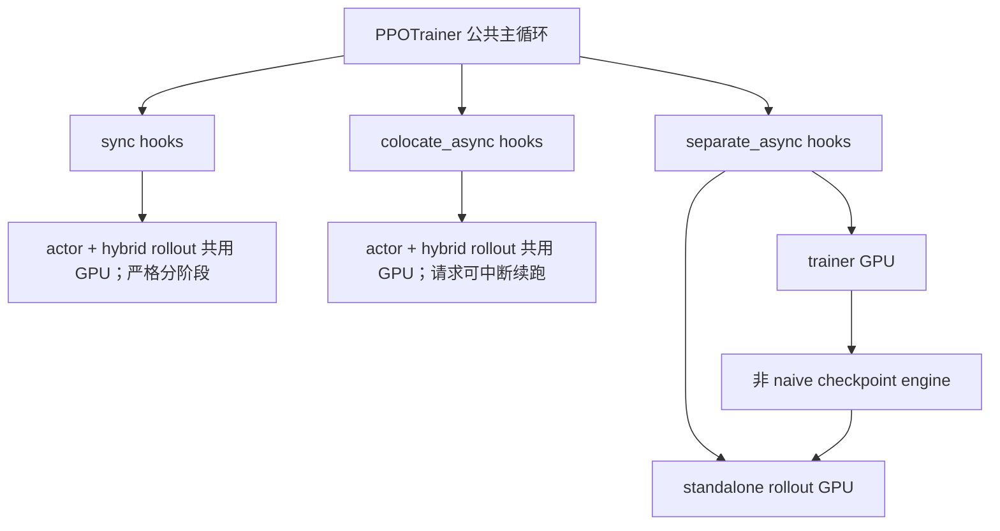
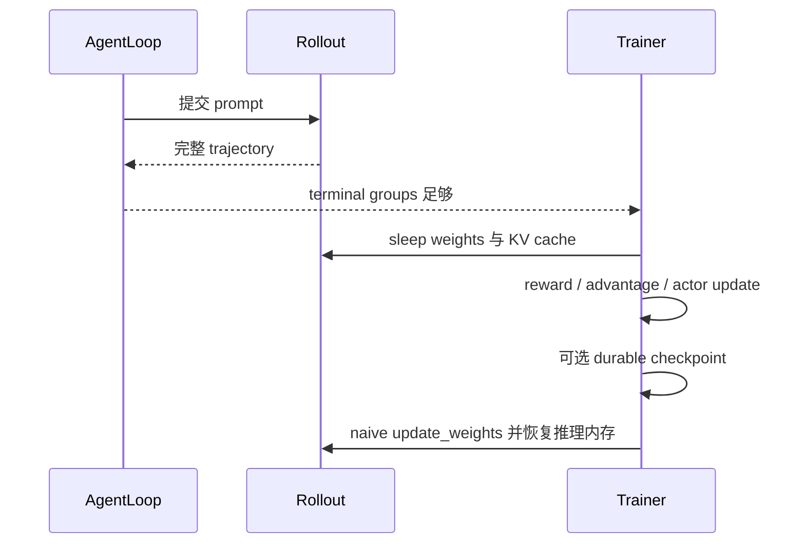
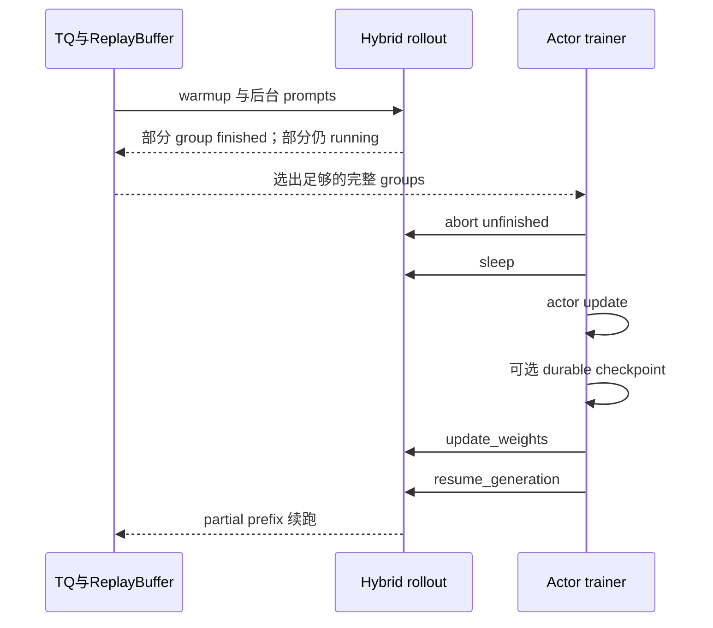
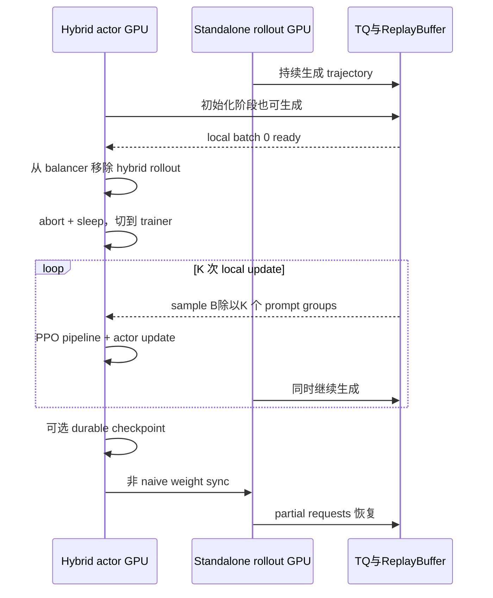
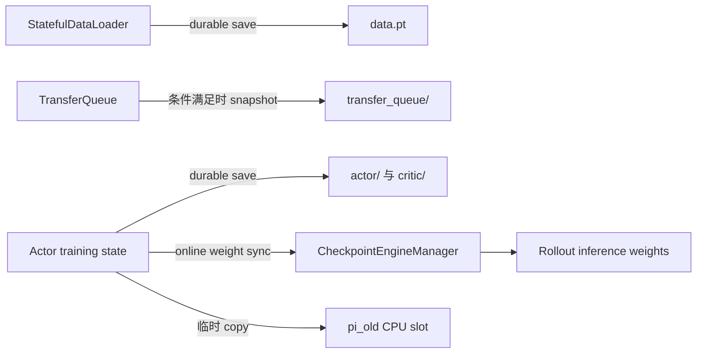
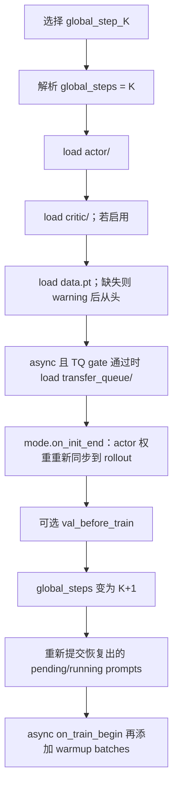
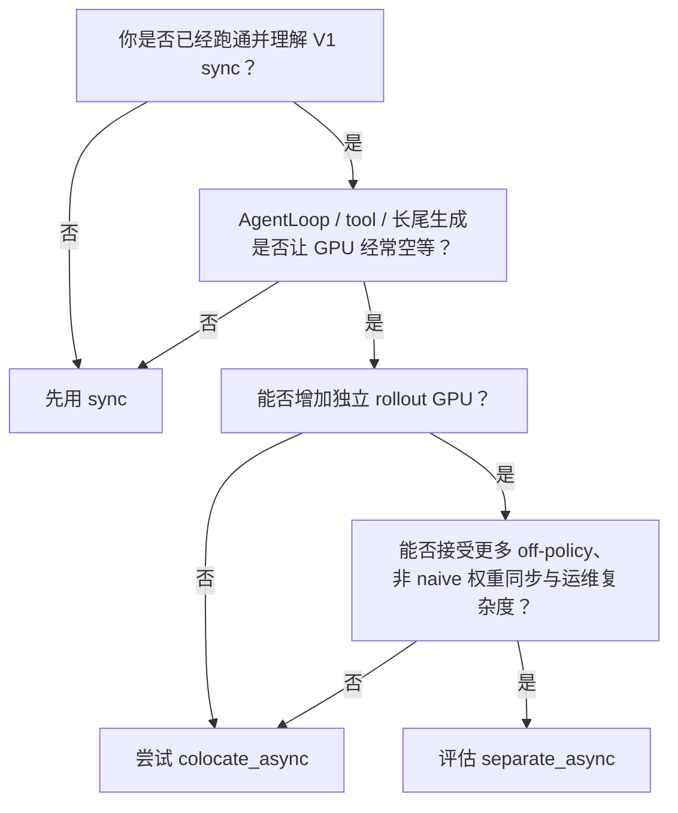

# 13. 训练模式、Partial Rollout 与 Checkpoint

> 本章基于源码快照 `d33ddd7140f44d392e0e10b48a8902651a1340f4`。重点是当前默认的 V1 trainer：`sync`、`colocate_async` 与 `separate_async`。verl 的 async 和 checkpoint 子系统还在快速演进，因此本章会明确区分“代码已经实现的能力”和“当前默认依赖真正能启用的能力”。

## 本章目标

读完以后，你应该能回答：

1. 三种 V1 trainer mode 的 GPU 布局和完整生命周期有什么不同？
2. `partial rollout` 如何跨权重更新继续生成？它保存了什么，又没有保存什么？
3. `ReplayBuffer`、TransferQueue（下文简称 TQ）和 staleness 控制是什么关系？
4. `parameter_sync_step=4` 到底表示什么？
5. checkpoint engine 和训练 checkpoint 为什么不是同一种 checkpoint？
6. 进程重启后，actor、optimizer、dataloader 和异步请求各自怎样恢复？

开始前先纠正一个容易混淆的名字：

> `trainer.v1.trainer_mode=sync` 描述的是**训练与生成的调度关系**，不表示 rollout 调用同步 API。当前唯一受支持和推荐的值是 `rollout.mode=async`；显式设置 `rollout.mode=sync` 会在配置校验阶段报错。其他未知值在 [`RolloutConfig.__post_init__()`](https://github.com/verl-project/verl/blob/d33ddd7140f44d392e0e10b48a8902651a1340f4/verl/workers/config/rollout.py#L276-L290) 阶段虽然只触发 `DeprecationWarning`，但之后构造 rollout 时仍会因为 registry 中不存在对应的 `(rollout_name, mode)` 组合而失败，见 [`get_rollout_class()`](https://github.com/verl-project/verl/blob/d33ddd7140f44d392e0e10b48a8902651a1340f4/verl/workers/rollout/base.py#L88-L106)。因此这些未知值同样不可用。

---

## 1. 前置概念：先分清四种“时间”

异步训练最难的地方，通常不是某个函数，而是同一句“step”可能在说不同层级。

### 1.1 Global step：controller 的外层迭代

`PPOTrainer.fit()` 的外层循环使用 `global_steps`。一次 global step 会经历采样、reward、log probability、advantage、actor/critic update、可选磁盘保存和 rollout 权重同步，最后才把 `global_steps += 1`，见 [`fit()`](https://github.com/verl-project/verl/blob/d33ddd7140f44d392e0e10b48a8902651a1340f4/verl/trainer/ppo/v1/trainer_base.py#L425-L503)。

在默认 `sync` 和 `colocate_async` 中，一个 global step 通常只含一次 local update。在 `separate_async` 中，一个 global step 默认包含四次 local update。

### 1.2 Local update：一次完整的小批 PPO 管道

`parameter_sync_step` 的值为 $K$ 时，一个 global step 内会循环 $K$ 次 `_step_once()`。每一次都不是单纯的一次 forward，而是：

```text
sample
→ reward
→ old/ref log probability
→ value
→ advantage/return
→ critic update
→ actor update
```

源码顺序见 [`step()` 与 `_step_once()`](https://github.com/verl-project/verl/blob/d33ddd7140f44d392e0e10b48a8902651a1340f4/verl/trainer/ppo/v1/trainer_base.py#L509-L586)。本章把这一级称为 **local update**。

### 1.3 Inner mini-batch / PPO epoch：一次 local update 内部还可能再循环

`actor.ppo_epochs` 控制同一 local batch 训练多少个 PPO epoch。训练 worker 还会把输入拆成 mini-batch，逐个调用训练 engine，见 [`train_mini_batch()`](https://github.com/verl-project/verl/blob/d33ddd7140f44d392e0e10b48a8902651a1340f4/verl/workers/engine_workers.py#L241-L333)。因此：

> `parameter_sync_step` 计算的是 controller 层的完整 local update 次数，不能无条件等同于最底层 `optimizer.step()` 的原始调用次数。

默认 actor 的 `ppo_epochs=1`，见 [`actor.yaml`](https://github.com/verl-project/verl/blob/d33ddd7140f44d392e0e10b48a8902651a1340f4/verl/trainer/config/actor/actor.yaml#L118-L125)。LR scheduler 在每次 `train_mini_batch()` 的最后一个内部 batch 后前进一步，见 [`engine_workers.py`](https://github.com/verl-project/verl/blob/d33ddd7140f44d392e0e10b48a8902651a1340f4/verl/workers/engine_workers.py#L304-L370)。

### 1.4 Rollout weight version：推理引擎实际加载的策略版本

actor 完成训练不等于 rollout 立刻看到新参数。只有 `CheckpointEngineManager.update_weights(global_steps=K)` 完成，rollout 才发布版本 $K$。一条 partial trajectory 甚至可能前半段由版本 $K-1$ 生成、后半段由版本 $K$ 生成。

后文必须一直区分：

```text
controller global step
local update
内部 optimizer/mini-batch update
rollout 已发布的 weight version
```

---

## 2. 三种模式的全局对照

V1 默认开启，默认 mode 是 `sync`；三种 mode 及默认参数见 [`ppo_trainer.yaml`](https://github.com/verl-project/verl/blob/d33ddd7140f44d392e0e10b48a8902651a1340f4/verl/trainer/config/ppo_trainer.yaml#L221-L257)。

| 维度 | `sync` | `colocate_async` | `separate_async` |
|---|---|---|---|
| actor 与 rollout GPU | colocated，共用 | colocated，共用 | actor GPU + standalone rollout GPU |
| AgentLoop client | 普通 client | `FullyAsyncLLMServerClient` | `FullyAsyncLLMServerClient` |
| partial rollout | 关闭 | 开启 | 开启 |
| actor 训练时 rollout GPU | 已 sleep，不能生成 | 已 abort + sleep，不能生成 | standalone GPU 继续生成 |
| 默认 `parameter_sync_step` | 1 | 1 | 4 |
| 权重同步 | 每个 global step，`naive` | 每个 global step，`naive` | 每个 global step；内部先做 K 次 local update |
| off-policy 风险 | 最低 | 有受控 queue/partial staleness | 通常最高 |
| 额外 GPU | 不需要 | 不需要 | 需要 |
| 实现复杂度 | 最低 | 中 | 最高 |

三种类只覆写少量 lifecycle hook；主训练管道仍由共同的 `PPOTrainer` 实现。mode 注册与 sampler 选择见 [`PPOTrainer.__init__()`](https://github.com/verl-project/verl/blob/d33ddd7140f44d392e0e10b48a8902651a1340f4/verl/trainer/ppo/v1/trainer_base.py#L125-L188)。



### 2.1 三种模式共同的保存与同步顺序

一个 global step 尾部的真实顺序是：

```text
完成 actor/critic update
→ 命中 save_freq 时保存 durable training checkpoint
→ on_step_end() 将 actor 新权重同步给 rollout
→ validation / metrics / dump
→ 清除已训练 trajectory
→ global_steps += 1
```

请特别注意：**磁盘 checkpoint 发生在 rollout 权重同步之前**，见 [`fit()`](https://github.com/verl-project/verl/blob/d33ddd7140f44d392e0e10b48a8902651a1340f4/verl/trainer/ppo/v1/trainer_base.py#L448-L498)。所以 `global_step_K/actor` 已包含第 K 步更新后的 actor，而此刻 rollout 仍可能持有旧版本。rollout 不需要写入磁盘；恢复时会从 actor checkpoint 重新同步。

---

## 3. `sync`：最容易建立正确心智模型

实现只有三个关键动作，见 [`PPOTrainerSync`](https://github.com/verl-project/verl/blob/d33ddd7140f44d392e0e10b48a8902651a1340f4/verl/trainer/ppo/v1/trainer_sync.py#L24-L42)：

1. 初始化并加载训练 checkpoint 后，把 actor 权重同步给 rollout。
2. 完整 sample batch 到手后，让 rollout sleep，丢弃推理权重和 KV cache。
3. actor 更新后，再同步权重并恢复 rollout。



这里使用普通 `LLMServerClient`，不会为 aborted request 做 prefix retry，见 [`get_llm_client()`](https://github.com/verl-project/verl/blob/d33ddd7140f44d392e0e10b48a8902651a1340f4/verl/trainer/ppo/v1/trainer_base.py#L371-L373)。普通路径的 sampler 会等足够的 terminal group；`drop`/`wait` staleness 策略在 sync 中是 no-op，见 [`ReplayBuffer` 的模式矩阵](https://github.com/verl-project/verl/blob/d33ddd7140f44d392e0e10b48a8902651a1340f4/verl/trainer/ppo/v1/replay_buffer.py#L93-L113)。

适合：

- 第一次理解或调试 V1；
- 希望尽量接近 on-policy；
- rollout 很快，pipeline overlap 收益不大；
- GPU 不够再分 standalone rollout pool。

代价是 rollout、reward/tool 等待和训练更容易串行暴露在 critical path 上。

---

## 4. `colocate_async`：请求异步，不是共享 GPU 同时训练和生成

`colocate_async` 与 `sync` 仍共用同一组 actor/rollout GPU。不同之处是它使用 [`FullyAsyncLLMServerClient`](https://github.com/verl-project/verl/blob/d33ddd7140f44d392e0e10b48a8902651a1340f4/verl/trainer/ppo/v1/trainer_colocate_async.py#L25-L46)，并在训练前预提交 warmup batch。

真实生命周期是：

```text
预提交 warmup prompts
→ 后台 AgentLoop / tool / rollout tasks 持续推进
→ ReplayBuffer 选到足够完整 terminal groups
→ abort 所有未完成推理请求
→ sleep rollout，释放推理 weights/KV
→ actor/critic 训练
→ 可选 durable checkpoint
→ 同步新权重
→ resume generation
→ 未完成逻辑任务用 partial prefix 重试
```

hook 实现见 [`PPOTrainerColocateAsync`](https://github.com/verl-project/verl/blob/d33ddd7140f44d392e0e10b48a8902651a1340f4/verl/trainer/ppo/v1/trainer_colocate_async.py#L36-L59)。



最重要的边界是：

> 这里的“异步”主要是 trajectory pipeline 异步。actor 真正训练时，共享 GPU 上的 rollout 已经被 abort 并 sleep；它并不是让 vLLM/SGLang 与 backward 在同一张 GPU 上自由并发。

默认 `num_warmup_batches=1`，见 [`ppo_trainer.yaml`](https://github.com/verl-project/verl/blob/d33ddd7140f44d392e0e10b48a8902651a1340f4/verl/trainer/config/ppo_trainer.yaml#L233-L237)。它可以隐藏 AgentLoop 中工具调用、网络等待或不同 trajectory 长度带来的尾部延迟，但会引入跨版本 partial rollout 和排队年龄。

---

## 5. `separate_async`：训练与生成真正使用不同 GPU pool

`separate_async` 同时存在两套 rollout 资源：

- **hybrid rollout**：位于 actor GPU 上，由基类创建；
- **standalone rollout**：位于独立 GPU pool，可在 actor 训练时继续生成。

初始化会创建 standalone `LLMServerManager` 和第二个 `CheckpointEngineManager`，并暂时把 hybrid replicas 也加入同一个 global load balancer，见 [`_setup()`](https://github.com/verl-project/verl/blob/d33ddd7140f44d392e0e10b48a8902651a1340f4/verl/trainer/ppo/v1/trainer_separate_async.py#L81-L101)。AgentLoop 从这个合并后的 balancer 获取 fully-async client，见 [`get_llm_client()`](https://github.com/verl-project/verl/blob/d33ddd7140f44d392e0e10b48a8902651a1340f4/verl/trainer/ppo/v1/trainer_separate_async.py#L129-L136)。

设 `parameter_sync_step` 的值为 $K$，一次周期是：

```text
standalone rollout 持续生成
hybrid rollout 初始也可参与生成
→ 第一次 local sample 完成
→ hybrid 从 load balancer 移除
→ abort + sleep hybrid，actor GPU 切回 TRAINER
→ 连续做 K 次 local update
→ 可选 durable checkpoint
→ 将最终 actor 权重同步一次给 standalone rollout
→ standalone partial requests 在新版本上继续
```



### 5.1 当前动态 spillover 的真实边界

代码提供 `switch_to_rollout()` / `switch_to_trainer()`，可以把空闲 actor GPU 上的 hybrid replicas 加入或移出 standalone load balancer，见 [`L180-L203`](https://github.com/verl-project/verl/blob/d33ddd7140f44d392e0e10b48a8902651a1340f4/verl/trainer/ppo/v1/trainer_separate_async.py#L180-L203)。但当前 [`should_switch_to_rollout()`](https://github.com/verl-project/verl/blob/d33ddd7140f44d392e0e10b48a8902651a1340f4/verl/trainer/ppo/v1/trainer_separate_async.py#L205-L207) 固定返回 `False`。

因此当前常见行为是：第一次 sample 后，hybrid GPU 长期保持 trainer 模式；只有 validation 等显式 hook 才临时切回 rollout。不要把尚未实现的自动闲置 GPU spillover 当成已有调度策略。

### 5.2 构造时的硬约束

[`PPOTrainerSeparateAsync.__init__()`](https://github.com/verl-project/verl/blob/d33ddd7140f44d392e0e10b48a8902651a1340f4/verl/trainer/ppo/v1/trainer_separate_async.py#L46-L69) 要求：

```text
data.train_batch_size
    == parameter_sync_step * actor.ppo_mini_batch_size

rollout.nnodes > 0
rollout.n_gpus_per_node > 0
rollout.checkpoint_engine.backend != naive
```

如果启用 reward model，还必须让它使用独立 resource pool，并给这个 pool 配置正数规模；reward model 本身所需的模型路径和 rollout engine 也不能省略：

```yaml
reward:
  reward_model:
    enable: true
    enable_resource_pool: true
    nnodes: 1
    n_gpus_per_node: 8
    model_path: /path/to/reward-model
    rollout:
      name: vllm
```

原因是 standalone rollout 不会为了 colocated reward model 停下来释放 GPU。未启用 reward model 时，应保持默认的 `enable: false` 和 `enable_resource_pool: false`；不能只把 `enable_resource_pool` 改成 `true`，因为 resource-pool 初始化会独立检查 `nnodes > 0` 和 `n_gpus_per_node > 0`，见 [`reward.yaml`](https://github.com/verl-project/verl/blob/d33ddd7140f44d392e0e10b48a8902651a1340f4/verl/trainer/config/reward/reward.yaml#L27-L40) 与 [`resource pool 校验`](https://github.com/verl-project/verl/blob/d33ddd7140f44d392e0e10b48a8902651a1340f4/verl/trainer/ppo/v1/trainer_base.py#L761-L770)。默认 rollout 则是 `nnodes: 0` 和 `checkpoint_engine.backend: naive`，见 [`rollout.yaml`](https://github.com/verl-project/verl/blob/d33ddd7140f44d392e0e10b48a8902651a1340f4/verl/trainer/config/rollout/rollout.yaml#L4-L14) 与 [`checkpoint engine 默认值`](https://github.com/verl-project/verl/blob/d33ddd7140f44d392e0e10b48a8902651a1340f4/verl/trainer/config/rollout/rollout.yaml#L271-L300)。所以只修改 `trainer_mode=separate_async` 一定不够。

---

## 6. Partial rollout：保留 token 前缀，不保留旧 KV cache

`colocate_async` 与 `separate_async` 都使用 `FullyAsyncLLMServerClient`。其目标是让底层 rollout 中断对上层 AgentLoop 尽量透明。

假设请求原本是：

```text
prompt = [p0, p1, p2]
response budget = 8 tokens
```

版本 10 先生成：

```text
tokens    = [a, b, c]
log_probs = [la, lb, lc]
stop_reason = aborted
```

client 会累积这三个 token/logprob，然后以新请求重发：

```text
new prompt       = [p0, p1, p2, a, b, c]
remaining budget = 8 - 3 = 5
```

若版本 11 再生成 `[d, e]`，最终逻辑输出是：

```text
token_ids         = [a, b, c, d, e]
log_probs         = [la, lb, lc, ld, le]
min_global_steps  = 10
max_global_steps  = 11
```

累积 token、logprob、routing 信息、扣减剩余 budget 和版本范围的实现见 [`FullyAsyncLLMServerClient.generate()`](https://github.com/verl-project/verl/blob/d33ddd7140f44d392e0e10b48a8902651a1340f4/verl/workers/rollout/llm_server.py#L334-L450)。

### 6.1 它恢复的是什么

- Python client 中已经返回的 token 前缀；
- 对应的逐 token rollout log probability；
- 已消费的 response token budget；
- trajectory 用过的最小/最大 rollout weight version。

### 6.2 它不恢复的是什么

- 原 inference engine request 对象；
- 原 server 上的 KV cache；
- 原采样 RNG 的精确状态；
- 跨 retry 必须命中同一台 rollout server 的硬保证。

因此 partial rollout 是“把已有 token 当作新 prefix，重新 prefill 后继续”，不是原 request 的原地续跑。Fully-async retry 会复用同一个逻辑 `request_id`，全局 load balancer 通常会把它 sticky 到同一台仍 active 的 server，见 [`GlobalRequestLoadBalancer`](https://github.com/verl-project/verl/blob/d33ddd7140f44d392e0e10b48a8902651a1340f4/verl/workers/rollout/llm_server.py#L46-L111)。但 server 被移除、sticky cache entry 被淘汰或 cache 被清空后仍会重选，所以这是 best-effort affinity，不是 KV/RNG 状态恢复或硬保证；新段始终可能使用不同权重版本，在上述重选条件下也可能使用不同 server。

### 6.3 async sampler 仍不会训练半条 trajectory

partial request 可以中断，但 ReplayBuffer 不会把 `running` group 交给 PPO。一个 prompt 的全部 $n$ 个 AgentLoop session settle 后，prompt marker 才会从 `running` 变成 `finished` 或 `failure`，见 [`AgentLoopWorkerTQ._run_prompt()`](https://github.com/verl-project/verl/blob/d33ddd7140f44d392e0e10b48a8902651a1340f4/verl/trainer/ppo/v1/agent_loop_tq.py#L107-L148)。sample 只从 terminal group 中选择，见 [`_sampleable_terminal_keys()`](https://github.com/verl-project/verl/blob/d33ddd7140f44d392e0e10b48a8902651a1340f4/verl/trainer/ppo/v1/replay_buffer.py#L319-L326)。

---

## 7. `sleep`、`wake`、`abort`、`resume` 不是同义词

| 动作 | 控制什么 | 对 partial token 的含义 |
|---|---|---|
| `abort_replicas()` | 让 server 终止所有 in-flight inference request | fully-async client 收到 `aborted` 后可保留已返回 token |
| `sleep_replicas()` | 释放 rollout weights 与 KV cache 的设备内存 | 不能靠旧 KV 原地继续 |
| `update_weights()` | 从 actor 发布新权重给 rollout | 新 segment 可能使用新 version |
| `resume_generation_replicas()` | 解除 abort 后的生成暂停 | client 重新提交 prefix；本身不等同于加载权重 |
| `wake_up_replicas()` | 恢复 rollout weights/KV 设备内存 | 是通用控制 API，trainer 主路径更多由 weight-update 流程负责恢复 |

统一控制接口见 [`CheckpointEngineManager`](https://github.com/verl-project/verl/blob/d33ddd7140f44d392e0e10b48a8902651a1340f4/verl/checkpoint_engine/base.py#L447-L483) 和 [`RolloutReplica`](https://github.com/verl-project/verl/blob/d33ddd7140f44d392e0e10b48a8902651a1340f4/verl/workers/rollout/replica.py#L265-L291)。

对于 colocated `naive` 路径，actor worker 的 `update_weights()` 会恢复 rollout weight memory、写入参数，再恢复 KV allocation，见 [`engine_workers.py`](https://github.com/verl-project/verl/blob/d33ddd7140f44d392e0e10b48a8902651a1340f4/verl/workers/engine_workers.py#L719-L805)。

对于 separate 的非 `naive` 路径，一次同步内部会：

```text
abort requests
→ release KV cache，但保留 rollout weight buffers
→ 建立 actor ↔ rollout 传输拓扑
→ send/receive/load weights
→ finalize
→ resume KV allocation
→ resume generation
```

源码见 [`CheckpointEngineManager.update_weights()`](https://github.com/verl-project/verl/blob/d33ddd7140f44d392e0e10b48a8902651a1340f4/verl/checkpoint_engine/base.py#L485-L538)。

---

## 8. ReplayBuffer：名字像经验回放，实际是 TQ 上的状态机与 sampler

不要把 V1 的 `ReplayBuffer` 想成 DQN 中固定容量、随机重复抽样的 Python 环形数组。它的事实来源是 TransferQueue：

```text
prompt marker key: uid
  status: pending → running → finished / failure

trajectory key: uid_session_id_output_index
  value: prompt_ids / response_ids / masks / reward fields / ...
  tag: length / version / status / ...
```

完整存储格式见 [`ReplayBuffer` 类说明](https://github.com/verl-project/verl/blob/d33ddd7140f44d392e0e10b48a8902651a1340f4/verl/trainer/ppo/v1/replay_buffer.py#L63-L129)。每轮 poll 时，sampler 会清空自己的 Python metadata，再从 `tq.kv_list()` 重建，见 [`_sync_metadata_from_transfer_queue()`](https://github.com/verl-project/verl/blob/d33ddd7140f44d392e0e10b48a8902651a1340f4/verl/trainer/ppo/v1/replay_buffer.py#L188-L223)。

内置选择规则是：

1. 只考虑 terminal prompt groups；
2. 按 prompt 提交时的 `global_steps` 从旧到新排序；
3. 选择 `batch_size` 个 prompt groups；
4. 立刻删除这些 prompt marker，避免再次 sample；
5. trajectory rows 留在 TQ，供 reward/actor/critic 按 key 读写；
6. 本 global step 的 metric/dump 完成后才统一清 trajectory rows。

实现见 [`_select_prompt_uids()` / `_materialize_batch()`](https://github.com/verl-project/verl/blob/d33ddd7140f44d392e0e10b48a8902651a1340f4/verl/trainer/ppo/v1/replay_buffer.py#L366-L389) 与 [`fit()` 的 cleanup](https://github.com/verl-project/verl/blob/d33ddd7140f44d392e0e10b48a8902651a1340f4/verl/trainer/ppo/v1/trainer_base.py#L478-L487)。所以 `sample(batch_size=k)` 中的 `k` 是 **prompt/GRPO group 数**，不是扁平 trajectory row 数。

### 8.1 三类 version 字段

不要把 trajectory tag 中的三个 step 字段混为一谈：

| 字段 | 含义 | 谁写入 |
|---|---|---|
| `global_steps` | prompt 在哪个 controller step 被提交 | trainer |
| `min_global_steps` | 第一个生成 segment 使用的 rollout weight version | rollout/client |
| `max_global_steps` | 最后一个生成 segment 使用的 rollout weight version | rollout/client |

prompt marker 的提交 tag 见 [`_submit_batch_to_rollout()`](https://github.com/verl-project/verl/blob/d33ddd7140f44d392e0e10b48a8902651a1340f4/verl/trainer/ppo/v1/trainer_base.py#L1345-L1360)，最终 trajectory tag 见 [`agent_loop_tq.py`](https://github.com/verl-project/verl/blob/d33ddd7140f44d392e0e10b48a8902651a1340f4/verl/trainer/ppo/v1/agent_loop_tq.py#L204-L219)。

### 8.2 当前 staleness filter 实际看的是 prompt age

设：

```text
K = 当前 controller global_steps
S = prompt 提交时的 global_steps
age = K - S + 1
```

当前 `drop` / `wait` 判断使用的是这个 `age`，不是 `max_global_steps - min_global_steps + 1`。

#### `drop`

```text
仅检查已经 finished 的 group
若 age > max_off_policy_threshold：
    删除 prompt marker 与该 group 全部 trajectory
    从 dataloader 精确补发同数量 prompt
```

边界 `age == threshold` 仍可训练。实现见 [`_stale_terminal_keys()`](https://github.com/verl-project/verl/blob/d33ddd7140f44d392e0e10b48a8902651a1340f4/verl/trainer/ppo/v1/replay_buffer.py#L503-L522) 和 [`ReplayBufferAsync.sample()`](https://github.com/verl-project/verl/blob/d33ddd7140f44d392e0e10b48a8902651a1340f4/verl/trainer/ppo/v1/replay_buffer.py#L541-L579)。

#### `wait`

```text
若任意 pending/running prompt 的 age >= threshold：
    即使已经有足够 finished groups，也暂不 sample
    等这个老请求进入 terminal 状态
```

它只是针对 **staleness eviction** 的 dropless backpressure，不保证 terminal group 一定被训练。老请求若正常 `finished` 且没有被 DAPO filter 独立淘汰，会进入 oldest-first sampling；若变成 `failure`，async sampler 无论配置 `drop` 还是 `wait` 都会将它淘汰并补发。阻塞条件见 [`_has_enough_samples()`](https://github.com/verl-project/verl/blob/d33ddd7140f44d392e0e10b48a8902651a1340f4/verl/trainer/ppo/v1/replay_buffer.py#L524-L539)，failure/DAPO eviction 见 [`_terminal_eviction_reasons()`](https://github.com/verl-project/verl/blob/d33ddd7140f44d392e0e10b48a8902651a1340f4/verl/trainer/ppo/v1/replay_buffer.py#L514-L522)。

| 策略 | 吞吐/稳定性取舍 | 风险 |
|---|---|---|
| `drop` | 不让慢请求卡住 trainer | 浪费已经做过的生成/工具工作，并改变有效数据分布 |
| `wait` | 不因 staleness 丢老请求；failure/DAPO filter 仍可淘汰 | 一个极慢 tool/request 可对采样形成 backpressure |

默认 threshold 为 8、策略为 `drop`，见 [`ppo_trainer.yaml`](https://github.com/verl-project/verl/blob/d33ddd7140f44d392e0e10b48a8902651a1340f4/verl/trainer/config/ppo_trainer.yaml#L248-L257)。validation 不做这一套 eviction。

### 8.3 实际 trajectory version range 目前主要用于 metric

代码记录：

```text
trajectory_spans
    = max_version - min_version + 1

trajectory_staleness
    = (current_global_step - 1) - max_version

trajectory_staleness_worst
    = (current_global_step - 1) - min_version
```

见 [`off-policy metrics`](https://github.com/verl-project/verl/blob/d33ddd7140f44d392e0e10b48a8902651a1340f4/verl/trainer/ppo/v1/trainer_base.py#L1800-L1827)。`global_steps - 1` 表示进入本轮更新时最近已发布的策略版本。注意这些真实版本范围当前用于观测，不是 `drop`/`wait` 的 eviction 条件。

---

## 9. `parameter_sync_step`：一个 global step 内更新 K 次，再 publish 一次

基类从当前 mode 的配置读取该值；没有显式设置时默认 1，见 [`PPOTrainer.__init__()`](https://github.com/verl-project/verl/blob/d33ddd7140f44d392e0e10b48a8902651a1340f4/verl/trainer/ppo/v1/trainer_base.py#L125-L140)。

设：

```text
B = data.train_batch_size
K = parameter_sync_step
```

则一个 global step 做：

```text
提交 B 个新 prompt
→ local 0: sample B/K 个 prompt groups，完整 PPO update
→ local 1: sample B/K 个 prompt groups，完整 PPO update
→ ...
→ local K-1: sample B/K 个 prompt groups，完整 PPO update
→ publish 最终 actor 权重一次
```

源码会检查 `B % K == 0`，见 [`step()`](https://github.com/verl-project/verl/blob/d33ddd7140f44d392e0e10b48a8902651a1340f4/verl/trainer/ppo/v1/trainer_base.py#L509-L534)。`separate_async` 还有更严格的等式：

```text
B == K * actor.ppo_mini_batch_size
```

### 9.1 数值例子

若：

```yaml
data:
  train_batch_size: 256
actor_rollout_ref:
  actor:
    ppo_mini_batch_size: 64
trainer:
  v1:
    separate_async:
      parameter_sync_step: 4
```

那么：

```text
θ0
→ 用 64 个 prompt groups 做 local update 0，得到 θ1
→ 用 64 个 prompt groups 做 local update 1，得到 θ2
→ 用 64 个 prompt groups 做 local update 2，得到 θ3
→ 用 64 个 prompt groups 做 local update 3，得到 θ4
→ rollout 只收到最终 θ4
```

LR scheduler horizon 会乘以 $K$，因为 scheduler 按 local update 前进，见 [`_init_dataloader()`](https://github.com/verl-project/verl/blob/d33ddd7140f44d392e0e10b48a8902651a1340f4/verl/trainer/ppo/v1/trainer_base.py#L710-L729)。但一个 local update 内仍可能有多个 PPO epoch/inner mini-batch，所以不要把 $K$ 机械翻译为所有后端都恰好调用 `optimizer.step()` $K$ 次。

另一个重要结果是：staleness threshold 以**发布的 weight version/global-step**为单位，不以 local update 为单位。$K=4$ 时，8 个 version 的年龄窗口最多可跨过约 32 次 controller local actor update。

### 9.2 为什么 separate mode 要把 $\pi_{\mathrm{old}}$ 存到 CPU

PPO 希望一个更新周期内的 proximal anchor $\pi_{\mathrm{old}}$ 稳定。若 $K$ 个 local batch 每次都拿“刚更新后的 actor”当 $\pi_{\mathrm{old}}$，anchor 会不断漂移。

`separate_async` 的 decoupled 路径这样做：

```text
local 0:
    将周期开始的 actor 保存到 CPU slot 0
    用它计算 old_log_probs

local 1..K-1:
    暂存当前 actor 到 CPU slot i
    恢复 CPU slot 0
    用固定 pi_old 计算 old_log_probs
    恢复 CPU slot i 的当前 actor
    清除临时 slot i
```

源码见 [`_compute_old_log_prob()`](https://github.com/verl-project/verl/blob/d33ddd7140f44d392e0e10b48a8902651a1340f4/verl/trainer/ppo/v1/trainer_separate_async.py#L103-L127)。`DetachActorWorker` 当前支持 `fsdp`、`fsdp2`、`veomni` 和 `megatron`；其他 strategy 会报 `NotImplementedError`，见 [`engine_workers.py`](https://github.com/verl-project/verl/blob/d33ddd7140f44d392e0e10b48a8902651a1340f4/verl/experimental/separation/engine_workers.py#L36-L110)。这些 CPU slots 是**临时内存快照**，不是故障恢复 checkpoint。

若 rollout correction 配置 `bypass_mode=true`，基类会直接令 `old_log_probs = rollout_log_probs`，不走这套重算，见 [`trainer_base.py`](https://github.com/verl-project/verl/blob/d33ddd7140f44d392e0e10b48a8902651a1340f4/verl/trainer/ppo/v1/trainer_base.py#L1479-L1493)。

---

## 10. “Checkpoint”一词在这里有四种不同含义

### 10.1 Checkpoint engine：在线 actor → rollout 权重传输

```text
actor training engine
→ CheckpointEngineManager
→ naive / NCCL / NIXL / ...
→ rollout server adapter
```

它传的是当前模型权重，用于让推理策略追上训练策略；不负责保存 optimizer、dataloader，也不以“进程重启后可恢复”为目标。抽象定义明确写的是 transfer weights from actor to rollout，见 [`CheckpointEngine`](https://github.com/verl-project/verl/blob/d33ddd7140f44d392e0e10b48a8902651a1340f4/verl/checkpoint_engine/base.py#L96-L205) 与 [`CheckpointEngineManager`](https://github.com/verl-project/verl/blob/d33ddd7140f44d392e0e10b48a8902651a1340f4/verl/checkpoint_engine/base.py#L361-L388)。

### 10.2 Durable training checkpoint：写磁盘用于重启

它保存 actor/critic 的训练状态、train dataloader state，以及在条件允许时的 TQ snapshot。入口是 [`PPOTrainer._save_checkpoint()`](https://github.com/verl-project/verl/blob/d33ddd7140f44d392e0e10b48a8902651a1340f4/verl/trainer/ppo/v1/trainer_base.py#L885-L957)。

### 10.3 TransferQueue checkpoint：异步经验与请求状态快照

它保存 TQ 里的 prompt markers 和 trajectory payload，解决“dataloader 已经取出，但还没有训练”的异步数据。它不是模型 checkpoint。

### 10.4 Separate mode 的 CPU $\pi_{\mathrm{old}}$ snapshot

它只是一个 global step 内为了稳定 old policy 使用的内存副本；不写磁盘、没有 optimizer/dataloader，也不会在重启后恢复。



---

## 11. Durable training checkpoint 到底保存什么

V1 不是写一个总的 `trainer_state.pt`。一次同步保存的概念目录是：

```text
default_local_dir/
├── latest_checkpointed_iteration.txt
└── global_step_K/
    ├── actor/
    ├── critic/                  # 仅启用 critic 时
    ├── data.pt                  # train StatefulDataLoader
    └── transfer_queue/         # 仅 async 且 TQ checkpoint gate 通过
```

### 11.1 Actor 与 critic

顶层 trainer 依次保存 `actor/` 和可选的 `critic/`，见 [`_save_checkpoint()`](https://github.com/verl-project/verl/blob/d33ddd7140f44d392e0e10b48a8902651a1340f4/verl/trainer/ppo/v1/trainer_base.py#L908-L936)。默认 role checkpoint 内容为：

```yaml
save_contents: [model, optimizer, extra]
load_contents: ${.save_contents}
```

通用配置定义见 [`CheckpointConfig`](https://github.com/verl-project/verl/blob/d33ddd7140f44d392e0e10b48a8902651a1340f4/verl/trainer/config/config.py#L23-L51)，actor 默认值见 [`actor.yaml`](https://github.com/verl-project/verl/blob/d33ddd7140f44d392e0e10b48a8902651a1340f4/verl/trainer/config/actor/actor.yaml#L127-L145)。`extra` 通常包括 LR scheduler 和 RNG 等 backend-specific state。

顶层 V1 trainer **不会单独持久化**：

- rollout inference server 及其 KV cache；
- reference model；
- reward model；
- teacher model；
- validation dataloader；
- logger/profiler；
- 自定义 ReplayBuffer/sampler 的私有 Python state；
- 一份可自动校验的完整 trainer config 或 dataset fingerprint。

rollout 会在恢复 actor 后重新同步；独立 reference/reward/teacher 按配置重新构建。内置 ReplayBuffer 每次从 TQ 重建 metadata，所以自身无需 `state_dict()`，但自定义 sampler 若有私有状态，当前 trainer 没有保存 hook。

### 11.2 Dataloader 与 TQ 为什么必须分开保存

异步模式会提前从 dataloader 取出 prompt：

```text
data.pt:
    记录 StatefulDataLoader 的 cursor / sampler state

transfer_queue/:
    记录已被取出的 prompt 当前 pending/running/finished 状态
    以及已经完成的 trajectory payload
```

只恢复 `data.pt` 而没有 TQ snapshot 时，cursor 会从更靠后的位置继续；那些“已经取出、尚未训练”的 prompt 可能不再出现。异步 prompt 原始 fields 被写入 TQ 正是为了恢复，见 [`_submit_batch_to_rollout()`](https://github.com/verl-project/verl/blob/d33ddd7140f44d392e0e10b48a8902651a1340f4/verl/trainer/ppo/v1/trainer_base.py#L1345-L1359)。

### 11.3 FSDP 的具体文件例子

FSDP/FSDP2 的每个 actor/critic role 目录通常包含：

```text
model_world_size_W_rank_R.pt
optim_world_size_W_rank_R.pt
extra_state_world_size_W_rank_R.pt
huggingface/
fsdp_config.json
```

保存 model shard、optimizer shard、scheduler/RNG extra state 的实现见 [`FSDPCheckpointManager.save_checkpoint()`](https://github.com/verl-project/verl/blob/d33ddd7140f44d392e0e10b48a8902651a1340f4/verl/utils/checkpoint/fsdp_checkpoint_manager.py#L272-L362)。rank 0 还会保存 HF config 与 tokenizer/processor，见 [`L364-L417`](https://github.com/verl-project/verl/blob/d33ddd7140f44d392e0e10b48a8902651a1340f4/verl/utils/checkpoint/fsdp_checkpoint_manager.py#L364-L417)。

加载代码直接用**当前** `world_size` 和 rank 拼文件名，见 [`load_checkpoint()`](https://github.com/verl-project/verl/blob/d33ddd7140f44d392e0e10b48a8902651a1340f4/verl/utils/checkpoint/fsdp_checkpoint_manager.py#L176-L270)。所以原生 resume 通常要求相同 world size、兼容的 FSDP wrapping/version/state layout；它不是自动 reshard loader。

### 11.4 保存与保留策略的现实边界

- 默认 `trainer.save_freq=-1`，所以默认连最后一步也不会保存；外层条件要求 `save_freq > 0`，见 [`ppo_trainer.yaml`](https://github.com/verl-project/verl/blob/d33ddd7140f44d392e0e10b48a8902651a1340f4/verl/trainer/config/ppo_trainer.yaml#L169-L170) 和 [`fit()`](https://github.com/verl-project/verl/blob/d33ddd7140f44d392e0e10b48a8902651a1340f4/verl/trainer/ppo/v1/trainer_base.py#L456-L461)。
- `max_actor_ckpt_to_keep` / `max_critic_ckpt_to_keep` 管的是 role checkpoint 路径，不是整棵 `global_step_K/` 的完整垃圾回收；旧 `data.pt`、TQ snapshot 或空目录可能留下。它们也不是跨重启的全局保留上限：checkpoint manager 的已保存路径列表从空开始，只登记当前进程之后的新 save，不会扫描或登记前一进程已有的 role 目录，见 [`CheckpointManager`](https://github.com/verl-project/verl/blob/d33ddd7140f44d392e0e10b48a8902651a1340f4/verl/utils/checkpoint/checkpoint_manager.py#L40-L59) 与 [`retention bookkeeping`](https://github.com/verl-project/verl/blob/d33ddd7140f44d392e0e10b48a8902651a1340f4/verl/utils/checkpoint/checkpoint_manager.py#L166-L194)。
- `auto` resume 依赖本地 tracker，不会扫描最大的 `global_step_*` 目录，见 [`find_latest_ckpt_path()`](https://github.com/verl-project/verl/blob/d33ddd7140f44d392e0e10b48a8902651a1340f4/verl/utils/checkpoint/checkpoint_manager.py#L219-L256)。
- `default_hdfs_dir` 只从顶层传给 actor/critic；`data.pt`、TQ snapshot 和 root tracker 仍只写本地。具体 backend 的远程支持也不同；例如 FSDP manager 明确把 `hdfs_path` 视为未使用参数，见 [`FSDP save docstring`](https://github.com/verl-project/verl/blob/d33ddd7140f44d392e0e10b48a8902651a1340f4/verl/utils/checkpoint/fsdp_checkpoint_manager.py#L272-L289)。
- `async_save` 当前只由 Megatron 实现，见 [`CheckpointConfig`](https://github.com/verl-project/verl/blob/d33ddd7140f44d392e0e10b48a8902651a1340f4/verl/trainer/config/config.py#L33-L49)。不要在其他 backend 上仅仅打开该 flag：顶层 trainer 会跳过 tracker 写入，而 backend 未必会代写。

同步路径会在 actor、critic、data、TQ 之后才写 tracker，可把 tracker 理解为 auto-resume 的提交标记。但整个 root checkpoint 不是一个文件系统事务；Megatron async save 的 manifest/tracker 由 backend finalizer 管理，详见 [`Megatron finalize`](https://github.com/verl-project/verl/blob/d33ddd7140f44d392e0e10b48a8902651a1340f4/verl/utils/checkpoint/megatron_checkpoint_manager.py#L1099-L1167)。生产环境仍应验证所有必需子目录完整，而不是只看到一个 `global_step_K/` 就认定可恢复。

---

## 12. Resume：从目录选择到 rollout 重新发布

### 12.1 三种 resume mode

| `trainer.resume_mode` | 行为 |
|---|---|
| `disable` | 不加载 checkpoint，`global_steps=0` |
| `auto` | 从 `default_local_dir/latest_checkpointed_iteration.txt` 找目标目录；找不到就从头训练 |
| `resume_path` | 使用显式路径；路径必须包含 `global_step_` |

实现见 [`_load_checkpoint()`](https://github.com/verl-project/verl/blob/d33ddd7140f44d392e0e10b48a8902651a1340f4/verl/trainer/ppo/v1/trainer_base.py#L789-L816)。`global_steps` 是从目录名解析的，不是从一个总 trainer state 反序列化出来的。

### 12.2 恢复顺序



actor → critic → dataloader → TQ 的 load 顺序见 [`trainer_base.py`](https://github.com/verl-project/verl/blob/d33ddd7140f44d392e0e10b48a8902651a1340f4/verl/trainer/ppo/v1/trainer_base.py#L818-L845)。基类在 load 前先让 rollout sleep，见 [`_setup()`](https://github.com/verl-project/verl/blob/d33ddd7140f44d392e0e10b48a8902651a1340f4/verl/trainer/ppo/v1/trainer_base.py#L350-L367)；各 mode 的 `on_init_end()` 再把已恢复 actor 同步给 rollout：

- [`sync`](https://github.com/verl-project/verl/blob/d33ddd7140f44d392e0e10b48a8902651a1340f4/verl/trainer/ppo/v1/trainer_sync.py#L31-L38)
- [`colocate_async`](https://github.com/verl-project/verl/blob/d33ddd7140f44d392e0e10b48a8902651a1340f4/verl/trainer/ppo/v1/trainer_colocate_async.py#L36-L53)
- [`separate_async`](https://github.com/verl-project/verl/blob/d33ddd7140f44d392e0e10b48a8902651a1340f4/verl/trainer/ppo/v1/trainer_separate_async.py#L133-L136)

恢复后默认先运行 `val_before_train`，再把 step 从 K 增到 K+1 并 reissue，见 [`fit()`](https://github.com/verl-project/verl/blob/d33ddd7140f44d392e0e10b48a8902651a1340f4/verl/trainer/ppo/v1/trainer_base.py#L413-L441)。随后 async mode 的 `on_train_begin()` 还会按配置追加 warmup batches。容量规划和排障时，要把“恢复的 in-flight prompts”和“新 warmup prompts”都算进去。

---

## 13. Async TQ 恢复：设计语义与当前默认可用性

### 13.1 如果 TQ checkpoint gate 通过

保存时，async trainer 调用：

```python
tq.save_checkpoint(
    "global_step_K/transfer_queue",
    metadata={"global_steps": K},
)
```

对应源码见 [`_save_checkpoint()`](https://github.com/verl-project/verl/blob/d33ddd7140f44d392e0e10b48a8902651a1340f4/verl/trainer/ppo/v1/trainer_base.py#L938-L946)。恢复后，`_reissue_inflight_prompts()` 会：

1. 找出 `is_prompt=True` 且状态为 `pending` / `running` 的 UID；
2. 从 TQ 读取这些 prompt 的原始 fields；
3. 删除这些 UID 已经产生的旧 partial trajectory rows；
4. 把 prompt 的 `global_steps` 更新为恢复后的 K+1；
5. 把状态重置为 `pending`；
6. 重新交给 AgentLoop，从**完整 prompt**开始生成；
7. 已经 terminal 的 `finished` / `failure` groups 和已有 trajectories 都由 reissue 原样保留；随后 async sampler 会让 finished group 正常参与采样，并淘汰、补发 failure group。

实现见 [`_reissue_inflight_prompts()`](https://github.com/verl-project/verl/blob/d33ddd7140f44d392e0e10b48a8902651a1340f4/verl/trainer/ppo/v1/trainer_base.py#L847-L883)，测试覆盖 pending/running 重投与 finished 保留，见 [`test_reissue_inflight_on_cpu.py`](https://github.com/verl-project/verl/blob/d33ddd7140f44d392e0e10b48a8902651a1340f4/tests/trainer/ppo/v1/test_reissue_inflight_on_cpu.py#L236-L309)。

必须分清两个恢复层级：

```text
同一进程内，因 sleep/weight sync 而 abort：
    FullyAsync client 保留 partial tokens
    → prompt + partial prefix 续跑

进程死亡后，从 TQ checkpoint restart：
    删除 in-flight 的旧 partial rows
    → 从原始完整 prompt 重跑
```

TQ checkpoint 不保存 inference KV cache、client coroutine stack、原 request/RNG，也不恢复工具进程内部状态。对于有外部副作用的工具调用，重投意味着工具可能再次执行；verl 这里没有提供 exactly-once side-effect 语义，工具应自行设计幂等键、去重或事务边界。

### 13.2 当前仓库的关键限制：默认依赖实际上关闭了这条路径

代码的能力 gate 要求：

```text
TransferQueue version >= 0.1.9
并且 save_checkpoint / load_checkpoint 都可调用
```

见 [`_tq_supports_checkpoint()`](https://github.com/verl-project/verl/blob/d33ddd7140f44d392e0e10b48a8902651a1340f4/verl/trainer/ppo/v1/trainer_base.py#L105-L115)。但当前仓库同时固定：

```text
requirements.txt:      TransferQueue==0.1.8
requirements-npu.txt:  TransferQueue==0.1.8
```

见 [`requirements.txt`](https://github.com/verl-project/verl/blob/d33ddd7140f44d392e0e10b48a8902651a1340f4/requirements.txt#L22-L28) 和 [`requirements-npu.txt`](https://github.com/verl-project/verl/blob/d33ddd7140f44d392e0e10b48a8902651a1340f4/requirements-npu.txt#L17-L23)。

因此，**按当前仓库声明依赖安装时**：

- async TQ snapshot 保存分支跳过；
- async TQ load 分支跳过；
- in-flight prompt reissue 分支跳过；
- trainer 不会因此报错或 warning。

这意味着只有 `data.pt` 恢复时，dataloader cursor 可能已经越过预取的 prompts，而这些 prompts 又没有 TQ snapshot 可找。不要在没有核对实际 `transfer_queue.__version__` 和 API 的情况下声称 async experience 已可容错恢复。

可以用下面的只读检查确认运行环境：

```bash
python3 -c 'import transfer_queue as tq; print(tq.__version__); print(callable(getattr(tq, "save_checkpoint", None)), callable(getattr(tq, "load_checkpoint", None)))'
```

这项能力取决于 **TransferQueue package 的版本/API**，不是 vLLM/SGLang checkpoint-engine backend。

---

## 14. 配置例子

以下都是 Hydra 合并后的局部结构示意；模型路径、rollout backend、并行度和硬件资源仍需按你的环境补齐。

### 14.1 从 `sync` 和定期保存开始

```yaml
trainer:
  use_v1: true
  save_freq: 100
  resume_mode: auto
  default_local_dir: checkpoints/my_project/my_run
  max_actor_ckpt_to_keep: 2
  max_critic_ckpt_to_keep: 2
  v1:
    trainer_mode: sync

actor_rollout_ref:
  rollout:
    mode: async              # 唯一受支持/推荐值；sync 会报错
  actor:
    checkpoint:
      save_contents: [model, optimizer, extra]
      load_contents: [model, optimizer, extra]
      async_save: false
```

从显式目录恢复：

```yaml
trainer:
  resume_mode: resume_path
  resume_from_path: checkpoints/my_project/my_run/global_step_1200
```

### 14.2 `colocate_async`

```yaml
trainer:
  v1:
    trainer_mode: colocate_async
    colocate_async:
      num_warmup_batches: 1
    sampler:
      max_off_policy_threshold: 4
      max_off_policy_strategy: drop   # 或 wait
```

这里仍不需要配置 standalone rollout `nnodes`；actor 和 rollout 共用 trainer GPU。

### 14.3 `separate_async`

```yaml
data:
  train_batch_size: 256

trainer:
  v1:
    trainer_mode: separate_async
    separate_async:
      num_warmup_batches: 1
      parameter_sync_step: 4
    sampler:
      max_off_policy_threshold: 8
      max_off_policy_strategy: drop

actor_rollout_ref:
  actor:
    ppo_mini_batch_size: 64   # 256 == 4 * 64
  rollout:
    nnodes: 1
    n_gpus_per_node: 8
    checkpoint_engine:
      backend: nccl           # 必须是当前环境真正可用的非 naive backend

reward:
  reward_model:
    enable: false
    enable_resource_pool: false
```

上面的最小示例不启用 reward model。若要启用，请把 `reward.reward_model` 块替换为 5.2 节中的完整独立 resource-pool 配置，并按实际环境填写 `model_path`、engine、节点数和每节点 GPU 数；不要单独设置 `enable_resource_pool: true`。

切换前至少核对：

```text
train_batch_size == parameter_sync_step * ppo_mini_batch_size
standalone GPU 数与 rollout TP/DP/PP 布局兼容
checkpoint-engine backend 已安装、已注册、跨节点网络可用
reward model 没有与永不暂停的 standalone rollout 非法 colocate
实际 TransferQueue 版本是否支持 checkpoint
```

---

## 15. 选择指南



### 15.1 推荐顺序

1. 先用 `sync` 建立正确 baseline，确认 reward、mask、advantage 和 loss 没问题。
2. 工具调用或长尾 generation 明显成为瓶颈时，再试 `colocate_async`。
3. 只有 profiling 证明训练与生成值得用不同 GPU 并发，而且你能接受更复杂的 staleness/weight-sync/checkpoint 运维时，再试 `separate_async`。

### 15.2 `drop` 还是 `wait`

- 更重视 trainer 不被极慢请求卡住：先试 `drop`，同时观察丢弃率和数据分布。
- rollout/tool 成本昂贵、不能接受白做：试 `wait`，同时监控最慢请求造成的 backpressure。
- 不要只看配置 threshold；同时看 `trajectory_spans`、fresh/worst staleness 和 evicted sample metrics。

### 15.3 Checkpoint 选择原则

- 要恢复训练，至少保存 `model + optimizer + extra + data.pt`。
- async mode 若要避免预取数据缺口，还必须验证 TQ snapshot 真正可用。
- `hf_model` 更适合部署/导出，不应替代 optimizer 和 backend-native model shards 来做完整训练恢复。
- 改 world size、FSDP wrapping、TP/PP/EP 或 backend 前，先做一次隔离恢复演练；不要把“目录存在”等同于“拓扑可恢复”。

---

## 16. 排障清单

### 16.1 async 训练卡在 sample

1. 查看 TQ prompt markers 是 `pending`、`running`、`finished` 还是 `failure`。
2. `wait` 策略下检查是否有一个老的 pending/running request 达到 threshold。
3. `separate_async` 检查 standalone servers 是否仍在 load balancer 中。
4. 检查 weight sync 是否停在 abort、KV release、process-group build 或 receive/load weights。
5. 区分 prompt dispatch age 与真实 `min/max_global_steps`，不要用错 metric。

### 16.2 恢复后出现数据缺口或重复工具调用

1. 检查 `data.pt` 是否存在。
2. 检查 `transfer_queue/` 是否存在。
3. 在真实环境打印 TQ version 与 save/load API。
4. 检查 log 中是否真的 reissue 了 pending/running prompts。
5. 对有副作用的 tool 验证幂等/去重机制；checkpoint restart 会从完整 prompt 重跑。

### 16.3 `auto` 没有恢复已有目录

检查 `latest_checkpointed_iteration.txt`，因为 auto 不会扫描“编号最大的目录”。如果 tracker 缺失但你已经人工确认某个 step 完整，可使用 `resume_mode=resume_path` 指向具体 `global_step_K`。

### 16.4 checkpoint 能保存却不能 load

核对：

- `save_contents` 与 `load_contents`；
- actor/critic backend 与原运行是否一致；
- world size 和 FSDP/Megatron topology；
- LoRA adapter 配置；
- optimizer/scheduler/RNG extra files；
- root tracker 指向的 role/data/TQ 子目录是否都完整。

---

## 17. 源码阅读路线与自测

建议按这个顺序读：

1. 共同主循环：[`trainer_base.py:L387-L586`](https://github.com/verl-project/verl/blob/d33ddd7140f44d392e0e10b48a8902651a1340f4/verl/trainer/ppo/v1/trainer_base.py#L387-L586)
2. 三种 hook：[`trainer_sync.py`](https://github.com/verl-project/verl/blob/d33ddd7140f44d392e0e10b48a8902651a1340f4/verl/trainer/ppo/v1/trainer_sync.py#L24-L42)、[`trainer_colocate_async.py`](https://github.com/verl-project/verl/blob/d33ddd7140f44d392e0e10b48a8902651a1340f4/verl/trainer/ppo/v1/trainer_colocate_async.py#L25-L59)、[`trainer_separate_async.py`](https://github.com/verl-project/verl/blob/d33ddd7140f44d392e0e10b48a8902651a1340f4/verl/trainer/ppo/v1/trainer_separate_async.py#L39-L207)
3. partial retry：[`llm_server.py:L281-L450`](https://github.com/verl-project/verl/blob/d33ddd7140f44d392e0e10b48a8902651a1340f4/verl/workers/rollout/llm_server.py#L281-L450)
4. TQ sampler：[`replay_buffer.py:L63-L223`](https://github.com/verl-project/verl/blob/d33ddd7140f44d392e0e10b48a8902651a1340f4/verl/trainer/ppo/v1/replay_buffer.py#L63-L223) 与 [`L497-L579`](https://github.com/verl-project/verl/blob/d33ddd7140f44d392e0e10b48a8902651a1340f4/verl/trainer/ppo/v1/replay_buffer.py#L497-L579)
5. weight sync：[`checkpoint_engine/base.py:L361-L538`](https://github.com/verl-project/verl/blob/d33ddd7140f44d392e0e10b48a8902651a1340f4/verl/checkpoint_engine/base.py#L361-L538)
6. durable save/load：[`trainer_base.py:L789-L957`](https://github.com/verl-project/verl/blob/d33ddd7140f44d392e0e10b48a8902651a1340f4/verl/trainer/ppo/v1/trainer_base.py#L789-L957)
7. FSDP checkpoint：[`fsdp_checkpoint_manager.py:L176-L476`](https://github.com/verl-project/verl/blob/d33ddd7140f44d392e0e10b48a8902651a1340f4/verl/utils/checkpoint/fsdp_checkpoint_manager.py#L176-L476)

最后尝试不看正文回答：

1. 为什么 `colocate_async` 不是同一张 GPU 上 generation 与 backward 同时运行？
2. `parameter_sync_step=4` 为什么不是“每四个 global step 同步一次”？
3. partial rollout 为什么可以跨权重版本，却不能恢复旧 KV cache？
4. 当前 `drop` 策略到底根据 prompt age 还是 `min/max_global_steps` 做 eviction？
5. 为什么只有 `data.pt` 而没有 TQ snapshot 会丢掉 async 预取数据？
6. checkpoint engine 为什么不能替代 durable training checkpoint？
7. 当前 requirements 下，为什么 TQ resume 代码虽然存在却默认不会运行？

如果这七题都能准确回答，你已经从“会调配置”走到了可以审查 V1 async lifecycle 和恢复语义的程度。
