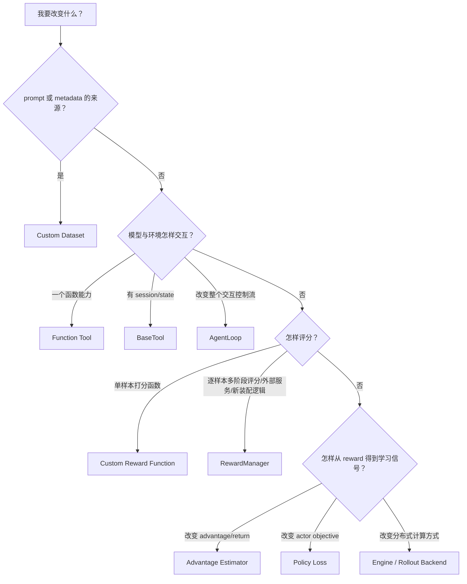
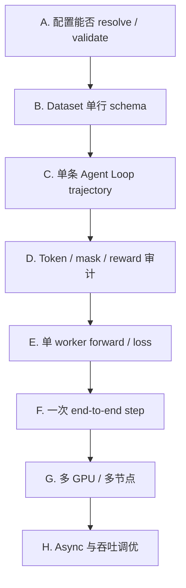

# 14. 扩展与调试：怎样改 verl，怎样知道改对了

本章不以“改哪个文件”为起点，而以 **契约** 为起点。扩展 verl 时，最常见的问题不是 Python 语法错误，而是新增组件表面可运行，却破坏了数据字段、shape、mask、生命周期或分布式假设。

## 14.1 先判断你要扩展哪一层



一个实用判断：

- 数据里已有信息，只是评分方法不同 → reward；
- 生成中间需要查询环境 → tool/agent loop；
- 同样的 trajectory，要改变相对比较或 credit assignment → advantage estimator；
- advantage 不变，但要改变优化目标 → policy loss；
- 只是 OOM/吞吐问题 → 先调 batch、parallelism、offload，不要先写新算法。

## 14.2 扩展前的四条规则

### 规则一：明确输入输出 schema

为新组件写一张表：

| 字段 | 创建者 | 类型/shape | mask 语义 | 消费者 |
|---|---|---|---|---|
| `raw_prompt` | dataset | object/list[message] | 无 | Agent Loop |
| `responses` | Agent Loop | ragged / `[B,R]` | 由 response mask 限定 | reward、actor |
| `rm_scores` | reward | `[B,R]` | 有效 response 末端通常非零 | advantage |
| `advantages` | estimator | `[B,R]` | action token 有效 | actor loss |

只要某一格说不清，先不要启动多 GPU 训练。

### 规则二：先做纯函数测试，再接 Ray

推荐顺序：

1. 直接调用你的 tokenizer/dataset/reward/tool；
2. 用一条固定 trajectory 测 shape 和数值；
3. 接入单个 Agent Loop；
4. 做很小的 end-to-end smoke test；
5. 最后扩大节点和并行度。

Ray 会让异常跨进程包装，分布式 collective 还可能把一个 rank 的异常表现成其他 rank hang。越早在本地纯函数阶段发现问题，定位越简单。

### 规则三：分清“registry 已声明”和“模块已导入”

装饰器只有在 Python 执行模块时才会注册：

```python
@register_adv_est("my_adv")
def compute_my_advantage(...):
    ...
```

如果定义这段代码的模块从未被 import，registry 里就没有 `my_adv`。当前 verl 支持通过环境变量导入外部模块：

```bash
VERL_USE_EXTERNAL_MODULES=my_project.verl_extensions \
python3 -m verl.trainer.main_ppo ...
```

入口见 [`verl/__init__.py`](https://github.com/verl-project/verl/blob/d33ddd7140f44d392e0e10b48a8902651a1340f4/verl/__init__.py)。外部包必须在 driver 和 Ray runtime 环境中都可 import，而且注册模块必须在每个查询 registry 的进程中实际执行；不要只在登录节点临时修改 `sys.path`。

如果 Ray 是预先或在集群外启动的，不要假定 driver shell 中的 `VERL_USE_EXTERNAL_MODULES` 会自动传播给 worker。自定义 policy loss 等 registry 会在 actor worker 内查询，应显式传入 Ray runtime env：

```yaml
ray_kwargs:
  ray_init:
    runtime_env:
      env_vars:
        VERL_USE_EXTERNAL_MODULES: my_project.verl_extensions
```

也可以使用安装后自动发现的 plugin entry point，或在 worker 初始化路径中显式 import 注册模块；无论采用哪种方式，都要同时保证模块代码对 worker 可见。

### 规则四：先确认 V1/V0 边界

如果你在 V0 的 `RayPPOTrainer` 中加了字段，但实际配置是 `trainer.use_v1=true`，代码可能永远不会被执行。调试前记录：

```text
git commit
trainer.use_v1
trainer.v1.trainer_mode
model_engine
actor_rollout_ref.rollout.name / actor_rollout_ref.rollout.mode
algorithm.adv_estimator / actor_rollout_ref.actor.policy_loss.loss_mode
```

## 14.3 自定义 Dataset

### 默认 dataset row 的最小语义

一个简化数据样本可以是：

```json
{
  "prompt": [
    {"role": "user", "content": "17 * 23 是多少？"}
  ],
  "data_source": "math",
  "reward_model": {"ground_truth": "391"},
  "extra_info": {
    "tool_selection": ["calculator"]
  }
}
```

默认 [`RLHFDataset`](https://github.com/verl-project/verl/blob/d33ddd7140f44d392e0e10b48a8902651a1340f4/verl/utils/dataset/rl_dataset.py) 负责读取 parquet/json/jsonl、提取 `raw_prompt` 和 metadata。当前 V1 不应假设 `__getitem__()` 已经产生最终 `input_ids`；Agent Loop 会应用 chat template 和 tokenize。

### 自定义 class 的约束

配置：

```yaml
data:
  custom_cls:
    path: /absolute/path/my_dataset.py
    name: MyDataset
```

[`get_dataset_class()`](https://github.com/verl-project/verl/blob/d33ddd7140f44d392e0e10b48a8902651a1340f4/verl/utils/dataset/rl_dataset.py) 会动态加载 class，并至少检查它继承 `torch.utils.data.Dataset`。

一个稳妥的写法是继承 `RLHFDataset`，只重写必要部分：

```python
from verl.utils.dataset.rl_dataset import RLHFDataset


class MyDataset(RLHFDataset):
    def __getitem__(self, item):
        row = super().__getitem__(item)
        row["domain"] = self.dataframe[item].get("domain", "unknown")
        return row
```

上面只是结构示例；真实底层 Dataset 对象的索引方式要按父类当前实现确认。

### Dataset 检查清单

逐项打印一条样本：

```python
sample = dataset[0]
print(sample.keys())
print(sample["raw_prompt"])
print(sample.get("reward_model"))
print(sample.get("extra_info"))
```

确认：

1. `raw_prompt` 是 chat template 能接受的 message list；
2. `reward_model.ground_truth` 的结构与 reward function 一致；
3. `data_source` 可用于选择评分器；
4. object 字段能被 collate，且每项 batch 维长度一致；
5. 没有把不可序列化的连接、文件句柄或本地对象放进 row；
6. `tool_selection` 中名称与全局注册 tool 名一致；
7. train/validation schema 相同。

更多数据路径见 [04_data_and_protocols.md](04_data_and_protocols.md)。

## 14.4 自定义 Reward Function

### 最小接口

默认 naive reward manager 调用函数时传入：

```python
def compute_score(
    data_source,
    solution_str,
    ground_truth,
    extra_info=None,
    **kwargs,
):
    ...
```

它可以返回：

- 一个 `float`；
- 一个至少带 `score` 的 dict，其他键会进入 reward extra info。

示例：

```python
import re


def compute_score(data_source, solution_str, ground_truth, extra_info=None, **kwargs):
    numbers = re.findall(r"-?\d+(?:\.\d+)?", solution_str)
    prediction = numbers[-1] if numbers else None
    correct = prediction == str(ground_truth)
    return {
        "score": 1.0 if correct else 0.0,
        "acc": float(correct),
        "parsed_answer": prediction,
    }
```

配置：

```yaml
reward:
  custom_reward_function:
    path: /absolute/path/reward.py
    name: compute_score
```

上面是兼容额外参数的简单 rule-reward 签名。配置中的 `reward_kwargs` 会继续注入关键字；启用 reward router 时还会传 `reward_router_address` 和 `reward_model_tokenizer`。加载逻辑见 [`get_custom_reward_fn()`](https://github.com/verl-project/verl/blob/d33ddd7140f44d392e0e10b48a8902651a1340f4/verl/trainer/ppo/reward.py)，naive 调用契约见 [`NaiveRewardManager.run_single()`](https://github.com/verl-project/verl/blob/d33ddd7140f44d392e0e10b48a8902651a1340f4/verl/experimental/reward_loop/reward_manager/naive.py)。同步函数会在线程 executor 中运行；async 函数会被 await。

### 不要让 reward 悄悄失败

反例：

```python
def compute_score(...):
    try:
        ...
    except Exception:
        return 0.0
```

这会把 schema 错误、parser bug、网络错误全部伪装成“模型全错”。在开发期应让未知异常抛出，或者返回明确的 `error_type` metric。

推荐监控：

```text
score mean/std/min/max
parser success rate
每个 data_source 的 accuracy
每种 error_type 数量
reward 与 response length 的相关性
同一 prompt 组内 reward 方差
```

### 何时写 RewardManager

当单个 `compute_score()` 不足以表达以下需求时，再扩展 [`RewardManagerBase`](https://github.com/verl-project/verl/blob/d33ddd7140f44d392e0e10b48a8902651a1340f4/verl/experimental/reward_loop/reward_manager/base.py)：

- 一条 trajectory 有多个阶段输出；
- 需要自定义多阶段的单样本评分与结果装配；
- 要组合多个 reward component；
- 要访问外部 reward server/router；
- 要自定义 `rm_scores` 在 token 维的装配。

可以用 registry：

```python
from verl.experimental.reward_loop.reward_manager import register
from verl.experimental.reward_loop.reward_manager.base import RewardManagerBase


@register("my_reward_manager")
class MyRewardManager(RewardManagerBase):
    def __init__(
        self,
        config,
        tokenizer,
        compute_score,
        reward_router_address=None,
        reward_model_tokenizer=None,
    ):
        super().__init__(config, tokenizer, compute_score)
        self.reward_router_address = reward_router_address
        self.reward_model_tokenizer = reward_model_tokenizer

    async def run_single(self, data):
        return {
            "reward_score": 1.0,
            "reward_extra_info": {"component_a": 0.4, "component_b": 0.6},
        }
```

同一个 batch 中，每条样本的 `reward_extra_info` 必须使用相同的 key 集；没有某个分量时也要显式填默认值，而不是省略 key。当前 [`RewardLoopManager.compute_rm_score()`](https://github.com/verl-project/verl/blob/d33ddd7140f44d392e0e10b48a8902651a1340f4/verl/experimental/reward_loop/reward_loop.py) 以第一条结果的 key 集为准，再逐条读取 `info[key]`：某条缺 key 会报错，第一条为空还会让后续样本独有的指标不进入输出。若不需要额外指标，所有样本统一返回空 dict。

registry 方式还要选择这个名字，并保证包含装饰器的模块已经导入：

```yaml
reward:
  reward_manager:
    source: register
    name: my_reward_manager
```

另一种方式是设置 `reward.reward_manager.source=importlib`，用 `reward.reward_manager.module.path` 指向文件，并把 `reward.reward_manager.name` 设为 class 名称。`module.name` 当前不参与这个 resolver。解析逻辑见 [`resolve_reward_manager_cls()`](https://github.com/verl-project/verl/blob/d33ddd7140f44d392e0e10b48a8902651a1340f4/verl/trainer/ppo/reward.py)，内置 registry 见 [`reward_manager/registry.py`](https://github.com/verl-project/verl/blob/d33ddd7140f44d392e0e10b48a8902651a1340f4/verl/experimental/reward_loop/reward_manager/registry.py)。

当前默认 Reward Loop 仍会把 batch 分给多个 worker，并为 chunk 中的每条样本并发调用 `run_single()`；`RewardManagerBase` 没有一个可直接覆写的 batch-scoring hook。若要真正改变批处理协议，需要扩展 Reward Loop/Worker，而不只是换 RewardManager。组装 token-level `rm_scores` 时可覆写 `assemble_rm_scores()`。

## 14.5 自定义 Function Tool

无 session 状态的轻量工具，优先使用 [`@function_tool`](https://github.com/verl-project/verl/blob/d33ddd7140f44d392e0e10b48a8902651a1340f4/verl/tools/function_tool.py)：

```python
from verl.tools.function_tool import function_tool


@function_tool("calculator")
def calculator(expr: str) -> str:
    """Evaluate a restricted arithmetic expression.

    Args:
        expr: Arithmetic expression containing allowed operators.
    """
    # 教学省略：真实实现必须解析 AST 并限制节点，不能直接 eval 不可信输入。
    return safe_arithmetic_eval(expr)
```

配置：

```yaml
actor_rollout_ref:
  rollout:
    agent:
      default_agent_loop: tool_agent
    multi_turn:
      enable: true
      function_tool_path: /absolute/path/tools.py
```

函数参数必须有 type hint 和可解析的 Google-style docstring；schema 默认由 Transformers 推导。函数可同步或 async，返回值可以是：

- `str` / `dict` / `ToolResponse`；
- `(response, reward)`；
- `(response, reward, metrics)`。

### Tool 的安全边界

模型生成的参数是不可信输入。工具至少应限制：

- 文件系统允许目录；
- 命令白名单和资源限额；
- 网络目标；
- SQL/API 权限；
- timeout、并发数、输出长度；
- secret 不进入 tool response 或 trace。

RL 会主动寻找 reward 漏洞；“模型现在看起来不会这样调用”不是安全边界。

## 14.6 自定义有生命周期的 BaseTool

如果工具需要显式创建/释放资源，例如临时浏览器、游戏实例或代码 sandbox，继承 [`BaseTool`](https://github.com/verl-project/verl/blob/d33ddd7140f44d392e0e10b48a8902651a1340f4/verl/tools/base_tool.py)：

```python
from verl.tools.base_tool import BaseTool
from verl.tools.schemas import ToolResponse


class CounterTool(BaseTool):
    async def create(self, instance_id=None, **kwargs):
        instance_id, _ = await super().create(instance_id, **kwargs)
        self.states[instance_id] = 0
        return instance_id, ToolResponse(text="counter ready")

    async def execute(self, instance_id, parameters, **kwargs):
        self.states[instance_id] += int(parameters["delta"])
        value = self.states[instance_id]
        return ToolResponse(text=str(value)), 0.0, {"counter": value}

    async def release(self, instance_id, **kwargs):
        self.states.pop(instance_id, None)
```

真实 class 还需要初始化 `states` 并定义/提供 tool schema。YAML 的结构由 [`initialize_tools_from_config()`](https://github.com/verl-project/verl/blob/d33ddd7140f44d392e0e10b48a8902651a1340f4/verl/tools/tool_registry.py) 读取：

```yaml
tools:
  - class_name: my_tools.CounterTool
    config:
      type: native
    tool_schema:
      type: function
      function:
        name: counter
        description: Update a temporary counter instance.
        parameters:
          type: object
          properties:
            delta:
              type: integer
          required: [delta]
```

然后设置：

```yaml
actor_rollout_ref:
  rollout:
    agent:
      default_agent_loop: tool_agent
    multi_turn:
      enable: true
      tool_config_path: /absolute/path/tools.yaml
```

这里必须以当前接线而不是抽象类注释为准：工具名存在且 arguments 能解析为 JSON 后，内置 `ToolAgentLoop` 对**每一次 BaseTool call** 执行一次

```text
create → execute → release
```

下一轮再次调用同名 BaseTool 时会重新 create，并不是一条 trajectory 共用一次 instance。FunctionTool 则直接调用函数，没有这套 lifecycle。`create()` 返回的 creation response 当前没有进入对话，`calc_reward()` 当前也没有被调用。只有 create 得到 truthy `instance_id` 时，`finally` 才会调用 release；create 抛错或返回 falsy ID 时不会 release。execute 抛异常后仍会尝试释放已有 instance，release 自身也应能安全处理部分初始化状态。真实接线见 [`ToolAgentLoop._call_tool()`](https://github.com/verl-project/verl/blob/d33ddd7140f44d392e0e10b48a8902651a1340f4/verl/experimental/agent_loop/tool_agent_loop.py)。

因此，如果环境状态必须跨多个 tool call 持续存在，不能仅依赖上述默认 instance 生命周期；需要把可恢复的 session 标识放进 trajectory 状态并由工具管理，或编写掌控完整生命周期的自定义 Agent Loop。还要注意，dataset 的 `tools_kwargs[name].create_kwargs` 当前会作为一个名为 `create_kwargs` 的嵌套参数传给 `create()`，而不是自动展开成任意关键字参数。

### 两种 Tool 可共存

`tool_config_path` 和 `function_tool_path` 会由 [`load_all_tools()`](https://github.com/verl-project/verl/blob/d33ddd7140f44d392e0e10b48a8902651a1340f4/verl/tools/tool_registry.py) 合并；名称冲突会报错。Tool Agent Loop 的每条样本还可以用：

```json
{"extra_info": {"tool_selection": ["calculator", "search"]}}
```

从全局工具集合中筛选本 trajectory 可见的 schema 和可执行工具。未知名称当前不会自动变成可调用工具，因此应在数据预处理阶段主动校验，避免样本静默缺工具。

当前判断使用 `if tool_selection`：空列表 `[]` 是 falsey，会回退为**全部全局工具**，而不是“禁用所有工具”。如果数据语义需要零工具样本，应使用 single-turn agent 或自定义明确的路由/selection 契约，不能把空列表当作 deny-all。

## 14.7 自定义 Agent Loop

只有在工具状态机不足以表达环境时才写新 Agent Loop，例如：

- 模型与用户模拟器轮流对话；
- 一个 step 产生多个阶段输出；
- 特定 stopping rule；
- 外部 agent framework 接管交互；
- trajectory 内部已能计算最终 reward。

### 输出契约

继承 [`AgentLoopBase`](https://github.com/verl-project/verl/blob/d33ddd7140f44d392e0e10b48a8902651a1340f4/verl/experimental/agent_loop/agent_loop.py)，实现 async `run()`，返回 `AgentLoopOutput`：

```python
from verl.experimental.agent_loop.agent_loop import (
    AgentLoopBase,
    AgentLoopMetrics,
    AgentLoopOutput,
)


class MyAgentLoop(AgentLoopBase):
    async def run(self, sampling_params, **kwargs):
        prompt_ids = await self.apply_chat_template(kwargs["raw_prompt"])
        generated = await self.server_manager.generate(
            request_id="...",
            prompt_ids=prompt_ids,
            sampling_params=sampling_params,
        )
        return AgentLoopOutput(
            prompt_ids=prompt_ids,
            response_ids=generated.token_ids,
            response_mask=[1] * len(generated.token_ids),
            response_logprobs=generated.log_probs,
            num_turns=2,
            metrics=AgentLoopMetrics(),
        )
```

输出必须逐位置对齐：`len(response_ids) == len(response_mask)`；`response_logprobs` 要么为 `None`，要么也必须与 `response_ids` 等长。自定义 loop 插入 environment/tool observation 时，该位置的 `response_mask` 应为 0，`response_logprobs` 也要放一个 `0.0` 占位，不能直接省略；否则 observation 后面的 assistant log-prob 会整体错位。内置 [`ToolAgentLoop`](https://github.com/verl-project/verl/blob/d33ddd7140f44d392e0e10b48a8902651a1340f4/verl/experimental/agent_loop/tool_agent_loop.py) 就同步追加这两个占位。

这是简化结构；请求 ID、multimodal、长度限制、trace、preemption 等应参考 [`SingleTurnAgentLoop`](https://github.com/verl-project/verl/blob/d33ddd7140f44d392e0e10b48a8902651a1340f4/verl/experimental/agent_loop/single_turn_agent_loop.py)。

### 注册方式

内置模块可用：

```python
from verl.experimental.agent_loop.agent_loop import register


@register("my_agent")
class MyAgentLoop(AgentLoopBase):
    ...
```

外部实现可通过 agent loop 配置文件加载：

```yaml
- name: my_agent
  _target_: my_project.agent.MyAgentLoop
```

并配置：

```yaml
actor_rollout_ref:
  rollout:
    agent:
      agent_loop_config_path: /absolute/path/agent_loops.yaml
      default_agent_loop: my_agent
```

也可以让 dataset 每行提供 `agent_name`，从而在同一个 batch 使用不同 loop。实例化位置见 [`AgentLoopWorker._run_agent_loop()`](https://github.com/verl-project/verl/blob/d33ddd7140f44d392e0e10b48a8902651a1340f4/verl/experimental/agent_loop/agent_loop.py)。

### 最容易写错的是 mask

如果环境插入 observation：

```text
assistant generation: response_mask=1
environment/tool text: response_mask=0
assistant generation: response_mask=1
```

但 observation token 仍要出现在下一轮 prompt/context 中。丢掉它，模型下一轮不知道环境返回；把 mask 标成 1，则 policy gradient 会把环境文字误当作模型 action。

## 14.8 自定义 Advantage Estimator

registry 位于 [`core_algos.py`](https://github.com/verl-project/verl/blob/d33ddd7140f44d392e0e10b48a8902651a1340f4/verl/trainer/ppo/core_algos.py)：

```python
from verl.trainer.ppo.core_algos import register_adv_est


@register_adv_est("centered_return")
def compute_centered_return_advantage(
    token_level_rewards,
    response_mask,
    **kwargs,
):
    sequence_reward = token_level_rewards.sum(dim=-1)
    centered = sequence_reward - sequence_reward.mean()
    advantages = centered[:, None] * response_mask
    returns = advantages.clone()
    return advantages, returns
```

这只是教学函数，不是推荐算法。真实 estimator 必须对照 [`compute_advantage()`](https://github.com/verl-project/verl/blob/d33ddd7140f44d392e0e10b48a8902651a1340f4/verl/trainer/ppo/ray_trainer.py) 如何组装 kwargs。对一个普通自定义 registry 名称，当前通用路径传入 `token_level_rewards`、`response_mask`、`config`，以及可选的 `index` 和 `reward_baselines`；不会自动传入 `values`、`gamma`、`lam` 或 GRPO normalization flag。GAE/GRPO 和少数按名字特殊处理的 estimator 走另外的参数分支。

配置：

```yaml
algorithm:
  adv_estimator: centered_return
```

并确保注册模块在 controller 查询 registry 前被 import，例如通过 `VERL_USE_EXTERNAL_MODULES`。

### Estimator 测试必须包含

1. 两个不同长度 response；
2. 全 padding/极短 response 边界；
3. tool observation 造成中间 `response_mask=0`；
4. 同组 reward 全相同；
5. batch 顺序打乱后，基于 uid 的 grouping 仍正确；
6. 输出无 NaN/Inf；建议防御性地把 mask 外清零，但当前通用接口并不强制所有 estimator 的原始输出都为零；
7. 与手算小例一致。

## 14.9 自定义 Policy Loss

policy loss registry 同样在 [`core_algos.py`](https://github.com/verl-project/verl/blob/d33ddd7140f44d392e0e10b48a8902651a1340f4/verl/trainer/ppo/core_algos.py)。函数签名由 `PolicyLossFn` 明确：

```python
from verl.trainer.ppo.core_algos import register_policy_loss


@register_policy_loss("my_loss")
def compute_my_policy_loss(
    old_log_prob,
    log_prob,
    advantages,
    response_mask,
    loss_agg_mode,
    config,
    rollout_is_weights=None,
):
    ...
    return pg_loss, metrics
```

然后配置：

```yaml
actor_rollout_ref:
  actor:
    policy_loss:
      loss_mode: my_loss
```

注意：`algorithm.adv_estimator` 与 `policy_loss.loss_mode` 是两个正交选择。把 estimator 名字改成 `grpo`，并不会自动把 actor loss 换成另一个名为 GRPO 的实现；GRPO 常仍配 PPO-style clipped objective。

自定义 loss 时至少检查：

- 正负 advantage 下 clip 分支是否正确；
- reduction 是否只统计有效 action token；
- DP rank 上的 normalization 是否一致；
- `loss_agg_mode` 的 sequence/token 语义；
- mixed precision 下 `exp(log_prob-old_log_prob)` 是否溢出；
- metrics 不参与 backward；
- loss 的符号与 optimizer 最小化方向一致。

worker 侧入口见 [`ppo_loss()`](https://github.com/verl-project/verl/blob/d33ddd7140f44d392e0e10b48a8902651a1340f4/verl/workers/utils/losses.py)。

## 14.10 调试的分层漏斗



不要在 H 层看到 loss 异常后，直接从 NCCL 或 load balancer 开始猜。逐层收缩问题。

## 14.11 一条样本的 token 审计模板

在正式训练前，把 token 逐位置打印成表：

```python
for i, token_id in enumerate(response_ids):
    print({
        "i": i,
        "text": tokenizer.decode([int(token_id)]),
        "attention": int(response_attention_mask[i]),
        "loss_mask": int(loss_mask[i]),
        "response_mask": int(response_mask[i]),
        "reward": float(rm_scores[i]),
        "advantage": float(advantages[i]) if advantages is not None else None,
    })
```

先记录审计发生在哪个阶段。V1 的 Agent Loop 刚写入 trajectory 时，会令 `loss_mask=response_mask`，两者都表示原始 assistant action，tool/environment observation 为 0。启用 rollout correction/rejection 后，trainer 会把被拒绝 assistant token 对应的 `response_mask` 改成 0 并写回，而原始 `loss_mask` 保持不变；因此此时 `response_mask` 是 loss 分子的有效训练 mask，`loss_mask` 是 correction 前的 action/全局 token normalization mask。没有 rejection 时二者仍相同。对应写入与 correction 接线见 [`AgentLoopWorkerTQ`](https://github.com/verl-project/verl/blob/d33ddd7140f44d392e0e10b48a8902651a1340f4/verl/trainer/ppo/v1/agent_loop_tq.py) 和 [`rollout_corr_helper.py`](https://github.com/verl-project/verl/blob/d33ddd7140f44d392e0e10b48a8902651a1340f4/verl/trainer/ppo/rollout_corr_helper.py)。

目标不是长期在训练中打印，而是验证：

```text
padding                    → attention=0, loss_mask=0, response_mask=0
保留的 assistant token    → attention=1, loss_mask=1, response_mask=1
tool observation           → attention=1, loss_mask=0, response_mask=0
被 rejection 的 assistant → attention=1, loss_mask=1, response_mask=0（仅 rejection 后）
terminal reward            → 位于最后有效 response token（按所用 manager 契约）
advantage/loss             → 分子只消费 response_mask 有效位置；token normalization 还可能统计 loss_mask
```

如果这里不对，loss 数值“看起来正常”也没有意义。

## 14.12 V1 TransferQueue 调试

V1 里 trainer 拿到的常是 `KVBatchMeta`。调试时围绕三件事：

1. `keys`：这一批引用哪些 trajectory；
2. `partition_id`：train 还是 val；
3. `tags`：prompt marker 使用 `pending/running/finished/failure` 状态；trajectory tag 使用 `status=success`、长度和 `global_steps/min/max` 等版本信息。不要把两种 key 的 tag schema 混为一谈。

建议在 bridge 边界记录 **字段名与 shape**，不要默认把所有 tensor 内容打印出来：

```text
before actor.compute_log_prob:
  keys=6
  stored_fields=[input_ids, position_ids, prompts, responses, response_mask, loss_mask]

worker output:
  produced=[log_probs, entropy]              # full sequence / nested

trainer postprocess:
  produced=[old_log_probs, entropy]          # 截取到 response 位置后写回
  old_log_probs.shape=[6, R]                 # 在需要 dense/padded 的局部阶段
```

桥接实现见 [`tqbridge`](https://github.com/verl-project/verl/blob/d33ddd7140f44d392e0e10b48a8902651a1340f4/verl/utils/transferqueue_utils.py)，trajectory 写入者是 [`AgentLoopWorkerTQ`](https://github.com/verl-project/verl/blob/d33ddd7140f44d392e0e10b48a8902651a1340f4/verl/trainer/ppo/v1/agent_loop_tq.py)，replay/staleness 见 [`replay_buffer.py`](https://github.com/verl-project/verl/blob/d33ddd7140f44d392e0e10b48a8902651a1340f4/verl/trainer/ppo/v1/replay_buffer.py)。

### 常见症状

| 症状 | 优先检查 |
|---|---|
| worker 说缺字段 | 上一阶段是否写回 TQ；字段名是否一致；bridge 声明 |
| batch size 突然变化 | `rollout.n`、refill、过滤失败 group、repeat |
| 一直等不到样本 | prompt status、Agent Loop exception、staleness strategy |
| train/val 混数据 | `partition_id` |
| resume 后重复/丢 prompt | TQ checkpoint 支持、in-flight reissue 日志 |

## 14.13 分布式 hang 的定位顺序

hang 常常不是“Ray 坏了”。按顺序检查：

1. 是否有某个 rank 先抛 Python exception；
2. 所有 rank 是否进入同一个 worker method；
3. dispatch 后每个 rank 的 batch 是否满足整除/shape 约束；
4. 是否只有部分 rank 进入 collective；
5. TP/PP/DP world size 与资源实际数量是否匹配；
6. 某个 rollout request 是否没有 timeout/终止条件；
7. colocated 状态是否卡在 sleep/wake/abort；
8. 最后才检查网络、NCCL/HCCL、端口和节点故障。

一个 rank 的 OOM 可能导致其他 rank 卡在 all-reduce。必须找最早发生的错误，而不是只看最后一个超时。

## 14.14 OOM 的定位顺序

先判断发生阶段：

```text
rollout OOM      → KV cache / max_num_batched_tokens / max_num_seqs / response length
log-prob OOM     → inference micro batch / dynamic batching / sequence length
actor update OOM → training micro batch / activations / optimizer / FSDP offload
weight sync OOM  → weight materialization / bucket / colocated wake state
reward OOM       → reward model batch / independent resource pool
```

再判断显存构成：

```text
parameters + gradients + optimizer states + activations + temporary buffers + KV cache
```

不要只减 `train_batch_size`。如果 optimizer step 的 mini-batch 会继续被切成 micro-batch，真正控制峰值的可能是 micro-batch 或 max token；如果是 rollout KV cache，actor micro-batch 完全无关。

## 14.15 Loss 不学习的定位顺序

### Reward 层

- reward 是否几乎全相同？
- 是否 parser 大量失败并统一给零分？
- tool reward 是否真正进入最终 reward？
- GRPO 同组内是否有方差？

### Advantage 层

- `advantages` 的 mean/std/min/max；
- loss 使用的 effective mask 是否正确；原始 advantage 在 mask 外非零不必然是 bug；
- uid grouping 是否正确；
- 是否因标准化或全同 reward 变成全零；
- 使用的 estimator 是否符合 tool-observation credit assignment 需求。

### Policy 层

- 首个 mini-batch 的 old/current log-prob 是否合理接近；ratio≈1 本身正常，不能据此推断 gradient 为零；
- PPO ratio 和 clip fraction；
- KL 是否大到压过 reward；
- grad norm、learning rate、optimizer step 是否真实发生；
- trainable parameter 数量是否为预期值；
- LoRA/冻结规则是否选错模块。

### 权重闭环

- actor 参数在 step 后是否改变；
- rollout 是否同步到新 `global_steps`；
- 生成结果是否仍来自旧 replica；
- async 数据是否超过 off-policy threshold。

## 14.16 Tool Agent 专项故障表

| 症状 | 可能原因 | 检查点 |
|---|---|---|
| 模型从不调用工具 | schema 未注入、chat template 不支持、训练数据无格式示例 | active schemas、rendered prompt |
| 生成 tool call 但解析失败 | parser format 与模型格式不匹配 | `multi_turn.format`、原始 token/text |
| `unknown tool` | 每样本 selection 过滤、名称不一致 | 全局 tools、`extra_info.tool_selection` |
| 工具返回后模型像没看见 | observation 未拼入下一轮上下文 | messages/token sequence |
| loss 训练工具返回文本 | `response_mask` 错标为 1 | token 审计表 |
| session 越跑越多 | exception 时未 release | create/release 数量与 timeout |
| reward 很高但行为退化 | 工具或 parser 存在 reward hack | 保存完整 trajectory 人工审计 |

状态机见 [`ToolAgentLoop`](https://github.com/verl-project/verl/blob/d33ddd7140f44d392e0e10b48a8902651a1340f4/verl/experimental/agent_loop/tool_agent_loop.py)，完整专题见 [09_tool_agent_loop.md](09_tool_agent_loop.md)。

## 14.17 最小 smoke test 设计

不要一上来跑完整 epoch。一个有诊断价值的 smoke test 应满足：

```text
2 条 prompt
rollout.n = 2 或 3
很短 prompt/response limit
只运行 1～2 个 step
固定随机种子
开启 trajectory dump / rollout trace
保存 update 前后一个小参数切片或 checksum
```

验收：

1. 每条 prompt 得到预期数量的最终 trajectory；
2. FunctionTool 调用次数符合预期；若使用 BaseTool，再检查成功 create 的 session 与 release 配对；
3. reward 能手算；
4. advantage 与小例一致；
5. old/ref/current log-prob 字段不混；
6. actor grad norm 非零且有限；
7. update 后 actor 权重改变；
8. sync 后 rollout version 改变；
9. checkpoint 恢复后 global step 和 dataloader 连续。

## 14.18 可观测性：该记录什么

### 数据质量

```text
prompt/response/action-token length distribution
truncation rate
tool call count / parse failure / execution failure
reward component distribution
group reward std
```

### 算法健康度

```text
advantage mean/std
return mean/std
old/current/ref log-prob
importance ratio
clip fraction
approx KL / reference KL
entropy
value loss / explained variance
grad norm / learning rate
```

### 系统性能

```text
rollout latency / queue wait / preemption
tokens per second
actor forward/backward/update time
weight sync time
GPU allocated/reserved memory
replay buffer size
sample model-version lag
```

只看总 `reward` 和总 `loss`，无法区分是数据、算法还是系统出了问题。

## 14.19 修改源码时的测试矩阵

| 变化 | 单元测试 | 集成测试 | 回归观察 |
|---|---|---|---|
| dataset | schema/collate | 1 batch Agent Loop | 长度和过滤数量 |
| reward | 手算 case/异常 case | reward loop | score 分布 |
| tool | schema/execute/release | 一条 multi-turn | mask、泄漏、timeout |
| agent loop | 状态转移 | rollout server | token/mask/终止 |
| estimator | 小 tensor 手算 | one step | advantage 分布 |
| policy loss | 数值与梯度 | one update | ratio/clip/KL |
| worker/engine | dispatch/shape | 多 rank | collective/OOM |
| async trainer | 状态机 | resume + staleness | 丢样本/重复样本 |

## 14.20 一个完整扩展示例：给数学 Agent 增加工具和评分

目标：模型调用 calculator，最后回答正确得 1 分。

### 数据

```json
{
  "prompt": [{"role": "user", "content": "17*23=?"}],
  "data_source": "tool_math",
  "reward_model": {"ground_truth": "391"},
  "extra_info": {"tool_selection": ["calculator"]}
}
```

### Tool

```python
@function_tool("calculator")
def calculator(expr: str) -> str:
    """Evaluate a basic arithmetic expression.

    Args:
        expr: Basic arithmetic expression.
    """
    return parse_and_evaluate(expr)
```

### Reward

```python
def compute_score(data_source, solution_str, ground_truth, extra_info=None):
    final = extract_final_answer(solution_str)
    return {
        "score": float(final == str(ground_truth)),
        "answer_ok": float(final == str(ground_truth)),
        "tool_calls": len((extra_info or {}).get("tool_rewards", [])),
    }
```

### 数据流验收

```text
dataset row
→ raw_prompt + tool_selection + ground_truth
→ ToolAgentLoop 只注入 calculator schema
→ model tool-call tokens: response_mask=1
→ calculator observation tokens: response_mask=0
→ model final-answer tokens: response_mask=1
→ reward function 解码完整 response，得到 score=1
→ rm_scores 最后有效 response 位置为 1
→ GRPO 与同 prompt 的其他 samples 比较
→ advantage 广播到模型 action tokens
→ policy loss 不训练 calculator observation
```

只要这条链中的每个箭头都能用实际字段和日志证明，扩展才算真正接通。

## 14.21 调试时常用的源码入口

- 配置合并与验证：[`main_ppo.py`](https://github.com/verl-project/verl/blob/d33ddd7140f44d392e0e10b48a8902651a1340f4/verl/trainer/main_ppo.py)、[`utils/config.py`](https://github.com/verl-project/verl/blob/d33ddd7140f44d392e0e10b48a8902651a1340f4/verl/utils/config.py)
- Dataset：[`rl_dataset.py`](https://github.com/verl-project/verl/blob/d33ddd7140f44d392e0e10b48a8902651a1340f4/verl/utils/dataset/rl_dataset.py)
- V1 step：[`trainer_base.py`](https://github.com/verl-project/verl/blob/d33ddd7140f44d392e0e10b48a8902651a1340f4/verl/trainer/ppo/v1/trainer_base.py)
- TransferQueue bridge：[`transferqueue_utils.py`](https://github.com/verl-project/verl/blob/d33ddd7140f44d392e0e10b48a8902651a1340f4/verl/utils/transferqueue_utils.py)
- Replay/staleness：[`replay_buffer.py`](https://github.com/verl-project/verl/blob/d33ddd7140f44d392e0e10b48a8902651a1340f4/verl/trainer/ppo/v1/replay_buffer.py)
- Agent Loop：[`agent_loop.py`](https://github.com/verl-project/verl/blob/d33ddd7140f44d392e0e10b48a8902651a1340f4/verl/experimental/agent_loop/agent_loop.py)
- Tool Agent：[`tool_agent_loop.py`](https://github.com/verl-project/verl/blob/d33ddd7140f44d392e0e10b48a8902651a1340f4/verl/experimental/agent_loop/tool_agent_loop.py)
- Tool registry：[`tool_registry.py`](https://github.com/verl-project/verl/blob/d33ddd7140f44d392e0e10b48a8902651a1340f4/verl/tools/tool_registry.py)
- Reward loop：[`reward_loop.py`](https://github.com/verl-project/verl/blob/d33ddd7140f44d392e0e10b48a8902651a1340f4/verl/experimental/reward_loop/reward_loop.py)
- Reward loading：[`reward.py`](https://github.com/verl-project/verl/blob/d33ddd7140f44d392e0e10b48a8902651a1340f4/verl/trainer/ppo/reward.py)
- Advantage/loss：[`core_algos.py`](https://github.com/verl-project/verl/blob/d33ddd7140f44d392e0e10b48a8902651a1340f4/verl/trainer/ppo/core_algos.py)
- Worker loss：[`losses.py`](https://github.com/verl-project/verl/blob/d33ddd7140f44d392e0e10b48a8902651a1340f4/verl/workers/utils/losses.py)
- Engine worker：[`engine_workers.py`](https://github.com/verl-project/verl/blob/d33ddd7140f44d392e0e10b48a8902651a1340f4/verl/workers/engine_workers.py)
- Rollout routing：[`llm_server.py`](https://github.com/verl-project/verl/blob/d33ddd7140f44d392e0e10b48a8902651a1340f4/verl/workers/rollout/llm_server.py)
- Weight sync：[`checkpoint_engine/base.py`](https://github.com/verl-project/verl/blob/d33ddd7140f44d392e0e10b48a8902651a1340f4/verl/checkpoint_engine/base.py)

下一章给出更完整的“问题 → 文件 → symbol”源码地图和术语表。
