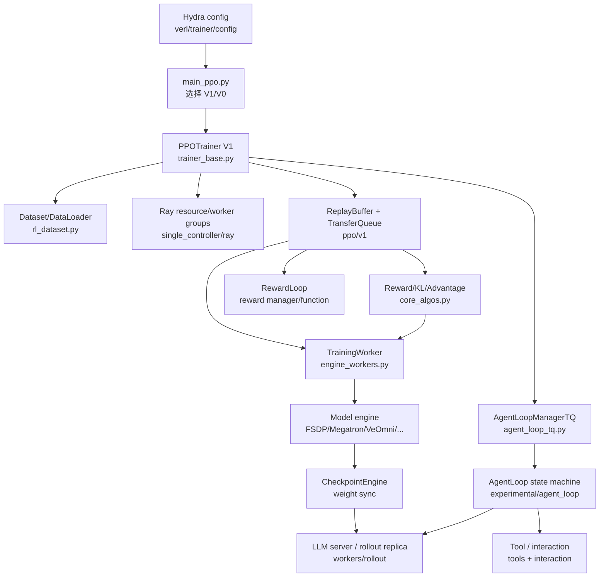

# 15. 源码地图、术语表与阅读训练

前面的章节回答“verl 怎样工作”；这一章回答“以后遇到问题，我该从哪一行源码开始找”。

这不是按目录逐文件介绍。大型项目的目录树很容易让初学者产生一种错觉：仿佛必须先读完所有基础类，才有资格理解训练流程。更有效的方法是从一个具体问题出发，沿着调用链只追踪与它有关的对象、字段和远程边界。

本章提供五样东西：

1. 按问题组织的源码入口。
2. 当前 V1 与 legacy V0 的分界线。
3. 关键术语表。
4. 建议断点、日志变量和 `rg` 检索词。
5. 从纯静态阅读到单步训练的循序练习与自测题。

> 本章对应当前仓库的 `0.9.0.dev` 快照。默认配置启用 V1 trainer（[`ppo_trainer.yaml`](https://github.com/verl-project/verl/blob/d33ddd7140f44d392e0e10b48a8902651a1340f4/verl/trainer/config/ppo_trainer.yaml#L222-L228)）。看到 `RayPPOTrainer`、controller 上的大型 padded `DataProto` 时，先确认自己是否进入了 legacy 路径。

## 15.1 阅读源码时始终带着四张便签

每进入一个函数，先写下四件事：

```text
对象：输入和输出究竟是什么类型？
单位：dim 0 是 prompt、trajectory、token，还是 worker？
位置：真数据在 controller、Ray worker、GPU，还是 TransferQueue？
来源：哪个 config 字段决定了这条分支？
```

例如，看到 `batch` 这个变量名本身几乎得不到信息；下面三种 `batch` 完全不同：

```text
DataLoader dict     -> P 个 prompt
KVBatchMeta         -> P*n 条 trajectory 的 key/tag
GPU micro-batch     -> 当前 rank 本次 forward 的一小部分 trajectory/token
```

如果读到一半迷路，不要继续向下翻页。回到最近一次“对象类型或单位发生变化”的位置，重新确认这四项。

## 15.2 一页总地图



先记住每个目录的职责，不必立刻记住所有类名：

| 目录 | 主要回答的问题 |
| --- | --- |
| `verl/trainer/` | 一步训练按什么顺序发生？ |
| `verl/single_controller/` | controller 如何调用和切分 Ray workers？ |
| `verl/experimental/agent_loop/` | 一条 prompt 如何经历生成、工具和环境交互？ |
| `verl/workers/rollout/` | 请求怎样送到 vLLM/SGLang/TRT-LLM 等 serving backend？ |
| `verl/workers/engine/` | actor/critic/ref 怎样 forward、backward 与 optimizer step？ |
| `verl/checkpoint_engine/` | 训练权重怎样同步给 rollout replica？ |
| `verl/experimental/reward_loop/` | reward function/model 怎样被调度？ |
| `verl/tools/` | 工具 schema、生命周期和执行接口是什么？ |
| `verl/utils/` | 数据、mask、配置、设备、日志等共享机制在哪里？ |
| `tests/` | 某个行为最小且可验证的例子在哪里？ |

## 15.3 按问题找源码

### 问题 1：命令启动以后，最先发生什么？

从 [`verl/trainer/main_ppo.py`](https://github.com/verl-project/verl/blob/d33ddd7140f44d392e0e10b48a8902651a1340f4/verl/trainer/main_ppo.py#L33-L193) 开始，按下面顺序读：

1. `main(config)`：校验配置，并根据 `trainer.use_v1` 选择入口。
2. `run_ppo()`：初始化 Ray runtime，创建远程 `TaskRunner`。
3. `TaskRunnerV1.run()`：初始化 TransferQueue、构造 trainer、初始化 AgentLoopManager，然后 `fit()`。

接着进入 [`PPOTrainer.init`](https://github.com/verl-project/verl/blob/d33ddd7140f44d392e0e10b48a8902651a1340f4/verl/trainer/ppo/v1/trainer_base.py#L194-L372) 和主训练循环。第一次阅读不要跟进每个 `_init_*`；只记录它创建了哪些长期对象：

```text
tokenizer / processor
dataset / dataloader
resource pool / worker groups
LLM server manager
reward loop manager
replay buffer
checkpoint engine manager
```

Hydra 配置的组合入口是 [`ppo_trainer.yaml`](https://github.com/verl-project/verl/blob/d33ddd7140f44d392e0e10b48a8902651a1340f4/verl/trainer/config/ppo_trainer.yaml#L1-L70)。如果某个命令行 override 不知道落在哪里，先从这里的 `defaults` 和顶层组名查起，再进入具体 config group。

### 问题 2：一行 Parquet/JSONL 什么时候变成 prompt batch？

阅读链路：

1. [`create_rl_dataset`](https://github.com/verl-project/verl/blob/d33ddd7140f44d392e0e10b48a8902651a1340f4/verl/trainer/ppo/utils.py#L110-L137)：选择默认或自定义 dataset class。
2. [`RLHFDataset`](https://github.com/verl-project/verl/blob/d33ddd7140f44d392e0e10b48a8902651a1340f4/verl/utils/dataset/rl_dataset.py#L72-L195)：下载、读取、拼接、过滤。
3. [`RLHFDataset.__getitem__`](https://github.com/verl-project/verl/blob/d33ddd7140f44d392e0e10b48a8902651a1340f4/verl/utils/dataset/rl_dataset.py#L386-L411)：返回 `raw_prompt`、metadata 和 `dummy_tensor`。
4. [`dataset collate_fn`](https://github.com/verl-project/verl/blob/d33ddd7140f44d392e0e10b48a8902651a1340f4/verl/utils/dataset/rl_dataset.py#L41-L69)：tensor stack，其他字段变 object array。
5. [`PPOTrainer._fetch_one_gen_batch`](https://github.com/verl-project/verl/blob/d33ddd7140f44d392e0e10b48a8902651a1340f4/verl/trainer/ppo/v1/trainer_base.py#L1315-L1343)：加入 `uid`，转成 TensorDict。

定位数据问题时，按这个顺序检查字段。不要一开始就进入 tokenizer 或 model engine；当前默认路径的最终 chat template/tokenization 在 AgentLoop 中发生，而不是在 dataset `__getitem__` 中。

对应的 CPU 测试入口是 [`tests/utils/dataset/test_rl_dataset_on_cpu.py`](https://github.com/verl-project/verl/blob/d33ddd7140f44d392e0e10b48a8902651a1340f4/tests/utils/dataset/test_rl_dataset_on_cpu.py)。

### 问题 3：同一个 prompt 的 `n` 条 rollout 在哪里产生？

V1 中不是 controller 先 `repeat(n)`，而是 AgentLoop worker 为一个 prompt 启动多个 session：

1. [`AgentLoopManagerTQ.generate_sequences`](https://github.com/verl-project/verl/blob/d33ddd7140f44d392e0e10b48a8902651a1340f4/verl/trainer/ppo/v1/agent_loop_tq.py#L230-L257)：把 prompt TensorDict 分发给多个 AgentLoop worker。
2. [`AgentLoopWorkerTQ.generate_sequences`](https://github.com/verl-project/verl/blob/d33ddd7140f44d392e0e10b48a8902651a1340f4/verl/trainer/ppo/v1/agent_loop_tq.py#L59-L106)：为每个 prompt 建后台任务。
3. [`AgentLoopWorkerTQ._run_prompt`](https://github.com/verl-project/verl/blob/d33ddd7140f44d392e0e10b48a8902651a1340f4/verl/trainer/ppo/v1/agent_loop_tq.py#L107-L149)：读取 `rollout.n`，创建 `session_id in [0,n)` 的任务。
4. [`_agent_loop_postprocess`](https://github.com/verl-project/verl/blob/d33ddd7140f44d392e0e10b48a8902651a1340f4/verl/trainer/ppo/v1/agent_loop_tq.py#L150-L227)：写入 `{uid}_{session_id}_{index}` trajectory key。

如果实际 trajectory 数量不是 `P*n`，重点检查：

- 某些 session 是否失败。
- 自定义 AgentLoop 是否返回 `None` 或多段 output。
- 是否存在每样本的 `__rollout_n__` override。
- ReplayBuffer 是否因为 staleness、DAPO filtering 或 failure 进行了淘汰/refill。

最小测试见 [`tests/trainer/ppo/v1/test_agent_loop_tq_on_cpu.py`](https://github.com/verl-project/verl/blob/d33ddd7140f44d392e0e10b48a8902651a1340f4/tests/trainer/ppo/v1/test_agent_loop_tq_on_cpu.py)。

### 问题 4：普通生成与 Tool Agent Loop 从哪里分叉？

AgentLoop 的注册表、抽象基类、worker 与 manager 都在 [`agent_loop.py`](https://github.com/verl-project/verl/blob/d33ddd7140f44d392e0e10b48a8902651a1340f4/verl/experimental/agent_loop/agent_loop.py#L206-L300) 和同文件的注册逻辑（[`agent_loop.py`](https://github.com/verl-project/verl/blob/d33ddd7140f44d392e0e10b48a8902651a1340f4/verl/experimental/agent_loop/agent_loop.py#L483-L557)）。

两条最重要的实现路径是：

- 单轮：[`SingleTurnAgentLoop`](https://github.com/verl-project/verl/blob/d33ddd7140f44d392e0e10b48a8902651a1340f4/verl/experimental/agent_loop/single_turn_agent_loop.py#L29-L115)
- 工具多轮：[`ToolAgentLoop`](https://github.com/verl-project/verl/blob/d33ddd7140f44d392e0e10b48a8902651a1340f4/verl/experimental/agent_loop/tool_agent_loop.py#L99-L206)

读 Tool Agent Loop 时，不要从 500 行的每个 helper 开始。先抓住状态机：

```text
PENDING
  -> 应用 chat template，注入 tool schemas
GENERATING
  -> 请求 LLM server，解析 tool call
PROCESSING_TOOLS
  -> 执行工具，把 observation 接回上下文
TERMINATED
  -> 组装 AgentLoopOutput
```

对应代码是 [`ToolAgentLoop.run`](https://github.com/verl-project/verl/blob/d33ddd7140f44d392e0e10b48a8902651a1340f4/verl/experimental/agent_loop/tool_agent_loop.py#L124-L206)、[`_handle_pending_state`](https://github.com/verl-project/verl/blob/d33ddd7140f44d392e0e10b48a8902651a1340f4/verl/experimental/agent_loop/tool_agent_loop.py#L208-L223)、[`_handle_generating_state`](https://github.com/verl-project/verl/blob/d33ddd7140f44d392e0e10b48a8902651a1340f4/verl/experimental/agent_loop/tool_agent_loop.py#L225-L305) 与 [`_handle_processing_tools_state`](https://github.com/verl-project/verl/blob/d33ddd7140f44d392e0e10b48a8902651a1340f4/verl/experimental/agent_loop/tool_agent_loop.py#L307-L451)。

工具接口从 [`BaseTool`](https://github.com/verl-project/verl/blob/d33ddd7140f44d392e0e10b48a8902651a1340f4/verl/tools/base_tool.py#L24-L93) 读起，工具加载与名称冲突检查在 [`tool_registry.py`](https://github.com/verl-project/verl/blob/d33ddd7140f44d392e0e10b48a8902651a1340f4/verl/tools/tool_registry.py#L55-L101)。

### 问题 5：trajectory 真数据存在哪里，controller 拿到什么？

V1 的答案是两层：

```text
TransferQueue：存 prompts/responses/masks/reward/log-prob 等真字段
KVBatchMeta：controller 持有的 keys/tags/extra_info
```

从 [`ReplayBuffer`](https://github.com/verl-project/verl/blob/d33ddd7140f44d392e0e10b48a8902651a1340f4/verl/trainer/ppo/v1/replay_buffer.py#L63-L129) 的类注释开始，再读：

1. `_sync_metadata_from_transfer_queue()`：同步 prompt 与 trajectory 状态。
2. `_select_prompt_uids()`：按 prompt group 选择。
3. [`_materialize_batch`](https://github.com/verl-project/verl/blob/d33ddd7140f44d392e0e10b48a8902651a1340f4/verl/trainer/ppo/v1/replay_buffer.py#L366-L389)：组装 `KVBatchMeta`。
4. [`sample`](https://github.com/verl-project/verl/blob/d33ddd7140f44d392e0e10b48a8902651a1340f4/verl/trainer/ppo/v1/replay_buffer.py#L404-L494)：等待、淘汰、refill、返回 batch meta。

verl 对外部 TransferQueue 的转换适配集中在 [`transferqueue_utils.py`](https://github.com/verl-project/verl/blob/d33ddd7140f44d392e0e10b48a8902651a1340f4/verl/utils/transferqueue_utils.py#L134-L177)。它是理解“KVBatchMeta 何时变回 TensorDict”的关键入口。

测试见 [`tests/trainer/ppo/v1/test_replay_buffer_on_cpu.py`](https://github.com/verl-project/verl/blob/d33ddd7140f44d392e0e10b48a8902651a1340f4/tests/trainer/ppo/v1/test_replay_buffer_on_cpu.py)。

### 问题 6：actor、critic、reference 和 rollout 分别由谁创建？

先看 [`Role`](https://github.com/verl-project/verl/blob/d33ddd7140f44d392e0e10b48a8902651a1340f4/verl/trainer/ppo/utils.py#L27-L73) 与三个判断函数：

- [`need_reference_policy`](https://github.com/verl-project/verl/blob/d33ddd7140f44d392e0e10b48a8902651a1340f4/verl/trainer/ppo/utils.py#L75-L88)
- [`need_reward_model`](https://github.com/verl-project/verl/blob/d33ddd7140f44d392e0e10b48a8902651a1340f4/verl/trainer/ppo/utils.py#L89-L94)
- [`need_critic`](https://github.com/verl-project/verl/blob/d33ddd7140f44d392e0e10b48a8902651a1340f4/verl/trainer/ppo/utils.py#L96-L107)

再分别看 V1 trainer 如何建立 role→resource pool 映射（[`_init_resource_pool_mgr`](https://github.com/verl-project/verl/blob/d33ddd7140f44d392e0e10b48a8902651a1340f4/verl/trainer/ppo/v1/trainer_base.py#L733-L787)），以及如何创建、spawn worker groups 并初始化各 role（[`PPOTrainer._setup`](https://github.com/verl-project/verl/blob/d33ddd7140f44d392e0e10b48a8902651a1340f4/verl/trainer/ppo/v1/trainer_base.py#L229-L369)）。

Ray 层的两个核心对象是：

- [`ResourcePoolManager`](https://github.com/verl-project/verl/blob/d33ddd7140f44d392e0e10b48a8902651a1340f4/verl/single_controller/ray/base.py#L185-L270)：描述每个节点拿出多少 GPU，以及 role 放入哪个 pool。
- [`RayWorkerGroup`](https://github.com/verl-project/verl/blob/d33ddd7140f44d392e0e10b48a8902651a1340f4/verl/single_controller/ray/base.py#L418-L560)：管理一组 Ray actor，并生成远程调用包装。

worker 侧从 [`TrainingWorker`](https://github.com/verl-project/verl/blob/d33ddd7140f44d392e0e10b48a8902651a1340f4/verl/workers/engine_workers.py#L76-L330) 与 [`ActorRolloutRefWorker`](https://github.com/verl-project/verl/blob/d33ddd7140f44d392e0e10b48a8902651a1340f4/verl/workers/engine_workers.py#L446-L707) 开始。前者围绕 model engine 做训练/推断，后者还负责 rollout 与权重同步相关职责。

### 问题 7：vLLM/SGLang 请求究竟走到哪里？

不要从第三方 backend 内部开始。先读 verl 自己的两层接口：

1. [`BaseRollout` 与 adapter registry](https://github.com/verl-project/verl/blob/d33ddd7140f44d392e0e10b48a8902651a1340f4/verl/workers/rollout/base.py#L29-L109)：按 `rollout.name`、`mode` 选择 adapter。
2. [`LLMServerManager`](https://github.com/verl-project/verl/blob/d33ddd7140f44d392e0e10b48a8902651a1340f4/verl/workers/rollout/llm_server.py#L453-L618)：创建/管理 rollout replicas 与客户端路由。
3. [`RolloutReplica`](https://github.com/verl-project/verl/blob/d33ddd7140f44d392e0e10b48a8902651a1340f4/verl/workers/rollout/replica.py#L70-L180)：不同 backend server replica 的共同生命周期；[`RolloutReplicaRegistry/get_rollout_replica_class`](https://github.com/verl-project/verl/blob/d33ddd7140f44d392e0e10b48a8902651a1340f4/verl/workers/rollout/replica.py#L302-L408) 独立选择 server replica。

因此新增 backend 时必须同时接通 adapter registry 与 replica registry；只加入 `_ROLLOUT_REGISTRY`，`LLMServerManager` 仍无法按新名字创建 server replica。

然后才进入具体 backend：

- vLLM：[`vllm_async_server.py`](https://github.com/verl-project/verl/blob/d33ddd7140f44d392e0e10b48a8902651a1340f4/verl/workers/rollout/vllm_rollout/vllm_async_server.py#L1102-L1200)
- SGLang：[`async_sglang_server.py`](https://github.com/verl-project/verl/blob/d33ddd7140f44d392e0e10b48a8902651a1340f4/verl/workers/rollout/sglang_rollout/async_sglang_server.py#L744-L840)
- TensorRT-LLM：[`trtllm_async_server.py`](https://github.com/verl-project/verl/blob/d33ddd7140f44d392e0e10b48a8902651a1340f4/verl/workers/rollout/trtllm_rollout/trtllm_async_server.py#L485-L580)

调试请求参数时，优先在 AgentLoop 调 `server_manager.generate(...)` 的位置检查 `prompt_ids`、sampling params、multimodal data 和 request id，再进入 backend adapter。

### 问题 8：reward 在哪里算，最终写成什么？

先区分三件常被统称为“reward model”的东西：

```text
reward function：Python 规则/验证器
reward manager：批量解码、调用 reward function、组织额外字段
learned reward model：真正的神经网络 RM
```

源码入口：

1. [`load_reward_manager`](https://github.com/verl-project/verl/blob/d33ddd7140f44d392e0e10b48a8902651a1340f4/verl/trainer/ppo/reward.py#L89-L167)：解析 reward manager 与 custom reward function。
2. [`RewardManagerBase`](https://github.com/verl-project/verl/blob/d33ddd7140f44d392e0e10b48a8902651a1340f4/verl/experimental/reward_loop/reward_manager/base.py#L34-L82)：manager 接口。
3. [`NaiveRewardManager`](https://github.com/verl-project/verl/blob/d33ddd7140f44d392e0e10b48a8902651a1340f4/verl/experimental/reward_loop/reward_manager/naive.py#L24-L99)：最直接的批量 reward 实现。
4. [`RewardLoopWorker/Manager`](https://github.com/verl-project/verl/blob/d33ddd7140f44d392e0e10b48a8902651a1340f4/verl/experimental/reward_loop/reward_loop.py#L93-L330)：异步/独立 reward 调度。
5. [`default_compute_score`](https://github.com/verl-project/verl/blob/d33ddd7140f44d392e0e10b48a8902651a1340f4/verl/utils/reward_score/__init__.py#L19-L114)：按数据源选择内置 score function。

在数据层，统一目标是 response-aligned 的 `rm_scores`。outcome reward 通常只有最后一个有效位置非零。之后 trainer 把它变成 `token_level_scores`，再选择是否减去 KL penalty。

### 问题 9：old log-prob、reference log-prob 和 values 在哪里加入？

V1 trainer 的顺序集中在 [`_step_once`](https://github.com/verl-project/verl/blob/d33ddd7140f44d392e0e10b48a8902651a1340f4/verl/trainer/ppo/v1/trainer_base.py#L536-L586)：

```text
reward -> balance -> old_log_prob -> ref_log_prob -> values
       -> advantage -> critic update -> actor update
```

对应函数可以并排阅读：

| 量 | Controller 函数 | 主要 worker |
| --- | --- | --- |
| `old_log_probs` | [`_compute_old_log_prob`](https://github.com/verl-project/verl/blob/d33ddd7140f44d392e0e10b48a8902651a1340f4/verl/trainer/ppo/v1/trainer_base.py#L1479-L1538) | actor |
| `ref_log_prob` | [`_compute_ref_log_prob`](https://github.com/verl-project/verl/blob/d33ddd7140f44d392e0e10b48a8902651a1340f4/verl/trainer/ppo/v1/trainer_base.py#L1540-L1564) | ref 或 actor 的 no-LoRA 视图 |
| `values` | [`_compute_values`](https://github.com/verl-project/verl/blob/d33ddd7140f44d392e0e10b48a8902651a1340f4/verl/trainer/ppo/v1/trainer_base.py#L1566-L1586) | critic |

`old_log_probs` 是 PPO 本批次的 proximal anchor，不等于 frozen reference policy。`ref_log_prob` 主要用于 KL 约束；`values` 是 critic 对 return 的估计。

### 问题 10：advantage/return 的数学公式在哪里？

入口分两层：

1. trainer 层：[`PPOTrainer._compute_advantage`](https://github.com/verl-project/verl/blob/d33ddd7140f44d392e0e10b48a8902651a1340f4/verl/trainer/ppo/v1/trainer_base.py#L1588-L1647)，负责取字段、padding、KL、回写。
2. algorithm 层：[`compute_advantage`](https://github.com/verl-project/verl/blob/d33ddd7140f44d392e0e10b48a8902651a1340f4/verl/trainer/ppo/ray_trainer.py#L187-L282)，根据 estimator 分发到具体函数。

核心实现都在 [`core_algos.py`](https://github.com/verl-project/verl/blob/d33ddd7140f44d392e0e10b48a8902651a1340f4/verl/trainer/ppo/core_algos.py)：

- GAE：[`compute_gae_advantage_return`](https://github.com/verl-project/verl/blob/d33ddd7140f44d392e0e10b48a8902651a1340f4/verl/trainer/ppo/core_algos.py#L215-L263)
- GRPO：[`compute_grpo_outcome_advantage`](https://github.com/verl-project/verl/blob/d33ddd7140f44d392e0e10b48a8902651a1340f4/verl/trainer/ppo/core_algos.py#L266-L331)
- RLOO/ReMax/REINFORCE++ 等：沿 `@register_adv_est` 向下查

多段 AgentLoop output 的 GRPO 特殊处理在 [`compute_advantage_for_multi_trajectories`](https://github.com/verl-project/verl/blob/d33ddd7140f44d392e0e10b48a8902651a1340f4/verl/trainer/ppo/v1/utils.py#L148-L216)。CPU 数学测试集中在 [`tests/trainer/ppo/test_core_algos_on_cpu.py`](https://github.com/verl-project/verl/blob/d33ddd7140f44d392e0e10b48a8902651a1340f4/tests/trainer/ppo/test_core_algos_on_cpu.py)。

### 问题 11：policy loss 与 optimizer step 在哪里？

先分清三层：

```text
trainer：决定何时 update actor
TrainingWorker：按 DP size、mini-batch、epoch 切数据
engine：forward、loss、backward、optimizer step
```

阅读链路：

1. [`PPOTrainer._update_actor`](https://github.com/verl-project/verl/blob/d33ddd7140f44d392e0e10b48a8902651a1340f4/verl/trainer/ppo/v1/trainer_base.py#L1672-L1711)：设置有效 global mini-batch、epochs、shuffle 等。
2. [`TrainingWorker.train_mini_batch`](https://github.com/verl-project/verl/blob/d33ddd7140f44d392e0e10b48a8902651a1340f4/verl/workers/engine_workers.py#L241-L320)：把每个 DP shard 切成 local mini-batches。
3. [`tensordict_utils.make_iterator`](https://github.com/verl-project/verl/blob/d33ddd7140f44d392e0e10b48a8902651a1340f4/verl/utils/tensordict_utils.py#L559-L612)：按 index shuffle 并遍历 PPO epochs。
4. [`get_policy_loss_fn`](https://github.com/verl-project/verl/blob/d33ddd7140f44d392e0e10b48a8902651a1340f4/verl/trainer/ppo/core_algos.py#L50-L85)：从 registry 选择 vanilla、GSPO、SAPO 等 loss。
5. [`compute_policy_loss_vanilla`](https://github.com/verl-project/verl/blob/d33ddd7140f44d392e0e10b48a8902651a1340f4/verl/trainer/ppo/core_algos.py#L1283-L1375)：标准 clipped PPO policy loss。
6. [`workers/utils/losses.py`](https://github.com/verl-project/verl/blob/d33ddd7140f44d392e0e10b48a8902651a1340f4/verl/workers/utils/losses.py#L19-L205)：把 model output、mask、advantage 与 policy/value loss 接起来。
7. [`BaseEngine.train_batch`](https://github.com/verl-project/verl/blob/d33ddd7140f44d392e0e10b48a8902651a1340f4/verl/workers/engine/base.py#L113-L132)：依次执行 zero grad、forward/backward 与 optimizer step。

FSDP backend 先在 [`FSDPEngine.forward_backward_batch`](https://github.com/verl-project/verl/blob/d33ddd7140f44d392e0e10b48a8902651a1340f4/verl/workers/engine/fsdp/transformer_impl.py#L700-L748) 切 micro-batch 并做 backward，再由具体的 [`FSDPEngineWithLMHead.forward_step`](https://github.com/verl-project/verl/blob/d33ddd7140f44d392e0e10b48a8902651a1340f4/verl/workers/engine/fsdp/transformer_impl.py#L1507-L1559) 移动设备、forward 和计算 loss，最后进入 [`FSDPEngine.optimizer_step`](https://github.com/verl-project/verl/blob/d33ddd7140f44d392e0e10b48a8902651a1340f4/verl/workers/engine/fsdp/transformer_impl.py#L759-L805)。基类 `FSDPEngine.forward_step` 本身只抛 `NotImplementedError`；其他 backend 有相同职责，但实现不同。

### 问题 12：为什么一个远程方法会自动按 DP 切 batch？

看 worker 方法上方的 `@register(...)` 装饰器，再读 [`single_controller/base/decorator.py`](https://github.com/verl-project/verl/blob/d33ddd7140f44d392e0e10b48a8902651a1340f4/verl/single_controller/base/decorator.py#L26-L117) 与注册入口（[`decorator.py`](https://github.com/verl-project/verl/blob/d33ddd7140f44d392e0e10b48a8902651a1340f4/verl/single_controller/base/decorator.py#L300-L436)）。

装饰器描述两件事：

- dispatch：controller 输入怎样切到多个 worker。
- collect：多个 worker 输出怎样收回来。

对 ND model mesh，dispatch 会查询每个 worker 对应的 data-parallel rank，只给每个 DP rank 一份 shard；同一 TP/PP group 的其他 rank 接收同一份数据。不要简单地用 `world_size` 推断每张 GPU 拿多少 sample，应该先找 `dp_rank_mapping`。

### 问题 13：actor 更新后，rollout 为什么能看到新权重？

同步 trainer 的 hook 很短：[`PPOTrainerSync`](https://github.com/verl-project/verl/blob/d33ddd7140f44d392e0e10b48a8902651a1340f4/verl/trainer/ppo/v1/trainer_sync.py#L24-L42) 在初始化和每个 step 结束后调用 `checkpoint_manager.update_weights()`。

真正的策略选择在 [`CheckpointEngineManager`](https://github.com/verl-project/verl/blob/d33ddd7140f44d392e0e10b48a8902651a1340f4/verl/checkpoint_engine/base.py#L361-L526)：它管理 rollout replicas 的 sleep/wake，并根据 backend 选择 colocated、NCCL、NIXL、Mooncake、delta 等同步方式。

worker 侧入口是 [`ActorRolloutRefWorker.update_weights`](https://github.com/verl-project/verl/blob/d33ddd7140f44d392e0e10b48a8902651a1340f4/verl/workers/engine_workers.py#L719-L806)。这里连接：

```text
training engine 参数
  -> checkpoint engine/export path
  -> rollout adapter
  -> rollout replica 新权重
```

如果训练 loss 在变但 rollout 输出像是一直不变，优先检查：

1. step-end hook 是否执行。
2. checkpoint backend 是否与部署模式一致。
3. replica 是否正确 sleep/wake。
4. LoRA 是同步 adapter 还是 merge 后 full weights。
5. `global_steps` 是否传到 rollout。

### 问题 14：sync、colocate async、separate async 从哪里分叉？

trainer registry 根据 `trainer.v1.trainer_mode` 选择类（[`register_trainer/get_trainer_cls`](https://github.com/verl-project/verl/blob/d33ddd7140f44d392e0e10b48a8902651a1340f4/verl/trainer/ppo/v1/trainer_base.py#L1830-L1857)）：

- [`PPOTrainerSync`](https://github.com/verl-project/verl/blob/d33ddd7140f44d392e0e10b48a8902651a1340f4/verl/trainer/ppo/v1/trainer_sync.py#L24-L42)
- [`PPOTrainerColocateAsync`](https://github.com/verl-project/verl/blob/d33ddd7140f44d392e0e10b48a8902651a1340f4/verl/trainer/ppo/v1/trainer_colocate_async.py#L24-L59)
- [`PPOTrainerSeparateAsync`](https://github.com/verl-project/verl/blob/d33ddd7140f44d392e0e10b48a8902651a1340f4/verl/trainer/ppo/v1/trainer_separate_async.py#L34-L205)

三者共享 `PPOTrainer` 的大部分数据处理和 update 逻辑，主要重写生命周期 hook、采样等待、权重同步时机与资源布局。先读 base，再对比这三个小文件，比从三个 trainer 各读一遍高效得多。

### 问题 15：checkpoint/resume 在哪里？

trainer 的加载、恢复 in-flight prompts 与保存编排在 [`trainer_base.py`](https://github.com/verl-project/verl/blob/d33ddd7140f44d392e0e10b48a8902651a1340f4/verl/trainer/ppo/v1/trainer_base.py#L789-L958)。这里不仅涉及 model/optimizer，还涉及：

- global step。
- DataLoader state。
- TransferQueue/replay state是否可恢复。
- async 模式下 in-flight prompt/trajectory 的一致性。

底层 actor/critic checkpoint 由 engine worker 与各 engine 实现负责；rollout 权重同步使用 checkpoint engine，但“训练 checkpoint”与“每步参数同步”不是同一个概念。

## 15.4 扩展功能时，从哪个 registry 或接口开始

| 目标 | 首选扩展点 | 注册/加载入口 | 最小测试参考 |
| --- | --- | --- | --- |
| 自定义 dataset | 继承 `torch.utils.data.Dataset` | [`get_dataset_class`](https://github.com/verl-project/verl/blob/d33ddd7140f44d392e0e10b48a8902651a1340f4/verl/utils/dataset/rl_dataset.py#L566-L590) | [`test_rl_dataset_on_cpu.py`](https://github.com/verl-project/verl/blob/d33ddd7140f44d392e0e10b48a8902651a1340f4/tests/utils/dataset/test_rl_dataset_on_cpu.py) |
| 新 rule reward | Python function | [`get_custom_reward_fn`](https://github.com/verl-project/verl/blob/d33ddd7140f44d392e0e10b48a8902651a1340f4/verl/trainer/ppo/reward.py#L50-L86) | [`tests/experimental/reward_loop/reward_fn.py`](https://github.com/verl-project/verl/blob/d33ddd7140f44d392e0e10b48a8902651a1340f4/tests/experimental/reward_loop/reward_fn.py) |
| 新 reward manager | `RewardManagerBase` | [`resolve_reward_manager_cls`](https://github.com/verl-project/verl/blob/d33ddd7140f44d392e0e10b48a8902651a1340f4/verl/trainer/ppo/reward.py#L89-L108) → [当前 V1/V0 共用的 `register/get_reward_manager_cls`](https://github.com/verl-project/verl/blob/d33ddd7140f44d392e0e10b48a8902651a1340f4/verl/experimental/reward_loop/reward_manager/registry.py#L21-L53) | [当前 reward-loop 行为测试](https://github.com/verl-project/verl/blob/d33ddd7140f44d392e0e10b48a8902651a1340f4/tests/experimental/reward_loop/test_rate_limited_reward_manager_on_cpu.py) |
| 新 tool | `BaseTool` 或 function tool | [`load_all_tools`](https://github.com/verl-project/verl/blob/d33ddd7140f44d392e0e10b48a8902651a1340f4/verl/tools/tool_registry.py#L83-L101) | [`test_mixed_tools_on_cpu.py`](https://github.com/verl-project/verl/blob/d33ddd7140f44d392e0e10b48a8902651a1340f4/tests/tools/test_mixed_tools_on_cpu.py) |
| 新 AgentLoop | `AgentLoopBase` | [`@register(agent_name)`](https://github.com/verl-project/verl/blob/d33ddd7140f44d392e0e10b48a8902651a1340f4/verl/experimental/agent_loop/agent_loop.py#L483-L494) | [`test_basic_agent_loop.py`](https://github.com/verl-project/verl/blob/d33ddd7140f44d392e0e10b48a8902651a1340f4/tests/experimental/agent_loop/test_basic_agent_loop.py) |
| 新 advantage estimator | estimator function | [`@register_adv_est`](https://github.com/verl-project/verl/blob/d33ddd7140f44d392e0e10b48a8902651a1340f4/verl/trainer/ppo/core_algos.py#L113-L150) | [`test_core_algos_on_cpu.py`](https://github.com/verl-project/verl/blob/d33ddd7140f44d392e0e10b48a8902651a1340f4/tests/trainer/ppo/test_core_algos_on_cpu.py) |
| 新 policy loss | loss function | [`@register_policy_loss`](https://github.com/verl-project/verl/blob/d33ddd7140f44d392e0e10b48a8902651a1340f4/verl/trainer/ppo/core_algos.py#L50-L85) | 同上 |
| 新 V1 trainer mode | 继承 `PPOTrainer` | [`@register_trainer`](https://github.com/verl-project/verl/blob/d33ddd7140f44d392e0e10b48a8902651a1340f4/verl/trainer/ppo/v1/trainer_base.py#L1830-L1857) | 对比三个内置 trainer |
| 新 rollout backend | `BaseRollout` adapter + `RolloutReplica` | [adapter registry/`get_rollout_class`](https://github.com/verl-project/verl/blob/d33ddd7140f44d392e0e10b48a8902651a1340f4/verl/workers/rollout/base.py#L88-L109) + [`RolloutReplicaRegistry/get_rollout_replica_class`](https://github.com/verl-project/verl/blob/d33ddd7140f44d392e0e10b48a8902651a1340f4/verl/workers/rollout/replica.py#L302-L408)；确保注册模块被 import | backend 专属 tests |
| 新 model engine | `BaseEngine` | [`EngineRegistry`](https://github.com/verl-project/verl/blob/d33ddd7140f44d392e0e10b48a8902651a1340f4/verl/workers/engine/base.py#L337-L443) | engine/worker tests |
| 新 weight-sync backend | `CheckpointEngine` | [`CheckpointEngineRegistry`](https://github.com/verl-project/verl/blob/d33ddd7140f44d392e0e10b48a8902651a1340f4/verl/checkpoint_engine/base.py#L49-L94) | [`tests/checkpoint_engine`](https://github.com/verl-project/verl/tree/d33ddd7140f44d392e0e10b48a8902651a1340f4/tests/checkpoint_engine) |

扩展前先回答：这是改变“算法”“数据”“环境”“计算 backend”还是“调度策略”？如果同时修改四层，通常说明边界还没想清楚。

## 15.5 关键术语表

### RL 与优化

| 术语 | 小白定义 | 不要混淆 | 源码落点 |
| --- | --- | --- | --- |
| Policy | 给定上下文，对下一个 token/action 的概率分布 | 不是某个固定 Python 类 | [`core_algos.py`](https://github.com/verl-project/verl/blob/d33ddd7140f44d392e0e10b48a8902651a1340f4/verl/trainer/ppo/core_algos.py#L1208-L1375) |
| Actor | 被优化的 policy 模型 | rollout engine 也执行 policy，但不是训练器本身 | [`ActorConfig`](https://github.com/verl-project/verl/blob/d33ddd7140f44d392e0e10b48a8902651a1340f4/verl/workers/config/actor.py#L106-L175) |
| Rollout policy | 用于生成 trajectory 的 serving 版本 policy | 可能比当前 actor 慢一个或多个同步 step | [`RolloutConfig`](https://github.com/verl-project/verl/blob/d33ddd7140f44d392e0e10b48a8902651a1340f4/verl/workers/config/rollout.py#L145-L260) |
| Old policy / `old_log_probs` | PPO 对本批数据固定的 proximal anchor | 不等于 frozen reference model | [`_compute_old_log_prob`](https://github.com/verl-project/verl/blob/d33ddd7140f44d392e0e10b48a8902651a1340f4/verl/trainer/ppo/v1/trainer_base.py#L1479-L1538) |
| Reference policy | 冻结基线，用于 KL 约束 | 不做 optimizer step | [`_compute_ref_log_prob`](https://github.com/verl-project/verl/blob/d33ddd7140f44d392e0e10b48a8902651a1340f4/verl/trainer/ppo/v1/trainer_base.py#L1540-L1564) |
| Critic / value model | 估计从当前状态出发的 expected return | reward model 判断结果好坏；critic 估计未来回报 | [`CriticConfig`](https://github.com/verl-project/verl/blob/d33ddd7140f44d392e0e10b48a8902651a1340f4/verl/workers/config/critic.py#L47-L140) |
| Reward | 环境/验证器对行为结果给出的反馈 | 不等于 advantage，也不等于 return | [`reward.py`](https://github.com/verl-project/verl/blob/d33ddd7140f44d392e0e10b48a8902651a1340f4/verl/trainer/ppo/reward.py#L111-L167) |
| Return | 从某位置开始的累计折扣 reward target | GAE 中常为 `advantage + value` | [`compute_gae_advantage_return`](https://github.com/verl-project/verl/blob/d33ddd7140f44d392e0e10b48a8902651a1340f4/verl/trainer/ppo/core_algos.py#L215-L263) |
| Advantage | 相比 baseline，这个 action 有多好 | 正值并不等于 raw reward 为正 | [`compute_advantage`](https://github.com/verl-project/verl/blob/d33ddd7140f44d392e0e10b48a8902651a1340f4/verl/trainer/ppo/ray_trainer.py#L187-L282) |
| GAE | 用 `gamma`、`lambda` 平衡 bias/variance 的 advantage estimator | 需要 critic values | [`compute_gae_advantage_return`](https://github.com/verl-project/verl/blob/d33ddd7140f44d392e0e10b48a8902651a1340f4/verl/trainer/ppo/core_algos.py#L215-L263) |
| GRPO | 同 prompt 多条 rollout 内做相对归一化的 outcome estimator | 分组 key 是关键；通常不需要 critic | [`compute_grpo_outcome_advantage`](https://github.com/verl-project/verl/blob/d33ddd7140f44d392e0e10b48a8902651a1340f4/verl/trainer/ppo/core_algos.py#L266-L331) |
| PPO clip | 限制新旧 policy probability ratio 变化幅度 | clip 不是直接裁剪梯度 | [`compute_policy_loss_vanilla`](https://github.com/verl-project/verl/blob/d33ddd7140f44d392e0e10b48a8902651a1340f4/verl/trainer/ppo/core_algos.py#L1283-L1375) |
| KL penalty | 惩罚 policy 偏离 reference 或其他 anchor | 可加在 reward，也可作为 loss 项 | [`apply_kl_penalty`](https://github.com/verl-project/verl/blob/d33ddd7140f44d392e0e10b48a8902651a1340f4/verl/trainer/ppo/ray_trainer.py#L78-L117) |
| Entropy | policy 分布的不确定性 | 高 entropy 不保证回答质量高；entropy 的聚合仍受 loss mask/aggregation mode 控制 | [`agg_loss`](https://github.com/verl-project/verl/blob/d33ddd7140f44d392e0e10b48a8902651a1340f4/verl/trainer/ppo/core_algos.py#L1138-L1204) |
| On-policy | trajectory 来自当前训练 policy | 分布式/异步系统里“当前”需要用版本跨度定义 | [`ReplayBufferAsync`](https://github.com/verl-project/verl/blob/d33ddd7140f44d392e0e10b48a8902651a1340f4/verl/trainer/ppo/v1/replay_buffer.py#L497-L579) |
| Off-policy staleness | trajectory 生成权重版本落后训练版本的程度 | 不只是 wall-clock 时间 | 同上 |

### 数据与 mask

| 术语 | 小白定义 | 不要混淆 | 源码落点 |
| --- | --- | --- | --- |
| Prompt | AgentLoop 开始前的输入消息/上下文 | DataLoader prompt 还可能不是 token ids | [`RLHFDataset.__getitem__`](https://github.com/verl-project/verl/blob/d33ddd7140f44d392e0e10b48a8902651a1340f4/verl/utils/dataset/rl_dataset.py#L386-L411) |
| Trajectory | 一次完整生成/环境交互得到的经验 | 同一 prompt 可有 `n` 条 | [`AgentLoopOutput`](https://github.com/verl-project/verl/blob/d33ddd7140f44d392e0e10b48a8902651a1340f4/verl/experimental/agent_loop/agent_loop.py#L90-L157) |
| Turn | 对话中的一次 user/assistant/tool 消息交替 | 一条 trajectory 可含多 turn | [`ToolAgentLoop`](https://github.com/verl-project/verl/blob/d33ddd7140f44d392e0e10b48a8902651a1340f4/verl/experimental/agent_loop/tool_agent_loop.py#L124-L206) |
| Token | tokenizer 后的离散 id | tool observation 也会成为 token，但不是 actor action | [`AgentLoopOutput.as_dict`](https://github.com/verl-project/verl/blob/d33ddd7140f44d392e0e10b48a8902651a1340f4/verl/experimental/agent_loop/agent_loop.py#L116-L157) |
| Padding | 把不同长度序列补到同宽 | V1 TransferQueue 主路径尽量保留 jagged 数据 | [`padding.py`](https://github.com/verl-project/verl/blob/d33ddd7140f44d392e0e10b48a8902651a1340f4/verl/workers/utils/padding.py#L23-L143) |
| `attention_mask` | 哪些 token 真实存在 | observation token 的 attention mask 仍是 1 | 同上 |
| `response_mask` | response 中哪些 token 是 actor 生成/可训练动作 | 不只是 padding mask | [`AgentLoopOutput`](https://github.com/verl-project/verl/blob/d33ddd7140f44d392e0e10b48a8902651a1340f4/verl/experimental/agent_loop/agent_loop.py#L90-L109) |
| `loss_mask` | 当前 loss 真正纳入哪些位置 | 当前 tool path 通常先等于 response mask | [`agent_loop_tq.py`](https://github.com/verl-project/verl/blob/d33ddd7140f44d392e0e10b48a8902651a1340f4/verl/trainer/ppo/v1/agent_loop_tq.py#L193-L203) |
| `uid` | prompt group 的唯一 id | 不等于 dataset `index` | [`_fetch_one_gen_batch`](https://github.com/verl-project/verl/blob/d33ddd7140f44d392e0e10b48a8902651a1340f4/verl/trainer/ppo/v1/trainer_base.py#L1315-L1326) |
| `session_id` | 一个 uid 的第几次 rollout | `index` 是同一 session 的第几段 output | [`_run_prompt`](https://github.com/verl-project/verl/blob/d33ddd7140f44d392e0e10b48a8902651a1340f4/verl/trainer/ppo/v1/agent_loop_tq.py#L107-L149) |
| TensorDict | 能统一 slice/chunk 一组 tensor 与 non-tensor 字段的容器 | 不要求所有值都是普通 dense tensor | [`tensordict_utils.py`](https://github.com/verl-project/verl/blob/d33ddd7140f44d392e0e10b48a8902651a1340f4/verl/utils/tensordict_utils.py#L377-L455) |
| NestedTensor / jagged | 每一行序列长度可不同的 tensor 表示 | 逻辑 `[B,j]` 中的 `j` 不是固定整数 | [`list_of_dict_to_tensordict`](https://github.com/verl-project/verl/blob/d33ddd7140f44d392e0e10b48a8902651a1340f4/verl/utils/tensordict_utils.py#L918-L949) |
| `NonTensorStack` | 每个 batch row 一个 Python 对象 | 与整批共享的 `NonTensorData` 不同 | [`assign_non_tensor_stack`](https://github.com/verl-project/verl/blob/d33ddd7140f44d392e0e10b48a8902651a1340f4/verl/utils/tensordict_utils.py#L48-L74) |
| DataProto | `TensorDict + np object arrays + meta_info` 的兼容协议 | V1 不再全程只用它 | [`DataProto`](https://github.com/verl-project/verl/blob/d33ddd7140f44d392e0e10b48a8902651a1340f4/verl/protocol.py#L317-L341) |
| TransferQueue | trajectory 真字段的共享 KV data plane | 不是 Python `queue.Queue` | [`agent_loop_tq.py`](https://github.com/verl-project/verl/blob/d33ddd7140f44d392e0e10b48a8902651a1340f4/verl/trainer/ppo/v1/agent_loop_tq.py#L150-L227) |
| KVBatchMeta | 指向一批 TQ records 的 keys/tags 控制对象 | 它通常不携带全部 token tensors | [`ReplayBuffer._materialize_batch`](https://github.com/verl-project/verl/blob/d33ddd7140f44d392e0e10b48a8902651a1340f4/verl/trainer/ppo/v1/replay_buffer.py#L366-L389) |
| Partition | TQ 中的数据命名空间，如 `train`/`val` | 不等于 data-parallel partition | 同上 |
| Tag | 与 trajectory key 绑定的轻量状态/长度/版本 metadata | 与真正 fields 分开存储 | [`agent_loop_tq.py`](https://github.com/verl-project/verl/blob/d33ddd7140f44d392e0e10b48a8902651a1340f4/verl/trainer/ppo/v1/agent_loop_tq.py#L204-L227) |

### 分布式执行与模型 backend

| 术语 | 小白定义 | 不要混淆 | 源码落点 |
| --- | --- | --- | --- |
| Launcher / Ray driver | 执行 `main()/run_ppo()`，初始化 Ray、创建远程 controller actor 并等待它完成 | 与 `TaskRunnerV1` 不在同一个 OS process | [`main/run_ppo`](https://github.com/verl-project/verl/blob/d33ddd7140f44d392e0e10b48a8902651a1340f4/verl/trainer/main_ppo.py#L34-L100) |
| Controller | 远程 `TaskRunnerV1` Ray actor；持有 trainer/manager，决定训练阶段顺序 | 不是 launcher/Ray driver，也通常不执行大模型 forward | [`TaskRunnerV1`](https://github.com/verl-project/verl/blob/d33ddd7140f44d392e0e10b48a8902651a1340f4/verl/trainer/main_ppo.py#L103-L164) |
| Worker | 通过 WorkerGroup/RPC 暴露某类计算的逻辑对象；可能是 Ray actor，也可能是 colocated actor 内的普通 Python 对象 | 外层 `WorkerDict` actor/process 与内层 logical worker 不是同一层 | [`Worker`](https://github.com/verl-project/verl/blob/d33ddd7140f44d392e0e10b48a8902651a1340f4/verl/single_controller/base/worker.py#L76-L145)、[`create_colocated_worker_cls`](https://github.com/verl-project/verl/blob/d33ddd7140f44d392e0e10b48a8902651a1340f4/verl/single_controller/ray/base.py#L987-L1029) |
| WorkerGroup | 对一组 workers 的调用与收集封装 | 不等于 PyTorch process group | [`RayWorkerGroup`](https://github.com/verl-project/verl/blob/d33ddd7140f44d392e0e10b48a8902651a1340f4/verl/single_controller/ray/base.py#L418-L560) |
| Role | actor/rollout/ref/critic 等逻辑职责 | role 可以 colocate 在同一个 worker 进程 | [`Role`](https://github.com/verl-project/verl/blob/d33ddd7140f44d392e0e10b48a8902651a1340f4/verl/trainer/ppo/utils.py#L27-L73) |
| Resource pool | Ray 层的 GPU 资源与 role placement 描述 | 不负责 tensor sharding 算法 | [`ResourcePoolManager`](https://github.com/verl-project/verl/blob/d33ddd7140f44d392e0e10b48a8902651a1340f4/verl/single_controller/ray/base.py#L185-L270) |
| Data parallel / DP | 不同 replica 处理不同 data shard，再同步梯度 | DP size 不一定等于总 GPU 数 | [`dispatch_nd_compute`](https://github.com/verl-project/verl/blob/d33ddd7140f44d392e0e10b48a8902651a1340f4/verl/single_controller/base/decorator.py#L202-L250) |
| Tensor parallel / TP | 一个 layer 的 tensor 计算跨设备切分 | 同一 TP group 通常看到同一 data shard | [`MegatronEngine`](https://github.com/verl-project/verl/blob/d33ddd7140f44d392e0e10b48a8902651a1340f4/verl/workers/engine/megatron/transformer_impl.py#L78-L180) |
| Pipeline parallel / PP | 不同 layer stage 放在不同设备 | 会产生 pipeline bubble 与 micro-batch 调度 | 同上 |
| Context parallel / CP | 长序列维度跨设备切分 | 与 data parallel 不同 | [`McoreEngineConfig`](https://github.com/verl-project/verl/blob/d33ddd7140f44d392e0e10b48a8902651a1340f4/verl/workers/config/engine.py#L150-L195) |
| Expert parallel / EP | MoE experts 跨设备分布 | 与 top-k routing 本身不是一回事 | [`VeOmniEngineConfig`](https://github.com/verl-project/verl/blob/d33ddd7140f44d392e0e10b48a8902651a1340f4/verl/workers/config/engine.py#L296-L405) |
| FSDP | PyTorch 参数/梯度/optimizer state sharding backend | 是训练 engine，不是 rollout server | [`FSDPEngine`](https://github.com/verl-project/verl/blob/d33ddd7140f44d392e0e10b48a8902651a1340f4/verl/workers/engine/fsdp/transformer_impl.py#L87-L180) |
| Megatron | 支持 TP/PP/CP/EP 等组合并行的训练 backend | 不等于 Ray 调度层 | [`MegatronEngine`](https://github.com/verl-project/verl/blob/d33ddd7140f44d392e0e10b48a8902651a1340f4/verl/workers/engine/megatron/transformer_impl.py#L78-L180) |
| Model engine | 屏蔽 FSDP/Megatron/VeOmni 等差异的训练/推断接口 | 与 vLLM rollout engine 职责不同 | [`BaseEngine`](https://github.com/verl-project/verl/blob/d33ddd7140f44d392e0e10b48a8902651a1340f4/verl/workers/engine/base.py#L30-L120) |
| Rollout engine | 高吞吐生成 token 的 serving backend | 通常不做 optimizer step | [`BaseRollout`](https://github.com/verl-project/verl/blob/d33ddd7140f44d392e0e10b48a8902651a1340f4/verl/workers/rollout/base.py#L29-L107) |
| Hybrid/colocated | actor training 与 rollout 共享或复用同一组 GPU | 不表示两者共享同一个运行时数据结构 | [`PPOTrainerSync`](https://github.com/verl-project/verl/blob/d33ddd7140f44d392e0e10b48a8902651a1340f4/verl/trainer/ppo/v1/trainer_sync.py#L24-L42) |
| Dispatch | controller batch 怎样按 DP 等规则送到 workers | collect 是反方向合并输出 | [`decorator.py`](https://github.com/verl-project/verl/blob/d33ddd7140f44d392e0e10b48a8902651a1340f4/verl/single_controller/base/decorator.py#L70-L199) |
| DataProtoFuture | 延迟收集远程结果的 future wrapper | 不能在 controller 上直接做普通 batch 运算 | [`DataProtoFuture`](https://github.com/verl-project/verl/blob/d33ddd7140f44d392e0e10b48a8902651a1340f4/verl/protocol.py#L1173-L1230) |

### Agent、配置与生命周期

| 术语 | 小白定义 | 不要混淆 | 源码落点 |
| --- | --- | --- | --- |
| AgentLoop | 一条 prompt 与模型/环境交互直到终止的协程 | AgentLoopManager 管很多 loops | [`AgentLoopBase`](https://github.com/verl-project/verl/blob/d33ddd7140f44d392e0e10b48a8902651a1340f4/verl/experimental/agent_loop/agent_loop.py#L206-L300) |
| AgentLoopWorker | 在一个 Ray actor 中并发运行许多 AgentLoop | 不等于 rollout replica | [`AgentLoopWorker`](https://github.com/verl-project/verl/blob/d33ddd7140f44d392e0e10b48a8902651a1340f4/verl/experimental/agent_loop/agent_loop.py#L497-L673) |
| Tool schema | 告诉模型工具名、参数 JSON schema | 不是工具实现本身 | [`schemas.py`](https://github.com/verl-project/verl/blob/d33ddd7140f44d392e0e10b48a8902651a1340f4/verl/tools/schemas.py#L24-L96) |
| Tool instance | 某条 trajectory 的有状态工具会话 | 全局 tool object 可为多条 trajectory 创建实例 | [`BaseTool`](https://github.com/verl-project/verl/blob/d33ddd7140f44d392e0e10b48a8902651a1340f4/verl/tools/base_tool.py#L43-L93) |
| Hydra config group | 可组合替换的一组 YAML 配置 | 命令行 override 只改最终 composed config | [`ppo_trainer.yaml`](https://github.com/verl-project/verl/blob/d33ddd7140f44d392e0e10b48a8902651a1340f4/verl/trainer/config/ppo_trainer.yaml#L1-L70) |
| OmegaConf | Hydra 使用的结构化配置对象 | runtime dataclass 是另一层表示 | [`omega_conf_to_dataclass`](https://github.com/verl-project/verl/blob/d33ddd7140f44d392e0e10b48a8902651a1340f4/verl/utils/config.py#L23-L47) |
| Checkpoint | 可恢复训练的持久化 model/optimizer/data state | 不等于每步 actor→rollout weight sync | [`trainer_base.py`](https://github.com/verl-project/verl/blob/d33ddd7140f44d392e0e10b48a8902651a1340f4/verl/trainer/ppo/v1/trainer_base.py#L789-L958) |
| Checkpoint engine | 训练 engine 与 rollout replica 之间的权重传输机制 | 名字含 checkpoint，但常用于每步同步 | [`CheckpointEngineManager`](https://github.com/verl-project/verl/blob/d33ddd7140f44d392e0e10b48a8902651a1340f4/verl/checkpoint_engine/base.py#L361-L526) |
| Sleep/wake | colocated rollout 为释放权重/KV cache 进行的生命周期切换 | 不是停止整个 Ray cluster | 同上 |

## 15.6 建议断点与观察变量

Ray actor、异步协程和多进程训练会让交互式断点变得困难。第一次追踪时，优先在 controller 侧使用断点；远程 actor 侧先用带 `uid/request_id/global_steps/rank` 的条件日志。否则多个 worker 同时停在 `breakpoint()`，很容易看起来像程序死锁。

| 停点 | 想回答的问题 | 建议观察 |
| --- | --- | --- |
| [`TaskRunnerV1.run`](https://github.com/verl-project/verl/blob/d33ddd7140f44d392e0e10b48a8902651a1340f4/verl/trainer/main_ppo.py#L134-L164) | 最终 config 和长期对象是什么？ | `trainer.use_v1`、`trainer_mode`、rollout backend |
| [`_fetch_one_gen_batch`](https://github.com/verl-project/verl/blob/d33ddd7140f44d392e0e10b48a8902651a1340f4/verl/trainer/ppo/v1/trainer_base.py#L1315-L1326) | DataLoader 真正给了什么？ | keys、每字段类型/shape、`raw_prompt`、`uid` |
| [`_submit_batch_to_rollout`](https://github.com/verl-project/verl/blob/d33ddd7140f44d392e0e10b48a8902651a1340f4/verl/trainer/ppo/v1/trainer_base.py#L1345-L1361) | prompt 如何注册并发给 AgentLoop？ | tags、partition、sync/async 分支 |
| [`AgentLoopWorkerTQ._run_prompt`](https://github.com/verl-project/verl/blob/d33ddd7140f44d392e0e10b48a8902651a1340f4/verl/trainer/ppo/v1/agent_loop_tq.py#L107-L149) | `n` 在哪里展开？ | `uid`、`n`、`session_id`、`sampling_params` |
| [`ToolAgentLoop.run`](https://github.com/verl-project/verl/blob/d33ddd7140f44d392e0e10b48a8902651a1340f4/verl/experimental/agent_loop/tool_agent_loop.py#L124-L206) | 每样本可见哪些工具？ | `tool_selection`、active tools/schemas、turn counters |
| [`_handle_generating_state`](https://github.com/verl-project/verl/blob/d33ddd7140f44d392e0e10b48a8902651a1340f4/verl/experimental/agent_loop/tool_agent_loop.py#L225-L305) | 模型返回了什么？ | request id、prompt length、generated ids、parsed calls |
| [`_handle_processing_tools_state`](https://github.com/verl-project/verl/blob/d33ddd7140f44d392e0e10b48a8902651a1340f4/verl/experimental/agent_loop/tool_agent_loop.py#L307-L451) | 工具如何改变上下文？ | function name/args、tool response/reward、mask 增量 |
| [`AgentLoopWorkerTQ._agent_loop_postprocess`](https://github.com/verl-project/verl/blob/d33ddd7140f44d392e0e10b48a8902651a1340f4/verl/trainer/ppo/v1/agent_loop_tq.py#L150-L227) | TQ 中具体写了哪些字段？ | key、field shapes、tag lengths/status |
| [`ReplayBuffer.sample`](https://github.com/verl-project/verl/blob/d33ddd7140f44d392e0e10b48a8902651a1340f4/verl/trainer/ppo/v1/replay_buffer.py#L404-L494) | 为什么在等、丢弃或 refill？ | pending/running/finished/failure sets、selected uids |
| [`_balance_batch`](https://github.com/verl-project/verl/blob/d33ddd7140f44d392e0e10b48a8902651a1340f4/verl/trainer/ppo/v1/trainer_base.py#L1453-L1477) | 为什么顺序变了？ | `seq_len`、DP size、partition indices、padding tags |
| [`_compute_advantage`](https://github.com/verl-project/verl/blob/d33ddd7140f44d392e0e10b48a8902651a1340f4/verl/trainer/ppo/v1/trainer_base.py#L1588-L1647) | reward 怎样变成 advantage？ | selected fields、padded shapes、uid groups、mask sums |
| [`_update_actor`](https://github.com/verl-project/verl/blob/d33ddd7140f44d392e0e10b48a8902651a1340f4/verl/trainer/ppo/v1/trainer_base.py#L1672-L1711) | effective mini-batch 是多少？ | configured size、`rollout.n`、epochs、shuffle |
| [`TrainingWorker.train_mini_batch`](https://github.com/verl-project/verl/blob/d33ddd7140f44d392e0e10b48a8902651a1340f4/verl/workers/engine_workers.py#L241-L320) | 每个 DP rank 实际处理多少？ | DP size/rank、local batch、local mini size、iteration count |
| [`FSDPEngineWithLMHead.forward_step`](https://github.com/verl-project/verl/blob/d33ddd7140f44d392e0e10b48a8902651a1340f4/verl/workers/engine/fsdp/transformer_impl.py#L1507-L1559) | 何时上 GPU、loss 输入是什么？ | device、nested lengths、loss mask、advantages |
| [`CheckpointEngineManager.update_weights`](https://github.com/verl-project/verl/blob/d33ddd7140f44d392e0e10b48a8902651a1340f4/verl/checkpoint_engine/base.py#L486-L526) | actor 权重怎样到 rollout？ | backend、global step、replica state、sync metrics |

### 推荐的 shape 日志

对 dense tensor：

```python
print(name, tuple(x.shape), x.dtype, x.device)
```

对 jagged NestedTensor：

```python
print(
    name,
    "rows=", len(x),
    "lengths=", x.offsets().diff().tolist(),
    "values=", tuple(x.values().shape),
    "device=", x.values().device,
)
```

对 KVBatchMeta：

```python
print(
    "partition=", batch.partition_id,
    "num_keys=", len(batch.keys),
    "first_keys=", batch.keys[:3],
    "first_tags=", batch.tags[:3],
    "extra_info=", batch.extra_info,
)
```

不要直接打印完整 token tensors、raw multimodal payload 或几千条 keys；它们会淹没真正需要的结构信息。

## 15.7 `rg` 检索词工具箱

以下命令都从仓库根目录运行。

### 找训练主干

```bash
rg -n "class TaskRunnerV1|def run_ppo|def main\(" verl/trainer/main_ppo.py
rg -n "def _step_once|def _compute_advantage|def _update_actor" verl/trainer/ppo/v1
```

### 找一个字段的写入者和读取者

```bash
rg -n '"response_mask"|\["response_mask"\]' verl tests
rg -n '"old_log_probs"|\["old_log_probs"\]' verl tests
rg -n '"advantages"|\["advantages"\]' verl tests
```

字段追踪时优先找赋值：

```bash
rg -n '\["rm_scores"\]\s*=|"rm_scores"\s*:' verl
rg -n '\["returns"\]\s*=|"returns"\s*:' verl
```

### 找配置的消费者

```bash
rg -n "ppo_mini_batch_size" verl/trainer verl/workers
rg -n "max_off_policy_threshold" verl/trainer
rg -n "tool_config_path|function_tool_path" verl
```

不要只看 YAML 定义。真正决定语义的是读取该字段的 Python 代码，尤其要检查它是否乘了 `rollout.n`、除以 DP size，或在 V1/V0 中含义不同。

### 找远程边界和 dispatch

```bash
rg -n "@register\(|dispatch_mode|make_nd_compute_dataproto_dispatch_fn" verl
rg -n "\.remote\(|ray\.get\(|DataProtoFuture" verl/trainer verl/workers verl/single_controller
```

### 找 TransferQueue 数据流

```bash
rg -n "kv_batch_put|kv_batch_get|async_kv_batch_put|kv_clear" verl/trainer verl/experimental
rg -n "KVBatchMeta|BatchMeta" verl/trainer verl/utils verl/single_controller
```

### 找 registry/插件入口

```bash
rg -n "REGISTRY|def register|@register" verl/trainer/ppo verl/workers verl/experimental verl/tools verl/checkpoint_engine
```

### 找最小行为测试

```bash
rg --files tests | rg "protocol|rl_dataset|agent_loop|replay_buffer|core_algos|checkpoint_engine"
```

## 15.8 循序练习

这些练习按成本排列。前五项不需要完成一次大模型训练。

### 练习 1：画出 V1 启动链

目标：不用运行程序，从源码写出：

```text
Hydra main -> run_ppo -> TaskRunnerV1.run
  -> trainer_cls(...); trainer.init()
  -> TaskRunnerV1.init_agent_loop_manager()
  -> trainer.fit(agent_loop_manager)
```

要求：为每个箭头标出调用函数，并找出 V1/V0 分支条件。

完成标准：能解释为什么 `main_ppo.py` 本身不是执行 model forward 的进程。

### 练习 2：追踪一个 dataset 字段

选择 `extra_info` 或 `tools_kwargs`，从数据预处理脚本一路追到 `ToolAgentLoop.run()`。

要求：记录它依次属于：

```text
HF Dataset row
-> Python dict
-> NumPy object array
-> NonTensorStack
-> 单 sample kwargs
```

完成标准：能指出哪个阶段需要 batch dim，哪个阶段又回到普通 Python dict。

### 练习 3：手算 `P=2,n=3` 的 key 与 shape

自己写出六个 `{uid}_{session_id}_{index}` key，并假设六条 response lengths 为 `[3,5,4,2,4,6]`：

1. 写出 NestedTensor offsets。
2. 写出 advantage padding 后的 shape。
3. 设 DP size=2，算每个 rank 分到几条 trajectory。

完成标准：能解释 prompt batch size 与 trajectory batch size 为什么不同。

### 练习 4：运行协议与算法 CPU tests

环境依赖安装好后，从小测试开始：

```bash
uv run pytest tests/test_protocol_on_cpu.py -q
uv run pytest tests/test_protocol_v2_on_cpu.py -q
uv run pytest tests/trainer/ppo/test_core_algos_on_cpu.py -q
```

不要只看 PASS。选择一个 DataProto repeat/concat 测试和一个 GRPO 测试，手写输入、期望 shape 与数值关系，再对照断言。

### 练习 5：运行 dataset 与 tool parser tests

```bash
uv run pytest tests/utils/dataset/test_rl_dataset_on_cpu.py -q
uv run pytest tests/experimental/agent_loop/test_qwen3_tool_parser_on_cpu.py -q
uv run pytest tests/experimental/agent_loop/test_call_tool_on_cpu.py -q
```

完成标准：能说明“识别 tool call”和“执行 tool”为什么是两个独立步骤。

### 练习 6：观察 TransferQueue 中一条 trajectory

运行 V1 AgentLoopTQ/ReplayBuffer CPU tests：

```bash
uv run pytest tests/trainer/ppo/v1/test_agent_loop_tq_on_cpu.py -q
uv run pytest tests/trainer/ppo/v1/test_replay_buffer_on_cpu.py -q
```

在测试断言中记录：

- prompt control key 的 status 变化。
- trajectory key 格式。
- fields 与 tags 的区别。
- ReplayBuffer 返回的 key 数量。

### 练习 7：为 synthetic reward 计算 GAE 与 GRPO

构造两个 prompt、每个三条 rollout 的小 tensor：

```text
scores(A) = [0, 1, 1]
scores(B) = [-1, 0, 2]
```

先手算每组 GRPO mean/std 与 relative advantage，再调用 `compute_grpo_outcome_advantage()`。随后构造 `values`，观察 GAE 为什么会给同一 trajectory 的不同 token 不同 advantage。

完成标准：能解释 GRPO 的 group dimension 与 token dimension 分别在哪里。

### 练习 8：跟踪一次 Tool Agent 状态机

选择一条只调用一次 calculator 的 prompt，按时间记录：

```text
state
prompt_ids length
response_ids length
response_mask 新增部分
tool call arguments
tool response
```

完成标准：能说明工具 observation 为什么进入 `input_ids`，却在 `loss_mask` 中为 0。

### 练习 9：跟踪一次 actor mini-batch

在 controller `_update_actor` 和 worker `train_mini_batch` 两侧记录：

```text
global trajectory batch
effective global ppo mini-batch
DP size
local batch
local mini-batch
ppo epochs
micro-batch/token budget
```

完成标准：遇到“batch size not divisible”错误时，能自己指出是哪两个层次不能整除。

### 练习 10：做一次字段 lineage review

选择 `advantages`，只用 `rg` 回答：

1. 谁创建它？
2. 它何时是 padded tensor，何时是 jagged tensor？
3. 谁消费它计算 policy loss？
4. 哪个 mask 与它一起使用？
5. 它是否需要写 checkpoint？为什么？

这个练习完成后，你已经具备阅读大多数 verl feature PR 的基本方法。

### 练习 11：最后才做一次小规模端到端运行

选择你已有、能正常运行的最小模型与数据配置，把：

```text
train_batch_size
rollout.n
ppo_mini_batch_size
total_training_steps
```

都降到便于观察的一小组值，只跑一个 step。不要同时启用多节点、异步 trainer、复杂 reward model 和多个工具；一次只验证一层。

运行后保存一份“字段时间线”，至少包含：

```text
raw_prompt
trajectory key
response length / loss-token count
reward
old/ref log-prob shape
advantage mean/std
actor loss
weight-sync global step
```

## 15.9 阅读一个函数的固定模板

以后遇到陌生函数，可以按下面模板做笔记：

```markdown
### 函数：PPOTrainer._compute_advantage

- 调用者：_step_once
- 运行位置：controller
- 输入类型：KVBatchMeta
- dim 0 单位：trajectory
- 真数据位置：TransferQueue
- 读取字段：uid, response_mask, rm_scores, ...
- 新增字段：advantages, returns, optional token_level_rewards
- 中间格式：jagged TensorDict -> padded DataProto -> jagged TensorDict
- 关键配置：adv_estimator, gamma, lam, use_kl_in_reward
- 远程边界：无大模型 RPC；TQ get/put
- 失败条件：缺字段、group 不完整、shape/mask 不一致
- 对应测试：...
```

这个模板迫使你区分“算法逻辑”和“数据搬运逻辑”。verl 中很多难读函数，复杂度主要来自二者交织；分开记录以后会清楚很多。

## 15.10 阅读检查

如果能不看答案解释下面问题，说明你已经建立了框架级心智模型。

1. 当前默认入口怎样选择 V1 与 V0？
2. 为什么 `RLHFDataset` 过滤 prompt 时会 tokenize，但 `__getitem__` 仍返回 `raw_prompt`？
3. dataset `collate_fn` 与 `verl.protocol.collate_fn` 有什么区别？
4. `P=2,n=3` 时，哪一层 batch size 是 2，哪一层通常是 6？
5. V1 为什么同时需要 TransferQueue 与 KVBatchMeta？
6. `uid`、`session_id`、trajectory `index` 分别表示什么？
7. tool observation 为什么 `attention_mask=1` 而 `loss_mask=0`？
8. `old_log_probs` 与 `ref_log_prob` 有什么不同？
9. GAE 为什么需要 critic，而典型 GRPO 不需要？
10. controller 的 `ppo_mini_batch_size` 为什么还会乘 `rollout.n`？
11. 一个 Ray worker group 的 world size 为什么不一定等于 DP size？
12. `union`、`concat`、`reorder` 分别改变 batch 的哪个维度或属性？
13. actor optimizer step 与 actor→rollout weight sync 为什么是两个阶段？
14. 训练 checkpoint 与 checkpoint engine 的每步权重同步有什么不同？
15. 新增 reward、tool、advantage estimator 时分别应该用哪个扩展点？

<details>
<summary>参考答案</summary>

1. `main_ppo.main()` 读取 `trainer.use_v1`，选择 `TaskRunnerV1` 或 legacy `TaskRunner`。
2. 过滤需要估算应用 chat template 后的真实长度；最终 rollout 仍要在 AgentLoop 中用当时的工具 schema、多模态输入和模板生成正式 token ids。
3. 前者把 dataset sample list 变成普通 batch dict；后者把 `DataProtoItem` 重新 collate 成 mini-batch DataProto。
4. DataLoader/trainer 取出 2 个 prompt；每个 prompt 三次采样后通常得到 6 条 trajectory。
5. TQ 保存大字段；KVBatchMeta 只让 controller 用 keys/tags 调度，避免大 tensor 反复经过 controller。
6. `uid` 标识 prompt group；`session_id` 标识同 prompt 的第几次 rollout；`index` 标识同一 session 返回的第几段 output。
7. observation 是真实上下文，所以 attention 有效；它不是 actor action，所以不参与 policy loss。
8. old 是本批 PPO ratio 的固定 anchor；ref 是冻结基线，主要服务 KL。
9. GAE 用 value baseline 做逐 token TD 递推；典型 GRPO 用同组 rollout outcome 的相对统计作为 baseline。
10. 配置层按 prompt group 计，controller 转成真正参与 update 的 trajectory 数量。
11. TP/PP/CP/EP 会让多个 rank 共同处理同一 data shard，只有不同 DP replica 才处理不同 shard。
12. `union` 给相同 rows 加字段；`concat` 沿 dim 0 加 rows；`reorder` 同步改变所有 row 的顺序。
13. optimizer step 更新训练 engine；rollout 是另一个 serving runtime，需要显式同步新参数。
14. 训练 checkpoint 用于失败后恢复；checkpoint engine 还承担运行中的高频 actor→rollout 参数传输。
15. custom reward function/reward manager、`BaseTool`/function tool、`@register_adv_est`。

</details>

## 15.11 结尾：从“读文件”升级为“追系统”

真正掌握 verl，不是记住 `trainer_base.py` 有多少函数，而是能够从任意一个异常现象反向找到负责的层：

```text
样本缺字段         -> dataset/collate
rollout 数量不对    -> AgentLoop session/ReplayBuffer
工具调用不对        -> parser/state machine/tool implementation
reward 不对         -> reward function/manager/mask alignment
advantage 不对      -> grouping/reward/value/estimator
OOM                 -> sequence lengths/DP/mini/micro/backend
rollout 权重陈旧     -> checkpoint engine/sync hook/replica lifecycle
resume 后数据跳变    -> dataloader/TQ/replay/checkpoint consistency
```

以后阅读源码时，从“谁写了这个字段、谁消费它、它跨过了哪个远程边界”开始。沿这三个问题追踪，目录再大也只是地图，而不是迷宫。
