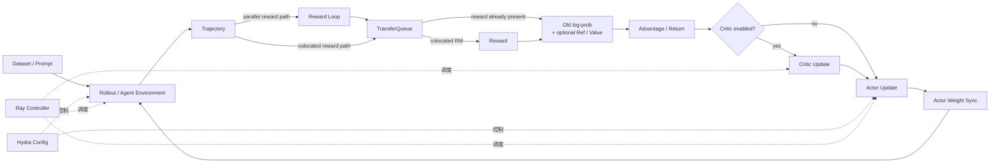

# verl 系统学习手册：从 RL 基础到源码数据流

这是一套面向 **用过 verl，但还没有建立框架内部心智模型** 的中文教程。阅读完以后，你应该能回答下面这些问题：

1. 一条 prompt 从数据集进入 verl 后，如何变成多条 trajectory？
2. actor、rollout、reference、critic 和 reward 各自做什么，为什么有时可以共用 GPU？
3. Ray、Hydra、FSDP、vLLM、TransferQueue 分别解决哪一层问题？
4. PPO/GRPO 的数学量如何对应到 batch 中的字段和 mask？
5. Tool Agent Loop 如何在“模型生成”和“工具执行”之间循环？
6. 参数更新之后，训练模型的新权重如何同步给 rollout 引擎？
7. 要增加 dataset、reward、tool、agent loop 或算法时，应该从哪里改？

## 适用版本

本手册按以下本地源码快照编写：

| 项目 | 值 |
|---|---|
| verl 版本 | `0.9.0.dev` |
| Git commit | `d33ddd7140f44d392e0e10b48a8902651a1340f4` |
| 默认 trainer | V1，`trainer.use_v1=true` |
| 默认 model engine | `dp`，通常对应 FSDP 路径 |

verl 正在快速演进。阅读其他文章时，先判断它讲的是当前 V1 trainer，还是仍以 `RayPPOTrainer`、`DataProto` 为主干的 V0。两者的高层 RL 过程类似，但控制流和数据搬运方式明显不同。

> 本手册最重要的版本结论：**当前默认 V1 的主数据路径并不是“所有数据都装进 DataProto，在 Ray worker 之间来回传递”**。它更接近 `dataset row → collate dict → TensorDict → AgentLoopManagerTQ → AgentLoopWorkerTQ / LLM server → TransferQueue → ReplayBuffer → KVBatchMeta（controller）→ BatchMeta（RPC 分片）→ TensorDict（worker）`。V1 仍会在 reward/advantage 等局部环节把数据 pad 成 `DataProto`，而 V0 则更广泛地以 `DataProto` 为总线。

## 推荐阅读顺序

### 路线 A：第一次系统学习

按编号顺序阅读：

1. [学习地图](00_learning_map.md)
2. [必要前置知识](01_prerequisites.md)
3. [整体架构](02_architecture.md)
4. [配置与入口](03_configuration_and_entrypoint.md)
5. [数据与协议](04_data_and_protocols.md)
6. [Ray Controller 与 Worker](05_ray_controller_and_workers.md)
7. [模型引擎与并行](06_model_engines_and_parallelism.md)
8. [Rollout 与权重同步](07_rollout_and_weight_sync.md)
9. [Agent Loop](08_agent_loop.md)
10. [Tool Agent Loop](09_tool_agent_loop.md)
11. [Reward 与 Advantage](10_reward_and_advantage.md)
12. [Policy / Value 更新](11_policy_and_value_update.md)
13. [端到端训练数据流](12_end_to_end_training_flow.md)
14. [训练模式与 Checkpoint](13_training_modes_and_checkpoints.md)
15. [扩展与调试](14_extension_and_debugging.md)
16. [源码地图与术语表](15_source_map_and_glossary.md)

### 路线 B：你已经在用 Tool Agent Loop

建议依次阅读：

`02 → 04 → 08 → 09 → 10 → 11 → 12`

这条路线会把你熟悉的工具调用体验，向前连接到 dataset/rollout，向后连接到 reward/advantage/actor update。

### 路线 C：准备改框架源码

建议依次阅读：

`02 → 03 → 05 → 06 → 07 → 12 → 14 → 15`

## 贯穿全书的例子

我们反复使用一个小型数学工具 Agent：

- 一个 batch 有 `P=2` 条 prompt；
- 每条 prompt 采样 `n=3` 次，因此得到 `B=6` 条 trajectory；
- 模型可以调用 `calculator`；
- reward 只在最后一个有效 response token 上记录；
- 使用 GRPO，在同一 prompt 的 3 个样本内部做相对比较；
- actor 通过 FSDP 训练，rollout 由 vLLM 提供。

简化后的单条 trajectory 是：

```text
user: 17 * 23 是多少？
assistant: <tool_call>{"name":"calculator","arguments":{"expr":"17*23"}}</tool_call>
tool: 391
assistant: 答案是 391。
reward: 1.0
```

它在 token 级可能对应：

```text
response tokens: [tool-call tokens] [tool-result tokens] [final-answer tokens]
response_mask:   [1 1 1 ... 1]      [0 0 0 ... 0]        [1 1 ... 1]
```

`response_mask=0` 的工具返回是环境提供的上下文，不应被当成 actor 自己采取的 action 来计算 policy loss。

## 先建立一个总心智模型

verl 不是“一个 PPO 函数”，也不是“一个分布式推理库”。更准确地说，它是把以下子系统编排到一起的 RL post-training 框架：



可以把它压缩成一句话：

> **trainer 决定先做什么；Ray 决定让谁来做；TransferQueue 决定数据在哪里；engine 决定怎样计算；rollout/agent loop 决定怎样产生经验；RL algorithm 决定怎样把经验变成梯度。**

## 如何阅读代码片段

文中的代码分为三类：

- **源码摘录**：保留当前代码的关键结构，但可能省略错误处理与日志；
- **等价伪代码**：用于解释控制流，不保证可直接运行；
- **配置示例**：展示 Hydra override 的表达方式，需要按实际模型和集群修改路径。

每章末尾都给出当前仓库中的源码入口。遇到文档与源码不一致时，以当前 checkout 的源码和配置 schema 为准。

## 学习目标自测

读完后，尝试不看答案解释：

1. 为什么 rollout 使用的模型和 actor 在概念上相同，在运行时却可能是两个完全不同的引擎实例？
2. 为什么 `attention_mask`、`response_mask`、loss mask 不能混为一谈？
3. GRPO advantage 为什么不需要 critic，而当前 trainer 仍会构造 old log-prob；默认 PPO-style actor loss 和可选 reference log-prob 又分别怎样使用它们？
4. V1 为什么让 controller 持有 `KVBatchMeta`，并在 dispatch/RPC 边界转换成分片的 `BatchMeta`，而不让 controller 反复搬运完整 TensorDict？
5. colocated 模式为什么必须协调 sleep/wake、KV cache 释放和权重同步？
6. Tool Agent Loop 中，工具返回 token 为什么出现在模型输入里，却通常不参与 policy gradient？

如果这些问题都能沿着具体源码路径回答，你就不再只是“会配 verl”，而是已经开始理解它如何运行。
